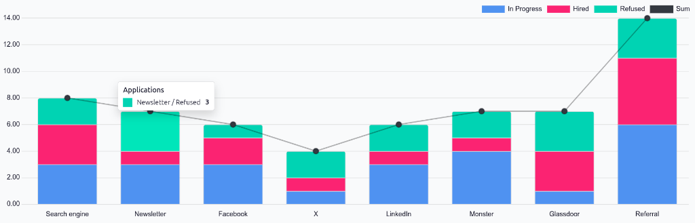
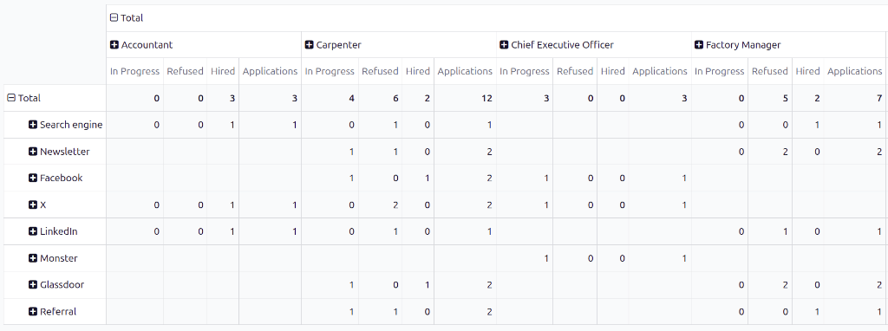
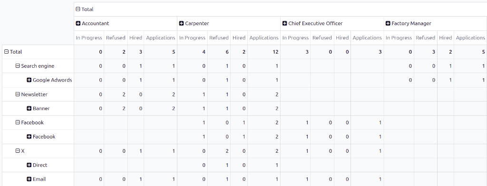

===============
Source analysis
===============

Reporting is a critical tool used by recruiting departments to gain insights into the entire
recruitment process.

Determining where applicants come from can provide information about which sources have the best
results. This information is determined by the *Source Analysis* report. With this data, recruitment
teams can better pivot their recruiting strategies to gain better applicants, in both quantity and
quality.

Open report
===========

To access the *Source Analysis* report, navigate to :menuselection:`Recruitment app --> Reporting
--> Source Analysis`.

This presents the data for the last 365 days in a default :icon:`fa-database` :guilabel:`(Stacked)`
:icon:`fa-bar-chart` :guilabel:`(Bar Chart)` view. It shows the amount of applicants by source and
separated by status (:guilabel:`In Progress`, :guilabel:`Hired`, and :guilabel:`Refused`),

Hover the cursor over any color-coded section of a column to view the specific numbers for that
status column.

Source effectiveness report
===========================

To identify which sources (e.g., job boards, social media, employee referrals, company website)
produce the most hires, the pivot table view of the *Source Analysis* report can be configured to
display further details.

To view the *Source Analysis* report in a pivot table, click the :icon:`oi-view-pivot`
:guilabel:`(Pivot)` icon in the corner. The data is presented in a pivot table, with rows populated
by sources, and columns populated by stages.

To expand this chart to show what specific job positions the applicants applied to from each source,
click the :icon:`fa-plus-square` :guilabel:`Total` box above the columns to reveal a drop-down menu,
and click :guilabel:`Job Position`.

Each column is then grouped by the job position, such as *Accountant* or *Carpenter*. Each job
position displays a separate count for applications :guilabel:`In Progress`, :guilabel:`Refused`, or
:guilabel:`Hired`, and an :guilabel:`Applications` column which displays the total count of all
statuses.

Medium
------

Viewing the medium for the applicants can be beneficial to see which specific medium is more
successful.

*Mediums* are the specific methods the applicant used to discover and then apply for job positions,
such as a search engine, social media ad, email, banner, etc.

To further group the results by medium, click into one of the :icon:`fa-plus-square`
:guilabel:`(Source)` rows then click :guilabel:`Medium` in the resulting drop-down menu. The row
presents the individual mediums relevant to that specific source.

Once :guilabel:`Medium` is selected for one source, clicking into another row automatically reveals
the specific metrics for the mediums for that source.

.. note::
   The only mediums that appear for a source are mediums that have been set on an applicant's form.
   If a medium has **not** been set for any applicants, the medium does not appear in the drop-down
   rows beneath the source.

   For example, if no applicants applied with the medium *Google Adwords*, that medium does **not**
   appear beneath the *Search engine* source row.

