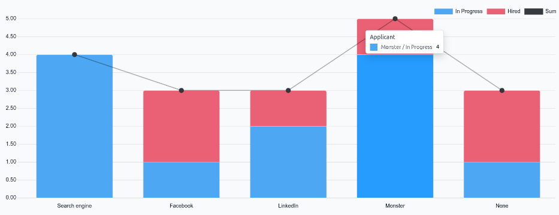

=========================
Source analysis reporting
=========================

Reporting is a critical tool used by recruiting departments to gain insights into the entire
recruitment process.

Determining where applicants come from can provide information about which sources have the best
results. This information is determined by the *Source Analysis* report. With this data, recruitment
teams can better pivot their recruiting strategies to gain better applicants, in both quantity and
quality.

Open report
===========

To access the *Source Analysis* report, navigate to :menuselection:`Recruitment app --> Reporting
--> Source Analysis`.

This presents the data for the :icon:`fa-filter` :guilabel:`Last 365 Days Applicant`, in a default
:icon:`fa-area-chart` :guilabel:`(Graph)` view, showing the amount of applicants by
:guilabel:`Source`, and further separated by stage (:guilabel:`In Progress` and :guilabel:`Hired`)

Hover the cursor over any column to view the specific numbers fort that column.

To view more details, view the :guilabel:`Source Analysis` report in a pivot table. To do so, click
the :icon:`oi-view-pivot` :guilabel:`(Pivot)` icon in the top-right corner. The data is presented in
a pivot table, with rows populated by job positions, and columns populated stages.

Source effectiveness report
===========================

To identify which sources (e.g., job boards, social media, employee referrals, company website)
produce the most hires, the pivot table view of the :guilabel:`Source Analysis` report can be
configured to display further details.

To expand this chart to show what specific sources the applicants came from, click the
:icon:`fa-plus-square` :guilabel:`Total` box above the columns, to reveal a drop-down menu, and
click :guilabel:`Source`.

Each column is then grouped by the source, such as: :guilabel:`Search engine`, :guilabel:`Facebook`,
:guilabel:`Newsletter`, etc. Each source displays a separate count for :guilabel:`Applicant`,
:guilabel:`Hired`, and :guilabel:`Refused`.

This information, as presented, makes it difficult to view the specific numbers for each source.
Click the :icon:`fa-exchange` :guilabel:`(Flip axis)` icon, to swap the information. After that, the
rows represent the source, and the columns represent the job positions, further divided by stage.

In this view, the total number of applicants, hired employees, and refused applicants, are displayed
for each source, as well as for each stage by job position.

Medium
------

Viewing the medium for the applicants can be beneficial to see which specific medium is more
successful.

*Mediums* are the specific methods the applicant used to discover and then apply for job positions,
such as organic search, paid search, social media ad, email, etc.

To further group the results by medium, click into one of the :icon:`fa-plus-square`
:guilabel:`[Source]` rows. Click :guilabel:`Medium` in the resulting drop-down menu. The row
presents the specific mediums, relevant to that specific source.

Once :guilabel:`Medium` is selected for one source, clicking into another row automatically reveals
the specific metrics for the mediums for that source.

.. note::
   The only mediums that appear for a source, are mediums that have been set on an applicant's form.
   If a medium has **not** been set for any applicants, the medium does not appear in the drop-down
   rows beneath the source.

   For example, if no applicants applied with the medium *Google Adwords*, that medium does **not**
   appear beneath the *Search engine* source row.
