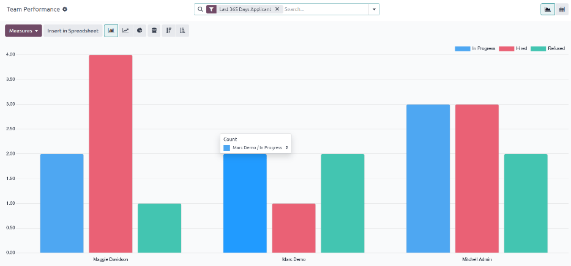
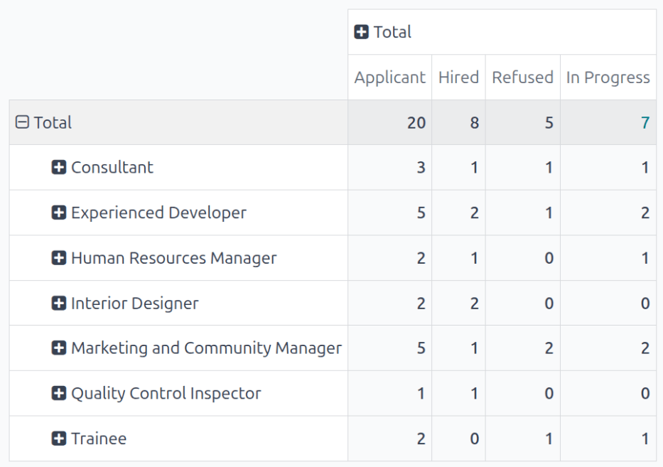
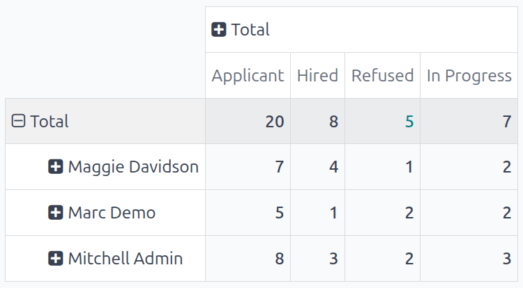
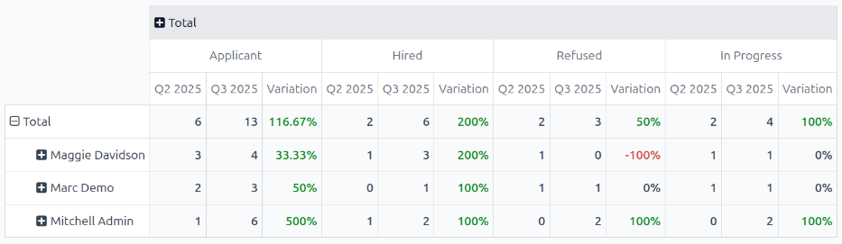

==========================
Team performance reporting
==========================

The *Team Performance* report in the **Recruitment** app shows how many applicants each recruiter is
managing.

This information is determined by the individuals populating the :ref:`Recruiter
<recruitment/applicant-details>` field on each applicant form.

Open report
===========

To access the *Team Performance* report, navigate to :menuselection:`Recruitment app --> Reporting
--> Team Performance`.

The number of :guilabel:`In Progress`, :guilabel:`Hired`, and :guilabel:`Refused` applicants for
each recruiter is displayed in the :icon:`fa-area-chart` :guilabel:`(Graph)` view.

The information shown is for the :icon:`fa-filter` :guilabel:`Last 365 Days Applicant` default
filter, as displayed in the search bar.

Hover the cursor over any column to view a popover window, displaying the specific details for that
column.

Pivot table view
----------------

For a more detailed view of the information in the :guilabel:`Team Performance` report, click the
:icon:`oi-view-pivot` :guilabel:`(Pivot)` icon in the top-right corner. This displays all the
information in a pivot table.

In this view, the job positions are displayed in the rows, while the columns display the total
number of applicants. The applicants are further organized by :guilabel:`# Applicant` (in process),
:guilabel:`# Hired`, and :guilabel:`# Refused`.

The displayed information can be modified, if desired.

In this example, there are 19 total applicants. Out of those 19, eight have been hired, and three
refused.

From the data presented, the :guilabel:`Experienced Developer` job position is the most successful.
This job position has the highest number of total applicants, as well as the most hires. In
addition, the :guilabel:`Experienced Developer` has the least amount of refused applicants.

This pivot table also shows that the :guilabel:`Chief Executive Officer` position is the hardest to
fill, as it has the fewest total applicants.

Use case: recruiter performance over time
=========================================

One way to modify this report is to show how recruiters are performing over time. To show this
information, begin with the :guilabel:`Team Performance` report in the :icon:`oi-view-pivot`
:guilabel:`(Pivot)` view.

Next, click the :icon:`fa-caret-down` :guilabel:`(down arrow)` in the search bar, revealing a
drop-down menu. Click :guilabel:`Add Custom Group` :icon:`oi-caret-down` at the bottom of the
:icon:`oi-group` :guilabel:`Group By` column, then click :guilabel:`Recruiter`. Click away from the
drop-down menu to close it. Now, each row on the table represents a recruiter.

To compare the team's performance over different time periods, click the :icon:`fa-caret-down`
:guilabel:`(down arrow)` in the search bar. Click :guilabel:`Start Date` :icon:`fa-caret-down` in
the :icon:`fa-filter` :guilabel:`Filters` column, revealing various time periods to select.

In this example, the desired data is the comparison between the team's performance in the third
quarter (June - August) and the second quarter (April - July). To do so, click :guilabel:`Q3`. Once
clicked, the current year is also ticked. In this example, it is :guilabel:`2024`.

After making this selection, a :icon:`fa-adjust` :guilabel:`Comparison` column appears. Click
:guilabel:`Start Date: Previous Period` to compare the third quarter with the second quarter, for
the various recruiters.

From this report, several things can be extrapolated: the total number of applicants increased, the
number of hired applicants remained the same, while the number of refused applicants decreased.

Additionally, :guilabel:`Jane Jobs` had the highest increase in number of applicants during the
third quarter, but her number of hired applicants went down :guilabel:`67%`. The recruiter with the
best overall numbers was :guilabel:`Rose Recruiter`, who had both their active applicants and hired
applicants, increase in the third quarter, while their refused applicants went down.
