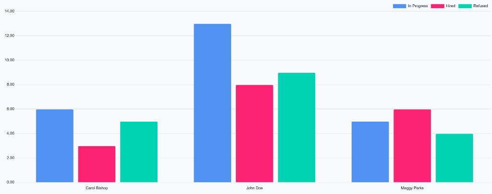
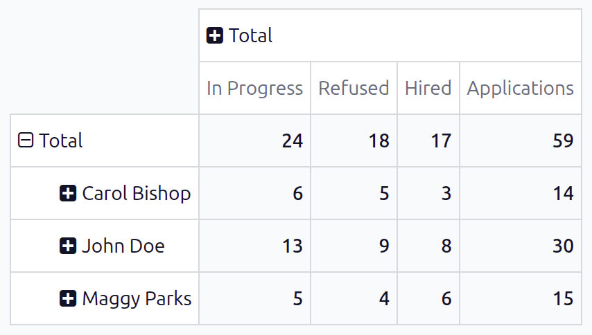

================
Team performance
================

The *Team Performance* report in the **Recruitment** app shows how many applicants each recruiter
manages and what stage their applicants are at.

This information is determined by the individuals populating the :ref:`Recruiter
<recruitment/add_applicants/applicant-details>` field on each applicant form.

View report
===========

To view the *Team Performance* report, navigate to :menuselection:`Recruitment app --> Reporting -->
Team Performance`.

For each recruiter, the number of :guilabel:`In Progress`, :guilabel:`Hired`, and
:guilabel:`Refused` applicants is displayed in a default :icon:`fa-bar-chart` :guilabel:`(Bar
Chart)` view. The default :guilabel:`Last 365 Days Applicant` filter shows all applicants for the
last 365 days.

Hover the cursor over any column to view a popover window, displaying the specific details for that
column.

.. _recruitment/team_performance/pivot:

Pivot table view
----------------

For a more detailed view of the information in the *Team Performance* report, click the
:icon:`oi-view-pivot` :guilabel:`(Pivot)` icon. This displays all the information in a pivot table.

In this view, the recruiters populate the rows, while the columns are populated with the number of
applicants in each stage. Each column displays the total number of applicants who are still
:guilabel:`In Progress`, have been :guilabel:`Hired`, or have been :guilabel:`Refused`. The last
column, :guilabel:`Applications`, is the total number of applicants across all stages for that
recruiter.

In this example, there are 59 applicants in total. Of those 59, 17 have been hired, 18 have been
refused, and 24 are still in the recruitment process.

Based on the data presented, :guilabel:`John Doe` is the most successful recruiter, with a total of
eight hires, while :guilabel:`Carol Bishop` has the fewest hires, with only three.

