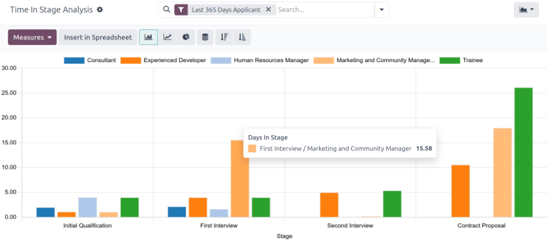
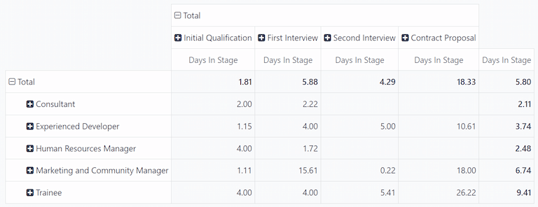
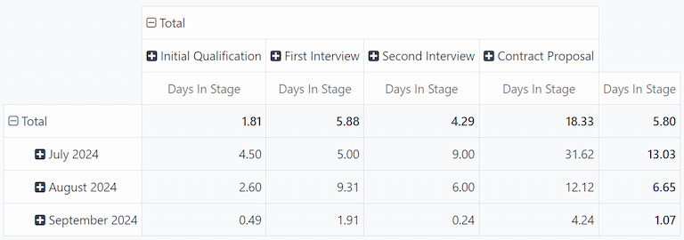

======================
Time in stage analysis
======================

The *Time In Stage Analysis* report provides information on how long applicants stay in each stage
of the recruitment process. This is important, as every job position has specific :ref:`process
details <recruitment/new_job_position/edit>` that state the length of time applicants should expect
to wait between specific stages.

Knowing how long applicants remain in each stage can help highlight possible bottlenecks. Analyzing
this data allows the recruitment team to assess each stage, identify any issues, and pivot their
strategies to move applicants through each stage, within the expected time interval.

Time in stage analysis report
=============================

To access the report, navigate to :menuselection:`Recruitment app --> Reporting --> Time in Stage
Analysis`. By default, the report displays data from all job positions, with the stages populating
the x-axis, and the number of days populating the y-axis, in a :icon:`fa-line-chart`
:guilabel:`(Line Chart)`.

The default filter is :guilabel:`Last 365 Days Applicant`, showing information for the last 365
days.

Hover over a stage in the line chart to reveal a popover window listing all the job positions within
it, and the average number of days each job position sits in each stage.

For a more visually digestible view of the information in the :guilabel:`Time In Stage Analysis`
report, click the :icon:`fa-bar-chart` :guilabel:`(Bar Chart)` icon in the upper-left corner. This
displays all the information in a bar chart.

In this view, it is easier to visualize the differences between the job positions, regarding how
long applicants stay in each stage. From this view, recruiters can more easily determine which job
positions have delays or bottlenecks at certain stages.

Use case: comparing times by month
----------------------------------

With the :guilabel:`Time In Stage Analysis` report, it is possible to see if there are certain
months where applicants take longer to be moved through the pipeline. To view this data, switch to
the :icon:`oi-view-pivot` :guilabel:`(Pivot)` view in the upper-right corner.

This presents the data in a detailed pivot table, with the rows representing the different job
positions, and the columns representing the stages. The average :guilabel:`Days in Stage` populates
the various boxes.

.. note::
   If a field is empty, it indicates no applicant has been in that stage. Instead, all applicants
   moved from a previous stage without being placed in the stage with an empty field.

Click :icon:`fa-minus-square-o` :guilabel:`Total` above the job position rows to collapse the
information. Next, click :icon:`fa-plus-square` :guilabel:`Total` again, revealing a drop-down menu.
Click :guilabel:`Add Custom Group` :icon:`fa-caret-down` at the bottom of the list, revealing
further grouping options. Click :guilabel:`Start Date` from the expanded list.

After doing so, the data presented is grouped with the various months from the previous 365 days for
the rows, leaving the :guilabel:`Days In Stage` as the columns.

In this example, :guilabel:`July 2024` had the longest time that applicants spent in each stage, on
average. In addition, the :guilabel:`Contract Proposal` stage had the longest wait time in July,
with an average of :guilabel:`31.62` days in that stage.

While this report does not display the reasons applicants stayed in the various stages for these
lengths of time, it can be helpful to know when delays occur.

.. seealso::
   :doc:`Essentials reporting documentation <../../essentials/reporting>`
