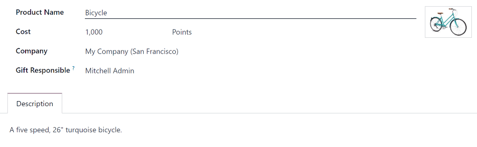
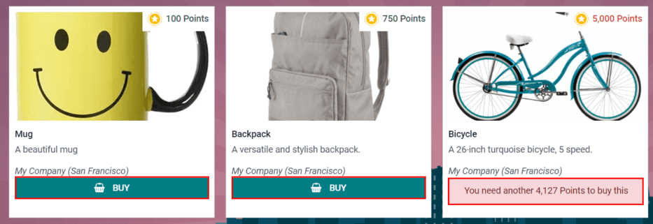
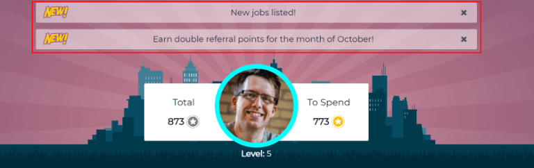
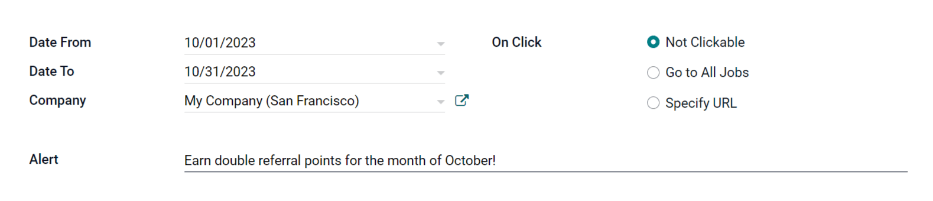

:show-content:

=========
Referrals
=========

Odoo's *Referrals* application is a centralized place where all information regarding referrals is
housed, from points earned, coworkers hired, and rewards selected. Users can recommend people they
know for job positions, then earn referral points as those people progress through the recruitment
pipeline. Once enough referral points are earned, they can be exchanged for prizes. The Referrals
application integrates with the *Employees*, *Recruitment*, and *Website* applications, all of which
must be installed in order for the *Referrals* application to function.

The only configuration needed for the Referrals application after it is installed are the
:ref:`rewards <referrals/rewards>`; everything else is pre-configured when Odoo Referrals is
installed.

Any user with either :guilabel:`Referral User`, :guilabel:`Officer`, or :guilabel:`Administrator`
rights for the Recruitment application has access to the Referrals application. Only user's with
:guilabel:`Administrator` rights for the Recruitment application have access to the :ref:`reporting
<referrals/reporting>` and configurations menus. For more information on users and access rights,
refer to these documents: :doc:`../general/users` and :doc:`../general/users/access_rights`.

Onboarding
==========

When opening the *Referrals* application for the first time, a pre-configured onboarding script
appears. This is in the form of four slides, each explaining the different parts of the Referrals
application. At the top of the dashboard, the following message is displayed throughout all the
onboarding slides: :guilabel:`GATHER YOUR TEAM! Job Referral Program`. Behind this main message is
an image, and beneath it some more explanatory text.

Each of the onboarding slides has a corresponding image and message that is displayed. After reading
each message, click the :guilabel:`Next` button to advance to the next slide.

The text that appears on each slide is as follows:

#. :guilabel:`Oh no! Villains are lurking the city! Help us recruit a team of superheroes to save
   the day!`
#. :guilabel:`Browse through open job positions, promote them on social media, or refer friends.`
#. :guilabel:`Collect points and exchange them for awesome gifts in the shop.`
#. :guilabel:`Compete against your colleagues to build the best justice league!`

.. note::
   The onboarding slides will appear every time the Referrals application is opened, until all the
   slides have been viewed and the :guilabel:`Start Now` button has been clicked. If the onboarding
   is exited at any point, or if the :guilabel:`Start Now` button has *not* been clicked, the
   onboarding slides will begin again when the Referrals application is opened. Once the
   :guilabel:`Start Now` button has been clicked, the onboarding slides will not be seen again, and
   the main dashboard will load when the Referrals application is opened from that point on.

At any point during onboarding, the :guilabel:`Skip` button may be clicked. This exits the
onboarding, and the main Referrals dashboard loads. If :guilabel:`Skip` is clicked, onboarding
slides will not load anymore when opening the Referrals application.

.. image:: referrals/onboarding.png
   :align: center
   :alt: An onboarding slide with the skip and next buttons visible at the bottom.

.. note::
   If there are any candidates hired that the user had referred prior to opening the Referrals app
   (meaning the onboarding slides have not appeared before), when :guilabel:`Start Now` is clicked
   at the end of onboarding, instead of going to the main dashboard, a :ref:`hired
   <referrals/hired>` screen appears instead.

Modifying onboarding slides
---------------------------

Onboarding slides can be modified if desired. Only users with :guilabel:`Administrator` rights for
the Recruitment application can modify onboarding slides. To edit a slide, navigate to
:menuselection:`Referrals app --> Configuration --> Onboarding.` Each line displays the text for the
individual onboarding slide. To edit an onboarding slide, click on an individual slide line to open
the slide's onboarding form, then click :guilabel:`Edit`.

Make any changes to the message in the :guilabel:`Text` box. To change the order the slide appear in
the onboarding, the :guilabel:`Sequence` can be modified. Type in the corresponding number to
indicate the order in which the slides should be displayed. A :guilabel:`Company` may be selected,
however, if this field is populated, that slide will only be displayed for that particular company.

The image can be modified as well. Hover over the image thumbnail in the top right corner of the
form. A :guilabel:`✏️ (pencil)` icon and :guilabel:`🗑️ (garbage can)` icon appear. Click the
:guilabel:`✏️ (pencil)` icon to change the image. A file navigator window loads. Navigate to the
desired image, select it, then click :guilabel:`Open`. The new image appears in the thumbnail. To
delete an image, click the :guilabel:`🗑️ (garbage can)` icon, then select a new image using the
:guilabel:`✏️ (pencil)` icon.

To save any changes, click :guilabel:`Save`, or click :guilabel:`Discard` to delete any changes and
revert to the original content.

.. image:: referrals/edit-onboarding.png
   :align: center
   :alt: An onboarding slide in edit mode, with the main fields highlighted.

The order of the slides can also be changed directly in the Onboarding dashboard, without having to
edit an individual onboarding slide. Click the up and down arrow symbol that appears after the
checkbox and before the slide text, and drag the slide to the desired position. The
:guilabel:`Sequence` automatically changes on all the slide's onboarding forms, reflecting the new
sequence.

.. image:: referrals/onboarding-reorder.png
   :align: center
   :alt: The onboarding slides in a list, with the drag and drop arrows highlighted.

.. _referrals/hired:

Hired referrals
===============

When a candidate that has been referred by a user is hired, the user "grows their superhero team"
and adds superhero avatars to their Referrals dashboard.

After a referral has been hired, when the user next opens the Referrals app, instead of the main
dashboard, a hired page loads. The text :guilabel:`(Referral Name) has been hired! Choose an avatar
for your new friend!` appears.

Below this message are five avatar thumbnails to choose from. If an avatar has already been assigned
to a referral, the thumbnail is greyed out, and the name the avatar has been chosen for appears
beneath the avatar. Click on an available avatar to select it.

If more than one referral was hired since opening the Referrals application, after selecting the
first avatar, the user is prompted to select another avatar for the subsequent hired referral. Once
all avatars have been selected, the dashboard loads and all the avatars are now visible. Mouse over
each avatar and their name is displayed above them.

.. image:: referrals/avatars.png
   :align: center
   :alt: The hired screen. A selection of avatars are presented to chose from, with any already
         chosen are greyed out.

Modify friends
--------------

Friend avatars are able to be modified in the same manner that :ref:`levels <referrals/levels>` are
modified. Only users with :guilabel:`Administrator` rights for the Recruitment application can make
modifications to friends. The pre-configured friends can be seen and modified by navigating to
:menuselection:`Referrals app --> Configuration --> Friends`. Each friend avatar appears in the
:guilabel:`Dashboard Image` column, and the corresponding name appears in the :guilabel:`Friend
Name` column. The default images are a motley group of hero characters, ranging from robots to dogs.

To modify a friend's dashboard image, thumbnail, name, or position, click on an individual friend to
open the referral friend form. Click :guilabel:`Edit` to make modifications. Type the name in the
:guilabel:`Friend Name` field. The name is solely to differentiate the friends in the configuration
menu; the friend's name is not visible anywhere else in the Referrals application.

The :guilabel:`Position` can be set to either :guilabel:`Front` or :guilabel:`Back`. This determines
the position of the friend in relation to the user's super hero avatar. Click the radio button next
to the desired selection, and the friend will appear either in front of or behind the user's avatar
when activated.

If desired, both the thumbnail :guilabel:`Image` and the :guilabel:`Dashboard Image` can be
modified. Hover over the image being replaced to reveal a :guilabel:`✏️ (pencil)` icon and
:guilabel:`🗑️ (garbage can)` icon. Click the :guilabel:`✏️ (pencil)` icon and a file explorer
window appears. Navigate to the desired image file then click :guilabel:`Open` to select it.

Once all changes have been made, click the :guilabel:`Save` button to save the changes, or click the
:guilabel:`Discard` button to revert to the original information.

.. image:: referrals/edit-friend.png
   :align: center
   :alt: A friend form in edit mode.

.. warning::
   It is not advised to edit the images. An image file must have a transparent background in order
   for it to render properly. Only users with knowledge about transparent images should attempt
   adjusting any images in the Referrals application.

   Once an image is changed and the friend is saved, it is **not possible** to revert to the
   original image. To revert to the original image, the Referrals application must be *uninstalled
   then reinstalled.*

Referral points
===============

The referral program is based on earning points that are then exchanged for rewards. On the main
Referrals application dashboard, the top displays a summary of the user's current points. The left
side of the summary displays the total points earned, and the right side displays the points that
are available to spend.

To see the various referrals and the points earned for each, click on one of the buttons directly
beneath the avatars. The options are :guilabel:`Referrals`, :guilabel:`Ongoing`, and
:guilabel:`Successful`.

The current number of referrals who are still active in the recruitment pipeline, and have not yet
been hired or refused, appear above the :guilabel:`Ongoing` button. The number of referrals who have
been hired appear above the :guilabel:`Successful` button. The total number of referrals (both the
ongoing and successful referrals combined) appear above the :guilabel:`Referrals` button.

.. note::
   To view the referrals associated with each of the categories, :guilabel:`Referrals`,
   :guilabel:`Ongoing`, and :guilabel:`Successful`, click on the corresponding button. All the
   referrals for that specific category are displayed.

My referrals
------------

To see all the referrals (both ongoing and successful) click the :guilabel:`Referrals` button. A
:guilabel:`My Referral` window loads. This screen displays all the referrals, with each referral in
its own referral card.

A successful referral has a green line down the left side of the card, and displays a
:guilabel:`✓ Hired` image in the top right corner of the card. Referrals that are in process display
an :guilabel:`In Progress` image in the top right corner.

Each referral card lists the name of the applicant, the department the job position is in, the name
of the job position, the person responsible for filling the role (recruiter), and the points earned.

Points
~~~~~~

The points that can be earned for a referral are the same across all job positions. Each stage of
the recruitment process has corresponding points assigned to it. The stages listed correspond to the
stages configured in the *Recruitment* application.

On each individual referral card, beneath the points earned is a bar chart that displays how many
points have been earned out of the total possible points that can be earned if the applicant is
hired.

Beneath the bar chart is a list of the various recruitment stages and the points earned when the
referral moves to that stage. If a stage has been achieved and the points have been earned, a green
check mark appears next to the stage.

.. example::
   The pre-configured point structure for referrals is as follows:

   - :guilabel:`Initial Qualification`: 1 point
   - :guilabel:`First Interview`: 20 points
   - :guilabel:`Second Interview`: 9 points
   - :guilabel:`Contract Proposal`: 5 points
   - :guilabel:`Contract Signed`: 50 points

   The total points earned for a referral that is hired is 85 points. Modifications of the points
   earned for each stage is done in the Recruitment application. Refer to the
   :ref:`Recruitment <recruitment/modify-stages>` documentation to modify the points for each stage.

.. _referrals/rewards:

Rewards
=======

Create rewards
--------------

The rewards are the only configurations needed when setting up the Referrals application. Only users
with :guilabel:`Administrator` rights for the Recruitment application can create or modify rewards.
To add rewards, navigate to :menuselection:`Referrals app --> Configuration --> Rewards`. Click
:guilabel:`Create` and a reward form loads. Enter the following information on the form:

- :guilabel:`Product Name`: Enter the name as it should appear for the reward.
- :guilabel:`Cost`: Enter the amount of points required to redeem the reward.
- :guilabel:`Company`: Using the drop-down menu, select the company the reward will appear for. If a
  reward is to be used for several companies, each company needs to have a record of the reward,
  with the company listed on the form.
- :guilabel:`Gift Responsible`: Select the person who will be responsible for procuring and
  delivering the reward to the recipient, using the drop-down menu. This person is alerted when the
  reward is purchased, so they know when to deliver the reward to the recipient.
- :guilabel:`Description`: Type in the description for the reward. This will be visible on the
  reward card, beneath the title.
- :guilabel:`Photo`: Add a photo of the reward, which appears on the rewards page. Hover over the
  image square, and two icons appear, a :guilabel:`✏️ (pencil)` and a :guilabel:`🗑️ (garbage can)`.
  Click the :guilabel:`✏️ (pencil)` icon and a file explorer appears. Navigate to the photo file,
  then click :guilabel:`Open` to select it.

The only required fields are the :guilabel:`Product Name`, :guilabel:`Company`, and
:guilabel:`Description`.

.. important::
   It is advised to enter a :guilabel:`Cost` and add a :guilabel:`Photo`. If a cost is not entered,
   the default cost will be listed as zero, which would list the reward as free in the reward shop.
   If a photo is not selected, a placeholder icon will be displayed on the rewards page.

Redeem rewards
--------------

To redeem points for a reward, click the :guilabel:`Rewards` button on the main Referrals dashboard.
All the configured rewards are listed in individual reward cards. The points required to purchase
the reward is listed in the top right corner of the card. If the user has enough points to purchase
a reward, a :guilabel:`🧺 (basket) Buy` button appears at the bottom of the reward card. If they do
not have enough points for a reward, the reward card displays :guilabel:`You need another (x) points
to buy this` instead of a buy button.

Click the :guilabel:`🧺 (basket) Buy` button on a reward to purchase it. A confirmation pop-up
appears, asking if the user is sure they want to purchase the reward. Click :guilabel:`OK` to
purchase the item, or :guilabel:`Cancel` to close the window and cancel the purchase.

After :guilabel:`OK` is clicked, the pop-up window closes, and the points used to purchase the
reward are subtracted from the user's available points. The rewards presented are now updated to
reflect the user's current available points.

         many more reward points are needed to redeem.

.. _referrals/levels:

Levels
======

The referrals application has pre-configured levels that are reflected in the user's avatar on the
Referrals dashboard. As a user refers potential employees and earns points, they can *level up*,
much like in a video game.

Levels have no functional impact on the performance of the application. They are solely used for the
purpose of adding achievement tiers for participants to aim for, gamifying referrals for the user.

The user's current level is displayed at the top of the main Referrals application dashboard,
directly beneath their photo, in a :guilabel:`Level: X` format. In addition, a colored ring appears
around the user's photo, indicating how many points the user currently has, and how many additional
points they need to level up. The cyan colored portion of the ring represents points earned, while
the white colored portion represents the points still needed before they can level up.

Modify levels
-------------

Only users with :guilabel:`Administrator` rights for the Recruitment application can modify levels.
The pre-configured levels can be seen and modified by navigating to :menuselection:`Referrals app
--> Configuration --> Levels`. Each avatar appears in the :guilabel:`Image` column, and the
corresponding level number appears in the :guilabel:`Level Name` column. The default images are of
Odoo superheroes, and each level adds an additional element to their avatar, such as capes and
shields.

To modify a level's image, name, or points required to reach the level, click on an individual level
in the list to open the level form. Click :guilabel:`Edit` to make modifications.

Type in the name or number of the level in the :guilabel:`Level Name` field. What is entered is
displayed beneath the user's photo on the main dashboard when they reach that level. Enter the
number of referral points needed to reach that level in the :guilabel:`Requirements` field. The
points needed to level up are the total accumulated points earned over the lifetime of the employee,
not additional points from the previous level that must be earned.

If desired, the :guilabel:`Image` can also be modified. Hover over the image to reveal a
:guilabel:`✏️ (pencil)` icon and :guilabel:`🗑️ (garbage can)` icon. Click the :guilabel:`✏️
(pencil)` icon and a file explorer window appears. Navigate to the desired image file then click
:guilabel:`Open` to select it.

Once all changes have been made, click the :guilabel:`Save` button to save the changes, or click the
:guilabel:`Discard` button to revert to the original information.

.. image:: referrals/levels.png
   :align: center
   :alt: A level form in edit mode.

.. warning::
   It is not advised to edit the images. An image file must have a transparent background in order
   for it to render properly. Only users with knowledge about transparent images should attempt
   adjusting any images in the Referrals application.

   Once an image is changed and the level is saved, it is **not possible** to revert to the original
   image. To revert to the original image, the Referrals application must be *uninstalled then
   reinstalled.*

Level up
--------

Once enough points have been accumulated to level up, the circle around the user's photo is
completely filled in with a cyan color, a large image stating :guilabel:`Level up!` appears above
the photo, and the phrase :guilabel:`Click to level up!` appears beneath the user's photo and
current level.

Click on either the :guilabel:`LEVEL UP!` graphic, the user's photo, or the text :guilabel:`Click to
level up!` beneath the user's photo to level up the user. The user's avatar changes to the current
level, and the ring around the photo is updated to indicate the current amount of points.

Leveling up does not cost the user any points, the user simply needs to earn the specified amount of
points required.

.. image:: referrals/level-up.png
   :align: center
   :alt: A 'Click to level up!' appears beneath the user's image, and a large 'Level up!' appears
         above their image.

.. note::
   Once a user has reached the highest configured level, they will continue to accrue points that
   can be redeemed for rewards, but they are no longer able to level up. The ring around their photo
   remains solid cyan.

Alerts
======

In the Referrals application, it is possible to post a message, also referred to as an *alert*, at
the top of the dashboard to share important information with users. These alerts appear as a thin
semi-transparent banner, with the word :guilabel:`New!` appearing on the far left. The text for the
alert is in the center of the banner, and on the far right side is an :guilabel:`X`.

Alerts appear on the main dashboard for the specified time configured on the individual alert. If a
user does not wish to see a specific alert again, click the :guilabel:`X` in the far right side of
the alert. This removes the alert from the dashboard and will not appear again, even when opening
the Referrals application for the first time in a new session.

Create an alert
---------------

Only users with :guilabel:`Administrator` rights for the Recruitment application can create alerts.
To add a new alert, navigate to the :menuselection:`Referrals application --> Configuration -->
Alerts`.

Click :guilabel:`Create` and a blank alert form loads. Enter the following information on the form:

- :guilabel:`Date From`: The date the alert starts. On this date, the alert will be visible on the
  dashboard.
- :guilabel:`Date To`: The date the alert ends. After this date, the alert will be hidden from view.
- :guilabel:`Company`: The current company populates this field by default. To modify the company
  the alert should be displayed for, select the company from the drop-down menu. If this field
  remains blank, the alert is visible to everyone with access to the Referrals application. If a
  company is specified, only user's within that company (who also have access to the Referrals
  application) will see the alert.
- :guilabel:`Alert`: Enter the text for the alert. This message appears inside the alert banner on
  the main dashboard.
- :guilabel:`On Click`: There are three options for the alert. Click the radio button next to the
  desired selection. The options are:

  - :guilabel:`Not Clickable`: The alert only displays text, there is no link to click.
  - :guilabel:`Go to All Jobs`: The alert contains a link that when clicked, navigates to the
    website with all the currently posted job positions.
  - :guilabel:`Specify URL`: The alert contains a link to a specific URL, that when clicked,
    navigates to that URL. When selected, a :guilabel:`URL` field appears below the :guilabel:`On
    Click` section. Enter the URL in the field.

.. _referrals/reporting:

Reporting
=========

Only users with :guilabel:`Administrator` rights for the Recruitment application have access to the
Reporting feature in Referrals. To access the reports, click :menuselection:`Referrals application
--> Reporting`. The main view is the Reporting Dashboard view, which contains three sections.

In the top portion of the window, the report displays a bar chart of how many referred candidates
are hired, and how many are still in the hiring pipeline. The candidates are further divided by
channel, showing specifically where the referral came from, such as a direct referral, Facebook,
etc. If a channel does not appear on the report, that indicates there are no referrals from that
particular channel.

The middle third provides all the specific data that has been tracked. This includes how many total
points have been earned across all referrals, how many applicants were referred, hired, or refused,
how many applicants the current logged-in user referred, how many total points were earned, and how
many points were given for refused applicants.

The bottom third displays a pivot table. This table can be inserted into a new or existing
spreadsheet. To do so, click the :guilabel:`Insert in Spreadsheet` button right above the chart. A
pop-up appears, asking which spreadsheet to insert the pivot chart into. Select the desired
spreadsheet from the drop-down menu, or select :guilabel:`New Spreadsheet`. Click
:guilabel:`Confirm` and the selected spreadsheet loads, with the new table in it.

.. note::
   The spreadsheet is stored in the *Documents* application. This application needs to be installed
   in order to use the :guilabel:`Insert in Spreadsheet` option.

.. seealso::
   :doc:`referrals/share_jobs`

.. toctree::

   referrals/share_jobs
