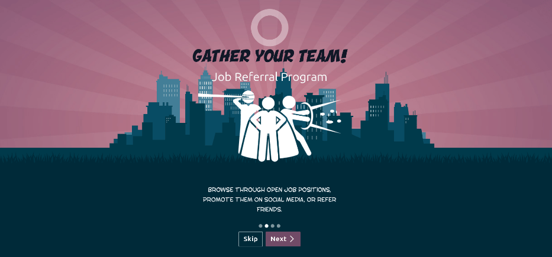
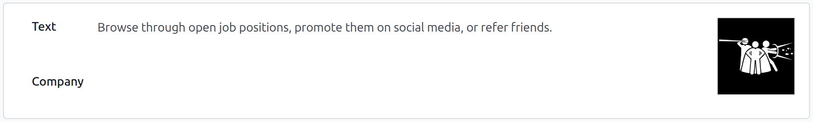
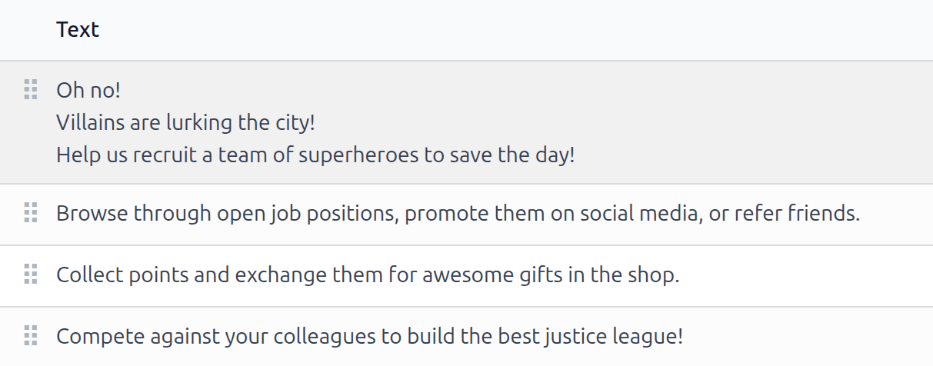
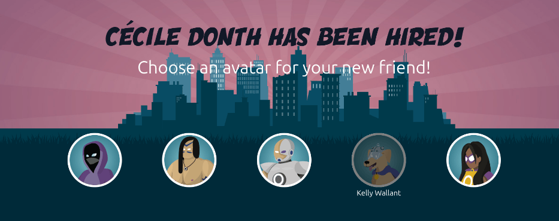
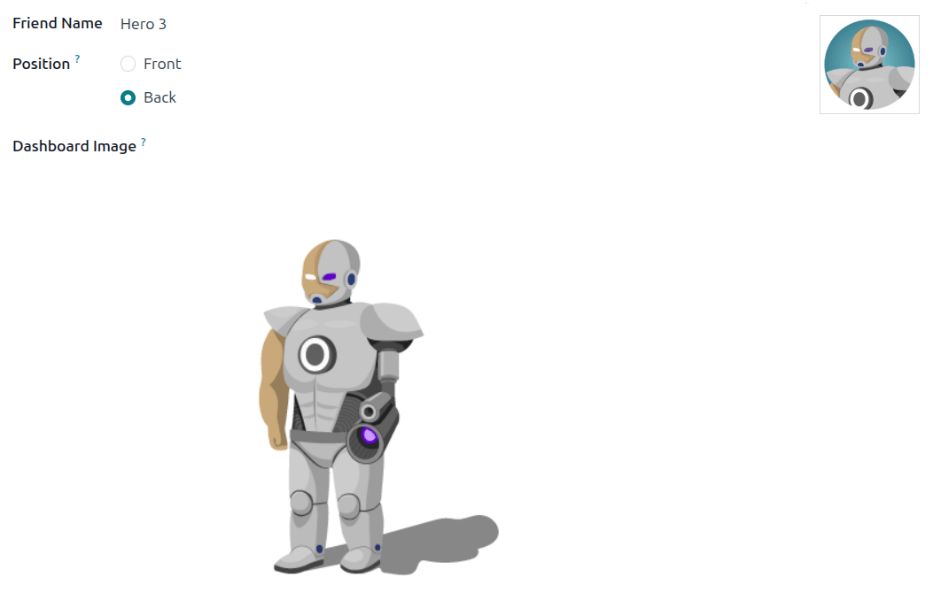
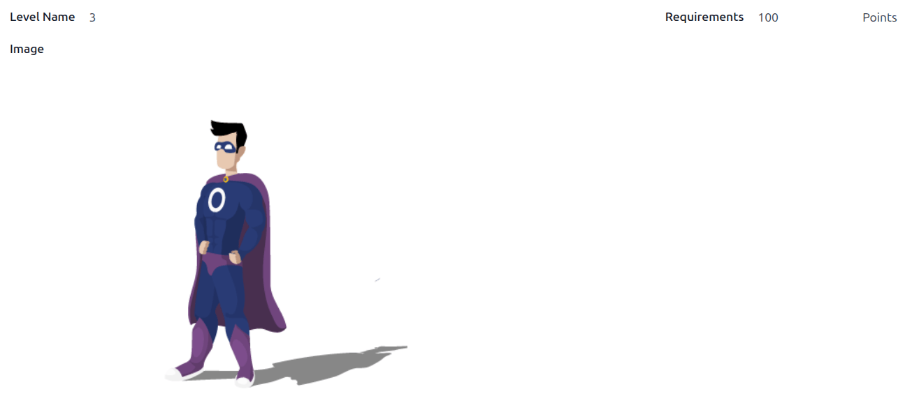

:show-content:

=========
Referrals
=========

Odoo's **Referrals** application is a centralized place where all information regarding referrals is
housed - from points earned, coworkers hired, and rewards selected. Users can recommend people they
know for job positions, and then earn referral points as those people progress through the
recruitment pipeline. Once enough referral points are earned, they can be exchanged for prizes. The
**Employees**, **Recruitment**, and **Website** apps must all be installed for the **Referrals** app
to function.

The only configurations needed for the **Referrals** app *after* it has been installed, are related
to the :doc:`rewards <referrals/rewards>`; everything else is preconfigured when Odoo **Referrals**
is installed.

Users with either :guilabel:`Referral User`, :guilabel:`Officer`, or :guilabel:`Administrator`
access rights for the **Recruitment** app can access the **Referrals** app. Only users with
:guilabel:`Administrator` access rights for the **Recruitment** app have access to the
:doc:`reporting <referrals/reporting>` and configuration menus. For more information on users and
access rights, refer to these documents: :doc:`../general/users` and
:doc:`../general/users/access_rights`.

.. _referrals/onboarding:

Onboarding
==========

When opening the **Referrals** app for the first time, a preconfigured onboarding script appears.
This script consists of four slides, each explaining the different parts of the **Referrals** app.
At the top of the dashboard, the following message is displayed throughout all the onboarding
slides: :guilabel:`GATHER YOUR TEAM! Job Referral Program`. Behind this main message is an image,
and beneath it some more explanatory text.

Each of the onboarding slides has a corresponding image and message that is displayed. After reading
each message, click the :guilabel:`Next` :icon:`fa-angle-right` button to advance to the next slide.

The text that appears on each slide is as follows:

#. :guilabel:`OH NO! VILLAINS ARE LURKING THE CITY! HELP US RECRUIT A TEAM OF SUPERHEROES TO SAVE
   THE DAY!`
#. :guilabel:`BROWSE THROUGH OPEN JOB POSITIONS, PROMOTE THEM ON SOCIAL MEDIA, OR REFER FRIENDS.`
#. :guilabel:`COLLECT POINTS AND EXCHANGE THEM FOR AWESOME GIFTS IN THE SHOP.`
#. :guilabel:`COMPETE AGAINST YOUR COLLEAGUES TO BUILD THE BEST JUSTICE LEAGUE!`

.. note::
   The onboarding slides will appear every time the **Referrals** app is opened, until all the
   slides have been viewed and the :guilabel:`Start Now` button has been clicked. If the onboarding
   is exited at any point, or if the :guilabel:`Start Now` button has *not* been clicked, the
   onboarding slides will begin again when the **Referrals** app is opened. Once the
   :guilabel:`Start Now` button has been clicked, the onboarding slides will not be seen again, and
   the main dashboard will load when the **Referrals** app is opened from that point on.

At any point during onboarding, click the :guilabel:`Skip` button to open the main **Referrals**
dashboard.

.. note::
   If there are any candidates hired that the user had referred prior to opening the **Referrals**
   app (meaning the onboarding slides have not appeared before), when :guilabel:`Start Now` is
   clicked at the end of onboarding, instead of going to the main dashboard, a :ref:`hired
   <referrals/hired>` screen appears instead.

Modifying onboarding slides
---------------------------

Onboarding slides can be modified if desired. Only users with :guilabel:`Administrator` rights for
the **Recruitment** app can modify onboarding slides. To edit a slide, navigate to
:menuselection:`Referrals app --> Configuration --> Onboarding.` Each line displays the text for the
individual onboarding slide. To edit an onboarding slide, click on an individual slide line to open
the slide's onboarding form.

Make any changes to the message in the :guilabel:`Text` field. A :guilabel:`Company` may be
selected, as well. However, if this field is populated, that slide is *only* displayed for that
particular company.

.. note::
   The :guilabel:`Company` field only appears when in a multi-company database.

The image can be modified, as well. Hover over the image thumbnail in the top-right corner of the
form. An :icon:`fa-pencil` :guilabel:`(Edit)` icon and :icon:`fa-trash-o` :guilabel:`(Clear)` icon
appear. Click the :icon:`fa-pencil` :guilabel:`(Edit)` icon to change the image. A file navigator
window loads. Navigate to the desired image, select it, then click :guilabel:`Open`. The new image
appears in the thumbnail. To delete an image, click the :icon:`fa-trash-o` :guilabel:`(Clear)` icon,
then select a new image using the :icon:`fa-pencil` :guilabel:`(Edit)` icon.

The sequence in which the slides appear can be changed from the *Onboarding* dashboard. Click the
:icon:`oi-draggable` :guilabel:`(draggable)` icon to the left of the slide text, and drag the slide
to the desired position.

.. _referrals/hired:

Hired referrals
===============

When a candidate referred by a user is hired, the user *"grows their superhero team"* and adds
superhero avatars to their **Referrals** dashboard.

After a referral has been hired, when the user next opens the **Referrals** app, instead of the main
dashboard, a hired page loads. The text :guilabel:`(REFERRAL NAME) HAS BEEN HIRED! Choose an avatar
for your new friend!` appears.

Below this message are five avatar thumbnails to choose from. If an avatar has already been assigned
to a referral, the thumbnail is grayed out, and the name that the avatar has been chosen for appears
beneath the avatar. Click on an available avatar to select it.

If more than one referral was hired since completing onboarding in the **Referrals** app, after
selecting the first avatar, the user is prompted to select another avatar for the subsequent hired
referral. Once all avatars have been selected, the dashboard loads and all the avatars are now
visible. Mouse over each avatar and their name is displayed above them.

         chosen are greyed out.

Modify friends
--------------

Friend avatars are able to be modified in the same manner that :ref:`levels <referrals/levels>` are
modified. Only users with :guilabel:`Administrator` rights for the **Recruitment** app can make
modifications to friends. The preconfigured friends can be seen and modified by navigating to
:menuselection:`Referrals app --> Configuration --> Friends`. Each friend's avatar appears in the
:guilabel:`Dashboard Image` column, and the corresponding name appears in the :guilabel:`Friend
Name` column. The default images are a motley group of hero characters, ranging from robots to dogs.

To modify a friend's dashboard image, thumbnail, name, or position, click on an individual friend to
open the referral friend form. Type the name in the :guilabel:`Friend Name` field. The name is
solely to differentiate the friends in the configuration menu; the friend's name is not visible
anywhere else in the **Referrals** app.

The :guilabel:`Position` can be set to either :guilabel:`Front` or :guilabel:`Back`. This determines
the position of the friend in relation to the user's super hero avatar. Click the radio button next
to the desired selection, and the friend will appear either in front of or behind the user's avatar
when activated.

If desired, both the thumbnail :guilabel:`Image` and the :guilabel:`Dashboard Image` can be
modified. Hover over the image being replaced to reveal an  :icon:`fa-pencil` :guilabel:`(Edit)`
icon and :icon:`fa-trash-o` :guilabel:`(Clear)` icon. Click the :icon:`fa-pencil` :guilabel:`(Edit)`
icon, and a file explorer window appears. Navigate to the desired image file, then click
:guilabel:`Open` to select it.

To cancel any changes made, click the :icon:`fa-times` :guilabel:`(Discard all changes)` icon to
delete any changes, and revert to the original content.

.. warning::
   It is not advised to edit the images. An image file must have a transparent background in order
   for it to render properly. Only users with knowledge about transparent images should attempt
   adjusting any images in the **Referrals** app.

   Once an image is changed and the friend is saved, it is **not possible** to revert to the
   original image. To revert to the original image, the **Referrals** app must be *uninstalled then
   reinstalled.*

.. _referrals/levels:

Levels
======

The **Referrals** app has preconfigured levels that are reflected in the user's avatar on the
**Referrals** dashboard. As a user refers potential employees and earns points, they can *level up*,
much like in a video game.

.. note::
   Levels have no functional impact on the performance of the app. They are solely used for the
   purpose of adding achievement tiers for participants to aim for, gamifying referrals for the
   user.

The user's current level is displayed at the top of the main **Referrals** app dashboard, directly
beneath their photo, in a :guilabel:`Level: #` format. In addition, a colored ring appears around
the user's photo, indicating how many points the user currently has, and how many additional points
they need to level up. The cyan colored portion of the ring represents points earned, while the
white colored portion represents the points still needed before they can level up.

Modify levels
-------------

Only users with :guilabel:`Administrator` rights for the **Recruitment** app can modify levels.

.. warning::
   It is not advised to edit the images. An image file must have a transparent background in order
   for it to render properly. Only users with knowledge about transparent images should attempt
   adjusting any images in the **Referrals** app.

   Once an image is changed and the level is saved, it is **not possible** to revert to the original
   image. To revert to the original image, the **Referrals** app must be *uninstalled then
   reinstalled.*

The preconfigured levels can be seen and modified by navigating to :menuselection:`Referrals app -->
Configuration --> Levels`. Each avatar appears in the :guilabel:`Image` column, and the
corresponding level number appears in the :guilabel:`Level Name` column. The default images are of
Odoo superheroes, and each level adds an additional element to their avatar, such as capes and
shields.

To modify a level's image, name, or points required to reach the level, click on an individual level
in the list to open the level form, then make modifications.

Type in the name (or number) of the level in the :guilabel:`Level Name` field. What is entered is
displayed beneath the user's photo on the main dashboard when they reach that level. Enter the
number of referral points needed to reach that level in the :guilabel:`Requirements` field. The
points needed to level up are the total accumulated points earned over the lifetime of the employee,
not additional points from the previous level that must be earned.

If desired, the :guilabel:`Image` can also be modified. Hover over the image to reveal an
:icon:`fa-pencil` :guilabel:`(Edit)` icon and a :icon:`fa-trash-o` :guilabel:`(Clear)` icon. Click
the :icon:`fa-pencil` :guilabel:`(Edit)` icon and a file explorer window appears. Navigate to the
desired image file, then click :guilabel:`Open` to select it.

To cancel any changes made, click the :icon:`fa-times` :guilabel:`(Discard all changes)` icon to
delete any changes, and revert to the original content.

Level up
--------

Once enough points have been accumulated to level up, the circle around the user's photo is
completely filled in with a cyan color, a large image stating :guilabel:`LEVEL UP!` appears above
the photo, and the phrase :guilabel:`CLICK TO LEVEL UP!` appears beneath the user's photo and
current level.

Click on either the :guilabel:`LEVEL UP!` graphic, the user's photo, or the text :guilabel:`CLICK TO
LEVEL UP!` beneath the user's photo to level up the user. The user's avatar changes to the current
level, and the ring around the photo is updated to indicate the current amount of points.

Leveling up does not cost the user any points, the user only needs to earn the specified amount of
points required.

         above their image.

.. note::
   Once a user has reached the highest configured level, they will continue to accrue points that
   can be redeemed for rewards, but they are no longer able to level up. The ring around their photo
   remains solid cyan.

.. seealso::
   - :doc:`referrals/share_jobs`
   - :doc:`referrals/points`
   - :doc:`referrals/rewards`
   - :doc:`referrals/alerts`
   - :doc:`referrals/reporting`

.. toctree::
   referrals/share_jobs
   referrals/points
   referrals/rewards
   referrals/alerts
   referrals/reporting
