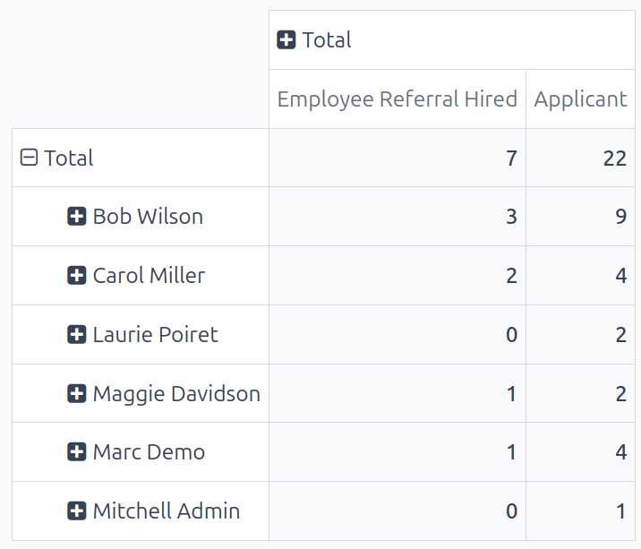

=========
Reporting
=========

The reporting function in the **Referrals** app helps recruiters and managers learn where applicants
are applying from, when referred by a current employee. Additionally, the reporting feature shows
the number of applicants hired, refused, and still in the recruitment pipeline, for each medium.

.. important::
   Only users with *Administrator* rights for the **Recruitment** app have access to the reporting
   feature in the **Referrals** app.

Employees referral analysis report
==================================

To access the *Employees Referral Analysis* report, navigate to :menuselection:`Referrals app -->
Reporting`. This loads the :guilabel:`Employees Referral Analysis` report, in a default
:icon:`fa-bar-chart` :guilabel:`Bar Chart`.

The graph is presented in a :icon:`fa-database` :guilabel:`Stacked` view, with the number of
referrals on the y-axis, and the source, referred to as the :guilabel:`Medium`, of the applicant
(e.g.: *Facebook*, *LinkedIn*, *Email*, etc.) on the x-axis. If a medium does **not** appear on the
report, that indicates there are no referrals from that particular medium.

Referral amounts for all stages are displayed, including :guilabel:`Not Hired` (refused),
:guilabel:`In Progress`, and :guilabel:`Hired`. The default filter is set to the current month.

Hover over any bar to view a popover containing specific data for that particular bar.

In this view, it is easy to see which :guilabel:`Medium` is the most successful.

.. example::
   In this example, both :guilabel:`Email` and :guilabel:`LinkedIn` are the mediums with the most
   referrals, but :guilabel:`Email` has the most referrals that were hired.

   .. image:: reporting/employee-report.png
      :align: center
      :alt: The default report in the Referrals app.

Use case: hired referrals
-------------------------

One way to use the reporting feature is to assess which employees are referring the highest quality
applicants. This is done by examining how many of their referrals go on to become employees.

In this example, data is examined to determined which employee has the highest number of hired
referrals for the current year.

To view this information, first click the :icon:`oi-view-pivot` :guilabel:`(Pivot)` icon in the
upper-right corner. Next, remove the current filter in the search bar.

Click the :icon:`fa-caret-down` :guilabel:`(down arrow)` in the search bar to reveal a drop-down
menu. Click :guilabel:`Date` in the :icon:`fa-filter` :guilabel:`Filters` column, revealing a
drop-down menu of available time periods, and click the current year (in this example,
:guilabel:`2024`).

Next, click :guilabel:`Measures` :icon:`fa-caret-down`, then deselect :guilabel:`Earned Points` and
:guilabel:`Employee Referral Refused` to hide those metrics. Click anywhere on the screen to close
the drop-down menu.

The information displayed shows how many total applicants each employee referred, and how many of
those applicants were hired, for the current year.

In this example, it can be determined that :guilabel:`Bob Wilson` is the most successful referrer,
with three hired referrals, and nine total referred applicants. Additionally, :guilabel:`Mitchell
Admin` has the lowest performance in terms of referrals, as he has only one applicant, and no hires.

This information can be helpful to the recruitment team, so they can determine the most active
referrers in the company, and who is the most successful in terms of hires.

.. tip::
   The pivot table can be inserted into a new or existing :doc:`spreadsheet
   <../../productivity/spreadsheet/insert>`, if desired.

   To do so, click the :guilabel:`Insert in Spreadsheet` button right above the chart. A pop-up
   window appears, asking which spreadsheet to insert the pivot chart into. Select the desired
   spreadsheet or dashboard from the presented options. Alternatively, select :guilabel:`Blank
   Spreadsheet` to create a new one.

   Click :guilabel:`Confirm`, and the selected spreadsheet loads, with the new table in it.

   The spreadsheet is stored in the *Documents* application. This application **must** be installed
   to use the :guilabel:`Insert in Spreadsheet` option.
