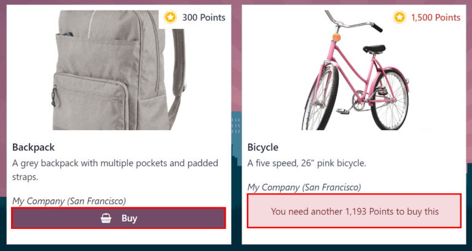

=======
Rewards
=======

After employees have successfully earned referral points, they can exchange their points by
purchasing rewards in Odoo's *Referrals* application. Rewards **must** be :ref:`created and
configured <referrals/create>` before employees can :ref:`redeem points for rewards
<referrals/redeem>`.

.. _referrals/create:

Create rewards
==============

Rewards are the only configurations needed when setting up the *Referrals* application.

Only users with :guilabel:`Administrator` rights for the *Recruitment* application can create or
modify rewards.

To add rewards, navigate to :menuselection:`Referrals app --> Configuration --> Rewards`. Click
:guilabel:`New`, and a reward form loads. Enter the following information on the form:

- :guilabel:`Product Name`: enter the name as it should appear for the reward. This field is
  required.
- :guilabel:`Cost`: enter the amount of points required to redeem the reward.
- :guilabel:`Company`: using the drop-down menu, select the company the reward is configured for. If
  a reward is available for multiple companies, each company **must** configure a reward for their
  specific company. This field **only** appears if in a multi-company environment; if this field
  appears, it is required.

  .. example::
     A corporation with three different companies offers a gift card as a reward. In the database,
     there are three separate rewards listed for a gift card, one for each of the three companies.

- :guilabel:`Gift Responsible`: using the drop-down menu, select the person responsible for
  procuring and delivering the reward to the recipient. This person is alerted when the reward is
  bought in the *Referrals* application, so they know when to deliver the reward to the recipient.
- :guilabel:`Photo`: add a photo of the reward, which appears on the rewards page. Hover over the
  image box in the top-right corner (a square with a camera and plus sign inside it), and a
  :icon:`fa-pencil` :guilabel:`(pencil)` icon appears. Click the :icon:`fa-pencil`
  :guilabel:`(pencil)` icon to select and add a photo to the reward form. Once a photo is added,
  hovering over the image reveals two icons instead of one: a :icon:`fa-pencil`
  :guilabel:`(pencil)` icon and a :icon:`fa-trash-o` :guilabel:`(trash can)` icon. Click the
  :icon:`fa-trash-o` :guilabel:`(trash can)` icon to delete the currently selected image.
- :guilabel:`Description` tab: type in the description for the reward. This is visible on the reward
  card, beneath the title. This field is required.

.. image:: rewards/rewards.png
   :align: center
   :alt: A filled out reward form with all details entered.

.. important::
   It is advised to enter a :guilabel:`Cost` and add a :guilabel:`Photo`. If a cost is not entered,
   the default cost is listed as zero, which would list the reward as free in the reward shop. If a
   photo is not selected, a placeholder icon is displayed on the rewards page.

.. _referrals/redeem:

Redeem rewards
==============

In order to redeem a reward, points must be earned. These points can then be used to purchase a
reward.

To purchase a reward, click the :guilabel:`Rewards` button on the main :guilabel:`Referrals`
dashboard. All the configured rewards are listed in individual reward cards.

The required point amount needed to purchase a reward is listed in the top-right corner of the card.

If the user has enough points to purchase a reward, a :icon:`fa-shopping-basket` :guilabel:`Buy`
button appears at the bottom of the reward card. If they do not have enough points for a reward, the
reward card displays :guilabel:`You need another (x) points to buy this`, instead of a
:icon:`fa-shopping-basket` :guilabel:`Buy` button.

Click the :icon:`fa-shopping-basket` :guilabel:`Buy` button on a reward to purchase it. A
:guilabel:`Confirmation` pop-up window appears, asking if the user is sure they want to purchase the
reward. Click :guilabel:`OK` to purchase the item, or :guilabel:`Cancel` to close the window, and
cancel the purchase.

After :guilabel:`OK` is clicked, the pop-up window closes, and the points used to purchase the
reward are subtracted from the user's available points. The rewards presented are now updated to
reflect the user's current available points.

         many more reward points are needed to redeem.
