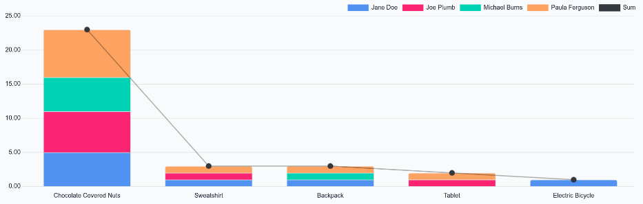

==============
Rewards report
==============

In the **Referrals** app, it is possible to view a report of the rewards that employees have
redeemed. This can help determine the most popular rewards and which rewards employees do not
request.

Incentivizing employees to recruit highly qualified applicants is aided by offering :doc:`rewards
<rewards>` that entice employees to earn points. Additionally, it can be helpful for the
**Referrals** app administrator to see what rewards are popular, to ensure a stock of highly
sought-after rewards is always available.

Reward analysis
===============

To view the *Reward Analysis* report, navigate to :menuselection:`Referrals app --> Reporting -->
Rewards`. This opens the :guilabel:`Reward Analysis` report in a default stacked
(:icon:`fa-database`) bar chart (:icon:`fa-bar-chart`).

The X-axis is populated with the various rewards, while the Y-axis is populated with the number of
rewards redeemed by employees. All employees who have redeemed rewards appear in their own
identifying color.

This report shows that :guilabel:`Chocolate Covered Nuts` are the most desired reward, with 23
distributed to employees. It can also be determined that employees do not often request the
:guilabel:`Sweatshirt`, :guilabel:`Backpack`, :guilabel:`Tablet`, and :guilabel:`Electric Bicycle`;
therefore, inventory for those items does not need to be as high as the :guilabel:`Chocolate Covered
Nuts`.

