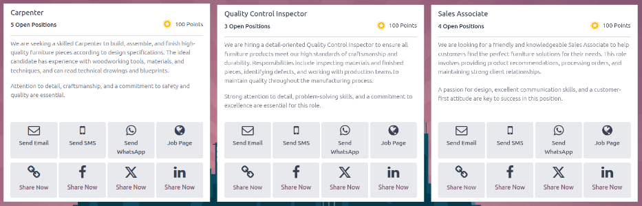

===================
Share job positions
===================

In Odoo **Referrals**, users can earn referral points by sharing job positions with potential
applicants. Individual job positions can be shared in several ways: via :ref:`email
<referrals/email>`, :ref:`SMS <referrals/sms>`, :ref:`WhatsApp <referrals/whatsapp>`, a
:ref:`tracking link <referrals/link>`, and various :ref:`social media platforms <referrals/social>`.

Additionally, *all* job positions can be :ref:`shared via email <referrals/email-jobs>`, instead of
sharing individual job positions.

.. note::
   Sharing jobs can **only** occur after :ref:`onboarding <referrals/onboarding>` slides have been
   viewed or skipped.

.. _referrals/view-jobs:

View all jobs
=============

To see all job positions that are actively recruiting candidates, click the :guilabel:`View Jobs`
button on the main **Referrals** app dashboard. This presents all job positions, with each job
presented with its own card.

         displayed on the card.

Each job position card contains the following information:

- The title of the job position. This information is taken from the *Job Position* field of the job
  form.
- The number of :guilabel:`Open Positions` being recruited. This information is taken from the
  *Expected New Employees* field of the *Recruitment* tab of the job form.
- The :doc:`points <points>` a user earns when an applicant applies for the position.
- The job description detailing the job position. This information is taken from the *Job Position*
  tab of the job form.

.. note::
   Only published job positions are visible in the **Referrals** app. To check which job positions
   are published or not, refer to the :doc:`../recruitment/new_job` documentation.

Share an individual job
=======================

To share an individual job position, first click the :guilabel:`View Jobs` button on the main
**Referrals** app dashboard. This presents a list of all currently published jobs. From this page,
an individual job can be shared with someone using one of the methods below.

.. _referrals/email:

Send email
----------

To share an individual job position via email, click the :icon:`fa-envelope-o` :guilabel:`Send
Email` button on the specific job position card. A preconfigured email template appears in a pop-up
window, using the :guilabel:`Send Job Offer by Mail` template. Enter the recipient's email address
in the :guilabel:`Email` field.

The :guilabel:`Subject` and :guilabel:`Body` are populated using a default template. The
:guilabel:`Subject` `Job for you` is present, by default, but can be modified, if desired.

The specific title of the job position populates the *Job Position* placeholder in the email body.
The `See Job Offer` text in the email body is an individualized tracking link to the specific job
position listed on the website.

When the prospective employee receives the email, the link sends them to the job position page,
where they can apply for the position, and the person who referred them is tracked in the
**Referrals** app.

If desired, add any text or closing salutation to the email body. When all edits have been made,
click :guilabel:`Send Mail` to send the email, or click :guilabel:`Cancel` to close the pop-up
window.

.. _referrals/sms:

Send SMS
--------

To share an individual job position with someone via SMS (text message), click the :icon:`fa-mobile`
:guilabel:`Send SMS` button on the specific job position card. A preconfigured :guilabel:`Send Job
Offer by SMS` pop-up window appears. Enter the recipient's mobile number in the
:guilabel:`Recipient` field.

Modify the prepopulated :guilabel:`Body` message, if desired, then click the :guilabel:`Send SMS`
button to send the message, or click :guilabel:`Cancel` to close the pop-up window and cancel the
message.

.. note::
   Sending text messages is **not** a default capability with Odoo. To send text messages, credits
   are required, which need to be purchased. For more information on IAP credits and plans, refer to
   the :doc:`../../essentials/in_app_purchase` documentation.

.. _referrals/whatsapp:

Send WhatsApp
-------------

To share an individual job position with someone via WhatsApp, click the :icon:`fa-whatsapp`
:guilabel:`Send WhatsApp` button on the specific job position card. A preconfigured :guilabel:`Send
Job Offer by WhatsApp` pop-up window appears. Enter the recipient's mobile number in the
:guilabel:`Recipient` field.

Modify the default message, if desired, then click the :guilabel:`Send WhatsApp` button to send the
message, or click :guilabel:`Cancel` to close the pop-up window and cancel the message.

.. note::
   To send WhatsApp messages, WhatsApp must be configured in Odoo. For more information, refer to
   the :doc:`../../productivity/whatsapp` documentation.

Job page
--------

To see all the details for a job position, click the :icon:`fa-globe` :guilabel:`Job Page` button on
the specific card. Doing so opens the job position webpage in a new browser tab. This is what an
applicant sees before applying for a position.

.. _referrals/link:

Share now
---------

To share the job position with a customized tracking link, click the :icon:`fa-chain`
:guilabel:`Share Now` button to copy the link. A pop-up window in the corner of the computer loads,
stating `Referral link: (link to Job Position) has been copied to clipboard`.

Next, share the link with the prospective employee.

.. _referrals/social:

Share a job via social media
----------------------------

Other than sending an email, SMS, WhatsApp message, or sharing a tracking link, job positions can be
shared via social media platforms (:ref:`Facebook <referrals/facebook>`, :ref:`X <referrals/x>`, and
:ref:`LinkedIn <referrals/linkedin>`. On each job position card are the three corresponding social
media icons that can be used to share the job position, keeping track of applicants in the
**Referrals** application.

.. _referrals/facebook:

Facebook
~~~~~~~~

To share the job position using Facebook, click the :icon:`fa-facebook` :guilabel:`Share Now`
button.

If the user is already logged into Facebook, when the :icon:`fa-facebook` :guilabel:`Share Now`
button is clicked, Facebook loads in a new tab, where a :guilabel:`Create post` pop-up window loads
with the tracking link attached.

Type in any additional information to add to the post, then share the job position using the
available options in Facebook.

.. note::
   To share the job via Facebook,first, the user **must** be logged into Facebook. If the user is
   *not* already logged in, when the :icon:`fa-facebook` :guilabel:`Share Now` button is clicked, a
   new tab loads, stating `You are not logged in. Please login and try again.`

.. _referrals/x:

X (formerly Twitter)
~~~~~~~~~~~~~~~~~~~~

To share a job position on X, click the :guilabel:`X Share Now` button.

If the user is already signed-in to X, when the :guilabel:`X Share Now` button is clicked, an X page
loads in a new tab with a pre-populated message ready to post, in a draft pop-up window. If the user
is *not* already signed-in, a sign-in screen loads instead, prompting the user to first sign-in to
X.

Type in any additional information, or make any edits to the default message, then share using the
available options in X.

.. _referrals/linkedin:

LinkedIn
~~~~~~~~

To share a job position on LinkedIn, click the :icon:`fa-linkedin` :guilabel:`Share Now` button.

If the user is already logged into LinkedIn, when the :icon:`fa-linkedin` :guilabel:`Share Now`
button is clicked, a new tab loads in LinkedIn, with a link to the job position at the top. If the
user is *not* already logged in, a log-in screen loads instead, prompting the user to log-in to
LinkedIn first.

The job position can be shared either in a public post, or in a private message to an individual (or
group of individuals).

Type in any additional information, or make any edits to the message or post, then share using the
available options in LinkedIn.

.. _referrals/email-jobs:

Share job list
==============

Another way to share job opportunities is to share the entire current list of open job positions,
instead of one job position at a time. To do this, navigate to the :menuselection:`Referrals` main
dashboard. Click the :guilabel:`Email a friend` button at the bottom of the screen. A
:guilabel:`Send Job Offer by Mail` pop-up window appears.

Enter the email address in the :guilabel:`Email` field. The email can be sent to multiple recipients
by separating each email address with a comma followed by a single space. The :guilabel:`Subject` is
preconfigured with :guilabel:`Job for you`, but can be edited. The email :guilabel:`Body` is also
populated with preconfigured text.

The link to all active job positions is a tracking link to a complete list of all job positions
currently being recruited for. Add any additional text and make any edits to the message body, if
necessary. Then, click :guilabel:`Send Mail` to send the email. This sends the message, and closes
the window.
