========
Time Off
========

Odoo's *Time Off* application is a centralized place, where all time off information is housed. The
*Time Off* app manages everything related to requests, balances, allocations, approvals, and
reports.

Users can :ref:`request time off <time_off/request-time-off>`, managers can :ref:`approve time off
requests <time_off/approve-time-off>`, :ref:`allocate time off <time_off/allocate>` to individuals,
teams, or the whole company, :ref:`reports <time_off/reporting>` can be run to see how much time off
(and what kinds of time off) are being used, :ref:`accrual plans <time_off/accrual-plans>` can be
created, and :ref:`public holidays <time_off/public-holidays>` can be set.

.. note::
   Be advised, only users with specific access rights can see all aspects of the *Time Off*
   application.

   All users can access the :guilabel:`My Time Off` and :guilabel:`Overview` sections of the *Time
   Off* application. All other sections require specific access rights.

   To better understand how access rights affect the *Time Off* application, refer to the
   :doc:`/applications/hr/employees/new_employee` document, specifically the section about
   configuring the work information tab.

Configuration
=============

In order to allocate time off to employees, and for employees to request and use their time off, the
various time off types must be configured first, then allocated to employees (if allocation is
required).

.. _time_off/time-off-types:

Time off types
--------------

To view the currently configured time off types, navigate to :menuselection:`Time Off application
--> Configuration --> Time Off Types`. The time off types are presented in a list view. The *Time
Off* application comes with four types of time off pre-configured: :guilabel:`Paid Time Off`,
:guilabel:`Sick Time Off`, :guilabel:`Unpaid`, and :guilabel:`Compensatory Days`. Any of these may
be modified to suit the needs of the businesses, or can be used as-is.

Create time off type
~~~~~~~~~~~~~~~~~~~~

To create a new time off type, navigate to :menuselection:`Time Off app --> Configuration --> Time
Off Types`. From here, click the :guilabel:`Create` button to reveal a blank time off type form.

Enter the name for the particular type of time off in the blank line at the top of the form, such as
`Sick Time` or `Vacation`. Then, enter the following information on the form:

Time off requests section
*************************

- :guilabel:`Approval`: select what specific kind of approval is required for the time off type. The
  options are:

  - :guilabel:`No Validation`: no approvals are required when requesting this type of time off. The
    time off request is automatically approved when requested.
  - :guilabel:`By Time Off Officer`: only the specified :ref:`Time Off Officer
    <time_off/time-off-officer>`, set on this form in the :guilabel:`Responsible Time Off Officer`
    field, is required to approve the time off request. This option is selected by default.
  - :guilabel:`By Employee's Approver`: only the employee's specified approver for time off, which
    is set on the *Work Information* tab on the :ref:`employee's form <employees/work-info-tab>`, is
    required to approve the time off request.
  - :guilabel:`By Employee's Approver and Time Off Officer`: both the employee's :ref:`specified
    time off approver<employees/work-info-tab>` and the :ref:`Time Off Officer
    <time_off/time-off-officer>` are required to approve the time off request.

  .. _`time_off/time-off-officer`:

- :guilabel:`Responsible Time Off Officer`: select the person responsible for approving requests and
  allocations for this specific type of time off.
- :guilabel:`Take Time Off in`: select the format the time off is requested from the drop-down menu.
  The options are:

  - :guilabel:`Day`: if time off can only be requested in full day increments (8 hours).
  - :guilabel:`Half Day`: if time off can only be requested in half day increments (4 hours).
  - :guilabel:`Hours`: if the time off can be taken in hourly increments.

- :guilabel:`Deduct Extra Hours`: tick this box if the time off request should factor in any extra
  time accrued by the employee

  .. example::
     For example, if an employee worked two (2) extra hours for the week, and requests five (5)
     hours of time off, the request would be for three (3) hours, since the two (2) additionally
     worked hours are used first, and deducted from the request.

- :guilabel:`Allow To Join Supporting Document`: tick this box to allow the employee to attach
  documents to the time off request. This is useful in situations where documentation is required,
  such as long-term medical leave.
- :guilabel:`Kind of Leave`: select from the drop-down menu the type of leave this time off type is,
  either :guilabel:`Time Off` or :guilabel:`Other`.
- :guilabel:`Company`: if multiple companies are created in the database, and this time off type
  only applies to one company, select the company from the drop-down menu. If this field is left
  blank, the time off type applies to all companies in the database.

Allocation requests section
***************************

- :guilabel:`Requires allocation`: if the time off must be allocated to employees, select
  :guilabel:`Yes`. If the time off can be requested without time off being previously allocated,
  select :guilabel:`No Limit`. If :guilabel:`No Limit` is selected, the following options do not
  appear on the form.
- :guilabel:`Employee Requests`: select :guilabel:`Extra Days Requests Allowed` if the employee is
  able to request more time off than was allocated.

  .. example::
     For example, if ten (10) days are allocated to the employee for this particular type of time
     off, and this option is enabled, the employee may submit a request for more than ten (10) days.

  If employees should **not** be able to make requests for more time off than what was allocated,
  select the :guilabel:`Not Allowed` option.

- :guilabel:`Approval`: select the type of approval(s) required for the allocation of this
  particular type of time off.

  - :guilabel:`No validation needed` indicates that no approvals are required.
  - :guilabel:`Approved by Time Off Officer` indicates the :ref:`Time Off Officer
    <time_off/time-off-officer>` set on this form must approve the allocation.
  - :guilabel:`Set by Time Off Officer` indicates that the :ref:`Time Off Officer
    <time_off/time-off-officer>` set on this form must allocate the time off.

Payroll section
***************

If the time off type should create :doc:`../hr/payroll/work_entries` in the *Payroll* application,
select the :guilabel:`Work Entry Type` from the drop-down list.

Timesheets section
******************

.. note::
   The :guilabel:`Timesheets` section only appears if the user is in developer mode. Refer to the
   :ref:`developer-mode` document for details on how to access the developer mode.

When an employee takes time off and is also using timesheets, Odoo creates entries in the timesheet
for the time off. This section defines how they are entered.

- :guilabel:`Project`: select the project that the time off type entries appear in.
- :guilabel:`Task`: select the task that appears in the timesheet for this time off type. The
  options are: :guilabel:`Time Off`, :guilabel:`Meeting`, or :guilabel:`Training`.

Display option section
**********************

- :guilabel:`Color`: select a color to be used in the *Time Off* application dashboard.
- :guilabel:`Cover Image`: select an icon to be used in the *Time Off* application dashboard.

.. note::
   The only required fields on the time off type form are the name of the :guilabel:`Time Off Type`,
   the :guilabel:`Approval`, the :guilabel:`Responsible Time Off Officer`, :guilabel:`Take Time Off
   in`, :guilabel:`Kind of Leave`, and the :guilabel:`Allocation Requests` section.

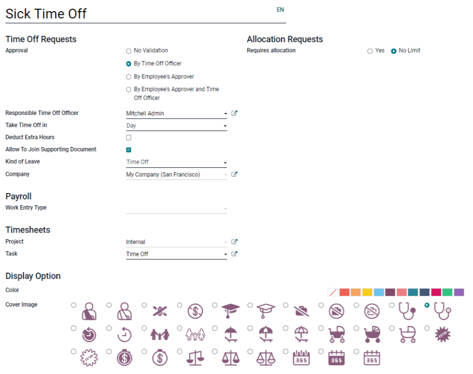

.. _time_off/accrual-plans:

Accrual plans
-------------

Some time off is earned through an accrual plan, meaning that for every specified amount of time an
employee works (hour, day, week, etc), they earn or *accrue* a specified amount of time off.

.. example::
   If an employee accrues a vacation day for every week they work, they would earn 0.2 vacation days
   for each hour they work. At the end of a forty (40) hour work week, they earn a whole vacation
   day (8 hours).

Create accrual plan
~~~~~~~~~~~~~~~~~~~

To create a new accrual plan, navigate to :menuselection:`Time Off app --> Configuration --> Accrual
Plans`. Then, click the :guilabel:`Create` button, which reveals a blank accrual plan form.

Enter the accrual plan name in the :guilabel:`Name` field. If the accrual plan only applies to a
specific time off type, select it from the drop-down menu. If this accrual plan is available for all
time off types, leave this field blank.

Next, select how the :guilabel:`Level Transition` occurs, either :guilabel:`Immediately` or
:guilabel:`After this accrual's period`. By default, the first level begins once the time off is
approved if the time off is based on an accrual plan. If :guilabel:`Immediately` is selected, then
the next level begins according to the time frame set on the level. If :guilabel:`After this
accrual's period` is selected, the next level does not begin until the first level is completed
according to the rules set on it.

Rules
*****

Rules must be created in order for the accrual plan to accrue time off.

To create a new rule, click the :guilabel:`Add A New Level` button right beneath the word `Rules`,
and a :guilabel:`Create Level` pop-up form appears.

Fill out the following fields on the form:

- :guilabel:`Start after (#) (time period) after allocation date`: enter the number and value of the
  time period that must pass before the employee starts to accumulate time off. The first value is
  numerical; enter a number in the first field.

  Then, select the type of time period using the drop-down menu in the second field. The options
  are: :guilabel:`day(s)`, :guilabel:`month(s)`, or :guilabel:`year(s)`.
- :guilabel:`Based on worked time`: tick this box if the accrual of time off is based on the time
  the employee has worked. If an employee takes time off that is *not* considered a worked day, Odoo
  will not count that day towards their accrual plan.
- :guilabel:`Rate (#) (time)`: enter the rate of time off that is accumulated. The first value is
  numerical; enter a number in the first field. Whole numbers are not necessary, any decimal value
  may be entered.

  Next, in the second field, select the type of time accrued using the drop-down menu. The options
  are either :guilabel:`Days` or :guilabel:`Hours`.
- :guilabel:`Frequency (X)`: select how often the employee accrues the time off for this rule using
  the drop-down menu. The options are :guilabel:`Daily`, :guilabel:`Weekly`, :guilabel:`Twice a
  month`, :guilabel:`Monthly`, :guilabel:`Twice a year`, or :guilabel:`Yearly`.

  Depending on the selection, more fields appear to specify exactly when the accrual renews.

.. example::
   If the employee should accrue one vacation day for every week worked, the :guilabel:`Rate` is set
   to `1`, and the :guilabel:`Frequency` entry is set to `Frequency (Weekly) on (Friday)`. Only the
   :guilabel:`Frequency` and :guilabel:`Weekday` fields appear.

   If the employee should accrue ten (10)vacation days each year, and they receive these days every
   year on the first of January, the :guilabel:`Rate` is set to `10`, and the :guilabel:`Frequency`
   entry is set to `Frequency (Yearly) on the (1) of (January)`. The :guilabel:`Frequency`,
   :guilabel:`Date`, and :guilabel:`Month` fields appear.

- :guilabel:`Limit to`: enter a maximum amount of days the employee can accrue with this plan.
- :guilabel:`At the end of the calendar year, unused accruals will be`: select from the drop-down
  menu how unused time off is handled.

  The options are either :guilabel:`Transferred to the next year`, which rolls over unused time to
  the next calendar year, or :guilabel:`Lost`, which means any unused time off is gone.

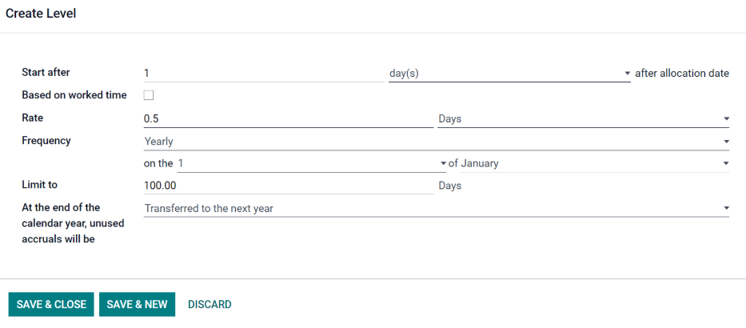

When the form is filled out, click :guilabel:`Save & Close` to save the form and close the pop-up,
or :guilabel:`Save & New` to save the form and create a new rule. Add as many levels as desired.

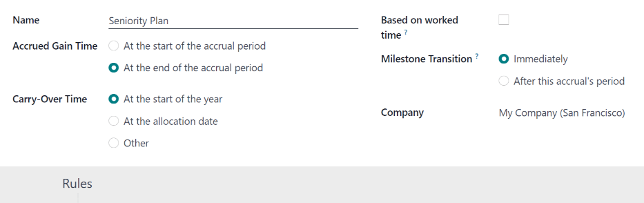

.. _time_off/public-holidays:

Public holidays
---------------

Most countries have public or national holidays, and some companies may have specific days they are
closed and/or give extra days as holidays.

It is important to configure these days in Odoo, so employees are aware of the days they have off,
and do not request time off on days that are already set as a public holiday (non-working days).

Create public holiday
~~~~~~~~~~~~~~~~~~~~~

To create a public holiday, navigate to :menuselection:`Time Off app --> Configuration --> Public
Holidays`.

All currently configured public holidays appear in a list view.

Click the :guilabel:`Create` button, and a new line appears at the bottom of the list.

Enter the following information:

- :guilabel:`Name`: enter the name of the holiday.
- :guilabel:`Company`: if in a multi-company database, the current company populates this field by
  default. It is not possible to edit this field.
- :guilabel:`Start Date`: using the date and time picker, select the date and time that the holiday
  starts. By default, this field is configured for the current date. The start time is set according
  to the start time for the company (according to the :ref:`working times <payroll/working-times>`).
  If the user's computer is set to a different time zone, the start time is adjusted according to
  the difference in the time zone compared to the company's time zone.
- :guilabel:`End Date`: using the date and time picker, select the date and time that the holiday
  ends. By default, this field is configured for the current date, and the time is set to the end
  time for the company (according to the :ref:`working times <payroll/working-times>`). If the
  user's computer is set to a different time zone, the start time is adjusted according to the
  difference in the time zone compared to the company's time zone.

  .. example::
     A company is located in San Francisco, and the working times are 9:00 AM - 6:00 PM (an eight
     (8) hour work day with a one (1) hour lunch break). A user is located in New York, and their
     computer time zone is set to Eastern. When they create a Public Holiday, the start time appears
     as 12:00 PM - 9:00 PM, since the time zone is accounted for. If a different user is located in
     Los Angeles, and their computer time zone is set to Pacific, when they create a Public Holiday,
     the time appears as 9:00 AM - 6:00 PM.

- :guilabel:`Working Hours`: if the holiday should only apply to employees who have a specific set
  of working hours, select the working hours from the drop-down menu. If left blank, the holiday
  applies to all employees.
- :guilabel:`Work Entry Type`: if using the *Payroll* application, this field defines how the work
  entry for the holiday appears. Select the work entry type from the drop-down menu.

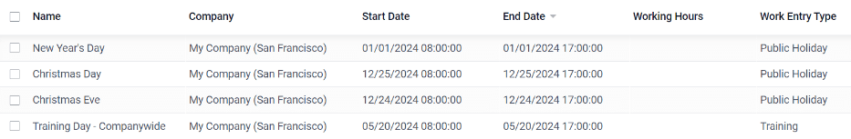

.. _time_off/allocate:

Overview
========

To view a color-coded schedule of both the user's time off, and/or the team managed by them,
navigate to :menuselection:`Time Off app --> Overview`. This presents a calendar with the default
filter of :guilabel:`My Team`, in a month view.

To change the time period displayed, click on either the :guilabel:`Day`, :guilabel:`Week`,
:guilabel:`Month`, or :guilabel:`Year` buttons to present the calendar in that corresponding view.

Each team member is displayed on a line, and any time off they requested, regardless of the status
(:guilabel:`Validated` or :guilabel:`To Approve`), appears on the calendar.

Each employee is color-coded. The employee's color is selected at random and does not correspond to
the type of time off they requested.

The status of the time of is represented by the color of the request either appearing solid
(:guilabel:`Validated`) or striped (:guilabel:`To Approve`).

The number of days or hours requested is written on the request (if there is enough space).

At the bottom of the calendar, a bar graph shows how many people are projected to be out on any
given day. The number on the bar represents the number of employees out for those highlighted days.

Hover over a time off entry to view the details for the specific time off entry. The total number of
hours or days are listed, along with the start and end time of the time off.

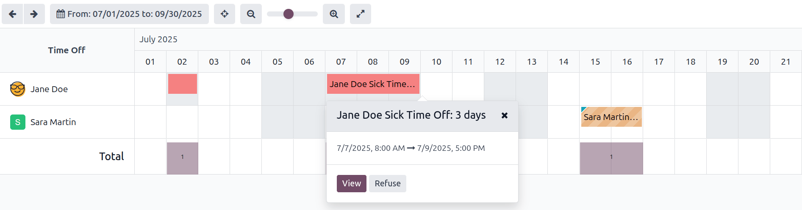

.. _time_off/reporting:

Allocate time off
=================

Once time off types and accrual plans have been configured, the next step is to allocate, or give,
time off to employees. This section is only visible to users who have either :guilabel:`Time Off
Officer` or :guilabel:`Administrator` access rights for the *Time Off* application.

To create a new allocation, navigate to :menuselection:`Time Off app --> Approvals --> Allocations`.

This presents a list of all current allocations, including their respective status.

Click :guilabel:`Create` to allocate time off, and a blank allocation form appears.

After entering a name for the allocation on the first blank field of the form, enter the following
information:

- :guilabel:`Time Off Type`: using the drop-down menu, select the type of time off that is being
  allocated to the employees.
- :guilabel:`Allocation Type`: select either :guilabel:`Regular Allocation` or :guilabel:`Accrual
  Allocation`.
- :guilabel:`Accrual Plan`: if :guilabel:`Accrual Allocation` is selected for the
  :guilabel:`Allocation Type`, the :guilabel:`Accrual Plan` field appears. Using the drop-down menu,
  select the accrual plan with which the allocation is associated. An accrual plan **must** be
  selected for an :guilabel:`Accrual Allocation`.
- :guilabel:`Validity Period/Start Date`: if :guilabel:`Regular Allocation` is selected for the
  :guilabel:`Allocation Type`, this field is labeled :guilabel:`Validity Period`.

  Using the calendar, select the beginning date for the allocation. If the allocation expires,
  select the expiration date in the next date field. If the time off does *not* expire, leave the
  second date field blank.

  If :guilabel:`Accrual Allocation` is selected for the :guilabel:`Allocation Type`, this field is
  labeled :guilabel:`Start Date`.

  Using the calendar picker, select the start date for the allocation. If the allocation expires,
  select the expiration date in the :guilabel:`Run until` field. If the time off does *not* expire,
  leave the :guilabel:`Run until` field blank.
- :guilabel:`Duration`: enter the amount of time that is being allocated to the employees. This
  field displays the time in either :guilabel:`Hours` or :guilabel:`Days`, depending on how the
  selected :ref:`Time Off Type <time_off/time-off-types>` is configured (in days or hours).
- :guilabel:`Mode`: using the drop-down menu, select how the allocation is assigned. This selection
  determines who receives the time off allocation. The options are :guilabel:`By Employee`,
  :guilabel:`By Company`, :guilabel:`By Department`, or :guilabel:`By Employee Tag`.

  Depending on what was selected for the :guilabel:`Mode`, this following field is labeled either:
  :guilabel:`Employees`, :guilabel:`Company`, :guilabel:`Department`, or :guilabel:`Employee Tag`.

  Using the drop-down menu, indicate the specific employees, company, department, or employee tags
  who are receiving this time off.

  Multiple selections can be made for either :guilabel:`Employees` or :guilabel:`Employee Tag`.

  Only one selection can be made for the :guilabel:`Company` or :guilabel:`Department`.
- :guilabel:`Add a reason...`: if any description or note is necessary to explain the time off
  allocation, enter it in this field at the bottom of the form.

.. _time_off/request-time-off:

Request time off
================

Once an employee has been allocated time off, a request to use the time off can be submitted. Time
off can be requested in one of two ways, either from the :ref:`dashboard <time_off/dashboard>` or
from the :guilabel:`My Time Off` view.

To access the dashboard, navigate to :menuselection:`Time Off app --> My Time Off --> Dashboard`.
This is also the default view for the *Time Off* application.

To access :guilabel:`My Time Off`, navigate to :menuselection:`Time Off app --> My Time Off --> My
Time Off`. This presents a list view of all the time off requests for the employee.

To create a new request for time off, click either the :guilabel:`New Time Off` button on the main
*Time Off* dashboard, or the :guilabel:`Create` button in the :guilabel:`My Time Off` list view.
Both buttons open a new time off request form.

Enter the following information on the form:

- :guilabel:`Time Off Type`: select the type of time off being requested from the drop-down menu.
- :guilabel:`Dates`: enter the dates that the time off will fall under. There are two fields to
  populate, the :guilabel:`From` and :guilabel:`To` fields. Click on either the :guilabel:`From` or
  :guilabel:`To` field, and a calendar pop-up appears.

  Click on the start date, then click on the end date. The selected start and end dates appear in
  deep purple, and the dates between them appear in pale purple (if applicable).

  If the time off requested is for a single day, click on the start date, then click the same date
  again for the end date.

  When the correct dates are selected/highlighted, click the :guilabel:`Apply` button.

  The dates now populate the :guilabel:`From` and :guilabel:`To` fields.

  - :guilabel:`Half Day`: if the time off request is for a half day, tick this box. When this is
    selected, the :guilabel:`From` date field disappears, and is replaced with a drop-down menu.
    Select either :guilabel:`Morning` or :guilabel:`Afternoon` to indicate which half of the day is
    being requested.
  - :guilabel:`Custom Hours`: if the time off requested is not a whole or half day, tick this box. A
    :guilabel:`From` and :guilabel:`To` field appears beneath this option if selected. Using the
    drop-down menu, select the start and end time for the time off request.

- :guilabel:`Duration`: this field updates automatically once the :guilabel:`Date` section is
  completed. If the :guilabel:`Date` section is modified, this section automatically updates to
  reflect the total time off requested. This field is in either hours or days, depending on the
  :guilabel:`Date` selections.
- :guilabel:`Description`: enter a description for the time off request. This should include any
  details that managers and approvers may need in order to approve the request.
- :guilabel:`Supporting Document`: this field only appears if the :guilabel:`Time Off Type` selected
  allows for the attachments of documents. Click the :guilabel:`Attach File` button, and a file
  explorer window appears.

  Navigate to the file(s) to attach, then click the :guilabel:`Open` button. The files then appear
  on the time off request form. Multiple documents can be attached, if necessary.

When the form is complete, click the :guilabel:`Save` button to save the information, and submit the
request.

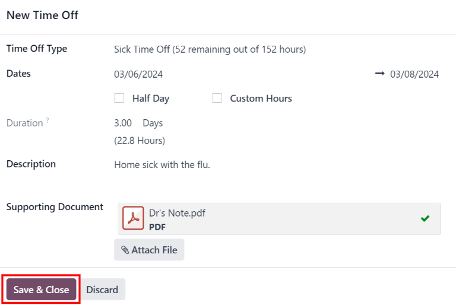

.. _time_off/request-allocation:

Request allocation
==================

If an employee has used all their time off, or is going to run out of time off, they can request an
allocation for additional time. Allocations can be requested in one of two ways, either from the
:ref:`dashboard <time_off/dashboard>` or the :guilabel:`My Allocations` view.

To access the dashboard, navigate to the :menuselection:`Time Off app --> My Time Off -->
Dashboard`. This is also the default view for the *Time Off* application.

To access :guilabel:`My Allocations`, navigate to the :menuselection:`Time Off app --> My Time Off
--> My Allocations`. This presents a list view of all the allocations for the employee.

To create a new allocation request, click either the :guilabel:`Allocation Request` button on the
main *Time Off* dashboard, or the :guilabel:`Create` button in the :guilabel:`My Allocations` list
view. Both buttons open a new allocation request form.

After entering a name for the allocation in the first blank line on the form, enter the following
information:

- :guilabel:`Time Off Type`: select the type of time off being requested for the allocation from the
  drop-down menu.
- :guilabel:`Validity Period`: the current date populates the start date by default. If there is no
  expiration on the time off type, there is no date populated as the end date. If the time off type
  has an expiration date, the date automatically populates the end date field once the form is
  saved.
- :guilabel:`Duration`: enter the amount of time being requested. The format (either days or hours)
  is in the same format as the time off type.
- :guilabel:`Add a reason...`: enter a description for the allocation request. This should include
  any details that managers and approvers may need in order to approve the request.

When the form is complete, click the :guilabel:`Save` button to save the information, and submit the
request.

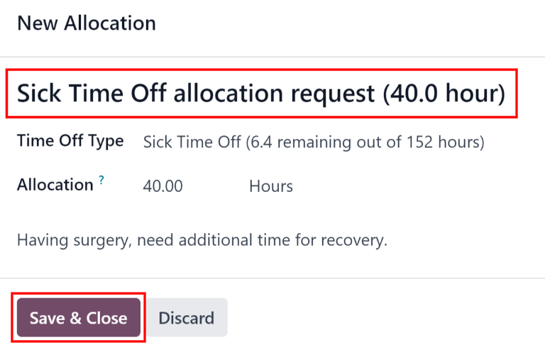
         sick time.

Approvals
=========

Most requests for time off and allocations need to go through the approval process, prior to the
time off being allocated, and then granted to an employee. Requests either need one or two
approvals, depending on how the specific type of time off is configured.

Only users who can approve allocation and time off requests have the :guilabel:`Approvals` section
visible in the *Time Off* application.

Approve allocations
-------------------

To view allocations that need approval, navigate to :menuselection:`Time Off app --> Approvals -->
Allocations`. The only allocations visible on this list are for employees the user has either
:guilabel:`Time Off Officer` or :guilabel:`Administrator` access rights for in the *Time Off*
application.

The default filters that are configured to be in place when navigating to the
:guilabel:`Allocations` list are :guilabel:`My Team` and :guilabel:`Active Employee`. This *only*
presents employees on the user's team (who they manage) and active employees. Inactive users are not
shown.

The left side of the screen has various grouping options to narrow down the presented allocation
requests.

The options are :guilabel:`To Approve`, :guilabel:`To Submit`, :guilabel:`Refused`, and
:guilabel:`Approved`.

To view all allocation requests, click :guilabel:`All`.

It is also possible to display allocation requests by department. Click on the department to only
present allocations for that specific department.

.. note::
   The groupings on the left side only present allocation requests that fall under the default
   filters of :guilabel:`My Team` and :guilabel:`Active Employee`. Only the statuses for allocation
   requests that fall under those filters are presented on the left side.

   For example, if there are no requests with a status of :guilabel:`To Submit`, that status option
   does not appear in the left-hand side.

   All departments for the user's employees appear in the list. If there are no allocation requests
   that fall under that department matching the pre-configured filters, the list is blank.

   It is always possible to remove any of the pre-configured filters, by clicking the :guilabel:`✖️
   (remove)` icon on the specific filter to remove it.

The status column displays the status of each request, with the status highlighted in a specific
color.

The :guilabel:`To Approve` requests are highlighted in yellow, :guilabel:`Approved` requests are
highlighted in green, :guilabel:`To Submit` (drafts) requests are highlighted in blue, and the
:guilabel:`Refused` requests are highlighted in gray.

To approve an allocation request, click :guilabel:`✔ Validate` at the end of the line, to refuse a
request, click :guilabel:`✖️ Refuse`.

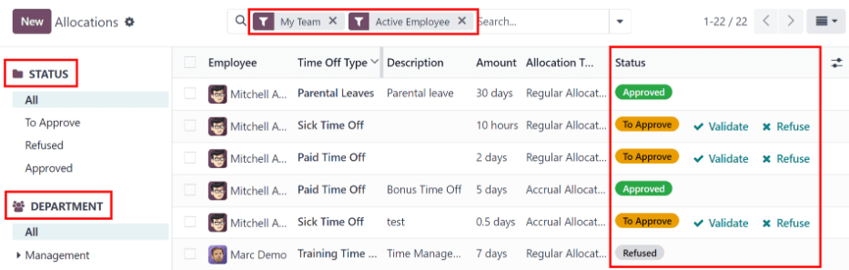

If more details are needed, click anywhere on the allocation request line (except for :guilabel:`✔
Validate` and :guilabel:`✖️ Refuse`) to view the request in detail.

Depending on the rights of the user, changes can be made on the allocation request form that
appears. To modify the request, click the :guilabel:`Edit` button, make any desired changes, then
click :guilabel:`Save`.

It is also possible to approve or refuse the request from this form. Click the :guilabel:`Validate`
button to approve, or the :guilabel:`Refuse` button to refuse the request.

.. _time_off/approve-time-off:

Approve time off
----------------

To view time off requests that need approval, navigate to :menuselection:`Time Off app --> Approvals
--> Time Off`. The only time off requests visible on this list are for employees the user has either
:guilabel:`Time Off Officer` or :guilabel:`Administrator` access rights for the *Time Off*
application.

The default filters in the :guilabel:`Time Off` list are :guilabel:`To Approve`, :guilabel:`My
Team`, :guilabel:`Active Employee`, and :guilabel:`Active Time Off`. This only presents time off
requests that need to be approved for current employees on the user's team, for requests that are
active and *not* in a draft mode.

The left side of the screen has various grouping options to narrow down the presented time off
requests. Since only time off requests that need to be approved are shown, the only status options
are :guilabel:`All` and :guilabel:`To Approve`.

To view requests with other statuses, first remove the :guilabel:`To Approve` filter, by clicking
the :guilabel:`✖️ (remove)` icon next to the :guilabel:`To Approve` filter to remove it.

To display time off requests for specific departments, click on the department on the left-hand
side. Only requests within the selected department are then presented.

The status column displays the status of each request, with the status highlighted in a specific
color.

The :guilabel:`To Approve` requests are highlighted in yellow, and are the only ones that appear in
the list by default. If the :guilabel:`To Approve` filter is removed, then all statuses appear.
:guilabel:`Approved` requests are highlighted in green, :guilabel:`To Submit` (drafts) requests are
highlighted in blue, and the :guilabel:`Refused` requests are highlighted in gray.

To approve a time off request, click :guilabel:`👍 Approve` at the end of the line, to refuse a
request, click :guilabel:`✖️ Refuse`.

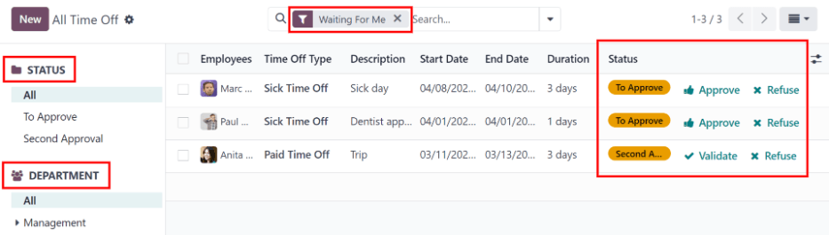

If more details are needed, click anywhere on the time off request line (except for :guilabel:`👍
Approve` and :guilabel:`✖️ Refuse`) to load the time off request form. Depending on the rights of
the user, changes can be made.

To modify the request, click the :guilabel:`Edit` button, make any desired changes, then click
:guilabel:`Save`.

It is also possible to approve or refuse the request from this form. Click the :guilabel:`Approve`
button to approve, or the :guilabel:`Refuse` button to refuse the request.

My time off
===========

The :guilabel:`My Time Off` section of the *Time Off* application contains the time off dashboard,
as well as the user's time off requests and allocations.

.. _time_off/dashboard:

Dashboard
---------

All users have access to the time off dashboard, which is the default view in the *Time Off*
application. The dashboard can also be accessed at any point in the application by navigating to
:menuselection:`Time Off app --> My Time Off --> Dashboard`.

The current year is displayed, and the current day is highlighted in red.

To change the view, click on the desired button at the top. The options are :guilabel:`Day`,
:guilabel:`Week`, :guilabel:`Month`, or :guilabel:`Year` (the default).

To change the presented dates, click the left and right arrows on either side of the
:guilabel:`Today` button. The calendar view adjusts in increments of the presented view.

For example, if :guilabel:`Week` is selected, the arrows adjust the view by one week.

To change the view at any point to a view that includes the current date, click the
:guilabel:`Today` button.

Above the calendar view is a summary of the users time off balances. Every time off type that has
been allocated appears in its own summary box. Each summary lists the type of time off, the
corresponding icon, the current available balance (in hours or days), and an expiration date (if
applicable).

The legend on the right side of the calendar view displays the various time off types, with their
corresponding colors. The status of the time off requests are shown as well.

Time off that has been validated appears in a solid color (in the color specified in the Time Off
Types part of the legend). Time off requests that still need to be approved appear with white
stripes in the color. Refused time off requests have a colored line through the dates.

New time off requests can be made from the dashboard. Click the :guilabel:`New Time Off` button at
the top of the dashboard, and a new :ref:`time off form <time_off/request-time-off>` appears.

New allocation requests can also be made from the dashboard. Click the :guilabel:`Allocation
Request` button at the top of the dashboard to request more time off, and a new :ref:`allocation
form <time_off/request-allocation>` appears.

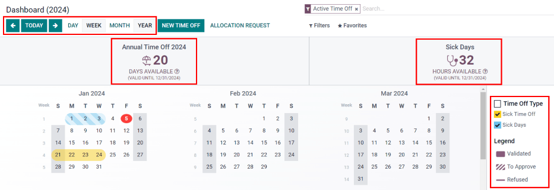

My time off
-----------

To view a list of all the user's time off requests, navigate to :menuselection:`Time Off app --> My
Time Off --> My Time Off`. Here, all time off requests appear in a list view, both past and
present.

Other than the employee's name, the list includes the following information for each request: the
:guilabel:`Time Off Type`, :guilabel:`Description`, :guilabel:`Start Date`, :guilabel:`End Date`,
:guilabel:`Duration`, and the :guilabel:`Status`.

A new time off request can be made from this view. Click the :guilabel:`Create` button to
:ref:`request time off <time_off/request-time-off>`.

My allocations
--------------

To view a list of all the users allocations, navigate to :menuselection:`Time Off app --> My Time
Off --> My Allocations`. All allocations and requested allocations appear in a list view.

The information presented includes: the :guilabel:`Time Off Type`, :guilabel:`Description`,
:guilabel:`Duration`, :guilabel:`Allocation Type`, and the :guilabel:`Status`.

A new allocation request can be made from this view, as well. Click the :guilabel:`Create` button to
:ref:`request an allocation <time_off/request-allocation>`.

Reporting
=========

The reporting feature allows users to view time off for their team, either by employee or type of
time off. This allows users to see which employees are taking time off, how much time off they are
taking, and what time off types are being used.

By employee
-----------

To view a report of employee time off requests, navigate to :menuselection:`Time Off app -->
Reporting --> by Employee`.

The default report is a stacked bar chart with the filters of :guilabel:`Active Employee` and
:guilabel:`Type` in place.

Each employee is displayed in their own column, with the bar displaying how many days of each type
of time off type they requested.

The report can be displayed in other ways. Click the various options at the top of the report to
view the data differently.

The graph options are :guilabel:`Bar Chart`, :guilabel:`Line Chart`, or :guilabel:`Pie Chart`. The
:guilabel:`Bar Chart` includes an option to present the data :guilabel:`Stacked`. Both the
:guilabel:`Bar Chart` and :guilabel:`Line Chart` have options to present the data in either
:guilabel:`Descending` or :guilabel:`Ascending` order.

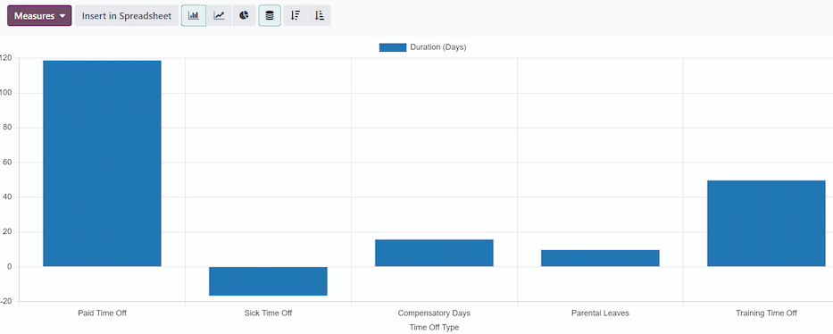

By type
-------

To view a list of approved time off, organized by time off type, navigate to :menuselection:`Time
Off app --> Reporting --> by Type`. This shows each time off type in its own section.

Click on a time off type to expand the list. Each request is listed, with the following information
displayed: the :guilabel:`Employee`, :guilabel:`Number of Days`, :guilabel:`Request Type`,
:guilabel:`Start Date`, :guilabel:`End Date`, :guilabel:`Status`, and the :guilabel:`Description`.

The default filters in place for this report are :guilabel:`Approved Requests`, :guilabel:`Active
Employee`, the :guilabel:`Current Year`, and the :guilabel:`Type`.

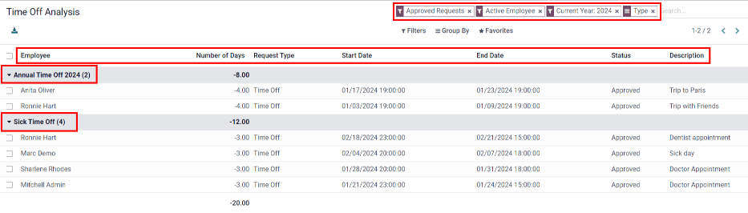
