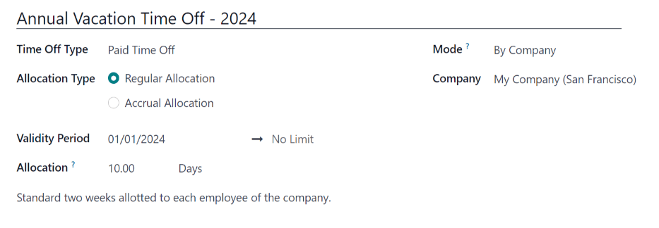
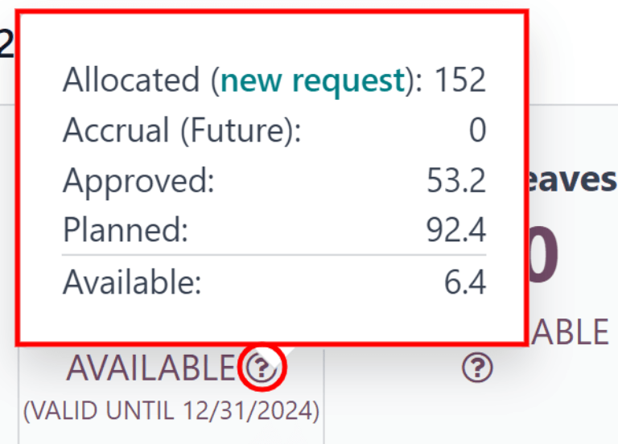
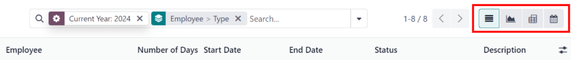

:show-content:

========
Time Off
========

Odoo's *Time Off* application serves as a centralized hub for all time-off-related information. This
application manages requests, balances, allocations, approvals, and reports.

Users can :doc:`request time off <../hr/time_off/request_time_off>`, and see an overview of their
requests and time off balances. Managers can :ref:`allocate time off <time_off/allocate>` to
individuals, teams, or the whole company, and :ref:`approve time off requests
<time_off/manage-time-off>`.

Detailed :ref:`reports <time_off/reporting>` can be run to see how much time off (and what kinds of
time off) are being used, :ref:`accrual plans <time_off/accrual-plans>` can be created, and
:ref:`public holidays <time_off/public-holidays>` can be set.

.. note::
   Be advised, only users with specific access rights can see all aspects of the *Time Off*
   application.

   All users can access the :guilabel:`My Time Off` and :guilabel:`Overview` sections of the *Time
   Off* application. All other sections require specific access rights.

   To better understand how access rights affect the *Time Off* application, refer to the
   :doc:`employees/new_employee` document, specifically the section about configuring the work
   information tab.

Configuration
=============

In order to allocate time off to employees, and for employees to request and use their time off, the
various time off types must be configured first, then allocated to employees (if allocation is
required).

.. _time_off/time-off-types:

Time off types
--------------

To view the currently configured time off types, navigate to :menuselection:`Time Off app -->
Configuration --> Time Off Types`. The time off types are presented in a list view.

The *Time Off* application comes with four pre-configured time off types: :guilabel:`Paid Time Off`,
:guilabel:`Sick Time Off`, :guilabel:`Unpaid`, and :guilabel:`Compensatory Days`. These can be
modified to suit business needs or used as-is.

Create time off type
~~~~~~~~~~~~~~~~~~~~

To create a new time off type, navigate to :menuselection:`Time Off app --> Configuration --> Time
Off Types`. From here, click the :guilabel:`New` button to reveal a blank time off type form.

Enter the name for the particular type of time off in the blank line at the top of the form, such as
`Sick Time` or `Vacation`. Then, enter the following information on the form.

.. note::
   The only **required** fields on the time off type form are the name of the :guilabel:`Time Off
   Type`, the :guilabel:`Take Time Off In`, and the :guilabel:`Kind of Time Off`. In addition, the
   :guilabel:`Time Off Requests` and :guilabel:`Allocation Requests` sections **must** be
   configured.

Time Off Requests section
*************************

- :guilabel:`Approval`: select what specific kind of approval is required for the time off type. The
  options are:

  - :guilabel:`No Validation`: no approvals are required when requesting this type of time off. The
    time off request is automatically approved.
  - :guilabel:`By Time Off Officer`: only the specified :ref:`Time Off Officer
    <time_off/time-off-officer>`, set on this form in the :guilabel:`Notified Time Off Officer`
    field, is required to approve the time off request. This option is selected by default.
  - :guilabel:`By Employee's Approver`: only the employee's specified approver for time off, which
    is set on the *Work Information* tab on the :ref:`employee's form <employees/work-info-tab>`, is
    required to approve the time off request.
  - :guilabel:`By Employee's Approver and Time Off Officer`: both the employee's :ref:`specified
    time off approver<employees/work-info-tab>` and the :ref:`Time Off Officer
    <time_off/time-off-officer>` are required to approve the time off request.

Allocation Requests section
***************************

- :guilabel:`Requires allocation`: if the time off must be allocated to employees, select
  :guilabel:`Yes`. If the time off can be requested without time off being previously allocated,
  select :guilabel:`No Limit`. If :guilabel:`No Limit` is selected, the following options do not
  appear on the form.
- :guilabel:`Employee Requests`: select :guilabel:`Extra Days Requests Allowed` if the employee is
  able to request more time off than was allocated.

  If employees should **not** be able to make requests for more time off than what was allocated,
  select the :guilabel:`Not Allowed` option.

  .. example::
     Ten days are allocated to the employee for this particular type of time off, and the
     :guilabel:`Extra Days Requests Allowed` option is enabled. The employee wants to take a
     vacation for twelve days. They may submit a request for two additional days, since the
     :guilabel:`Extra Days Requests Allowed` option is enabled.

  .. important::
     It is important to note that requesting additional time off does **not** guarantee that time
     off is granted.

- :guilabel:`Approval`: select the type of approvals required for the allocation of this particular
  time off type.

  - :guilabel:`Approved by Time Off Officer` indicates the :ref:`Time Off Officer
    <time_off/time-off-officer>` set on this form must approve the allocation.
  - :guilabel:`No validation needed` indicates that no approvals are required.

Configuration section
*********************

  .. _`time_off/time-off-officer`:

- :guilabel:`Notified Time Off Officer`: select the person who is notified and responsible for
  approving requests and allocations for this specific type of time off.
- :guilabel:`Take Time Off in`: select the format the time off is requested in from the drop-down
  menu.

  The options are:

  - :guilabel:`Day`: if time off can only be requested in full day increments (8 hours).
  - :guilabel:`Half Day`: if time off can only be requested in half day increments (4 hours).
  - :guilabel:`Hours`: if the time off can be taken in hourly increments.

  .. _`time_off/deduct-extra-hours`:

- :guilabel:`Deduct Extra Hours`: enable this option if the time off request should factor in any
  extra time accrued by the employee

  .. example::
     If an employee works two extra hours for the week, and requests five hours of time off, the
     request would be for three hours, since the two extra worked hours are used first, and deducted
     from the request.

- :guilabel:`Allow To Attach Supporting Document`: enable this option to allow the employee to
  attach documents to the time off request. This is useful in situations where documentation is
  required, such as long-term medical leave.
- :guilabel:`Kind of Time Off`: select from the drop-down menu the type of time off this is, either
  :guilabel:`Worked Time` or :guilabel:`Absence`. :guilabel:`Worked Time` indicates that the time
  off taken counts toward worked time for any type of accrual the employee is working towards,
  whereas :guilabel:`Absence` does not count toward any type of accrual.
- :guilabel:`Company`: if multiple companies are created in the database, and this time off type
  only applies to one company, select the company from the drop-down menu. If this field is left
  blank, the time off type applies to all companies in the database. This field **only** appears in
  a multi-company database.

Negative Cap section
********************

Enable the :guilabel:`Allow Negative Cap` option if employees are able to request more time off than
they currently have, allowing a negative balance. If enabled, an :guilabel:`Amount in Negative`
field appears. In this field, enter the maximum amount of negative time allowed, in days.

.. example::
   Sara currently has three days of the time off type `Vacation`. She is planning a trip that
   requires five days of time off.

   The `Vacation` time off type has the :guilabel:`Allow Negative Cap` option enabled, and the
   :guilabel:`Amount in Negative` is set to five.

   These settings allow Sara to submit a request for five days of the `Vacation` time off type. If
   approved, her `Vacation` time off balance will be negative two (-2) days.

.. image:: time_off/time-off-type-form-top.png
   :align: center
   :alt: The top half of the time off type form, with all the information filled out for sick time
         off.

Payroll section
***************

If the time off type should create :doc:`../hr/payroll/work_entries` in the *Payroll* application,
select the :guilabel:`Work Entry Type` from the drop-down list.

Timesheets section
******************

.. note::
   The :guilabel:`Timesheets` section only appears if the user is in developer mode. Refer to the
   :ref:`developer-mode` document for details on how to access the developer mode.

When an employee takes time off, and is also using timesheets, Odoo creates entries in the
*Timesheets* application for the time off. This section defines how they are entered.

- :guilabel:`Project`: select the project that the time off type entries appear in.
- :guilabel:`Task`: select the task that appears in the timesheet for this time off type. The
  default options are: :guilabel:`Time Off`, :guilabel:`Meeting`, or :guilabel:`Training`.

Display Option section
**********************

- :guilabel:`Color`: select a color to be used in the *Time Off* application dashboard.
- :guilabel:`Cover Image`: select an icon to be used in the *Time Off* application dashboard.

.. image:: time_off/time-off-type-form-bottom.png
   :align: center
   :alt: The lower half of the time off type form, with all the information filled out for sick time
         off.

.. _time_off/accrual-plans:

Accrual plans
-------------

Some time off is earned through an accrual plan, meaning that for every specified amount of time an
employee works (hour, day, week, etc), they earn or *accrue* a specified amount of time off.

.. example::
   If an employee accrues a vacation day for every week they work, they would earn 0.2 vacation days
   for each hour they work. At the end of a forty hour work week, they would earn one whole vacation
   day (8 hours).

Create accrual plan
~~~~~~~~~~~~~~~~~~~

To create a new accrual plan, navigate to :menuselection:`Time Off app --> Configuration --> Accrual
Plans`. Then, click the :guilabel:`New` button, which reveals a blank accrual plan form.

Enter the following information on the form:

- :guilabel:`Name`: enter the accrual plan name.
- :guilabel:`Accrued Gain Time`: select when the employee begins to accrue time off, either
  :guilabel:`At the start of the accrual period` or :guilabel:`At the end of the accrual period`.
- :guilabel:`Carry-Over Time`: select when the employee received previously earned time. The options
  are:

  - :guilabel:`At the start of the year`: select this if the accrual rolls over on January 1 of the
    upcoming year.
  - :guilabel:`At the allocation date`: select this if the accrual rolls over as soon as time is
    allocated to the employee.
  - :guilabel:`Other`: select this option if neither of the other two options are applicable. When
    selected, a :guilabel:`Carry-Over Date` field appears. Select the date using the two drop-down
    menus, one for the day and one for the month.

- :guilabel:`Based on worked time`: enable this option if time off accrual is determined by the
  employee's worked hours. Days **not** considered as worked time do **not** contribute to the
  accrual plan in Odoo.
- :guilabel:`Milestone Transition`: this selection determines when employees move up to a new
  milestone. If they qualify to change milestones in the middle of a pay period, select if the
  employee changes milestones :guilabel:`Immediately` or :guilabel:`After this accrual's period`
  (after the current pay period).

  .. important::
     The :guilabel:`Milestone Transition` field is **only** visible after a minimum of two
     :ref:`rules <time_off/rules>` have been configured on the accrual plan.

- :guilabel:`Company`: using the drop-down menu, select the company the accrual plan applies to. If
  left blank, the accrual plan can be used for all companies. This field only appears in a
  multi-company database.

.. image:: time_off/accrual-plan-form.png
   :align: center
   :alt: An accrual plan form with all the entries filled out.

.. _time_off/rules:

Rules
*****

Rules must be created in order for employees to accrue time off from the accrual plan.

To create a new rule, click the :guilabel:`New Milestone` button in the gray :guilabel:`Rules`
section, and a :guilabel:`Create Milestone` modal form appears.

Fill out the following fields on the form:

- :guilabel:`Employee accrue`: select the parameters for earned time off in this section.

  First, select either :guilabel:`Days` or :guilabel:`Hours` for the increment of accrued time using
  the drop-down menu.

  Next, enter the numerical amount of the selected parameter that is accrued. The numerical format
  is `X.XXXX`, so that partial days or hours can also be configured.

  Last, select how often the time is accrued using the drop-down menu. The default options are
  :guilabel:`Hourly`, :guilabel:`Daily`, :guilabel:`Weekly`, :guilabel:`Twice a month`,
  :guilabel:`Monthly`, :guilabel:`Twice a year`, and :guilabel:`Yearly`.

  Depending on which option is selected, additional fields may appear. For example, if
  :guilabel:`Twice a month` is selected, two additional fields appear, to specify the two days of
  each month that the milestone occurs.
- :guilabel:`Cap accrued time`: if there is a maximum amount of days the employee can accrue with
  this plan, enable this option.

  When enabled, two additional fields appear beneath it. Select the type of time period from the
  drop-down menu, either :guilabel:`Days` or :guilabel:`Hours`.

  Then, enter a numerical value in the field to specify the maximum amount of time that can be
  accrued.
- :guilabel:`Milestone reached`: enter the number and value of the time period that must pass before
  the employee starts to accumulate time off. The first value is numerical; enter a number in the
  first field.

  Then, select the type of time period using the drop-down menu in the second field. The options
  are: :guilabel:`Days`, :guilabel:`Months`, or :guilabel:`Years`.
- :guilabel:`Carry over`: select how any unused time off is handled. The options are either:

  - :guilabel:`None. Accrued time reset to 0`: any unused time off is gone.
  - :guilabel:`All accrued time carried over`: all unused time off is rolled over to the next
    calendar year.
  - :guilabel:`Carry over with a maximum`: unused time off is rolled over to the next calendar year,
    but there is a cap. An :guilabel:`Up to` field appears if this is selected. Enter the maximum
    number of :guilabel:`Days` that can roll over to the following year. Any time off beyond this
    parameter is lost.

Once the form is completed, click :guilabel:`Save & Close` to save the form and close the modal, or
click :guilabel:`Save & New` to save the form and create another milestone. Add as many milestones
as desired.

.. image:: time_off/milestone.png
   :align: center
   :alt: A milestone form with all the entries filled out.

.. _time_off/public-holidays:

Public holidays
---------------

To observe public or national holidays, and provide extra days off as holidays to employees,
configure the observed *public holidays* in Odoo.

It is important to configure these days in Odoo, so employees are aware of the days they have off,
and do not request time off on days that are already set as a public holiday (non-working days).

Additionally, all public holidays configured in the *Time Off* app are also reflected in any app
that uses working schedules, such as *Calendar*, *Planning*, *Manufacturing*, and more.

Due to Odoo's integration with other apps that use working schedules, it is considered best practice
to ensure *all* public holidays are configured.

Create public holiday
~~~~~~~~~~~~~~~~~~~~~

To create a public holiday, navigate to :menuselection:`Time Off app --> Configuration --> Public
Holidays`.

All currently configured public holidays appear in a list view.

Click the :guilabel:`New` button, and a new line appears at the bottom of the list.

Enter the following information on that new line:

- :guilabel:`Name`: enter the name of the holiday.
- :guilabel:`Company`: if in a multi-company database, the current company populates this field by
  default. It is not possible to edit this field.

  .. note::
     The :guilabel:`Company` field is hidden by default. To view this field, click the two dots in
     the top-right corner of the list, to the far-right of the column titles, and activate the
     :guilabel:`Company` selection from the drop-down menu that appears.

- :guilabel:`Start Date`: using the date and time picker, select the date and time that the holiday
  starts. By default, this field is configured for the current date. The start time is set according
  to the start time for the company (according to the :ref:`working schedules
  <payroll/working-times>`). If the user's computer is set to a different time zone, the start time
  is adjusted according to the difference in the time zone, compared to the company's time zone.
- :guilabel:`End Date`: using the date and time picker, select the date and time that the holiday
  ends. By default, this field is configured for the current date, and the time is set to the end
  time for the company (according to the :ref:`working schedules <payroll/working-times>`). If the
  user's computer is set to a different time zone, the start time is adjusted according to the
  difference in the time zone, compared to the company's time zone.

  .. example::
     A company located in San Francisco operates from 9:00 AM - 6:00 PM, with an eight hour work day
     and one hour lunch break.

     For a user in New York, with a computer time zone set to Eastern Standard Time, a created
     public holiday displays a start time of 12:00 PM - 9:00 PM, accounting for the three hour time
     zone difference.

     Similarly, a user located in Los Angeles, with a computer time zone set to Pacific Standard
     Time, sees a public holiday time as 9:00 AM - 6:00 PM.

- :guilabel:`Working Hours`: if the holiday should only apply to employees who have a specific set
  of working hours, select the working hours from the drop-down menu. If left blank, the holiday
  applies to all employees.
- :guilabel:`Work Entry Type`: if using the *Payroll* application, this field defines how the
  :ref:`work entries <payroll/work-entries>` for the holiday appear. Select the work entry type
  from the drop-down menu.

.. image:: time_off/holidays.png
   :align: center
   :alt: The list of public holidays in the configuration menu.

Mandatory days
--------------

Some companies have special days where specific departments, or the entire staff, is required to be
present, and time off is not allowed on those specific days.

These types of days are called *mandatory days* in Odoo. These can be configured to be company-wide,
or department specific. When configured, employees in the specified department or company are unable
to submit time off requests for these mandatory days.

Create mandatory days
~~~~~~~~~~~~~~~~~~~~~

No mandatory days are configured in Odoo by default. To create a mandatory day, navigate to
:menuselection:`Time Off app --> Configuration --> Mandatory Days`.

Click the :guilabel:`New` button in the top-left corner, and a blank line appears in the list.

Enter the following information on that new line:

- :guilabel:`Name`: enter the name of the mandatory day.
- :guilabel:`Company`: if in a multi-company database, this field is visible, and the current
  company populates this field by default. Using the drop-down menu, select the company the
  mandatory day is for.
- :guilabel:`Departments`: this column is hidden by default. First, click the :guilabel:`(optional
  columns)` icon in the top-right corner, next to :guilabel:`Colors`, and then click the checkbox
  next to :guilabel:`Departments` to reveal that column.

  Next, select the desired departments from the drop-down menu. Multiple departments can be
  selected, and there is no limit to the amount of departments that can be added.

  If this field is left blank, the mandatory day applies to the entire company.
- :guilabel:`Start Date`: using the calendar picker, select the date the mandatory day starts.
- :guilabel:`End Date`: using the calendar picker, select the date the mandatory day ends. If
  creating a single mandatory day, the end date should be the same as the start date.
- :guilabel:`Color`: if desired, select a color from the available presented options. If no color is
  desired, select the `No color` option, represented by a white box with a red line diagonally
  across it. The selected color appears on the main *Time Off* application dashboard, in both the
  calendar and in the legend.

.. image:: time_off/mandatory.png
   :align: center
   :alt: The Mandatory Days section with three configured days.

.. _time_off/allocate:

Allocate time off
=================

Once time off types and accrual plans have been configured, the next step is to allocate, or give,
time off to employees. This section is only visible to users who have either :guilabel:`Time Off
Officer` or :guilabel:`Administrator` access rights for the *Time Off* application.

To create a new allocation, navigate to :menuselection:`Time Off app --> Management -->
Allocations`.

This presents a list of all current allocations, including their respective statuses.

Click :guilabel:`New` to allocate time off, and a blank allocation form appears.

After entering a name for the allocation on the first blank field of the form, enter the following
information:

- :guilabel:`Time Off Type`: using the drop-down menu, select the type of time off that is being
  allocated to the employees.
- :guilabel:`Allocation Type`: select either :guilabel:`Regular Allocation` or :guilabel:`Accrual
  Allocation`. If the allocation is **not** based on an accrual plan, select :guilabel:`Regular
  Allocation`.
- :guilabel:`Accrual Plan`: if :guilabel:`Accrual Allocation` is selected for the
  :guilabel:`Allocation Type`, the :guilabel:`Accrual Plan` field appears. Using the drop-down menu,
  select the accrual plan with which the allocation is associated. An accrual plan **must** be
  selected for an :guilabel:`Accrual Allocation`.
- :guilabel:`Validity Period/Start Date`: if :guilabel:`Regular Allocation` is selected for the
  :guilabel:`Allocation Type`, this field is labeled :guilabel:`Validity Period`. If
  :guilabel:`Accrual Allocation` is selected for the :guilabel:`Allocation Type`, this field is
  labeled :guilabel:`Start Date`.

  The current date populates the first date field by default. To select another date, click on the
  pre-populated date to reveal a popover calendar window. Navigate to the desired start date for the
  allocation, and click on the date to select it.

  If the allocation expires, select the expiration date in the next date field. If the time off does
  *not* expire, leave the second date field blank. `No Limit` appears in the field if no date is
  selected.

  If :guilabel:`Accrual Allocation` is selected for the :guilabel:`Allocation Type`, this second
  field is labeled :guilabel:`Run until`.
- :guilabel:`Allocation`: enter the amount of time that is being allocated to the employees. This
  field displays the time in either :guilabel:`Hours` or :guilabel:`Days`, depending on how the
  selected :ref:`Time Off Type <time_off/time-off-types>` is configured (in hours or days).
- :guilabel:`Mode`: using the drop-down menu, select how the allocation is assigned. This selection
  determines who receives the time off allocation. The options are :guilabel:`By Employee`,
  :guilabel:`By Company`, :guilabel:`By Department`, or :guilabel:`By Employee Tag`.

  Depending on what is selected for the :guilabel:`Mode`, this following field is labeled either:
  :guilabel:`Employees`, :guilabel:`Company`, :guilabel:`Department`, or :guilabel:`Employee Tag`.

  Using the drop-down menu, indicate the specific employees, company, department, or employee tags
  who are receiving this time off.

  Multiple selections can be made for either :guilabel:`Employees` or :guilabel:`Employee Tag`.

  Only one selection can be made for the :guilabel:`Company` or :guilabel:`Department`.
- :guilabel:`Add a reason...`: if any description or note is necessary to explain the time off
  allocation, enter it in this field at the bottom of the form.

         granted to all employees.

.. _time_off/request-allocation:

Request allocation
==================

If an employee has used all their time off, or is going to run out of time off, they can request an
allocation for additional time. Allocations can be requested in one of two ways, either from the
:ref:`Dashboard <time_off/dashboard>` or the :ref:`My Allocations <time_off/my-allocations>` view.

To create a new allocation request, click either the :guilabel:`New Allocation Request` button on
the main *Time Off* dashboard, or the :guilabel:`New` button in the :guilabel:`My Allocations` list
view. Both buttons open a new allocation request form.

.. note::
   Both :guilabel:`New` buttons open a :guilabel:`New Allocation` request form, but when requested
   from the :guilabel:`Dashboard`, the form appears in a modal. When requested from the
   :guilabel:`My Allocations` list view, the screen navigates to a new allocation request page,
   instead.

Enter the following information on the :guilabel:`New Allocation` request form:

- :guilabel:`Time Off Type`: select the type of time off being requested for the allocation from the
  drop-down menu. After a selection is made, the title updates with the time off type.
- :guilabel:`Validity Period`: this field **only** appears if requesting an allocation with a time
  off type that has the :guilabel:`Take Time Off in` field :ref:`configured
  <time_off/time-off-officer>` to either :guilabel:`Day` or :guilabel:`Half Day`. This field does
  **not** appear if the :guilabel:`Take Time Off in` field is set to :guilabel:`Hours`.

  Using the calendar selector, select a start and end date the allocation is valid for. By default,
  the current date populates the first field, and :guilabel:`No Limit` populates the second field.

  Adjust both of these dates, if desired.
- :guilabel:`Allocation`: enter the amount of time being requested in this field. The format is
  presented in either days or hours, depending on how the time off type is configured. Once this
  field is populated, the name of the allocation request is updated to include the amount of time
  being requested.
- :guilabel:`Add a reason...`: enter a description for the allocation request. This should include
  any details that managers and approvers may need in order to approve the request.

If the request was created from the :guilabel:`Dashboard`, click the :guilabel:`Save & Close` button
to save the information and submit the request.

If the form was completed from the :guilabel:`My Allocations` list view, the information is
automatically saved as it is entered. However, the form can be saved manually at any time by
clicking the *save manually* button, represented by a :guilabel:`(cloud upload)` icon.

.. image:: time_off/allocation-request.png
   :align: center
   :alt: An allocation request form filled out for an employee requesting an additional week of
         sick time.

.. _time_off/approvals:

Management
==========

Time off and allocation requests typically undergo an approval process before being granted.
Requests either need one or two approvals, if any, depending on how the specific type of time off is
configured. These are all housed under the :guilabel:`Management` section of the *Time Off*
application.

Only users who can approve allocation and time off requests have the :guilabel:`Management` section
visible in the *Time Off* application.

.. _time_off/manage-time-off:

Manage time off
---------------

To view time off requests that need approval, navigate to :menuselection:`Time Off app -->
Management --> Time Off`. The only time off requests visible on this list are for employees the user
has either :guilabel:`Time Off Officer` or :guilabel:`Administrator` access rights for in the *Time
Off* application.

The default filter in the :guilabel:`Time Off` list is `Waiting For Me`. This only presents time off
requests that need to be approved for current employees on the user's team, with a status of either
:guilabel:`To Approve` or :guilabel:`Second Approval`.

The left side of the screen has various grouping options to narrow down the presented time off
requests. Since only time off requests that need to be approved are shown, the only status options
are :guilabel:`All`, :guilabel:`To Approve`, and :guilabel:`Second Approval`. The various
departments the user is a member of, and manages employees under, also appear on the left side of
the screen, under :guilabel:`Departments`.

.. note::
   If there are no requests that fall under one of the status options or departments, that status
   or department is **not** visible on the left-side menu.

To display time off requests for specific departments only, click on the :guilabel:`Department` on
the left-hand side. Only requests within the selected department are then presented.

The status column displays the status of each request, with the status highlighted in a specific
color.

The :guilabel:`To Approve` and :guilabel:`Second Approval` requests are highlighted in yellow and
are the only ones that appear in the list by default. If the `Waiting For Me` filter is removed,
then all statuses appear. :guilabel:`Approved` requests are highlighted in green, :guilabel:`To
Submit` (drafts) requests are highlighted in blue, and the :guilabel:`Refused` requests are
highlighted in gray.

To approve a time off request, click the :guilabel:`👍 Approve` button at the end of the line. To
validate a time off request that has already been approved, and is waiting on a second approval,
click the :guilabel:`✔️ Validate` button at the end of the line. To refuse a request, click the
:guilabel:`✖️ Refuse` button at the far end of the line.

.. image:: time_off/time-off-requests.png
   :align: center
   :alt: Time off requests with the filter, groupings, and status sections highlighted.

For more details, click anywhere on the time off request line (except for the :guilabel:`👍
Approve`, :guilabel:`✔️ Validate`, and :guilabel:`✖️ Refuse` buttons) to load the time off request
form. Depending on the rights of the user, changes can be made.

To modify the request, make any desired changes to the form. All changes are automatically saved.

It is also possible to approve or refuse the request from this form. Click the :guilabel:`Approve`
button to approve, or the :guilabel:`Refuse` button to refuse the request.

.. _time_off/manage-allocations:

Manage allocations
------------------

To view allocations that need approval, navigate to :menuselection:`Time Off app --> Management -->
Allocations`. The only allocations visible on this list are for employees the user has either
:guilabel:`Time Off Officer` or :guilabel:`Administrator` access rights for in the *Time Off*
application.

The default filters that are configured to be in place when navigating to the
:guilabel:`Allocations` list are :guilabel:`My Team` and :guilabel:`Active Employee`. This *only*
presents employees on the user's team (who they manage) and active employees. Inactive users are not
shown.

The left side of the screen has various grouping options to narrow down the presented allocation
requests.

The :guilabel:`Status` options are :guilabel:`To Approve`, :guilabel:`Refused`, and
:guilabel:`Approved`. Click on a specific :guilabel:`Status` to view only requests with that status.
To view all allocation requests, click :guilabel:`All`.

It is also possible to display allocation requests by department. Click on the
:guilabel:`Department` in the left side of the screen to only present allocations for that specific
department.

.. note::
   The groupings on the left side only present allocation requests that fall under the default
   filters of :guilabel:`My Team` and :guilabel:`Active Employee`. Only the statuses for allocation
   requests that fall under those filters are presented on the left side.

   For example, if there are no requests with a status of :guilabel:`To Submit`, that status option
   does not appear in the left-hand side.

   All departments for the user's employees appear in the list. If there are no allocation requests
   that fall under that department matching the pre-configured filters, the list is blank.

   It is always possible to remove any of the pre-configured filters, by clicking the :guilabel:`✖️
   (remove)` icon on the specific filter to remove it.

The status column displays the status of each request, with the status highlighted in a specific
color.

The :guilabel:`To Approve` requests are highlighted in yellow, :guilabel:`Approved` requests are
highlighted in green, and the :guilabel:`Refused` requests are highlighted in gray.

To approve an allocation request, click the :guilabel:`✔ Validate` button at the end of the line.
To refuse a request, click the :guilabel:`✖️ Refuse` button.

.. image:: time_off/allocations.png
   :align: center
   :alt: Allocations with the filter, groupings, and status sections highlighted.

If more details are needed, click anywhere on the allocation request line (except for the
:guilabel:`✔ Validate` and :guilabel:`✖️ Refuse` buttons) to view the request in detail.

Depending on the rights of the user, changes can be made to the allocation request form that
appears. To modify the request, make any desired changes to the form. All changes are automatically
saved.

It is also possible to approve or refuse the request from this form. Click the :guilabel:`Validate`
button to approve, or the :guilabel:`Refuse` button to refuse the request.

Overview
========

To view a color-coded schedule of the user's time off, and/or of the team managed by them, navigate
to :menuselection:`Time Off app --> Overview`. This presents a calendar with the default filter of
`My Team`, in a month view.

To change the time period displayed, click on the :guilabel:`Month` button to reveal a drop-down
menu. Then, select either :guilabel:`Day`, :guilabel:`Week`, or :guilabel:`Year` to present the
calendar in that corresponding view.

To navigate forward or backward in time, in the selected increment (:guilabel:`Month`,
:guilabel:`Week`, etc.), click the :guilabel:`← (left arrow)` or :guilabel:`→ (right arrow)` to move
either forward or backward in that specified amount of time.

For example, if :guilabel:`Month` is selected, the arrows adjust the view by one month.

To return to a view containing the current day, click the :guilabel:`Today` button at any time.

Team members are listed alphabetically on individual lines, and their requested time off,
regardless of the status (*validated* or *to approve*), is visible on the calendar.

Each employee is color-coded. The employee's color is selected at random, and does *not* correspond
to the type of time off they requested.

The status of the time off is represented by the color detail of the request, either appearing solid
(*validated*) or striped (*to approve*).

The number of days or hours requested is written on the request (if there is enough space).

At the bottom of the calendar, in the :guilabel:`Total` line, a bar graph shows how many people are
projected to be out on any given day. The number on each individual bar represents the number of
employees out for those highlighted days.

Click on a time off entry to view the details for the specific time off entry. The total number of
hours or days are listed, along with the start and end time of the time off. To view the details of
the time off request in a modal, click the :guilabel:`View` button.

.. image:: time_off/overview.png
   :align: center
   :alt: Overview of the user's team, with time off requests shown.

My time
=======

The :guilabel:`My Time` section of the *Time Off* application contains the time off dashboard, as
well as the user's time off requests and allocations.

.. _time_off/dashboard:

Dashboard
---------

All users have access to the time off dashboard, which is the default view in the *Time Off*
application. The dashboard can also be accessed at any point in the application by navigating to
:menuselection:`Time Off app --> My Time --> Dashboard`.

The current year is displayed, and the current day is highlighted in red.

To change the view, click on the :guilabel:`Year` button to reveal a drop-down menu. Then, select
either :guilabel:`Day`, :guilabel:`Week`, or :guilabel:`Month` to present the calendar in that
corresponding view.

To change the presented dates, click the :guilabel:`← (left arrow)` or :guilabel:`→ (right arrow)`
icons to the left of the :guilabel:`Year` button. The calendar view adjusts in increments of the
presented view.

For example, if :guilabel:`Year` is selected, the arrows adjust the view by one year.

To change the view at any point to a view that includes the current date, click the
:guilabel:`Today` button.

Above the calendar view is a summary of the user's time off balances. Every time off type that has
been allocated appears in its own summary box. Each summary lists the type of time off, the
corresponding icon, the current available balance (in hours or days), and an expiration date (if
applicable).

To view the full details of a time off balance, click the :guilabel:`? (question mark)` icon at the
end of the :guilabel:`(DAYS/HOURS) AVAILABLE` on the time off summary. The complete details are
presented in a popover window, including the :guilabel:`Allocated` time, future :guilabel:`Accrual`
time, :guilabel:`Approved` time off scheduled, :guilabel:`Planned` time off, and the currently
:guilabel:`Available` time off.

A user is also able to see how much time off they will have accrued in the future. On the right side
of the time off summary blocks, there is a :guilabel:`Balance at the (date)` field. Click on the
date, and a calendar selector popover appears.

The current date is the default date selected. Navigate to the desired date, and Odoo displays the
time off balances the user will have on that date. This takes into account all time off currently
planned and approved. To return to the current date, click the :guilabel:`Today` button to the right
of the date field.

On the right side of the calendar, the various time off types are displayed, with their
corresponding colors. The :guilabel:`Legend` explains how the various statuses for time off requests
are presented.

Time off that has been validated appears in a solid color (in the color specified in the
:guilabel:`Time Off Type` section above the :guilabel:`Legend`). Time off requests that still need
to be approved appear with white stripes in the color. Refused time off requests have a colored line
through the dates.

New time off requests can be made from the :guilabel:`Dashboard`. Click the :guilabel:`New` button
at the top of the dashboard, and a :doc:`New Time Off <../hr/time_off/request_time_off>` pop-up
window appears.

New allocation requests can also be made from the :guilabel:`Dashboard`. Click the :guilabel:`New
Allocation Request` button at the top of the :guilabel:`Dashboard` to request more time off, and a
:ref:`New Allocation <time_off/request-allocation>` modal appears.

.. image:: time_off/dashboard.png
   :align: center
   :alt: Time off dashboard view with the legend, time off summaries, and view buttons highlighted.

.. _time_off/my-time-off:

My time off
-----------

To view a list of all the user's time off requests, navigate to :menuselection:`Time Off app --> My
Time --> My Time Off`. Here, all time off requests, both past and present, appear in a list view.

The list includes the following information for each request: the :guilabel:`Time Off Type`,
:guilabel:`Description`, :guilabel:`Start Date`, :guilabel:`End Date`, :guilabel:`Duration`, and the
:guilabel:`Status`.

A new time off request can be made from this view. Click the :guilabel:`New` button to :doc:`request
time off <../hr/time_off/request_time_off>`.

.. _time_off/my-allocations:

My allocations
--------------

To view a list of all the user's allocations, navigate to :menuselection:`Time Off app --> My Time
--> My Allocations`. All allocations and requested allocations appear in a list view.

The information presented on the :guilabel:`My Allocations` page includes: the :guilabel:`Time Off
Type`, :guilabel:`Description`, :guilabel:`Amount`, :guilabel:`Allocation Type`, and
:guilabel:`Status`.

A new allocation request can be made from this view, as well. Click the :guilabel:`New` button to
:ref:`request an allocation <time_off/request-allocation>`.

.. _time_off/reporting:

Reporting
=========

The reporting feature allows users to view time off for their team, either by employee or type of
time off. This allows users to see which employees are taking time off, how much time off they are
taking, and what time off types are being used.

Any report can be added to a spreadsheet through the *Insert in Spreadsheet* button that appears in
the top-left of a report. If the *Documents* application is installed, an option to add the report
to a spreadsheet appears. If not, the report can be added to a *Dashboard*.

By employee
-----------

To view a report of employee time off requests, navigate to :menuselection:`Time Off app -->
Reporting --> by Employee`.

The default report presents the current year's data in a list view, displaying all the employees in
alphabetical order. Each employee's line is collapsed by default. To expand a line, click anywhere
on the line.

The view expands, and has the time off requests organized by time off type. Click anywhere on a time
off type line to expand it, and view all the individual time off requests that fall under that type.

The information shown in the list includes: the :guilabel:`Employee` name, :guilabel:`Number of
Days` off requested, the :guilabel:`Start Date`, :guilabel:`End Date`, :guilabel:`Status`, and
:guilabel:`Description`.

.. image:: time_off/employee-report.png
   :align: center
   :alt: Report of time off, shown by each employee in a list view.

The report can be displayed in other ways, as well. Click the corresponding button option in the
top-right corner of the page to view the data in that specific way. The various options are a
:guilabel:`List` (the default view), :guilabel:`Graph`, :guilabel:`Pivot` table, or
:guilabel:`Calendar` view.

When a selection has been made, additional options appear for that particular selection. For more
detailed information on the reports and their various options, refer to the :doc:`reporting
<../essentials/reporting>` documentation.

By type
-------

To view a list of all time off, organized by time off type, navigate to :menuselection:`Time Off app
--> Reporting --> by Type`. This shows all time off requests in a default bar chart.

Hover over a bar to view the :guilabel:`Duration (Days)` of that specific time off type.

.. image:: time_off/bar-chart.png
   :align: center
   :alt: The various time off types, and how many days requested, in a bar chart. Details are
         highlighted in a red box.

Click on a bar to go to a detailed list view of all the time off requests for that time off type.

Each request is listed, with the following information displayed: the :guilabel:`Employee`,
:guilabel:`Number of Days`, :guilabel:`Request Type`, :guilabel:`Start Date`, :guilabel:`End Date`,
:guilabel:`Status`, and the :guilabel:`Description`.

The report can be displayed in other ways, as well. Click the corresponding button option in the
top-right corner of the page to view the data in that way. The various options are a
:guilabel:`Graph` (the default view), :guilabel:`List`, or :guilabel:`Pivot` table.

When a selection has been made, additional options appear for that particular selection. For more
detailed information on the reports, and their various options, refer to the :doc:`reporting
<../essentials/reporting>` documentation.

.. seealso::
   :doc:`time_off/request_time_off`

.. toctree::
   :titlesonly:

   time_off/request_time_off
