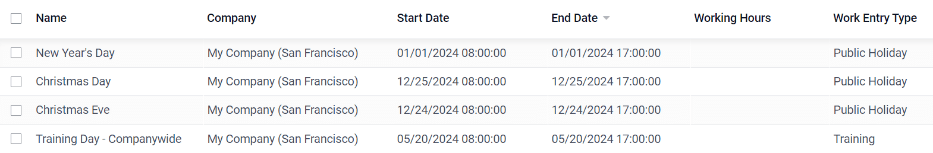

:show-content:

========
Time off
========

Odoo's **Time Off** application serves as a centralized hub for all time-off-related information.
This application manages requests, balances, allocations, approvals, and reports.

Users can :doc:`request time off <../hr/time_off/request_time_off>`, and see an overview of their
requests and time off balances. Managers can :doc:`allocate time off <time_off/allocations>` to
individuals, teams, or the whole company, and :ref:`approve time off requests
<time_off/manage-time-off>`.

Detailed :doc:`reports <time_off/reporting>` can be run to see how much time off (and what kinds of
time off) are being used, :doc:`accrual plans <time_off/accrual_plans>` can be created, and
:ref:`public holidays <time_off/public-holidays>` can be set.

.. note::
   Be advised, only users with specific access rights can see all aspects of the **Time Off** app.

   All users can access the *My Time Off* and *Overview* sections of the **Time Off** app. All other
   sections require specific access rights.

   To better understand how access rights affect the **Time Off** app, refer to the
   :doc:`employees/new_employee` document, specifically the section about configuring the *Work
   Information* tab.

.. seealso::
   :doc:`../general/users/access_rights`

Configuration
=============

In order to allocate time off to employees, and for employees to request and use their time off, the
various :doc:`time off types must be configured <time_off/time_off_types>` first, then
:doc:`allocated <time_off/allocations>` to employees (if allocation is required).

.. _time_off/public-holidays:

Public holidays
---------------

Since holidays vary from country to country, or even city to city, there are no public holidays
preconfigured in Odoo. To observe public or national holidays, and provide extra days off as
holidays to employees, configure the observed public holidays in Odoo.

It is important to configure public holidays in Odoo, so employees are aware of the days they have
off, and do not request time off on days that are already set as a public holiday (non-working
days).

Additionally, all public holidays configured in the **Time Off** app are also reflected in any app
that uses working schedules, such as **Calendar**, **Planning**, **Manufacturing**, and more.

Due to Odoo's integration with other apps that use working schedules, it is considered best practice
to ensure *all* public holidays are configured.

Create public holidays
~~~~~~~~~~~~~~~~~~~~~~

To create a public holiday, navigate to :menuselection:`Time Off app --> Configuration --> Public
Holidays`. All currently configured public holidays appear in a default list view.

Click the :guilabel:`New` button, and a new line appears at the bottom of the list.

Enter the following information on that new line:

- :guilabel:`Name`: Enter the name of the holiday.
- :guilabel:`Company`: If in a multi-company database, the current company populates this field by
  default. It is **not** possible to edit this field.

  .. note::
     The :guilabel:`Company` field is hidden, by default. To view this field, click the
     :icon:`oi-settings-adjust` :guilabel:`(settings adjusts)` icon in the top-right corner of the
     list, to the far-right of the column titles, and activate the :guilabel:`Company` selection
     from the drop-down menu that appears.

- :guilabel:`Start Date`: Using the date and time picker, select the date and time the holiday
  starts, then click :icon:`fa-check` :guilabel:`Apply`. By default, this field is configured for
  the current date. The start time is set according to the start time for the company (according to
  the :doc:`working schedules <payroll/working_schedules>`). If the user's computer is set to a
  different time zone, the start time is adjusted accordingly, compared to the company's time zone.
- :guilabel:`End Date`: Using the date and time picker, select the date and time the holiday ends,
  then click :icon:`fa-check` :guilabel:`Apply`. By default, this field is configured for the
  current date, and the time is set to the end time for the company (according to the :doc:`working
  schedules <payroll/working_schedules>`). If the user's computer is set to a different time zone,
  the start time is adjusted accordingly, compared to the company's time zone.

  .. example::
     A company located in San Francisco operates from 9:00 AM - 6:00 PM, with an eight hour work day
     and one hour lunch break.

     For a user in New York, with a computer time zone set to Eastern Standard Time, a created
     public holiday displays a start time of 12:00 PM - 9:00 PM, accounting for the three hour time
     zone difference.

     Similarly, a user located in Los Angeles, with a computer time zone set to Pacific Standard
     Time, sees a public holiday time as 9:00 AM - 6:00 PM.

- :guilabel:`Working Hours`: If the holiday should only apply to employees who have a specific set
  of working hours, select the working hours from the drop-down menu. If left blank, the holiday
  applies to all employees.
- :guilabel:`Work Entry Type`: If using the **Payroll** app, this field defines how the :doc:`work
  entries <payroll/work_entries>` for the holiday appear. Select the work entry type from the
  drop-down menu.

Mandatory days
--------------

Some companies have special days where specific departments, or the entire staff, is required to be
present, and time off is not allowed on those specific days.

These types of days are called *mandatory days* in Odoo. These can be configured to be company-wide,
or department specific. When configured, employees in the specified department or company are unable
to submit time off requests for these mandatory days.

Create mandatory days
~~~~~~~~~~~~~~~~~~~~~

No mandatory days are configured in Odoo by default. To create a mandatory day, navigate to
:menuselection:`Time Off app --> Configuration --> Mandatory Days`.

Click the :guilabel:`New` button in the top-left corner, and a blank line appears in the list.

Enter the following information on that new line:

- :guilabel:`Name`: Enter the name of the mandatory day.
- :guilabel:`Company`: If in a multi-company database, this field is visible, and the current
  company populates this field, by default. Using the drop-down menu, select the company the
  mandatory day is for.
- :guilabel:`Departments`: This column is hidden by default. First, click the
  :icon:`oi-settings-adjust` :guilabel:`(additional options)` icon in the top-right corner, next to
  :guilabel:`Color`, and then tick the checkbox next to :guilabel:`Departments` to reveal that
  column.

  Next, select the desired departments from the drop-down menu. Multiple departments can be
  selected, and there is no limit to the amount of departments that can be added.

  If this field is left blank, the mandatory day applies to the entire company.
- :guilabel:`Start Date`: Using the calendar picker, select the date the mandatory day starts.
- :guilabel:`End Date`: Using the calendar picker, select the date the mandatory day ends. If
  creating a single mandatory day, the end date should be the same as the start date.
- :guilabel:`Color`: If desired, select a color from the available presented options. If no color is
  desired, select the `No color` option, represented by a white box with. The selected color appears
  on the main **Time Off** app dashboard, in both the calendar and in the legend.

.. image:: time_off/mandatory.png
   :alt: The Mandatory Days section with three configured days.

Overview
========

To view a color-coded schedule of the user's time off, and/or of the team managed by them, navigate
to :menuselection:`Time Off app --> Overview`. This presents a calendar with the default filter of
`My Team`, in a quarterly (three month) view.

To change the time period displayed, click on the :icon:`fa-calendar` :guilabel:`(time period)`
button to reveal a drop-down menu. Then, select either :guilabel:`Today`, :guilabel:`This week`,
:guilabel:`This month`, :guilabel:`This year`, or a custom time period, to present the calendar in
that corresponding view.

To navigate forward or backward in time, in the selected increment (:guilabel:`Month`,
:guilabel:`Week`, etc.), click the :icon:`oi-arrow-left` :guilabel:`(left arrow)` or
:icon:`oi-arrow-right` :guilabel:`(right arrow)` buttons to move either forward or backward in that
specified amount of time. For example, if :guilabel:`Month` is selected, the arrows adjust the view
by one month.

To return to a view containing the current day, click the :icon:`fa-crosshairs` :guilabel:`(Focus
Today)` button at any time.

Team members are listed alphabetically on individual lines, and their requested time off, regardless
of the status (*validated* or *to approve*), is visible on the calendar.

Each employee is color-coded. The employee's color is selected at random, and does *not* correspond
to the type of time off they requested.

The status of the time off is represented by the color detail of the request, either appearing solid
(*validated*) or striped (*to approve*).

The number of days or hours requested is written on the request (if there is enough space).

At the bottom of the calendar, in the :guilabel:`Total` line, a bar graph shows how many people are
projected to be out on any given day. The number on each individual bar represents the number of
employees out for those highlighted days.

Click on a time off entry to view the details for the specific time off entry. The total number of
hours or days are listed, along with the start and end time of the time off. To view the details of
the time off request in a modal, click the :guilabel:`View` button.

.. image:: time_off/overview.png
   :alt: Overview of the user's team, with time off requests shown.

.. seealso::
   - :doc:`time_off/time_off_types`
   - :doc:`time_off/allocations`
   - :doc:`time_off/accrual_plans`
   - :doc:`time_off/request_time_off`
   - :doc:`time_off/my_time`
   - :doc:`time_off/management`
   - :doc:`time_off/reporting`

.. toctree::
   :titlesonly:

   time_off/time_off_types
   time_off/allocations
   time_off/accrual_plans
   time_off/request_time_off
   time_off/my_time
   time_off/management
   time_off/reporting
