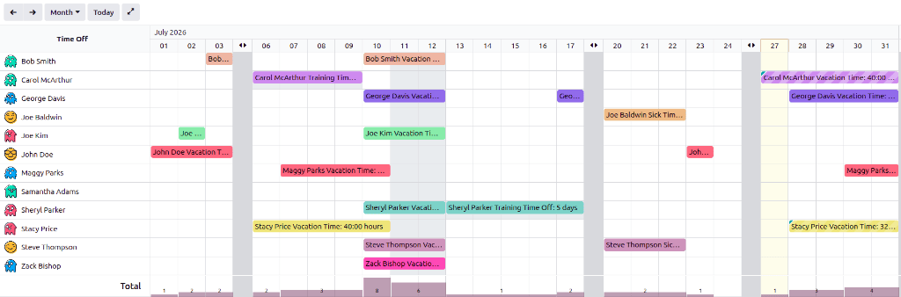

:show-content:

========
Time off
========

Odoo's **Time Off** application serves as a centralized hub for all time-off-related information.
This application manages requests, balances, allocations, approvals, and reports. The following
documents explain each aspect of the **Time Off** application:

.. cards::

   .. card:: Time off types
      :target: time_off/time_off_types

      Before time off can be requested, the various time off types must be configured.

   .. card:: Public holidays
      :target: time_off/public_holidays

      Configure all public holidays so employees receive the correct days off according to local and
      national laws.

   .. card:: Allocations
      :target: time_off/allocations

      Some time off types require management to grant time off to employees before they can request
      it.

   .. card:: Accrual plans
      :target: time_off/accrual_plans

      If time off is earned as employees work, an accrual plan must be configured.

   .. card:: Request time off
      :target: time_off/request_time_off

      Before employees take time off, they must submit a time off request.

   .. card:: My time
      :target: time_off/my_time

      Manage personal time off balances, allocations, and time off requests.

   .. card:: Management
      :target: time_off/management

      Review time off and allocation requests from their respective dashboards.

   .. card:: Reporting
      :target: time_off/reporting

      View a summary of all time off, by employee, time off type, or balance.

Overview
========

To view a color-coded schedule of the user's time off and the team they manage, navigate to
:menuselection:`Time Off app --> Overview`. This loads the *All Time Off* dashboard, which displays
a Gantt view of all time off requests for the user and their team, grouped by employee.

The *All Time Off* dashboard presents three months of data, the previous, current, and following
months, with the current month visible by default. To change the time period displayed, click the
:guilabel:`Month` :icon:`fa-caret-down` button to reveal a drop-down menu. Then, select either
:guilabel:`Day`, :guilabel:`Week`, :guilabel:`Month`, :guilabel:`Quarter`, :guilabel:`Year`, or a
custom time period.

To navigate forward or backward in time in the selected increment (:guilabel:`Month`,
:guilabel:`Week`, etc.), click the :icon:`oi-arrow-left` :guilabel:`(left arrow)` or
:icon:`oi-arrow-right` :guilabel:`(right arrow)` buttons. For example, if :guilabel:`Month` is
selected, the arrows adjust the view by one month. To return to a view containing the current day,
click the :guilabel:`Today` button at any time.

Team members are listed alphabetically by first name, and display their time off requests with a
status of *Approved* or *Second Approval*. Each employee is color-coded. The employee's color is
selected at random, and does *not* correspond to the type of time off requested.

The status of the time off is represented by the color detail of the request, either appearing solid
(*Approved*) or striped (*Second Approval*).

Each time off entry displays the employee name, time off type, and the amount of time requested.

.. note::
   If the time off entry is small and cannot display any text, the entry appears as a solid color
   with no text. All other entries display the text, but it may be cut off depending on the request
   size.

At the bottom of the calendar, in the :guilabel:`Total` line, a bar graph shows how many employees
are projected to be out on any given day. The number on each bar represents the number of employees
out on the highlighted days.

Click on a time off entry to open a *Time Off Request* pop-up window, containing a summary of the
time off entry. The :guilabel:`Employee`, :guilabel:`Time Off Type`, :guilabel:`Dates`, and notes
are displayed.

.. toctree::
   :titlesonly:

   time_off/time_off_types
   time_off/accrual_plans
   time_off/public_holidays
   time_off/mandatory_days
   time_off/allocations
   time_off/request_time_off
   time_off/my_time
   time_off/management
   time_off/reporting
