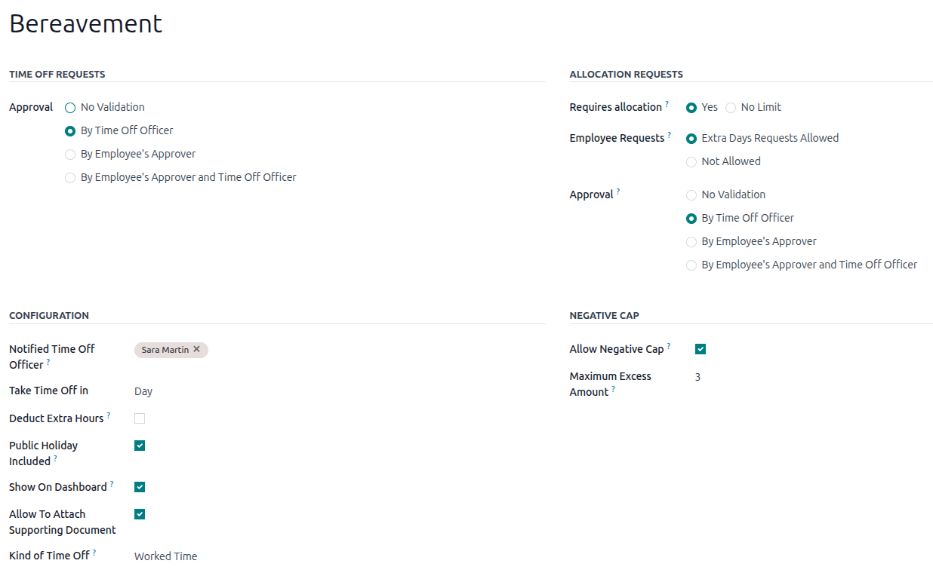

:show-content:

========
Time Off
========

Odoo's *Time Off* application serves as a centralized hub for all time-off-related information. This
application manages requests, balances, allocations, approvals, and reports.

Users can :doc:`request time off <../hr/time_off/request_time_off>`, and see an overview of their
requests and time off balances. Managers can :doc:`allocate time off <time_off/allocations>` to
individuals, teams, or the whole company, and :ref:`approve time off requests
<time_off/manage-time-off>`.

Detailed :ref:`reports <time_off/reporting>` can be run to see how much time off (and what kinds of
time off) are being used, :ref:`accrual plans <time_off/accrual-plans>` can be created, and
:ref:`public holidays <time_off/public-holidays>` can be set.

.. note::
   Be advised, only users with specific access rights can see all aspects of the *Time Off*
   application.

   All users can access the :guilabel:`My Time Off` and :guilabel:`Overview` sections of the *Time
   Off* application. All other sections require specific access rights.

   To better understand how access rights affect the *Time Off* application, refer to the
   :doc:`employees/new_employee` document, specifically the section about configuring the work
   information tab.

Configuration
=============

In order to allocate time off to employees, and for employees to request and use their time off, the
various time off types must be configured first, then allocated to employees (if allocation is
required).

.. _time_off/time-off-types:

Time off types
--------------

To view the currently configured time off types, navigate to :menuselection:`Time Off app -->
Configuration --> Time Off Types`. The time off types are presented in a list view.

The *Time Off* application comes with four pre-configured time off types: :guilabel:`Paid Time Off`,
:guilabel:`Sick Time Off`, :guilabel:`Unpaid`, and :guilabel:`Compensatory Days`. These can be
modified to suit business needs or used as-is.

Create time off type
~~~~~~~~~~~~~~~~~~~~

To create a new time off type, navigate to :menuselection:`Time Off app --> Configuration --> Time
Off Types`. From here, click the :guilabel:`New` button to reveal a blank time off type form.

Enter the name for the particular type of time off in the blank line at the top of the form, such as
`Sick Time` or `Vacation`. Then, enter the following information on the form.

.. note::
   The only **required** fields on the time off type form are the name of the :guilabel:`Time Off
   Type`, the :guilabel:`Take Time Off In`, and the :guilabel:`Kind of Time Off`. In addition, the
   :guilabel:`Time Off Requests` and :guilabel:`Allocation Requests` sections **must** be
   configured.

Time Off Requests section
*************************

- :guilabel:`Approval`: select what specific kind of approval is required for the time off type. The
  options are:

  - :guilabel:`No Validation`: no approvals are required when requesting this type of time off. The
    time off request is automatically approved.
  - :guilabel:`By Time Off Officer`: only the specified :ref:`Time Off Officer
    <time_off/time-off-officer>`, set on this form in the :guilabel:`Notified Time Off Officer`
    field, is required to approve the time off request. This option is selected by default.
  - :guilabel:`By Employee's Approver`: only the employee's specified approver for time off, which
    is set on the *Work Information* tab on the :ref:`employee's form <employees/work-info-tab>`, is
    required to approve the time off request.
  - :guilabel:`By Employee's Approver and Time Off Officer`: both the employee's :ref:`specified
    time off approver<employees/work-info-tab>` and the :ref:`Time Off Officer
    <time_off/time-off-officer>` are required to approve the time off request.

Allocation Requests section
***************************

- :guilabel:`Requires allocation`: if the time off must be allocated to employees, select
  :guilabel:`Yes`. If the time off can be requested without time off being previously allocated,
  select :guilabel:`No Limit`. If :guilabel:`No Limit` is selected, the following options do not
  appear on the form.
- :guilabel:`Employee Requests`: select :guilabel:`Extra Days Requests Allowed` if the employee is
  able to request more time off than was allocated.

  If employees should **not** be able to make requests for more time off than what was allocated,
  select the :guilabel:`Not Allowed` option.

  .. example::
     Ten days are allocated to the employee for this particular type of time off, and the
     :guilabel:`Extra Days Requests Allowed` option is enabled. The employee wants to take a
     vacation for twelve days. They may submit a request for two additional days, since the
     :guilabel:`Extra Days Requests Allowed` option is enabled.

  .. important::
     It is important to note that requesting additional time off does **not** guarantee that time
     off is granted.

- :guilabel:`Approval`: select the type of approvals required for the allocation of this particular
  time off type.

  - :guilabel:`Approved by Time Off Officer` indicates the :ref:`Time Off Officer
    <time_off/time-off-officer>` set on this form must approve the allocation.
  - :guilabel:`No validation needed` indicates that no approvals are required.

Configuration section
*********************

  .. _`time_off/time-off-officer`:

- :guilabel:`Notified Time Off Officer`: select the person who is notified and responsible for
  approving requests and allocations for this specific type of time off.
- :guilabel:`Take Time Off in`: select the format the time off is requested in from the drop-down
  menu.

  The options are:

  - :guilabel:`Day`: if time off can only be requested in full day increments (8 hours).
  - :guilabel:`Half Day`: if time off can only be requested in half day increments (4 hours).
  - :guilabel:`Hours`: if the time off can be taken in hourly increments.

  .. _`time_off/deduct-extra-hours`:

- :guilabel:`Deduct Extra Hours`: enable this option if the time off request should factor in any
  extra time accrued by the employee

  .. example::
     If an employee works two extra hours for the week, and requests five hours of time off, the
     request would be for three hours, since the two extra worked hours are used first, and deducted
     from the request.

- :guilabel:`Allow To Attach Supporting Document`: enable this option to allow the employee to
  attach documents to the time off request. This is useful in situations where documentation is
  required, such as long-term medical leave.
- :guilabel:`Kind of Time Off`: select from the drop-down menu the type of time off this is, either
  :guilabel:`Worked Time` or :guilabel:`Absence`. :guilabel:`Worked Time` indicates that the time
  off taken counts toward worked time for any type of accrual the employee is working towards,
  whereas :guilabel:`Absence` does not count toward any type of accrual.
- :guilabel:`Company`: if multiple companies are created in the database, and this time off type
  only applies to one company, select the company from the drop-down menu. If this field is left
  blank, the time off type applies to all companies in the database. This field **only** appears in
  a multi-company database.

Negative Cap section
********************

Enable the :guilabel:`Allow Negative Cap` option if employees are able to request more time off than
they currently have, allowing a negative balance. If enabled, an :guilabel:`Amount in Negative`
field appears. In this field, enter the maximum amount of negative time allowed, in days.

.. example::
   Sara currently has three days of the time off type `Vacation`. She is planning a trip that
   requires five days of time off.

   The `Vacation` time off type has the :guilabel:`Allow Negative Cap` option enabled, and the
   :guilabel:`Amount in Negative` is set to five.

   These settings allow Sara to submit a request for five days of the `Vacation` time off type. If
   approved, her `Vacation` time off balance will be negative two (-2) days.

         off.

Payroll section
***************

If the time off type should create :doc:`../hr/payroll/work_entries` in the *Payroll* application,
select the :guilabel:`Work Entry Type` from the drop-down list.

Timesheets section
******************

.. note::
   The :guilabel:`Timesheets` section only appears if the user is in developer mode. Refer to the
   :ref:`developer-mode` document for details on how to access the developer mode.

When an employee takes time off, and is also using timesheets, Odoo creates entries in the
*Timesheets* application for the time off. This section defines how they are entered.

- :guilabel:`Project`: select the project that the time off type entries appear in.
- :guilabel:`Task`: select the task that appears in the timesheet for this time off type. The
  default options are: :guilabel:`Time Off`, :guilabel:`Meeting`, or :guilabel:`Training`.

Display Option section
**********************

- :guilabel:`Color`: select a color to be used in the *Time Off* application dashboard.
- :guilabel:`Cover Image`: select an icon to be used in the *Time Off* application dashboard.

.. image:: time_off/time-off-type-form-bottom.png
   :align: center
   :alt: The lower half of the time off type form, with all the information filled out for sick time
         off.

.. _time_off/accrual-plans:

Accrual plans
-------------

Some time off is earned through an accrual plan, meaning that for every specified amount of time an
employee works (hour, day, week, etc), they earn or *accrue* a specified amount of time off.

.. example::
   If an employee accrues a vacation day for every week they work, they would earn 0.2 vacation days
   for each hour they work. At the end of a forty hour work week, they would earn one whole vacation
   day (8 hours).

Create accrual plan
~~~~~~~~~~~~~~~~~~~

To create a new accrual plan, navigate to :menuselection:`Time Off app --> Configuration --> Accrual
Plans`. Then, click the :guilabel:`New` button, which reveals a blank accrual plan form.

Enter the following information on the form:

- :guilabel:`Name`: enter the accrual plan name.
- :guilabel:`Accrued Gain Time`: select when the employee begins to accrue time off, either
  :guilabel:`At the start of the accrual period` or :guilabel:`At the end of the accrual period`.
- :guilabel:`Carry-Over Time`: select when the employee received previously earned time. The options
  are:

  - :guilabel:`At the start of the year`: select this if the accrual rolls over on January 1 of the
    upcoming year.
  - :guilabel:`At the allocation date`: select this if the accrual rolls over as soon as time is
    allocated to the employee.
  - :guilabel:`Other`: select this option if neither of the other two options are applicable. When
    selected, a :guilabel:`Carry-Over Date` field appears. Select the date using the two drop-down
    menus, one for the day and one for the month.

- :guilabel:`Based on worked time`: enable this option if time off accrual is determined by the
  employee's worked hours. Days **not** considered as worked time do **not** contribute to the
  accrual plan in Odoo.
- :guilabel:`Milestone Transition`: this selection determines when employees move up to a new
  milestone. If they qualify to change milestones in the middle of a pay period, select if the
  employee changes milestones :guilabel:`Immediately` or :guilabel:`After this accrual's period`
  (after the current pay period).

  .. important::
     The :guilabel:`Milestone Transition` field is **only** visible after a minimum of two
     :ref:`rules <time_off/rules>` have been configured on the accrual plan.

- :guilabel:`Company`: using the drop-down menu, select the company the accrual plan applies to. If
  left blank, the accrual plan can be used for all companies. This field only appears in a
  multi-company database.

.. image:: time_off/accrual-plan-form.png
   :align: center
   :alt: An accrual plan form with all the entries filled out.

.. _time_off/rules:

Rules
*****

Rules must be created in order for employees to accrue time off from the accrual plan.

To create a new rule, click the :guilabel:`New Milestone` button in the gray :guilabel:`Rules`
section, and a :guilabel:`Create Milestone` modal form appears.

Fill out the following fields on the form:

- :guilabel:`Employee accrue`: select the parameters for earned time off in this section.

  First, select either :guilabel:`Days` or :guilabel:`Hours` for the increment of accrued time using
  the drop-down menu.

  Next, enter the numerical amount of the selected parameter that is accrued. The numerical format
  is `X.XXXX`, so that partial days or hours can also be configured.

  Last, select how often the time is accrued using the drop-down menu. The default options are
  :guilabel:`Hourly`, :guilabel:`Daily`, :guilabel:`Weekly`, :guilabel:`Twice a month`,
  :guilabel:`Monthly`, :guilabel:`Twice a year`, and :guilabel:`Yearly`.

  Depending on which option is selected, additional fields may appear. For example, if
  :guilabel:`Twice a month` is selected, two additional fields appear, to specify the two days of
  each month that the milestone occurs.
- :guilabel:`Cap accrued time`: if there is a maximum amount of days the employee can accrue with
  this plan, enable this option.

  When enabled, two additional fields appear beneath it. Select the type of time period from the
  drop-down menu, either :guilabel:`Days` or :guilabel:`Hours`.

  Then, enter a numerical value in the field to specify the maximum amount of time that can be
  accrued.
- :guilabel:`Milestone reached`: enter the number and value of the time period that must pass before
  the employee starts to accumulate time off. The first value is numerical; enter a number in the
  first field.

  Then, select the type of time period using the drop-down menu in the second field. The options
  are: :guilabel:`Days`, :guilabel:`Months`, or :guilabel:`Years`.
- :guilabel:`Carry over`: select how any unused time off is handled. The options are either:

  - :guilabel:`None. Accrued time reset to 0`: any unused time off is gone.
  - :guilabel:`All accrued time carried over`: all unused time off is rolled over to the next
    calendar year.
  - :guilabel:`Carry over with a maximum`: unused time off is rolled over to the next calendar year,
    but there is a cap. An :guilabel:`Up to` field appears if this is selected. Enter the maximum
    number of :guilabel:`Days` that can roll over to the following year. Any time off beyond this
    parameter is lost.

Once the form is completed, click :guilabel:`Save & Close` to save the form and close the modal, or
click :guilabel:`Save & New` to save the form and create another milestone. Add as many milestones
as desired.

.. _time_off/public-holidays:

Public holidays
---------------

To observe public or national holidays, and provide extra days off as holidays to employees,
configure the observed *public holidays* in Odoo.

It is important to configure these days in Odoo, so employees are aware of the days they have off,
and do not request time off on days that are already set as a public holiday (non-working days).

Additionally, all public holidays configured in the *Time Off* app are also reflected in any app
that uses working schedules, such as *Calendar*, *Planning*, *Manufacturing*, and more.

Due to Odoo's integration with other apps that use working schedules, it is considered best practice
to ensure *all* public holidays are configured.

Create public holiday
~~~~~~~~~~~~~~~~~~~~~

To create a public holiday, navigate to :menuselection:`Time Off app --> Configuration --> Public
Holidays`.

All currently configured public holidays appear in a list view.

Click the :guilabel:`New` button, and a new line appears at the bottom of the list.

Enter the following information on that new line:

- :guilabel:`Name`: enter the name of the holiday.
- :guilabel:`Company`: if in a multi-company database, the current company populates this field by
  default. It is not possible to edit this field.

  .. note::
     The :guilabel:`Company` field is hidden by default. To view this field, click the two dots in
     the top-right corner of the list, to the far-right of the column titles, and activate the
     :guilabel:`Company` selection from the drop-down menu that appears.

- :guilabel:`Start Date`: using the date and time picker, select the date and time that the holiday
  starts. By default, this field is configured for the current date. The start time is set according
  to the start time for the company (according to the :ref:`working schedules
  <payroll/working-times>`). If the user's computer is set to a different time zone, the start time
  is adjusted according to the difference in the time zone, compared to the company's time zone.
- :guilabel:`End Date`: using the date and time picker, select the date and time that the holiday
  ends. By default, this field is configured for the current date, and the time is set to the end
  time for the company (according to the :ref:`working schedules <payroll/working-times>`). If the
  user's computer is set to a different time zone, the start time is adjusted according to the
  difference in the time zone, compared to the company's time zone.

  .. example::
     A company located in San Francisco operates from 9:00 AM - 6:00 PM, with an eight hour work day
     and one hour lunch break.

     For a user in New York, with a computer time zone set to Eastern Standard Time, a created
     public holiday displays a start time of 12:00 PM - 9:00 PM, accounting for the three hour time
     zone difference.

     Similarly, a user located in Los Angeles, with a computer time zone set to Pacific Standard
     Time, sees a public holiday time as 9:00 AM - 6:00 PM.

- :guilabel:`Working Hours`: if the holiday should only apply to employees who have a specific set
  of working hours, select the working hours from the drop-down menu. If left blank, the holiday
  applies to all employees.
- :guilabel:`Work Entry Type`: if using the *Payroll* application, this field defines how the
  :ref:`work entries <payroll/work-entries>` for the holiday appear. Select the work entry type
  from the drop-down menu.

.. image:: time_off/holidays.png
   :align: center
   :alt: The list of public holidays in the configuration menu.

Mandatory days
--------------

Some companies have special days where specific departments, or the entire staff, is required to be
present, and time off is not allowed on those specific days.

These types of days are called *mandatory days* in Odoo. These can be configured to be company-wide,
or department specific. When configured, employees in the specified department or company are unable
to submit time off requests for these mandatory days.

Create mandatory days
~~~~~~~~~~~~~~~~~~~~~

No mandatory days are configured in Odoo by default. To create a mandatory day, navigate to
:menuselection:`Time Off app --> Configuration --> Mandatory Days`.

Click the :guilabel:`New` button in the top-left corner, and a blank line appears in the list.

Enter the following information on that new line:

- :guilabel:`Name`: enter the name of the mandatory day.
- :guilabel:`Company`: if in a multi-company database, this field is visible, and the current
  company populates this field by default. Using the drop-down menu, select the company the
  mandatory day is for.
- :guilabel:`Departments`: this column is hidden by default. First, click the :guilabel:`(optional
  columns)` icon in the top-right corner, next to :guilabel:`Colors`, and then click the checkbox
  next to :guilabel:`Departments` to reveal that column.

  Next, select the desired departments from the drop-down menu. Multiple departments can be
  selected, and there is no limit to the amount of departments that can be added.

  If this field is left blank, the mandatory day applies to the entire company.
- :guilabel:`Start Date`: using the calendar picker, select the date the mandatory day starts.
- :guilabel:`End Date`: using the calendar picker, select the date the mandatory day ends. If
  creating a single mandatory day, the end date should be the same as the start date.
- :guilabel:`Color`: if desired, select a color from the available presented options. If no color is
  desired, select the `No color` option, represented by a white box with a red line diagonally
  across it. The selected color appears on the main *Time Off* application dashboard, in both the
  calendar and in the legend.

Overview
========

To view a color-coded schedule of the user's time off, and/or of the team managed by them, navigate
to :menuselection:`Time Off app --> Overview`. This presents a calendar with the default filter of
`My Team`, in a month view.

To change the time period displayed, click on the :guilabel:`Month` button to reveal a drop-down
menu. Then, select either :guilabel:`Day`, :guilabel:`Week`, or :guilabel:`Year` to present the
calendar in that corresponding view.

To navigate forward or backward in time, in the selected increment (:guilabel:`Month`,
:guilabel:`Week`, etc.), click the :guilabel:`← (left arrow)` or :guilabel:`→ (right arrow)` to move
either forward or backward in that specified amount of time.

For example, if :guilabel:`Month` is selected, the arrows adjust the view by one month.

To return to a view containing the current day, click the :guilabel:`Today` button at any time.

Team members are listed alphabetically on individual lines, and their requested time off,
regardless of the status (*validated* or *to approve*), is visible on the calendar.

Each employee is color-coded. The employee's color is selected at random, and does *not* correspond
to the type of time off they requested.

The status of the time off is represented by the color detail of the request, either appearing solid
(*validated*) or striped (*to approve*).

The number of days or hours requested is written on the request (if there is enough space).

At the bottom of the calendar, in the :guilabel:`Total` line, a bar graph shows how many people are
projected to be out on any given day. The number on each individual bar represents the number of
employees out for those highlighted days.

Click on a time off entry to view the details for the specific time off entry. The total number of
hours or days are listed, along with the start and end time of the time off. To view the details of
the time off request in a modal, click the :guilabel:`View` button.

.. image:: time_off/overview.png
   :align: center
   :alt: Overview of the user's team, with time off requests shown.

.. _time_off/reporting:

Reporting
=========

The reporting feature allows users to view time off for their team, either by employee or type of
time off. This allows users to see which employees are taking time off, how much time off they are
taking, and what time off types are being used.

Any report can be added to a spreadsheet through the *Insert in Spreadsheet* button that appears in
the top-left of a report. If the *Documents* application is installed, an option to add the report
to a spreadsheet appears. If not, the report can be added to a *Dashboard*.

By employee
-----------

To view a report of employee time off requests, navigate to :menuselection:`Time Off app -->
Reporting --> by Employee`.

The default report presents the current year's data in a list view, displaying all the employees in
alphabetical order. Each employee's line is collapsed by default. To expand a line, click anywhere
on the line.

The view expands, and has the time off requests organized by time off type. Click anywhere on a time
off type line to expand it, and view all the individual time off requests that fall under that type.

The information shown in the list includes: the :guilabel:`Employee` name, :guilabel:`Number of
Days` off requested, the :guilabel:`Start Date`, :guilabel:`End Date`, :guilabel:`Status`, and
:guilabel:`Description`.

.. image:: time_off/employee-report.png
   :align: center
   :alt: Report of time off, shown by each employee in a list view.

The report can be displayed in other ways, as well. Click the corresponding button option in the
top-right corner of the page to view the data in that specific way. The various options are a
:guilabel:`List` (the default view), :guilabel:`Graph`, :guilabel:`Pivot` table, or
:guilabel:`Calendar` view.

.. image:: time_off/report-options.png
   :align: center
   :alt: The various other views highlighted, for the employee time off report.

When a selection has been made, additional options appear for that particular selection. For more
detailed information on the reports and their various options, refer to the :doc:`reporting
<../essentials/reporting>` documentation.

By type
-------

To view a list of all time off, organized by time off type, navigate to :menuselection:`Time Off app
--> Reporting --> by Type`. This shows all time off requests in a default bar chart.

Hover over a bar to view the :guilabel:`Duration (Days)` of that specific time off type.

.. image:: time_off/bar-chart.png
   :align: center
   :alt: The various time off types, and how many days requested, in a bar chart. Details are
         highlighted in a red box.

Click on a bar to go to a detailed list view of all the time off requests for that time off type.

Each request is listed, with the following information displayed: the :guilabel:`Employee`,
:guilabel:`Number of Days`, :guilabel:`Request Type`, :guilabel:`Start Date`, :guilabel:`End Date`,
:guilabel:`Status`, and the :guilabel:`Description`.

The report can be displayed in other ways, as well. Click the corresponding button option in the
top-right corner of the page to view the data in that way. The various options are a
:guilabel:`Graph` (the default view), :guilabel:`List`, or :guilabel:`Pivot` table.

When a selection has been made, additional options appear for that particular selection. For more
detailed information on the reports, and their various options, refer to the :doc:`reporting
<../essentials/reporting>` documentation.

.. seealso::
   - :doc:`time_off/allocations`
   - :doc:`time_off/request_time_off`
   - :doc:`time_off/my_time`
   - :doc:`time_off/management`

.. toctree::
   :titlesonly:

   time_off/allocations
   time_off/request_time_off
   time_off/my_time
   time_off/management
