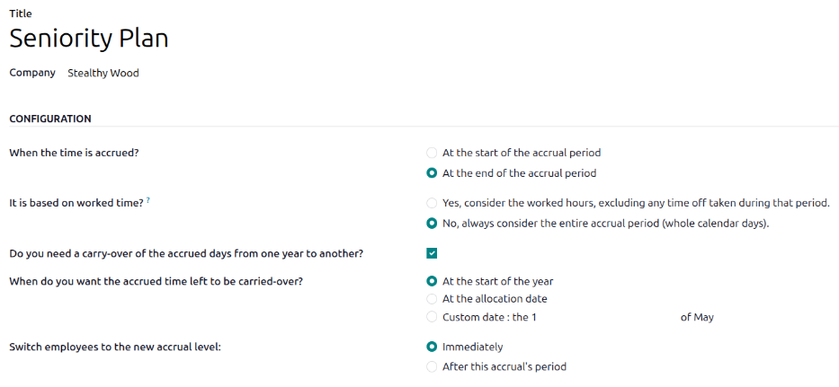
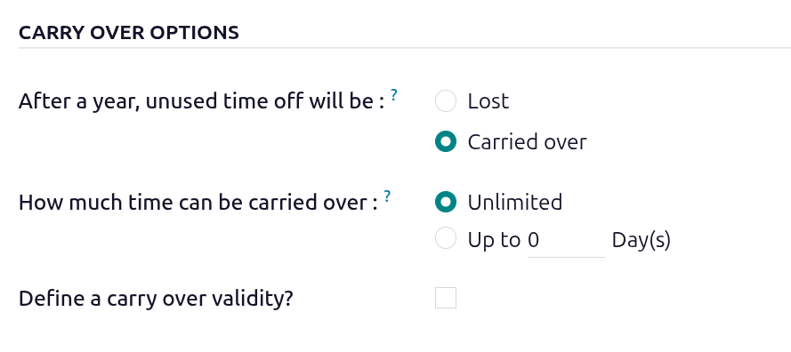
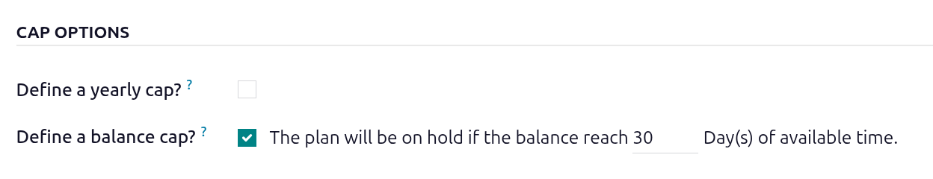

=============
Accrual plans
=============

Some time off is granted to employees up front, while other kinds of time off is earned through an
*accrual plan*, meaning that for every specified amount of time an employee works (hour, day, week,
etc), they earn or *accrue* a specified amount of time off.

.. example::
   If an employee accrues a vacation day for every week they work, they would earn 0.2 vacation days
   for each hour they work. At the end of a forty hour work week, they would earn one whole vacation
   day (8 hours).

Create an accrual plan
======================

To create a new accrual plan, navigate to :menuselection:`Time Off app --> Configuration --> Accrual
Plans`. Then, click the :guilabel:`New` button, which reveals a blank *Accrual Plans* form.

First, enter a :guilabel:`Title` for the accrual plan. If in a multi-company database, a
:guilabel:`Company` field appears beneath the :guilabel:`Title` field. Using the drop-down menu,
select the company the accrual plan applies to. If left blank, the accrual plan is available for all
companies.

Next, configure the following sections of the form:

Configuration section
---------------------

Configure the following fields in the *Configuration* section of the form:

- :guilabel:`When the time is accrued?`: Select when the employee begins to accrue time off, either
  :guilabel:`At the start of the accrual period` or :guilabel:`At the end of the accrual period`.
- :guilabel:`It is based on worked time?`: Select how time off accrual is determined. The options
  are:

  - :guilabel:`Yes, consider the worked hours, excluding any time off taken during that period.`:
    Days **not** considered as *worked time* do **not** contribute to the accrual plan in Odoo.
  - :guilabel:`No, always consider the entire accrual period (whole calendar days).`: Every day is
    calculated when determining worked time, with no exclusions.

  .. example::
     An employee is granted time off from an accrual plan configured to accrue one day of vacation
     for every five days worked. The accrual plan is based on the employee's worked time (the
     :guilabel:`Yes, consider the worked hours, excluding any time off taken during that period.`
     option is selected), which means they **only** earn vacation time for the five weekdays they
     work, *not* the entire seven day week period.

     The employee works standard 40-hour weeks. According to the accrual plan, they should earn four
     vacation days per month.

     The employee takes five days off using a :doc:`time off type <time_off/time-off-types>` with
     the :guilabel:`Counts as` set as an :guilabel:`Absence`. Because the plan grants vacation only
     for worked time, those five days do not count toward accrual.

     As a result, the employee accrues only three vacation days that month instead of four.

- :guilabel:`Do you need a carry-over of the accrued days from one year to another?`: Select when
  the employee received previously earned time. The options are:

  - :guilabel:`At the start of the year`: Select this if the accrual rolls over on January 1 of the
    upcoming year.
  - :guilabel:`At the allocation date`: Select this if the accrual rolls over as soon as time is
    allocated to the employee.
  - :guilabel:`Custom date`: Select this option if neither of the other two options are applicable.
    Once selected, set the date using the two drop-down menus, one for the day and one for the month.

.. image:: time_off/accrual_plans/accrual-plan-form.png
   :alt: An accrual plan form filled out for a Seniority Plan.

Milestones
----------

Milestones must be created in order for employees to accrue time off from the accrual plan. Each
milestone determines when and how much time off the employee earns.

To create a new milestone, click the :guilabel:`Create a milestone` button and a *New Milestone*
pop-up window loads. Then fill out the following sections on the form.

.. tip::
   Once milestones have been configured, click on a milestone to make edits, click the
   :icon:`fa-trash-o` :guilabel:`(Delete)` icon to delete it, or click :guilabel:`Add a milestone`
   to create additional milestones.

Accrual level options section
~~~~~~~~~~~~~~~~~~~~~~~~~~~~~

This section determines how much the employee earns, and when.

- :guilabel:`Set the employee accrual frequency`: Set the parameters for earned time off in this
  section by configuring how many hours or days the employee earns in a set period of time.

  The first two fields set *how much* time off the employee earns, while the remaining fields
  determine *how often* the employee earns the time off.

  Enter the numerical amount the employee earns in the first field. The numerical format is
  `X.XXXX`, so that partial days or hours can be earned. Next, set the middle field to either
  :guilabel:`Day(s)` or :guilabel:`Hour(s)`.

  In the last field, use the drop-down menu to set the frequency the employee earns the time
  configured in the first two fields. Some options require additional fields to be configured. The
  default options are:

  - :guilabel:`Hourly`: The employee earns the set amount of time for every hour worked. There are
    no additional fields needed.
  - :guilabel:`Daily`: The employee earns the set amount of time for every day worked. There are
    no additional fields needed.
  - :guilabel:`Weekly`: The employee earns the set amount of time for every week worked. When
    selected, use the drop-down menu to select the specific day of the week in the field that
    appears.
  - :guilabel:`Twice a month`: The employee earns the set amount of time, twice a month, on two
    specific days. When selected, use the drop-down menus to select the specific days of the month
    in the two fields that appear.
  - :guilabel:`Monthly`:  The employee earns the set amount of time for every month worked. When
    selected, use the drop-down menu to select the specific day of the month in the field that
    appears.
  - :guilabel:`Twice a year`: The employee earns the set amount of time, twice a year, on two
    speific dates. When selected, use the drop-down menus to select the specific day and month, in
    the four fields that appear.
  - :guilabel:`Yearly`: The employee earns the set amount of time, once a year, on a specific day.
    When selected, use the drop-down menus to select the specific day and month in the two fields
    that appear.
  - :guilabel:`Per Hour Worked`: The employee earns the set amount of time for every hour worked.
    There are no additional fields needed.

- :guilabel:`This milestone will be reached`: This selection determines *when* the employee starts
  to earn the time off. The options are:

  - :guilabel:`At allocation creation`: The time off starts accruing immediately.
  - :guilabel:`After (#) (Time) from the start of the allocation.`: Use the first two fields to set
    the time period the employee achieves the milestone. Enter a number in the first field, then set
    the middle field to either :guilabel:`Days`, :guilabel:`Months`, or :guilabel:`Years`.

.. image:: time_off/accrual_plans/accrual-levels.png
   :alt: An accrual plan set to give 10 days a year to employees.

Carry over options section
~~~~~~~~~~~~~~~~~~~~~~~~~~

This section determines what happens to any unused time off at the end of the year. Configure the
following field:

- :guilabel:`After a year, unused time off will be:`: Select :guilabel:`Lost` if any unused time off
  is lost, and does **not** carry over to the following year. Select :guilabel:`Carried over` if
  time off is rolled over to the next year. When this option is selected, two additional sections
  appear:

  - :guilabel:`How much time can be carried over:`: Select :guilabel:`Unlimited` if *all* time off
    can be carried over. Select :guilabel:`Up to (#) Day(s)` if there *is* a limit. Enter the total
    number of days the employee can carry over from one year to the next in the blank field.
  - :guilabel:`Define a carry over validity?`: If there is an expiration date for the carried over
    time off, enable this option. When enabled, the following appears: :guilabel:`The days carried
    over will be effective for (#) (Days or Months)`. Enter a number in the first field, then set
    the second field to either :guilabel:`Days` or :guilabel:`Months`.

Cap options section
~~~~~~~~~~~~~~~~~~~

This section sets limits on total time off earned.

- :guilabel:`Define a yearly cap?`: Enable this option to set a limit on the total amount of time
  that can be accrued every calendar year. When enabled, the following line appears:
  :guilabel:`Accrual will stop until next carry-over date if accrued time's reach (#) Day(s).` Enter
  the maximum number of days the employee can earn in the number field.
- :guilabel:`Define a balance cap?`: If there is a maximum amount of time the employee can accrue
  with this plan, enable this option. When enabled, the following line appears: :guilabel:`The plan
  will be on hold if the balance reach (#) Day(s) of available time.` Enter the maximum number of
  days the employee can have at any given time in the number field. Any time off beyond this
  parameter is lost.

When completed, click :guilabel:`Save` to save the milestone, or :guilabel:`Save & New` to save the
milestone and create a new one.

.. example::
   This milestone form is configured so the employee earns two weeks (10 days) a year when they are
   hired, three weeks (15 days) after three years, and a month (20 days) after five years.They start
   to earn this time yearly, on January 1st.

   The employee can never accrue more than 30 days the first three years, 45 days from years 3-5,
   and 100 days after five years. Anytime they exceed those amounts for the respective years, they
   will stop accruing more time off.

   Additionally, they can roll over all their unused time off during the first five years, then they
   can only rollover 20 days from one year ot the next.

   Note that in year five, the employee can have a yearly cap of 60 days, and a total balance cap of
   100 days.

   .. image:: accrual_plans/milestones.png
      :alt: A milestone form with all the entries filled out.
