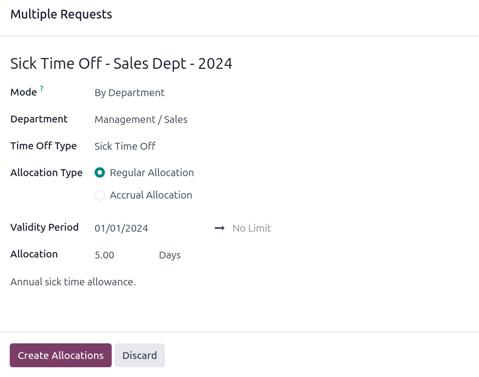

===========
Allocations
===========

Once :ref:`time off types <time_off/time-off-types>` and :ref:`accrual plans
<time_off/accrual-plans>` have been configured, the next step is to *allocate*, or give, time off to
employees.

The *Allocations* page of the **Time Off** app is **only** visible to users who have either *Time
Off Officer* or *Administrator* access rights for the **Time Off** application. For more information
on access rights, refer to the :doc:`access rights <../../general/users/access_rights/>`
documentation.

.. _time_off/allocation-form:

Allocate time off
=================

To create a new allocation, navigate to :menuselection:`Time Off app --> Management -->
Allocations`.

This presents a list of all current allocations, including their respective statuses.

Click :guilabel:`New` to allocate time off, and a blank :guilabel:`Allocation` form appears.

After entering a name for the allocation on the first blank field of the form, enter the following
information:

- :guilabel:`Time Off Type`: Using the drop-down menu, select the type of time off that is being
  allocated to the employees.
- :guilabel:`Allocation Type`: Select either :guilabel:`Regular Allocation` or :guilabel:`Accrual
  Allocation`. If the allocation is **not** based on an :ref:`accrual plan
  <time_off/accrual-plans>`, select :guilabel:`Regular Allocation`.
- :guilabel:`Accrual Plan`: If :guilabel:`Accrual Allocation` is selected for the
  :guilabel:`Allocation Type`, the :guilabel:`Accrual Plan` field appears. Using the drop-down menu,
  select the accrual plan with which the allocation is associated. An accrual plan **must** be
  selected for an :guilabel:`Accrual Allocation`.
- :guilabel:`Validity Period/Start Date`: If :guilabel:`Regular Allocation` is selected for the
  :guilabel:`Allocation Type`, this field is labeled :guilabel:`Validity Period`. If
  :guilabel:`Accrual Allocation` is selected for the :guilabel:`Allocation Type`, this field is
  labeled :guilabel:`Start Date`.

  The current date populates the first date field, by default. To select another date, click on the
  pre-populated date to reveal a popover calendar window. Navigate to the desired start date for the
  allocation, and click on the date to select it.

  If the allocation expires, select the expiration date in the next date field. If the time off does
  *not* expire, leave the second date field blank. :guilabel:`No Limit` appears in the field if no
  date is selected.

  If :guilabel:`Accrual Allocation` is selected for the :guilabel:`Allocation Type`, this second
  field is labeled :guilabel:`Run until`.

  .. important::
     If the :guilabel:`Start Date` entered is in the middle of a period of time, such as the middle
     of the month, Odoo applies the allocation to the beginning or end of the period, depending on
     the *Accrued Gain Time* entered on the :ref:`accrual plan <time_off/accrual-plans>` (either *At
     the start of the accrual period*, or *At the end of the accrual period*) instead of the
     specific date entered.

     For example, an allocation is created, and references an accrual plan that grants time *At the
     start of the accrual period*, monthly, on the first of the month.

     On the allocation form, the :guilabel:`Allocation Type` is set to :guilabel:`Accrual
     Allocation`, and the :guilabel:`Start Date` entered is `06/16/24`.

     Odoo's **Time Off** app retroactively applies the allocation to the beginning of the time
     period entered in the :guilabel:`Start Date`.

     Therefore, this allocation accrues time from `06/01/24`, rather than `06/16/24`.

     Additionally, if on the accrual form, the allocation references an accrual plan that grants
     time *`At the end of the accrual period*, the allocation accrues time from `7/01/24` rather
     than `6/18/24`.

- :guilabel:`Allocation`: Enter the amount of time that is being allocated to the employees. This
  field displays the time in either :guilabel:`Hours` or :guilabel:`Days`, depending on how the
  selected :ref:`Time Off Type <time_off/time-off-types>` is configured.
- :guilabel:`Add a reason...`: If any description or note is necessary to explain the time off
  allocation, enter it in this field at the bottom of the form.

.. image:: allocations/new-allocation.png
   :alt: A new allocation form with all the fields filled out for the annual two week vacation
         granted to all employees.

Multiple Allocations
--------------------

When allocating time off, it is common to allocate time to several employees at once. This is done
using the :guilabel:`Multiple Requests` feature.

To allocate time to multiple employees in a single allocation, navigate to :menuselection:`Time Off
app --> Management --> Allocations`. Then, click the :icon:`fa-gear` :guilabel:`(Actions)` icon in
the upper-left corner, then click :icon:`fa-users` :guilabel:`Multiple Requests`. This reveals a
:guilabel:`Multiple Requests` pop-up window.

This form is identical to the :guilabel:`Allocation` form, with an additional :guilabel:`Mode`
field. The :guilabel:`Mode` field determines how multiple employees are selected.

Using the drop-down menu, select one of the following :guilabel:`Modes`:

- :guilabel:`By Employee`: This option allows for the selection of multiple individual employees
  that are unrelated in terms of department, company, or tags. Selecting this reveals an
  :guilabel:`Employees` field. Select the employees to receive the allocation in the
  :guilabel:`Employees` field. There is no limit to the amount of employees that can be selected.
- :guilabel:`By Company`: This option allows for the selection of all employees within a specific
  company. Selecting this reveals a :guilabel:`Company` field. Select the :guilabel:`Company` to
  assign the allocation to. Only one company can be assigned in the :guilabel:`Company` field. When
  a company is selected, *all* employees within the company receive the allocation.
- :guilabel:`By Department`: This option allows for the selection of all employees within a specific
  department. Selecting this reveals a :guilabel:`Department` field. Select the
  :guilabel:`Department` to assign the allocation to. Only one department can be assigned in the
  :guilabel:`Department` field. When a department is selected, *all* employees within the department
  receive the allocation.
- :guilabel:`By Employee Tag`: This option allows for the selection of all employees with a specific
  tag. Selecting this reveals an :guilabel:`Employee Tag` field. Select the desired
  :guilabel:`Employee Tag` to select all employees with that tag. Only one tag can be assigned in
  the :guilabel:`Employee Tag` field. When a tag is selected, *all* employees with that tag receive
  the allocation.

Next, select the :guilabel:`Time Off Type` using the drop-down menu. Once a :guilabel:`Time Off
Type` is selected, the placeholder name, 'Allocation Request', changes to the name of the selected
:guilabel:`Time Off Type`, including the amount of days. Change the name of the allocation, if
desired.

Fill out the remainder of the :ref:`Multiple Requests form <time_off/allocation-form>`, then click
:guilabel:`Create Allocations` when done.

         department.

.. _time_off/request-allocation:

Request allocation
==================

If an employee has used all their time off, or will run out of time off, they can request an
allocation for additional time. Allocations can be requested in one of two ways, either from the
:ref:`Dashboard <time_off/dashboard>` or the :ref:`My Allocations <time_off/my-allocations>` view.

To create a new allocation request, click either the :guilabel:`New Allocation Request` button on
the main **Time Off** dashboard, or the :guilabel:`New` button in the :guilabel:`My Allocations`
list view. Both buttons open a new allocation request form.

.. note::
   Both options open a new allocation request form, but when requested from the
   :guilabel:`Dashboard`, the form appears in a pop-up window, and the *Validity Period* field does
   **not** appear. When requested from the :guilabel:`My Allocations` list view, the screen
   navigates to a new allocation request page, instead of presenting a pop-up window.

Enter the following information on the new allocation request form:

- :guilabel:`Time Off Type`: Select the type of time off being requested for the allocation from the
  drop-down menu. After a selection is made, the title updates with the time off type.
- :guilabel:`Validity Period`: By default, the current date populates this field, and it is **not**
  able to be modified. This field **only** appears when requesting an allocation from the
  :guilabel:`My Allocations` view (:menuselection:`Time Off --> My Time --> My Allocations`).
- :guilabel:`Allocation`: Enter the amount of time being requested in this field. The format is
  presented in either :guilabel:`Days` or :guilabel:`Hours`, depending on how the :guilabel:`Time
  Off Type` is configured. Once this field is populated, the name of the allocation request is
  updated to include the amount of time being requested.
- :guilabel:`Add a reason...`: Enter a description for the allocation request in this field. This
  should include any details that approvers may need to approve the request.

If the request was created from the :guilabel:`Dashboard`, click the :guilabel:`Save & Close` button
on the :guilabel:`New Allocation` pop-up window to save the information and submit the request.

If the form was completed from the :guilabel:`My Allocations` list view, the information is
automatically saved as it is entered. However, the form can be saved manually at any time by
clicking the :icon:`fa-cloud-upload` :guilabel:`(cloud upload)` icon.

.. image:: allocations/allocation-request.png
   :alt: An allocation request form filled out for an employee requesting an additional week of
         sick time.
