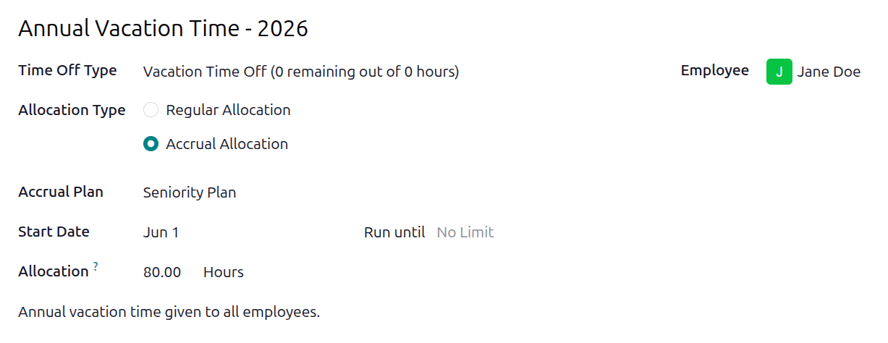
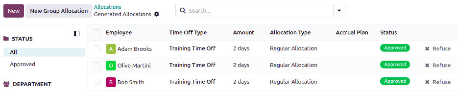
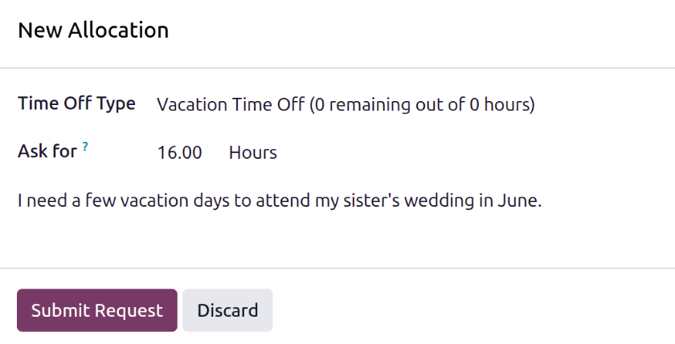
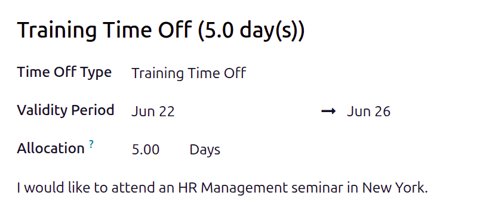

===========
Allocations
===========

Allocations are amounts of time off given to employees, either granted immediately or earned as the
employee works, through an :doc:`accrual plan <accrual_plans>`.

Once :doc:`time off types <time_off_types>` and accrual plans have been configured, the next step is
to *allocate*, or give, time off to employees.

The *Allocations* page of the **Time Off** app is **only** visible to users who have either *Time
Off Officer* or *Administrator* access rights for the **Time Off** application. For more information
on access rights, refer to the :doc:`access rights <../../general/users/access_rights/>`
documentation.

.. _time_off/allocation-form:

Allocate time off
=================

To create a new allocation, navigate to :menuselection:`Time Off app --> Management -->
Allocations`. This loads the *Allocations* dashboard.

The dashboard displays a Kanban view of all allocation requests for the user's team, awaiting
approval.

.. image:: allocations/allocations-requests.png
   :alt: A Kanban view of all allocation requests waiting approval.

Click :guilabel:`New` to allocate time off. This opens a blank :guilabel:`Allocations` form. Enter
the following information on the form:

- :guilabel:`Name`: Enter a name for the allocation, typically containing the type of time off, and
  the period of time it is available (example: `Annual Vacation Time Off - 2025`).
- :guilabel:`Time Off Type`: Using the drop-down menu, select the type of time off that is being
  allocated to the employees.
- :guilabel:`Allocation Type`: Select how the allocation is granted. The two options are:

  - :guilabel:`Regular Allocation`: The time off is given immediately, all at once.
  - :guilabel:`Accrual Allocation`: The time off is earned through an :doc:`accrual plan
    <accrual_plans>`.

- :guilabel:`Accrual Plan`: If :guilabel:`Accrual Allocation` is selected for the
  :guilabel:`Allocation Type`, the :guilabel:`Accrual Plan` field appears. Using the drop-down menu,
  select the accrual plan associated with the allocation. An accrual plan is **required** when using
  the :guilabel:`Accrual Allocation` type.
- :guilabel:`Validity Period/Start Date`: If :guilabel:`Regular Allocation` is selected for the
  :guilabel:`Allocation Type`, this field is labeled :guilabel:`Validity Period`. If
  :guilabel:`Accrual Allocation` is selected for the :guilabel:`Allocation Type`, this field is
  labeled :guilabel:`Start Date`.

  The current date populates the first date field, by default. To select another date, click on the
  pre-populated date to reveal a popover calendar window. Navigate to the desired start date for the
  allocation, and click on the date to select it.

  If the allocation expires, select the expiration date in the next date field. If the time off does
  *not* expire, leave the second date field blank.

  If :guilabel:`Accrual Allocation` is selected for the :guilabel:`Allocation Type`, this second
  field is labeled :guilabel:`Run until`.
- :guilabel:`Allocation`: Enter the amount of time that is being allocated to the employees. This
  field displays the time in either :guilabel:`Hours` or :guilabel:`Days`, depending on how the
  selected  :doc:`Time Off Type <time_off_types>` is configured.
- :guilabel:`Employee`: Using the drop-down menu, select the employee being allocated the time off.
- :guilabel:`Add a reason...`: If any description or note is necessary to explain the time off
  allocation, enter it in this field at the bottom of the form.

         for a new employee.

Accrual start date behavior
---------------------------

If the :guilabel:`Start Date` is in the middle of an accrual period, Odoo adjusts it to the start or
end of that period based on the *Accrued Gain Time* entered on the :doc:`accrual plan
<accrual_plans>`.

.. example::
   - *At the start of the accrual period*: A :guilabel:`Start Date` of `06/16/25` applies from
     `06/01/25`
   - *At the end of the accrual period*: A :guilabel:`Start Date` of `06/18/25` applies from
     `07/01/25`

Automatic adjustments on the start date to either the beginning or end of an accrual period ensures
accruals align with the defined period boundaries, rather than the exact date entered.

Group allocations
=================

When allocating time off, it is common to allocate time to multiple employees at once, instead of
creating individual allocations.

To allocate time to multiple employees in a single allocation, navigate to :menuselection:`Time Off
app --> Management --> Allocations`. Click the :guilabel:`New Group Allocation` button, and a *New
Group Allocation* pop-up window loads.

This form is identical to the individual :ref:`allocation form <time_off/allocation-form>`, with two
additional fields to determine how the employees are selected.

Using the drop-down menu, select one of the following options for the :guilabel:`Grant` field:

- :guilabel:`By Employee`: This option allows for the selection of multiple individual employees
  that are unrelated in terms of department, company, or tags. Selecting this reveals an
  :guilabel:`Employees` field. Using the drop-down menu, select the employees to receive the
  allocation in the :guilabel:`Employees` field. There is no limit to the amount of employees that
  can be selected.
- :guilabel:`By Company`: This option allows for the selection of all employees within a specific
  company. Selecting this reveals a :guilabel:`Company` field. Using the drop-down menu, select the
  :guilabel:`Company` to assign the allocation to. Only one company can be assigned in the
  :guilabel:`Company` field. When a company is selected, *all* employees within the company receive
  the allocation.
- :guilabel:`By Department`: This option allows for the selection of all employees within a specific
  department. Selecting this reveals a :guilabel:`Department` field. Select the
  :guilabel:`Department` to assign the allocation to. Only one department can be assigned in the
  :guilabel:`Department` field. When a department is selected, *all* employees within the department
  receive the allocation.
- :guilabel:`By Employee Tag`: This option allows for the selection of all employees with a specific
  tag. Selecting this reveals an :guilabel:`Employee Tag` field. Select the desired
  :guilabel:`Employee Tag` to select all employees with that tag. Only one tag can be assigned in
  the :guilabel:`Employee Tag` field. When a tag is selected, *all* employees with that tag receive
  the allocation.

Fill out the remainder of the :ref:`New Group Allocation form <time_off/allocation-form>`, then
click :guilabel:`Allocate Time Off` when done. The *Generated Allocations* dashboard loads,
displaying all the employees granted an allocation on the form.

.. example::
   A company wants to give their accounting department two days of training. The training is
   happening over one week. Since it is a work-related event, the company wants to grant time off to
   the accountants and let them decide which two training days they will attend.

   The time off officer creates multiple allocations, and configures the :ref:`New Group Allocation
   form <time_off/allocation-form>` as follows:

   The :guilabel:`Grant` field is set to :guilabel:`By Department`, and the :guilabel:`Department`
   field is set to :guilabel:`Accounting`.

   The :guilabel:`Time Off Type` is set to :guilabel:`Training Time Off`, with the
   :guilabel:`Allocation Type` set to :guilabel:`Regular Allocation`, since the time off is given up
   front, and is not *earned* through an accrual plan.

   The :guilabel:`Validity Period` is set to :guilabel:`June 22` :icon:`oi-arrow-right`
   :guilabel:`June 30`, since the training event is happening that week, and the employees can pick
   any two days they want to attend during that time.

   The :guilabel:`Allocation` is set to :guilabel:`2.00 Days`, and `Annual accounting training.`
   appears in the details at the bottom to provide information on why the time off is being
   allocated.

   .. image:: allocations/group.png
      :alt: An allocation request form filled out for two days of training granted to the accounting
            department.

.. _time_off/request-allocation:

Request allocation
==================

If an employee has used all their time off, or will run out of time off, they can request an
allocation for additional time. Allocations can be requested in one of two ways: either from the
main :ref:`Time Off dashboard <time_off/dashboard-allocation>` or the :ref:`My Allocations dashboard
<time_off/view-my-allocations>`.

.. note::
   Both options open a new *Allocation Request* form, but when requested from the main **Time Off**
   *Dashboard*, the form appears in a pop-up window, and the *Validity Period* field does **not**
   appear.

   When requested from the *My Allocations* dashboard, the screen navigates to a new allocation
   request page instead of presenting a pop-up window.

.. _time_off/dashboard-allocation:

Time off dashboard
------------------

To request an allocation from the **Time Off** dashboard, open the **Time Off** app, or navigate to
:menuselection:`Time Off app --> My Time --> Dashboard`. On the *Dashboard*, click :guilabel:`New
allocation request` beneath :guilabel:`Pending Requests`, and a *New Allocation* pop-up window
loads.

Configure the following fields on the form:

- :guilabel:`Time Off Type`: Select the type of time off being requested using the drop-down menu.
- :guilabel:`Ask for`: Enter the amount of time being requested, either in :guilabel:`Days` or
  :guilabel:`Hours`. The unit of time is determined by the selected :guilabel:`Time Off Type`.
- :guilabel:`Add a reason...`: Enter a brief description why the time off is being requested.

.. _time_off/view-my-allocations:

My allocations dashboard
------------------------

To request an allocation from the *My Allocations* dashboard, navigate to :menuselection:`Time Off
app --> My Time --> My Allocations`. Click the :guilabel:`New` button on the *My Allocations*
dashboard, and an *Allocation Request* form loads.

Enter the following information on the *Allocation Request* form:

- :guilabel:`Name`: The name for the allocation request is populated based on the default time off
  type, and displays both the time off type and the amount of hours by default. As selections are
  made, the name of the request is updated to reflect the request. The name **cannot** be manually
  modified.
- :guilabel:`Time Off Type`: Using the drop-down menu, select the type of time off being requested
  for the allocation. After a selection is made, the :guilabel:`Name` updates with the time off
  type.
- :guilabel:`Validity Period`: By default, the current date populates the first field and the
  second field displays :guilabel:`No Limit`. To change the time frame for the request, click on the
  date, and select the desired date on the calendar popover. If there is an expiration date for the
  request, select the end date in the second field.
- :guilabel:`Allocation`: Enter the amount of time being requested in this field. The format is
  presented in either :guilabel:`Days` or :guilabel:`Hours`, depending on how the :guilabel:`Time
  Off Type` is configured. Once this field is populated, the name of the allocation request is
  updated to include the amount of time being requested.
- :guilabel:`Add a reason...`: Enter a description for the allocation request in this field. This
  should include any details that approvers may need to approve the request.

The information is automatically saved as it is entered. To view the request, click the
:guilabel:`My Allocations` breadcrumb, or navigate to :menuselection:`Time Off app --> My Time -->
My Allocations`. The allocation request appears along with any other allocation requests awaiting
approval.

         training.
