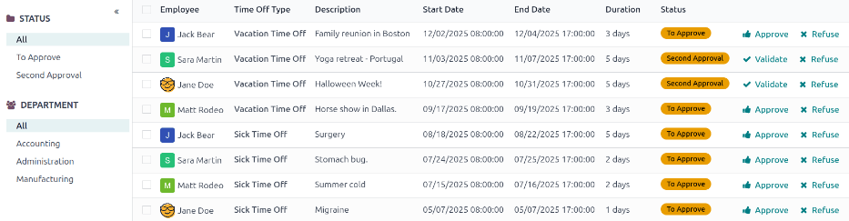
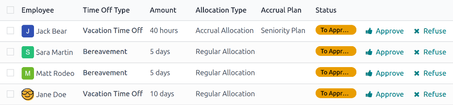

==========
Management
==========

.. _time_off/approvals:

Time off and allocation requests undergo an approval process before being granted. Requests either
need one or two approvals, if any, depending on how the specific type of time off is configured. All
these configurations can be found under the *Management* section of the *Time Off* application.

Only people who can approve allocation and time off requests have the :guilabel:`Management` section
visible in the *Time Off* application.

.. _time_off/manage-time-off:

Manage time off
===============

To view time off requests that need approval, navigate to :menuselection:`Time Off app -->
Management --> Time Off`. Doing so reveals the :guilabel:`All Time Off` page.

The only time off requests that are visible on this page belong to employees the user either has
:guilabel:`Time Off Officer` or :guilabel:`Administrator` access rights for in the *Time Off*
application.

The default filter on the :guilabel:`All Time Off` page is `Waiting For Me`.

This filter only presents time off requests that need to be approved for current employees on the
user's team, with a status of either :guilabel:`To Approve` or :guilabel:`Second Approval`.

On the left side of the :guilabel:`All Time Off` page, there are various grouping options that can
be used to narrow down the presented time off requests, located beneath the :guilabel:`Status` and
:guilabel:`Department` headings.

Since only time off requests that need to be approved are shown, the only :guilabel:`Status` options
are :guilabel:`All`, :guilabel:`To Approve`, and :guilabel:`Second Approval`.

The various departments the user is a member of, and manages employees under, also appear on the
left side of the page, under :guilabel:`Departments`.

.. note::
   If there are no requests that fall under one of the status options or departments, that status
   or department is **not** visible on the left-side menu.

To only display time off requests for specific departments, click on the :guilabel:`Department` on
the left-hand side of the page. Only requests within the selected department are then presented.

The status column displays the status of each request, with the status highlighted in a specific
color.

The :guilabel:`To Approve` and :guilabel:`Second Approval` requests are highlighted in yellow, and
are the only ones that appear in the list by default.

If the `Waiting For Me` filter is removed, all statuses appear.

:guilabel:`Approved` requests are highlighted in green, :guilabel:`To Submit` (drafts) requests are
highlighted in blue, and the :guilabel:`Refused` requests are highlighted in gray.

To approve a time off request, click the :icon:`fa-thumbs-up` :guilabel:`Approve` button at the end
of the line.

To validate a time off request that has already been approved, and is waiting on a second approval,
click the :icon:`fa-check` :guilabel:`Validate` button at the end of the line.

To refuse a request, click the :icon:`fa-times` :guilabel:`Refuse` button at the far end of the
line.

For more details, click anywhere on the time off request line (except for the :icon:`fa-thumbs-up`
:guilabel:`Approve`, :icon:`fa-check` :guilabel:`Validate` icon, and :icon:`fa-times`
:guilabel:`Refuse` buttons). Doing so loads that specific time off request form. Depending on the
rights of the user, changes can be made.

To modify the request, make any desired changes to the form. All changes are automatically saved.

It is also possible to approve, validate, or refuse the request from this form. Click the
:guilabel:`Approve` button to approve, the :guilabel:`Validate` button to validate, or the
:guilabel:`Refuse` button to refuse the request.

.. _time_off/manage-allocations:

Manage allocations
==================

To view allocations that need approval, navigate to :menuselection:`Time Off app --> Management -->
Allocations`. Doing so reveals the :guilabel:`Allocations` page.

The user is only presented with allocations for employees they have either :guilabel:`Time Off
Officer` or :guilabel:`Administrator` access rights for in the *Time Off* application.

The default filters configured on the :guilabel:`Allocations` page are :guilabel:`My Team` and
:guilabel:`Active Employee`. These default filters *only* present employees on the user's team (who
they manage) and active employees. Inactive records are not shown.

The left side of the :guilabel:`Allocations` page has various grouping options to narrow down the
presented allocation requests.

The :guilabel:`Status` options are: :guilabel:`All`, :guilabel:`To Approve`, :guilabel:`Refused`,
and :guilabel:`Approved`. Click on a specific :guilabel:`Status` to view only requests with that
specific status.

To view all allocation requests, regardless of status, click :guilabel:`All` under the
:guilabel:`Status` heading.

It is also possible to display allocation requests by department. Click on the desired
:guilabel:`Department` on the left side of the :guilabel:`Allocations` page, to only present
allocations for that specific department.

.. note::
   The groupings on the left side **only** present allocation requests that fall under the default
   filters of :guilabel:`My Team` and :guilabel:`Active Employee`, if those default filters are not
   removed from the :guilabel:`Search...` bar. Only the statuses for allocation requests that fall
   under those filters are presented on the left side.

   For example, if there are no requests with a status of :guilabel:`To Submit`, that status option
   does not appear in the left-hand side of the :guilabel:`Allocations` page.

   All departments for the user's employees appear in the list. If there are no allocation requests
   that fall under that department matching the preconfigured filters, the list is blank.

   It is always possible to remove any of the preconfigured filters, by clicking the
   :icon:`fa-times` :guilabel:`(remove)` icon on the specific filter to remove it.

The status column displays the status of each request, with the status highlighted in a specific
color.

The :guilabel:`To Approve` requests are highlighted in yellow, :guilabel:`Approved` requests are
highlighted in green, and the :guilabel:`Refused` requests are highlighted in gray.

To approve an allocation request, click the :icon:`fa-check` :guilabel:`Validate` button at the end
of the line. To refuse a request, click the :icon:`fa-times` :guilabel:`Refuse` button.

If more details are needed, click anywhere on the allocation request line (except for the
:icon:`fa-check` :guilabel:`Validate` or :icon:`fa-times` :guilabel:`Refuse` buttons) to view the
specific request in detail, via the allocation request form.

Depending on the rights of the user, changes can be made to the allocation request form that
appears. To modify the request, make any desired changes to the form. All changes are automatically
saved.

It is also possible to approve or refuse the request from this form. Click the :guilabel:`Validate`
button to approve, or the :guilabel:`Refuse` button to refuse the request.
