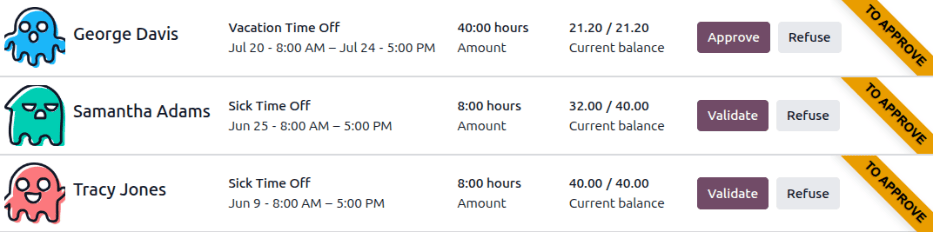
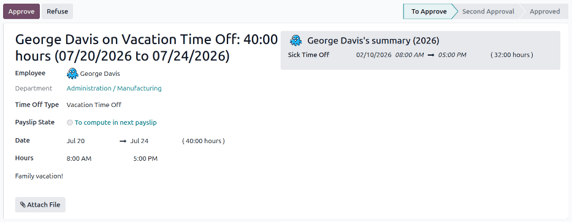
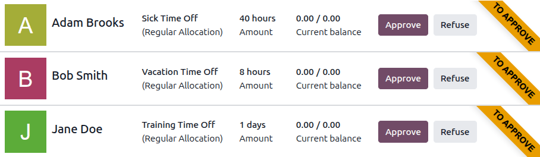
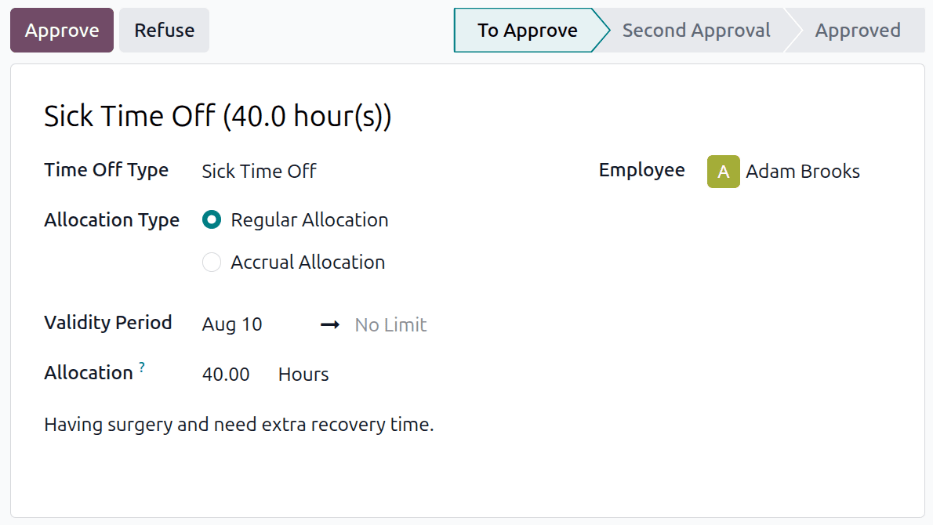

==========
Management
==========

.. _time_off/approvals:

Time off requests and allocation requests undergo an approval process before being granted. Requests
either need one or two approvals, if any, depending on how the specific type of time off is
configured. All these configurations can be found under the *Management* section of the **Time Off**
application.

.. note::
   The *Management* section in the **Time Off** application is **only** visible to users who can
   :ref:`approve allocation requests and time off requests <employees/work-info-tab>`.

.. _time_off/manage-time-off:

View time off requests
======================

To view time off requests waiting for approval, navigate to :menuselection:`Time Off app -->
Management --> Time Off`. Doing so reveals the *All Time Off* page. All time off requests appear in
a default Kanban view.

The only time off requests that are visible on this page belong to employees the user either has
:guilabel:`Time Off Officer` or :guilabel:`Administrator` access rights for in the **Time Off**
application.

The default filter on the :guilabel:`All Time Off` page is :icon:`fa-filter` :guilabel:`Waiting For
Me`. This filter only presents time off requests that need to be approved for current employees on
the user's team, with a status of either :guilabel:`To Approve` or :guilabel:`Second Approval`.

On the left side of the :guilabel:`All Time Off` page, there are various grouping options that can
be used to narrow down the presented time off requests, located beneath the :icon:`fa-folder`
:guilabel:`Status` and :icon:`fa-users` :guilabel:`Department` headings.

Since only time off requests that need to be approved are shown, the only :icon:`fa-folder`
:guilabel:`Status` options are :guilabel:`All`, :guilabel:`To Approve`, and :guilabel:`Second
Approval`.

The various departments the user is a member of, and manages employees under, also appear on the
left side of the page, under :icon:`fa-users` :guilabel:`Departments`.

To only display time off requests for specific departments, click on the :guilabel:`Department` on
the left-hand side of the page. Only requests within the selected department are then presented.

If the :icon:`fa-filter` :guilabel:`Waiting For Me` filter is removed, all statuses appear.

.. note::
   If no requests fall under one of the status options or departments, that status or department is
   **not** visible on the left-side menu.

Approve or refuse time off requests
===================================

To approve or refuse a time off request, navigate to :menuselection:`Time Off app --> Management -->
Time Off`. At the end of each time off request Kanban card, two buttons appear: an
:guilabel:`Approve` or :guilabel:`Validate` button, depending on the status of the request, and a
:guilabel:`Refuse` button.

To approve a time off request, click the :guilabel:`Approve` button. To validate a time off request
that has already been approved and is waiting on a second approval, click the :guilabel:`Validate`
button. To refuse a request, click the :guilabel:`Refuse` button.

If more information is needed before approving a time off request, click anywhere on the Kanban card
(except for the :guilabel:`Approve`, :guilabel:`Validate`, or :guilabel:`Refuse` buttons). Doing so
loads the detailed time off request form.

Depending on the rights of the user, changes can be made. To modify the request, make any desired
changes to the form. All changes are automatically saved.

It is also possible to approve, validate, or refuse the request from this form. Click the
:guilabel:`Approve` button to approve, the :guilabel:`Validate` button to validate, or the
:guilabel:`Refuse` button to refuse the request.

Once a request has been approved, validated, or refused, the Kanban card disappears from the default
:guilabel:`All Time Off` page. To view *all* requests, including approved and refused requests,
clear the default filters in the search bar.

.. _time_off/manage-allocations:

View allocation requests
========================

To view allocation requests waiting for approval, navigate to :menuselection:`Time Off app -->
Management --> Allocations`. Doing so reveals the :guilabel:`Allocations` page. All allocation
requests appear in a default Kanban view.

The only allocation requests that are visible on this page belong to employees the user either has
:guilabel:`Time Off Officer` or :guilabel:`Administrator` access rights for in the **Time Off**
application.

The default filters on the :guilabel:`Allocations` page are :icon:`fa-filter` :guilabel:`First
Approval` and :icon:`fa-filter` :guilabel:`My Team`. These filters only present allocation requests
that need to be approved for current employees on the user's team, awaiting approval or validation.

On the left side of the :guilabel:`Allocations` page, there are various grouping options that can be
used to narrow down the presented allocation requests, located beneath the :icon:`fa-folder`
:guilabel:`Status` and :icon:`fa-users` :guilabel:`Department` headings.

Since only allocation requests that need to be approved are shown, the only :icon:`fa-folder`
:guilabel:`Status` options are :guilabel:`All`, :guilabel:`To Approve`, and :guilabel:`Approved`.

The various departments the user is a member of, and manages employees under, also appear on the
left side of the page, under :icon:`fa-users` :guilabel:`Departments`.

To only display allocation requests for specific departments, click on the :guilabel:`Department` on
the left-hand side of the page. Only requests within the selected department are then presented.

If the :icon:`fa-filter` :guilabel:`First Approval` and :icon:`fa-filter` :guilabel:`My Team`
filters are removed, all statuses appear.

.. note::
   If no requests fall under one of the status options or departments, that status or department is
   **not** visible on the left-side menu.

Approve or refuse allocation requests
=====================================

To approve or refuse an allocation request, navigate to :menuselection:`Time Off app --> Management
--> Allocations`. At the end of each allocation request Kanban card, two buttons appear: an
:guilabel:`Approve` or :guilabel:`Validate` button, depending on the status of the request, and a
:guilabel:`Refuse` button.

If more information is needed before approving an allocation request, click anywhere on the Kanban
card (except for the :guilabel:`Approve`, :guilabel:`Validate`, or :guilabel:`Refuse` buttons).
Doing so loads the detailed allocation request form.

Depending on the rights of the user, changes can be made. To modify the request, make any desired
changes to the form. All changes are automatically saved.

It is also possible to approve, validate, or refuse the request from this form. Click the
:guilabel:`Approve` button to approve, the :guilabel:`Validate` button to validate, or the
:guilabel:`Refuse` button to refuse the request.

Once a request has been approved, validtaed, or refused, the Kanban card disappears from the default
:guilabel:`Allocations` page. To view *all* requests, including approved and refused requests, clear
the default filters in the search bar.

