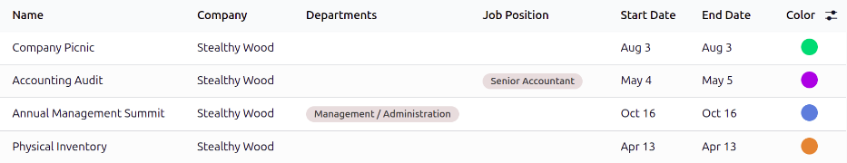

==============
Mandatory days
==============

Some companies have special days where a specific department, or the entire staff, is required to be
present. Time off is not allowed on those specific days.

These types of days are called *mandatory days* in Odoo. Mandatory days can be configured to be
company-wide, or department-specific. When configured, employees in the specified department or
company are unable to submit time off requests for these mandatory days.

.. important::
   No mandatory days are configured in Odoo by default.

Create mandatory days
=====================

To create mandatory days, navigate to :menuselection:`Time Off app --> Configuration --> Mandatory
Days`.

Click the :guilabel:`New` button in the top-left corner, and a blank line appears in the list.

Enter the following information on the new line:

- :guilabel:`Name`: Enter the name of the mandatory day.
- :guilabel:`Company`: This field is only visible in a multi-company database. The current company
  is selected by default. Use the drop-down menu to select the company the mandatory day is being
  configured for.
- :guilabel:`Departments`: This column is hidden by default. To display it, click the
  :icon:`oi-settings-adjust` :guilabel:`(additional options)` icon in the top corner of the header
  row, next to :guilabel:`Color`, then click the checkbox next to :guilabel:`Departments`.

  Use the drop-down menu to select the desired departments. Multiple departments can be selected;
  there is no limit to the number of departments that can be added.

  If this field is left blank, the mandatory day applies to all departments (the entire company).
- :guilabel:`Job Position`: This column is hidden by default. To display it, click the
  :icon:`oi-settings-adjust` :guilabel:`(additional options)` icon in the top corner of the header
  row, next to :guilabel:`Color`, then click the checkbox next to :guilabel:`Job Position`.

  Use the drop-down menu to select the desired job position. Multiple job positions can be selected;
  there is no limit to the number of job positions that can be added.

  If this field is left blank, the mandatory day applies to all employees.
- :guilabel:`Start Date`: Use the calendar picker to select the date the mandatory days start.
- :guilabel:`End Date`: Use the calendar picker to select the date the mandatory days end. If
  creating a single mandatory day, the end date should be the same as the start date.
- :guilabel:`Color`: Select a color from the available options, or select the `No color` option,
  represented by a white circle. The selected color appears on the main **Time Off** app dashboard,
  in both the calendar and in the legend.

