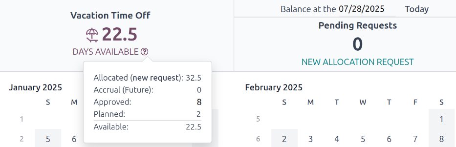
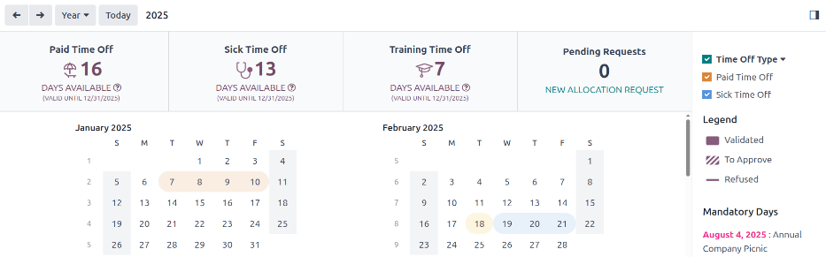

=======
My time
=======

The *My Time* menu of the *Time Off* application houses all the various time off information for
the signed-in user.

This includes the main *Time Off* dashboard, which displays an overview of the various time off
balances, as well as time-off requests and allocations.

.. _time_off/dashboard:

Dashboard
---------

All users have access to the *Time Off* :guilabel:`Dashboard`, which is the first page that appears
when the *Time Off* application is opened. The :guilabel:`Dashboard` can also be accessed at any
point in the application, by navigating to :menuselection:`Time Off app --> My Time --> Dashboard`.

The current year is displayed, and the current day is highlighted in a red circle.

To change the view, click on the :guilabel:`Year` button to reveal a drop-down menu. Then, select
either :guilabel:`Day`, :guilabel:`Week`, or :guilabel:`Month` to present the calendar in that
corresponding view.

.. note::
   To change the displayed dates, click the :icon:`fa-arrow-left` :guilabel:`(left arrow)` or
   :icon:`fa-arrow-right` :guilabel:`(right arrow)` icons to the left of the :guilabel:`Year`
   button. The calendar view adjusts in increments of the selected view.

   For example, if :guilabel:`Year` is selected, the arrows adjust the view by one year.

   To reset the view, so it includes the current date, click the :guilabel:`Today` button.

Above the calendar view is a summary of the user's time off balances. Every time off type that has
been allocated appears in its own summary box. Each summary lists the type of time off, the
corresponding icon, the current available balance (in hours or days), and an expiration date (if
applicable).

To view the full details of a time off balance, click the :icon:`fa-question-circle-o`
:guilabel:`(question mark)` icon at the end of the :guilabel:`(DAYS/HOURS) AVAILABLE` on the time
off summary. The complete details are presented in a popover window, including the
:guilabel:`Allocated` time, :guilabel:`Accrual (Future)` time, :guilabel:`Approved` time off
scheduled, :guilabel:`Planned` time off, and the currently :guilabel:`Available` time off.

A user can also select a future date to see an estimate of how much time they should accrue by that
point. On the right side of the time off summary blocks, there is a :guilabel:`Balance at the
(date)` field. Click on the date, and a calendar selector popover appears.

.. note::
   The :guilabel:`Balance at the (date)` field **only** appears if the user is accruing time off
   through an :ref:`accrual plan <time_off/accrual-plans>`.

The current date is the default date selected. Navigate to the desired date, and Odoo displays the
time off balances the user should have on that date. This takes into account all time off currently
planned and approved. To return to the current date, click the :guilabel:`Today` button to the right
of the date field.

On the right side of the calendar, the various time off types are displayed, each with their own
corresponding color. The :guilabel:`Legend` explains how the various statuses for time off requests
are presented.

Time off that has been validated appears in a solid color. Time off requests that still are still in
the :guilabel:`To Approve` stage, appear with white stripes in the color. :guilabel:`Refused` time
off requests have a line through the dates.

The color for each request corresponds to the specified color set with the various time off types,
listed in the section above the :guilabel:`Legend`.

New time off requests can be made from the :guilabel:`Dashboard`. Click the :guilabel:`New` button
in the upper-left corner, and a :doc:`New Time Off <request_time_off>` pop-up window appears.

New allocation requests can also be made from the :guilabel:`Dashboard`. Click the :guilabel:`New
Allocation Request` button to request more time off, and a :ref:`New Allocation
<time_off/request-allocation>` pop-up window appears.

.. _time_off/my-time-off:

My time off
-----------

To view a list of all the time off requests, navigate to :menuselection:`Time Off app --> My Time
--> My Time Off`. Here, all time off requests, both past and present, appear in a list view.

The list includes the following information for each request: the :guilabel:`Time Off Type`,
:guilabel:`Description`, :guilabel:`Start Date`, :guilabel:`End Date`, :guilabel:`Duration`, and
:guilabel:`Status`.

A new time off request can be made from this view. Click the :guilabel:`New` button to
:doc:`request_time_off`.

.. _time_off/my-allocations:

My allocations
--------------

To view a list of all allocations, navigate to :menuselection:`Time Off app --> My Time --> My
Allocations`. All allocations and requested allocations appear in a list view.

The information presented on the :guilabel:`My Allocations` page includes: :guilabel:`Time Off
Type`, :guilabel:`Description`, :guilabel:`Amount`, :guilabel:`Allocation Type`, and
:guilabel:`Status`.

A new allocation request can be made from this view, as well. Click the :guilabel:`New` button to
:ref:`request an allocation <time_off/request-allocation>`.
