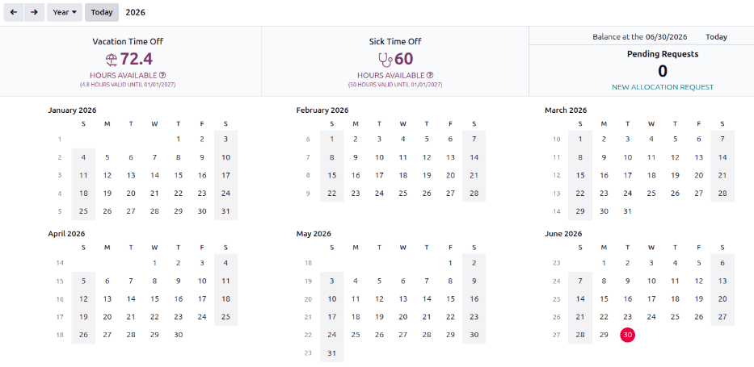
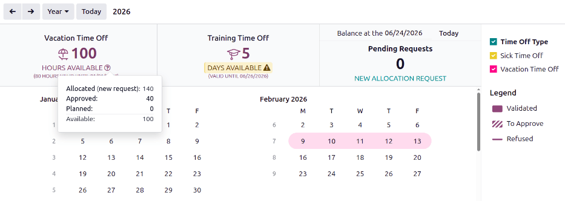
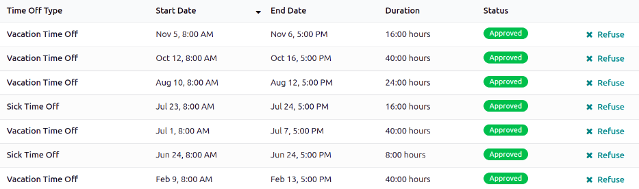
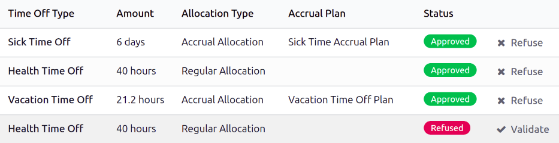

=======
My time
=======

The *My Time* menu of the **Time Off** app houses all the various time off information for the
signed-in user.

This includes the main **Time Off** :ref:`dashboard <time_off/dashboard>`, which displays an
overview of the various time off balances, as well as :ref:`time-off requests
<time_off/my-time-off>` and :ref:`allocations <time_off/my-allocations>`.

.. _time_off/dashboard:

Dashboard
=========

All users have access to the **Time Off** app dashboard, which is the first page that appears when
the **Time Off** app is opened. The dashboard can also be accessed at any point by navigating to
:menuselection:`Time Off app --> My Time --> Dashboard`.

The dashboard shows a summary of the user's time off, and the entire current calendar year, with the
current day highlighted in a red circle. The weeks are notated in light grey, in the far left column
of each month.

To change the view, click the :guilabel:`Year` :icon:`fa-caret-down` button to reveal a drop-down
menu. Then, select either :guilabel:`Day`, :guilabel:`Week`, or :guilabel:`Month` to present the
calendar in that corresponding view.

.. tip::
   The calendar displays weekends by default. To hide the weekends, click the :guilabel:`Year`
   :icon:`fa-caret-down` button, and click :icon:`fa-check` :guilabel:`Show Weekends`. The dashboard
   reloads, and the weekends are hidden from view.

.. note::
   To change the displayed dates, click the :icon:`fa-arrow-left` :guilabel:`(Previous)` or
   :icon:`fa-arrow-right` :guilabel:`(Next)` buttons to the left of the :guilabel:`Year` button. The
   calendar view adjusts in increments of the selected view.

   For example, if :guilabel:`Year` is selected, the arrows adjust the view by one year.

   To reset the view, so it includes the current date, click the :guilabel:`Today` button.

Above the calendar view is a summary of the user's time off balances. Every time off type that has
been allocated appears in its own summary box. Each summary lists the type of time off, the
corresponding icon, the current available balance (in hours or days), and if applicable, an
expiration date.

To view the full details of a time off balance, click the :icon:`fa-question-circle-o`
:guilabel:`(question mark)` icon at the end of the :guilabel:`(Days/Hours) available` on the time
off type summary. The complete details for the year are presented in a popover window, including:

- :guilabel:`Allocated (new request)`: The total amount of time off allocated to the employee. Click
  :guilabel:`Allocated` to view a list of allocations granted. To request more time, click
  :guilabel:`new request` and a :ref:`New Allocation pop-up window loads
  <time_off/request-allocation>`.
- :guilabel:`Approved`: The total amount of time off that has been approved.
- :guilabel:`Planned`: The total amount of time off that has been scheduled for the future.
- :guilabel:`Available`: The total amount of time off available to the employee after the approved
  and planned time off are factored in.

.. important::
   Any time off type that contains expired time provides an alert. The :guilabel:`(Days/Hours)
   available` is highlighted in yellow, along with a :icon:`fa-exclamation-triangle`
   :guilabel:`(caution)` sign.

A user can also select a future date to see an estimate of how much time they should accrue by that
point. On the right side of the time off summary blocks, there is a :guilabel:`Balance at the
(date)` field. Click on the date, and a calendar selector popover appears.

.. note::
   The :guilabel:`Balance at the (date)` field **only** appears if the user is accruing time off
   through an :doc:`accrual plan <accrual_plans>`.

The current date is the default date selected. Navigate to the desired date, and Odoo displays the
time off balances the user should have on that date. This takes into account all time off currently
planned and approved. To return to the current date, click the :guilabel:`Today` button to the right
of the date field.

On the right side of the calendar, the various time off types are displayed, each with their own
corresponding color. The :guilabel:`Legend` explains how the various statuses for time off requests
are presented.

Time off that has been validated appears in a solid color. Time off requests that are still in the
:guilabel:`To Approve` stage, appear with white stripes in the color. :guilabel:`Refused` time off
requests have a line through the dates.

The color for each request corresponds to the specified color set with the various time off types,
listed in the section above the :guilabel:`Legend`.

New time off requests can be made from the :guilabel:`Dashboard`. Click the :guilabel:`New` button
in the upper-left corner, and a :doc:`New Time Off <request_time_off>` pop-up window appears.

New allocation requests can also be made from the :guilabel:`Dashboard`. Click the :guilabel:`New
allocation request` link to request more time off, and a :ref:`New Allocation
<time_off/request-allocation>` pop-up window appears.

.. _time_off/my-time-off:

My time off
===========

To view a list of all the signed-in user's time off requests, navigate to :menuselection:`Time Off
app --> My Time --> My Time Off`. Here, all time off requests, both past and present, appear in a
chronological list view.

The list includes the following information for each request: the :guilabel:`Time Off Type`,
:guilabel:`Start Date`, :guilabel:`End Date`, :guilabel:`Duration`, and :guilabel:`Status`.

A new time off request can be made from this view. Click the :guilabel:`New` button to
:doc:`request_time_off`.

Additionally, if the user has the necessary access rights, a :icon:`fa-cross` :guilabel:`Refuse` or
:icon:`fa-check` :guilabel:`Validate` button appears at the end of each line.

.. _time_off/my-allocations:

My allocations
==============

To view a list of all allocations, navigate to :menuselection:`Time Off app --> My Time --> My
Allocations`. All allocations and requested allocations appear in a list view.

The information presented on the :guilabel:`My Allocations` page includes: :guilabel:`Time Off
Type`, :guilabel:`Amount`, :guilabel:`Allocation Type`, :guilabel:`Accrual Plan`, and
:guilabel:`Status`. If the signed-in user has the appropriate access rights, a :icon:`fa-cross`
:guilabel:`Refuse` or :icon:`fa-check` :guilabel:`Validate` button appears at the end of each line.

A new allocation request can be made from this view, as well. Click the :guilabel:`New` button to
:ref:`request an allocation <time_off/request-allocation>`.

