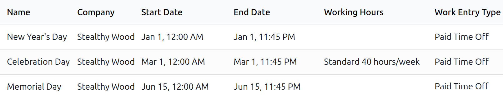

===============
Public holidays
===============

Since holidays vary by country, region, and even city, Odoo's **Time Off** app does *not* include
any public holidays by default. To account for public or national holidays, configure the observed
holidays in Odoo so employees can receive the appropriate days off.

Configuring public holidays helps employees clearly see their non-working days and prevents
unnecessary time off requests for dates already designated as holidays.

Public holidays configured in the **Time Off** app are also reflected across other Odoo apps that
use :doc:`working schedules <../payroll/working_schedules>`, including **Calendar**, **Planning**,
**Manufacturing**, and more.

Because of Odoo's integration across these apps, configuring all public holidays is considered best
practice.

Create public holidays
======================

To create a public holiday, navigate to :menuselection:`Time Off app --> Configuration --> Public
Holidays`. All currently configured public holidays appear in a default list view.

Click the :guilabel:`New` button and a new line appears at the bottom of the list.

Enter the following information on that new line:

- :guilabel:`Name`: Enter the name of the holiday.
- :guilabel:`Company`: If in a multi-company database, the current company populates this field by
  default. It is **not** possible to edit this field.

  .. note::
     The :guilabel:`Company` field is hidden, by default. To view this field, click the
     :icon:`oi-settings-adjust` :guilabel:`(settings adjusts)` icon in the top-right corner of the
     list, to the far-right of the column titles, and activate the :guilabel:`Company` selection
     from the drop-down menu that appears.

- :guilabel:`Start Date`: Using the date and time picker, select the date and time the holiday
  starts, then click :guilabel:`Apply`. By default, this field is configured for the current date,
  with a start time of `12:00 AM`.
- :guilabel:`End Date`: Using the date and time picker, select the date and time the holiday ends,
  then click :guilabel:`Apply`. By default, this field is configured for the current date, with an
  end time of `11:59 PM`.

  .. note::
     It is **not** recommended to change the public holiday hours of `12:00 AM` to `11:59 PM`. This
     ensures all employees working all shifts receive the public holiday.

- :guilabel:`Working Hours`: If the holiday should only apply to employees who have a specific set
  of working hours, select the working hours using the drop-down menu. If left blank, the holiday
  applies to all employees.
- :guilabel:`Work Entry Type`: If using the **Payroll** app, this field defines how the :doc:`work
  entries <../payroll/work_entries>` for the holiday appear. Select the work entry type using the
  drop-down menu.

