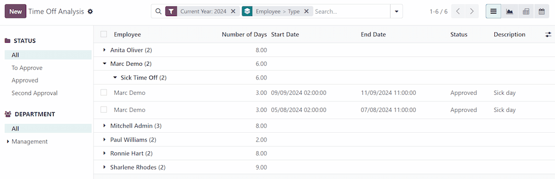
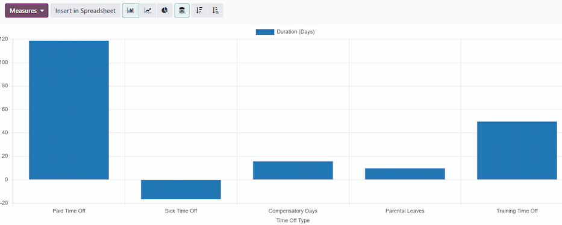
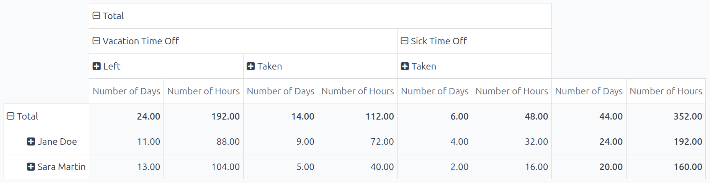

=========
Reporting
=========

The **Time Off** app's reporting feature lets managers view team time off by employee, type, or
remaining balances. This allows managers to see :ref:`who is taking time off, how much they have
used <time_off/by-employee>`, :ref:`which types are more commonly used <time_off/by_type>`, and
:ref:`how much each employee still has available <time_off/balance>`.

Any report can be added to a spreadsheet, when in either the :icon:`fa-area-chart`
:guilabel:`(Graph)` or :icon:`oi-view-pivot` :guilabel:`(Pivot)` view, through the *Insert in
Spreadsheet* button that appears in the top-left of a report.

.. note::
   If the **Documents** app is installed, an option to add the report to a spreadsheet appears. If
   not, the report can be added to a *Dashboard*.

.. _time_off/by-employee:

By employee
===========

Viewing time off by employee helps managers track usage patterns, monitor remaining balances, ensure
policy compliance, and plan coverage for upcoming absences. To view a list of employee time off
requests, navigate to :menuselection:`Time Off app --> Reporting --> by Employee`.

The default report presents the current year's data in a list view, displaying all the employees in
alphabetical order. Each employee's line is collapsed by default. To expand a line, click anywhere
on the line.

The view expands, and has the time off requests organized by time off type. Click anywhere on a time
off type line to expand it, and view all the individual time off requests that fall under that type.

The information shown in the list includes: the :guilabel:`Employee` name, :guilabel:`Number of
Days` off requested, the :guilabel:`Start Date`, :guilabel:`End Date`, :guilabel:`Status`, and
:guilabel:`Description`.

The report can be displayed in other ways, as well. Click the corresponding button option in the
top-right corner of the page to view the data in that specific way. The various options are a
:icon:`oi-view-list` :guilabel:`(List)`, or default view, :icon:`fa-area-chart` :guilabel:`(Graph)`,
:icon:`oi-view-pivot` :guilabel:`(Pivot)` table, or :icon:`fa-calendar` :guilabel:`(Calendar)` view.

When a selection has been made, additional options appear for that particular selection. For more
detailed information on the reports and their various options, refer to the :doc:`reporting
<../../essentials/reporting>` documentation.

.. _time_off/by_type:

By type
=======

Viewing company-wide time off by type can help managers determine if employees are using their time
off, which types are used more than others, and can spot any trends. High totals in certain time off
types, like sick time off, can indicate health or morale concerns.

To view a graph of all time off, organized by time off type, navigate to :menuselection:`Time Off
app --> Reporting --> by Type`. This shows all time off requests in a default bar chart.

Hover over a bar to view the :guilabel:`Duration (Days)` of that specific time off type.

         highlighted in a red box.

Click on a bar to go to a detailed list view of all the time off requests for that time off type.

Each request is listed, with the following information displayed: the :guilabel:`Employee`,
:guilabel:`Number of Days`, :guilabel:`Request Type`, :guilabel:`Start Date`, :guilabel:`End Date`,
:guilabel:`Status`, and the :guilabel:`Description`.

The report can be displayed in other ways, as well. Click the corresponding button option in the
top-right corner of the page to view the data in that way. The various options are a
:icon:`fa-area-chart` :guilabel:`(Graph)` (the default view), :icon:`oi-view-list`
:guilabel:`(List)`, or :icon:`oi-view-pivot` :guilabel:`(Pivot)` table.

When a selection has been made, additional options appear for that particular selection. For more
detailed information on the reports, and their various options, refer to the :doc:`reporting
<../../essentials/reporting>` documentation.

.. _time_off/balance:

Balance
=======

When some time off types have restrictions, such as rollover rules and balance limits, viewing time
off balances can help managers see a high-level overview of time off. If certain employees have a
lot of time that will expire soon, they can inform their employees and adjust scheduled accordingly
to be prepared for their absences.

To view a pivot table of all time off balances, organized by time off type, then further organized
by how many days and hours are :guilabel:`Left` and :guilabel:`Planned`, navigate to
:menuselection:`Time Off app --> Reporting --> Balance`.

This shows all time off balances in a default pivot table. The employees populate the rows, while
the various time off types and balances populate the columns.

