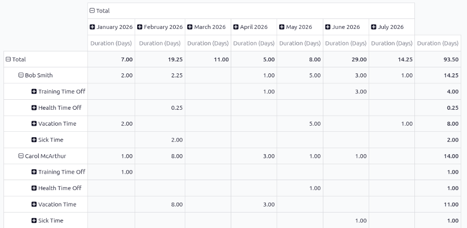
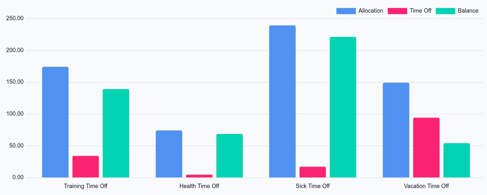
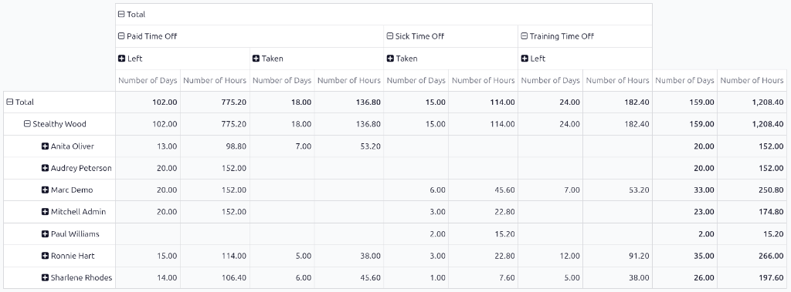

=========
Reporting
=========

The **Time Off** app's reporting feature lets managers view team time off by employee, type, or
remaining balances. This allows managers to see :ref:`who is taking time off, how much they have
used <time_off/by-employee>`, :ref:`which types are more commonly used <time_off/by_type>`, and
:ref:`how much each employee still has available <time_off/balance>`.

.. important::
   The reporting feature of the **Time Off** app is **only** available to users with the correct
   :doc:`access rights <../../general/users/access_rights>`, typically managers.

.. _time_off/by-employee:

By employee
===========

Viewing time off by employee helps managers track usage patterns, monitor remaining balances, ensure
policy compliance, and plan coverage for upcoming absences. To view a list of employee time off
requests, navigate to :menuselection:`Time Off app --> Reporting --> by Employee`.

The default report presents the current year's data in a pivot table, with the months populating the
columns, and the employees populating the rows. The report displays the various time off taken by
each employee, with a status of either *Approved* or *To Approve*, the amount of time off used for
each month (the :guilabel:`Duration (Days)`), and the various totals.

.. note::
   All time off is calculated in days, including time off types configured to be taken in hours.
   Odoo automatically converts all time off hours into their day equivalent. For example, two hours
   of time off is presented as `0.25` days.

.. seealso::
   :doc:`Reporting <../../essentials/reporting>`

.. _time_off/by_type:

By type
=======

Viewing company-wide time off by type can help managers determine if employees are using their time
off, which types are used more than others, and can spot any trends. High totals in certain time off
types, like sick time off, can indicate health or morale concerns.

To view a graph of all time off, organized by time off type, navigate to :menuselection:`Time Off
app --> Reporting --> by Type`. This shows all time off requests with a status of *Approved* or *To
Approve* in a default bar chart.

Each time off type displays three columns of information:

- :guilabel:`Allocation`: This blue-colored bar indicates the total amount of time off allocated to
  employees.
- :guilabel:`Time Off`: This red-colored bar indicates the amount of time off requested, including
  both past and scheduled future time off, for both approved and pending requests.
- :guilabel:`Balance`: This green-colored bar indicates the total balance of unused time off.

.. note::
   If the time off type is configured to not require an allocation, the :guilabel:`Allocation`
   column does *not* appear.

Hover over a column to view the total :guilabel:`Duration (Days)` and click on a bar to view a
detailed list of all the individual records for that bar.

Each request is listed, with the following information displayed: the :guilabel:`Employee`,
:guilabel:`Number of Days`, :guilabel:`Request Type`, :guilabel:`Start Date`, :guilabel:`End Date`,
:guilabel:`Status`, and the :guilabel:`Description`.

The report can be displayed in other ways, as well. Click the corresponding button option in the
top-right corner of the page to view the data in that way. The various options are a
:icon:`fa-area-chart` :guilabel:`(Graph)` (the default view), :icon:`oi-view-list`
:guilabel:`(List)`, or :icon:`oi-view-pivot` :guilabel:`(Pivot)` table.

When a selection has been made, additional options appear for that particular selection. For more
detailed information on the reports, and their various options, refer to the :doc:`reporting
<../../essentials/reporting>` documentation.

.. _time_off/balance:

Balance
=======

When some time off types have restrictions, such as rollover rules and balance limits, viewing time
off balances can help managers and time off approvers see a high-level overview of time off. If
certain employees have time off that will expire soon, they can be infomred and adjust their
schedules accordingly.

To view all time off balances for the current year, navigate to :menuselection:`Time Off app -->
Reporting --> Balance`. The *Balance* report shows all time off balances in a default pivot table.
The employees populate the rows, while the various time off types populate the columns.

Each time off type displays the :guilabel:`Number of Days` and :guilabel:`Number of Hours` remaining
for the following:

- :guilabel:`Left`: The remaining amount of time off for the year.
- :guilabel:`Planned`: The amount of time off scheduled for the remainder of the year.
- :guilabel:`Taken`: The amount of time off already taken for the year.

