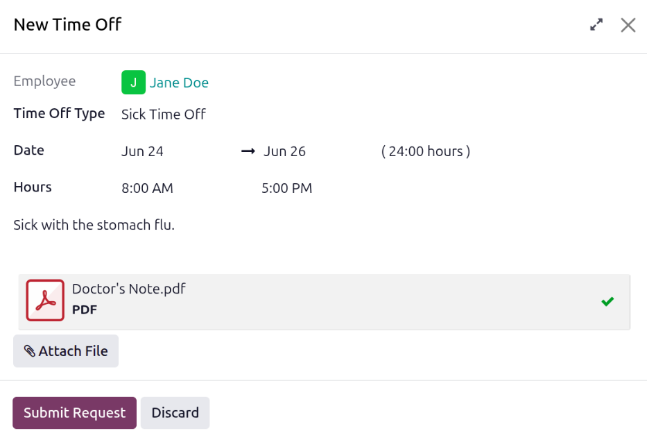

================
Request time off
================

When employees wish to take time off, they first submit a time off request through the **Time Off**
application.

If the :ref:`Time Off Type <time_off/time-off-requests>` does not require any approvals, the time
off request is automatically approved. If approval is needed, the request is then reviewed by either
the employee's manager or their time off officer, depending on who the employee's :ref:`time off
approver is <employees/approvers>`.

Submit time off request
=======================

Time off can be requested through the main :ref:`Time Off app dashboard <time_off/request-dash>`, or
the :ref:`My Time Off dashboard <time_off/request-my-dash>`.

.. _time_off/request-dash:

Time off dashboard
------------------

To request time off, open the **Time Off** app. Click the :guilabel:`New` button and a *New Time
Off* pop-up form loads.

Fill out the :ref:`fields on the form <time_off/fields>`, and then click the :guilabel:`Submit
Request` button to submit the time off request.

.. _time_off/request-my-dash:

My time off dashboard
---------------------

To request time off from the *My Time Off* dashboard, navigate to :menuselection:`Time Off app -->
My Time --> My Time Off`. Click the :guilabel:`New` button and a time off request page loads.

Fill out the various :ref:`fields on the form <time_off/fields>`. Once completed, the form
automatically saves and is sent to the corresponding manager and time off officer, and appears in
their :ref:`for approval <time_off/manage-time-off>` dashboard.

.. _time_off/fields:

Time off request fields
=======================

Enter the following information on the time off request form:

- :guilabel:`Employee`: When requesting time off from the main **Time Off** app dashboard, this
  field appears. The signed-in employee populates this field by default, and cannot be modified
  unless the user has the necessary :ref:`access rights for the time off type
  <time_off/time-off-requests>`.
- :guilabel:`Time Off Type`: Using the drop-down menu, select the type of time off being requested.
- :guilabel:`Date`: Enter the dates that the time off falls under. There are two fields to populate:
  the start and end dates. Click either date field to open a popover calendar.

  Click on the start date, then click on the end date. When requesting time off for a single day,
  click on the start date, then click the same date again for the end date.

  The selected dates now populate the two portions of the :guilabel:`Date` field.

  If the selected :guilabel:`Time Off Type` is configured to have the time off taken in whole days,
  no more fields are necessary to configure.

  If the selected :guilabel:`Time Off Type` is configured to have the time off taken in half days,
  the following fields appear:

  - :guilabel:`Day Period`: Select either :guilabel:`Morning` or :guilabel:`Afternoon` to indicate
    which half of the day is being requested off. To only request a half day, ensure both fields are
    set to the same selection.

  If the selected :guilabel:`Time Off Type` is configured to have the time off taken in hours, the
  following fields appear:

  - :guilabel:`Hours`: Using the drop-down menu, select both the start time and end time for the
    time off request in the two fields.

- :guilabel:`Description`: Enter a description for the time off request. This should include any
  details that managers and approvers may need to approve the request.
- :icon:`fa-paperclip` :guilabel:`Attach File`: This field **only** appears if the :guilabel:`Time
  Off Type` selected is :ref:`configured to require documentation <time_off/time-off-config>`. Click
  the :icon:`fa-paperclip` :guilabel:`Attach File` button, and a file explorer window appears.

  Navigate to the desired files to be attached, select them, then click the :guilabel:`Open` button.
  The files then appear on the time off request form. Multiple documents can be attached, if
  necessary.

         attached.
