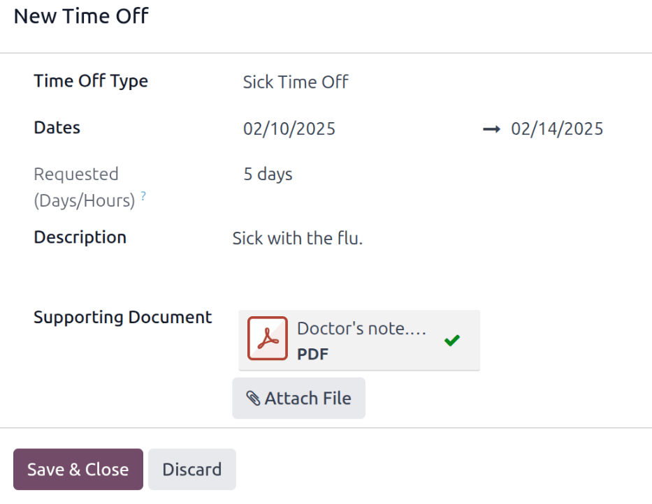

================
Request time off
================

Once time off has been :doc:`allocated <allocations>` to an employee, a time off request can be
submitted.

Time off can be requested in one of two ways: either from the main **Time Off** application
:guilabel:`Dashboard` (:menuselection:`Time Off app --> My Time --> Dashboard`), or from the
:guilabel:`My Time Off` dashboard view (:menuselection:`Time Off app --> My Time --> My Time Off`).

To create a new request for time off, click the :guilabel:`New` button on either the main
**Time Off** :guilabel:`Dashboard` or the :guilabel:`My Time Off` dashboard, in the default list
view.

.. note::
   Both :guilabel:`New` buttons allow the user to request time off, but when requested from the
   :guilabel:`Dashboard`, a :guilabel:`New Time Off` request form appears in a pop-up window. When
   requested from the :guilabel:`My Time Off` list view, the screen navigates to a new time off
   request page, instead.

Enter the following information on the :guilabel:`New Time Off` request form:

- :guilabel:`Time Off Type`: Using the drop-down menu, select the type of time off being requested.
- :guilabel:`Dates`: Enter the dates that the time off falls under. There are two fields to
  populate: the start and end dates. Click on either date field and a popover calendar appears.

  Click on the start date, then click on the end date. The selected start and end dates are circled,
  and the dates between them are highlighted (if applicable).

  If only requesting time off for a single day, click on the start date, then click the same date
  again for the end date.

  When the correct dates are selected, click the :guilabel:`Apply` button.

  The selected dates now populate the two portions of the :guilabel:`Dates` field.

  If the selected :guilabel:`Time Off Type` is configured to have the time off taken in hours, the
  following two fields also appear:

  - :guilabel:`Half Day`: If the time off request is for a half day, tick this checkbox. When this
    is selected, the second date field disappears, and is replaced with a drop-down menu. From that
    drop-down menu, select either :guilabel:`Morning` or :guilabel:`Afternoon` to indicate which
    half of the day is being requested off.
  - :guilabel:`Custom Hours`: If the time off requested is not a whole or half day, tick this
    checkbox. If selected, a :guilabel:`From` and :guilabel:`To` field appears beneath this option.
    Using the drop-down menu, select the start and end time for the time off request.

- :guilabel:`Requested (Days/Hours)`: This field updates automatically once the :guilabel:`Date`
  section is completed. If the :guilabel:`Date` section is modified, this section automatically
  updates to reflect the total time off requested. This field is in either hours or days, depending
  on how the selected :ref:`Time Off Type <time_off/time-off-types>` is configured.
- :guilabel:`Description`: Enter a description for the time off request. This should include any
  details that managers and approvers may need to approve the request.
- :guilabel:`Supporting Document`: This field **only** appears if the :ref:`Time Off Type
  <time_off/time-off-types>` selected allows for the attachment of documents. Click the
  :icon:`fa-paperclip` :guilabel:`Attach File` button, and a file explorer window appears.

  Navigate to the desired files that should be attached, select them, then click The
  :guilabel:`Open` button. The files then appear on the time off request form. Multiple documents
  can be attached, if necessary.

If the request was created from the :guilabel:`Dashboard`, click the :guilabel:`Save & Close` button
to save the information, and submit the request.

If the form was completed from the :ref:`My Time Off <time_off/my-time-off>` list view, the
information is automatically saved as it is entered.

