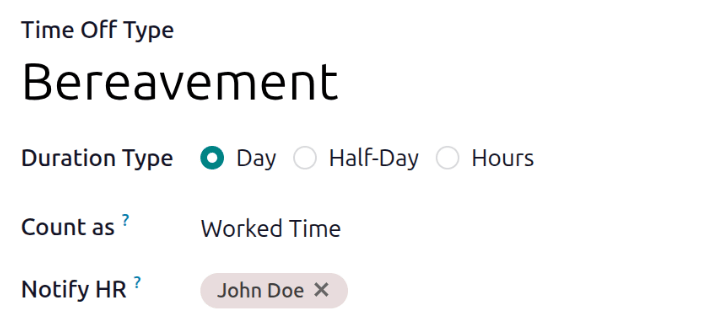
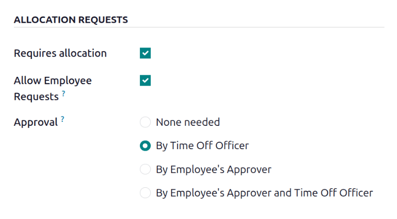
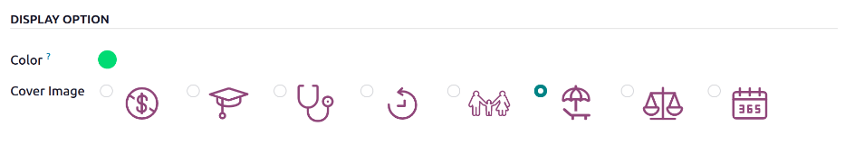

==============
Time off types
==============

One of the first things that requires configuration in the **Time Off** app are the time off types.

When employees request time off, they must specify the *type* of time off they are requesting, such
as sick time, vacation time, etc. The time off type determines several things, including *how* the
request is made (hours, half days, or days), and how it is :ref:`approved
<time_off/time-off-requests>`.

To view the currently configured time off types, navigate to :menuselection:`Time Off app -->
Configuration --> Time Off Types`. The time off types are presented in a list view.

The **Time Off** app comes with six preconfigured time off types: :guilabel:`Paid Time Off`,
:guilabel:`Sick Time Off`, :guilabel:`Unpaid`, :guilabel:`Compensatory Days`, :guilabel:`Extra Time
Off`, and :guilabel:`Extra Hours`. These can be modified to suit business needs, or used as-is.

Create time off type
====================

To create a new time off type, navigate to :menuselection:`Time Off app --> Configuration --> Time
Off Types`. From here, click the :guilabel:`New` button to reveal a blank *Time Off Type* form.
Then, enter the following information on the form.

.. note::
   The only **required** configurations on the time off type form are the following fields:

   - :guilabel:`Time Off Type`
   - :guilabel:`Duration Type`
   - :guilabel:`Count as`
   - :guilabel:`Approval`

General information section
---------------------------

This section outlines the high-level information for the time off type. Enter the following
information at the top of the form:

- :guilabel:`Time Off Type`: Enter the name for the particular type of time off, such as `Vacation`
  or `Bereavement`.
- :guilabel:`Duration Type`: Select the format the time off is requested in by clicking the
  corresponding radio button. The options are:

  - :guilabel:`Day`: Time off can only be requested in full-day increments (8 hours).
  - :guilabel:`Half Day`: Time off can only be requested in half-day increments (4 hours).
  - :guilabel:`Hours`: Time off can be taken in hourly increments.

- :guilabel:`Count as`: Using the drop-down menu, select whether the time off type is counted toward
  accrual plans. Select :guilabel:`Worked Time` if the time off *does* count, select
  :guilabel:`Absence` if it does *not* count toward any type of accrual.
- :guilabel:`Notify HR`: Select the user who is notified and responsible for approving requests and
  allocations for this specific type of time off. If this field is left blank, no one is notified.
- :guilabel:`Company`: If :doc:`multiple companies are created in the database
  <../../general/companies/multi_company>`, and this time off type only applies to one company,
  select the company from the drop-down menu. If this field is left blank, the time off type applies
  to all companies in the database. This field **only** appears in a multi-company database.
- :guilabel:`Country`: If multiple countries are associated with the database, and this time off
  type is restricted to one country, select the country from the drop-down menu. If this field is
  left blank, the time off type applies to all countries. This field **only** appears in a
  multi-country database.

.. _time_off/time-off-requests:

Time off requests section
-------------------------

This section determines how approvals are handled for time off requests for this time off type.

Select what specific kind of :guilabel:`Approval` is required for the time off type. The options
are:

  - :guilabel:`None Needed`: No approvals are required when requesting this type of time off. The
    time off request is automatically approved.
  - :guilabel:`By Time Off Officer`: Only the specified time off officer, set on this form in the
    :guilabel:`Notify HR` field, is required to approve the time off request. This option is
    selected by default.
  - :guilabel:`By Employee's Approver`: Only the employee's specified approver for time off, which
    is configured in the *Settings* tab of the :ref:`employee's form <employees/approvers>`, is
    required to approve the time off request.
  - :guilabel:`By Employee's Approver and Time Off Officer`: Both the employee's :ref:`specified
    time off approver <employees/approvers>` and the time off officer are required to approve the
    time off request.

Allocation requests section
---------------------------

This section determines how allocation requests are handled for this time off type.

- :guilabel:`Requires allocation`: If the time off must be allocated to employees, enable the
  checkbox. If the time off can be requested without time off being previously allocated, uncheck
  the box. If unchecked, no other options appear in the *Allocation Requests* section.
- :guilabel:`Allow Employee Requests`: Check the checkbox if the employee should be able to request
  more time off than was allocated.

  If employees should **not** be able to make requests for more time off than what was allocated,
  leave the box unchecked.

  .. example::
     Ten days are allocated to the employee for this particular type of time off, and the
     :guilabel:`Allow Employee Requests` option is enabled. The employee wants to take a vacation
     for twelve days. They may submit a request for two additional days, since the :guilabel:`Allow
     Employee Requests` option is enabled.

  .. important::
     It is important to note that requesting additional time off does **not** guarantee that time
     off is granted.

- :guilabel:`Approval`: Select the type of approvals required for the allocation of this particular
  time off type.

  - :guilabel:`None Needed`: No approvals are required when requesting additional allocations for
    the time off type. The allocation request is automatically approved.
  - :guilabel:`By Time Off Officer`: Only the specified time off officer, set on this form in the
    :guilabel:`Notify HR` field, is required to approve the allocation request. This option is
    selected, by default.
  - :guilabel:`By Employee's Approver`: Only the employee's specified approver for time off, which
    is set on the *Work Information* tab on the :ref:`employee's form <employees/work-info-tab>`, is
    required to approve the allocation request.
  - :guilabel:`By Employee's Approver and Time Off Officer`: Both the employee's :ref:`specified
    time off approver <employees/work-info-tab>` and the time off officer are required to approve
    the allocation request.

Configuration section
---------------------

This section determines all other details regarding the time off type, aside from approvals and
allocations.

- :guilabel:`Ignore Public Holidays`: Enable this option if public holidays should *not* be included
  in time off requests.

  .. example::
     An employee in the United States requests time off for the week of July 4th, for a total of
     five days. Since the 4th of July is a holiday in the United States, the time off request is
     automatically modified to use four vacation days and one public holiday, instead of five
     vacation days. That is because the holiday is ignored, and the user does not need to use their
     own vacation time for a public holiday.

     This option reduces extra work for users, enabling them to make only one time off request for
     the entire week, instead of making two separate requests, one for the days *before* the
     holiday, and another one for the days *after* the holiday.

- :guilabel:`Hide On Dashboard`: Enable this option if this type of time off should *not* appear on
  the dashboard.
- :guilabel:`Require Supporting Document`: Enable this option if the employee **must** attach
  documents to the time off request. This is useful in situations where documentation is required,
  such as long-term medical leave or jury duty.
- :guilabel:`Deduct Extra Hours`: Enable this option if the time off request should factor in any
  extra time accrued by the employee.

  .. example::
     If an employee works two extra hours for the week, and requests five hours of time off, the two
     extra worked hours are counted toward the request. As a result, the time off request only uses
     three hours of the employee's accrual.

- :guilabel:`Eligible for Accrual Rate`: Enable this checkbox if the time off type is included when
  calculating worked time for an accrual plan. This is enabled by default.
- :guilabel:`Allow Request on Top`: Enable this checkbox if the employee can request additional time
  off, stacked on top of this time off type.

Negative cap section
--------------------

Enable the :guilabel:`Allow Negative Cap` option if employees should be able to request more time
off than they currently have, allowing a negative balance. If enabled, an :guilabel:`up to` field
appears. In this field, enter the maximum amount of negative time allowed, in days.

.. example::
   Sara currently has three days of the `Vacation` time off type. She is planning a trip that
   requires five days of time off.

   The `Vacation` time off type has the :guilabel:`Allow Negative Cap` option enabled, and the
   :guilabel:`Maximum Excess Amount` is set to five.

   These settings allow Sara to submit a request for five days of the `Vacation` time off type. If
   approved, her `Vacation` time off balance will be negative two (-2) days.

Payroll section
---------------

If the time off type should create :doc:`../../hr/payroll/work_entries` in the **Payroll** app,
specify the :guilabel:`Work Entry Type` from the drop-down list.

Display option section
----------------------

- :guilabel:`Color`: Select a color to be used in the **Time Off** app dashboard.
- :guilabel:`Cover Image`: Select an icon to be used in the **Time Off** app dashboard.

