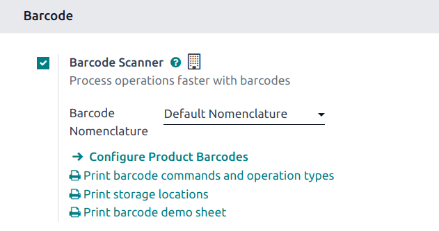
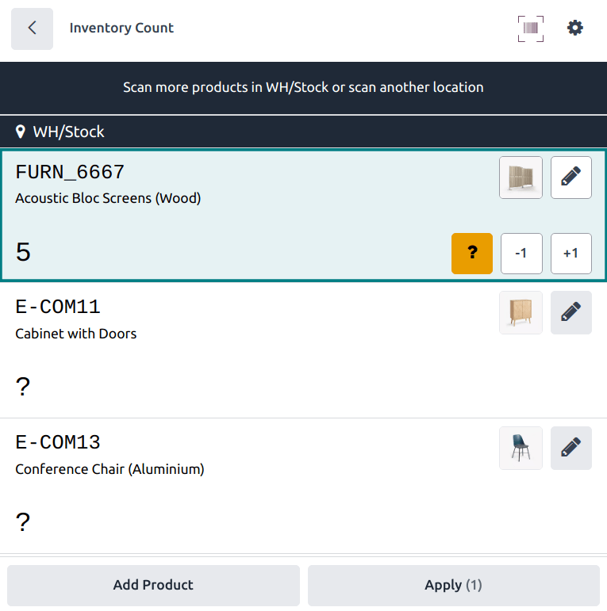
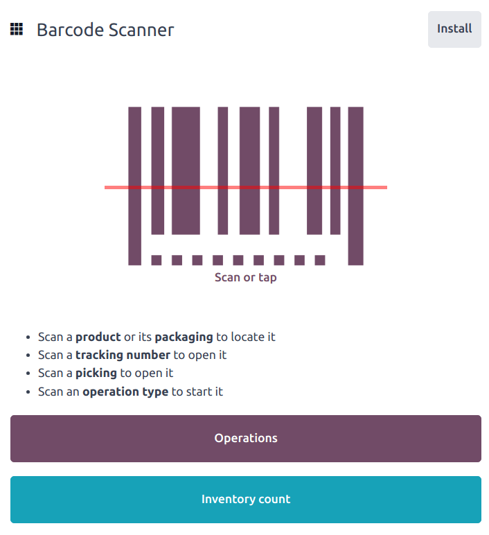
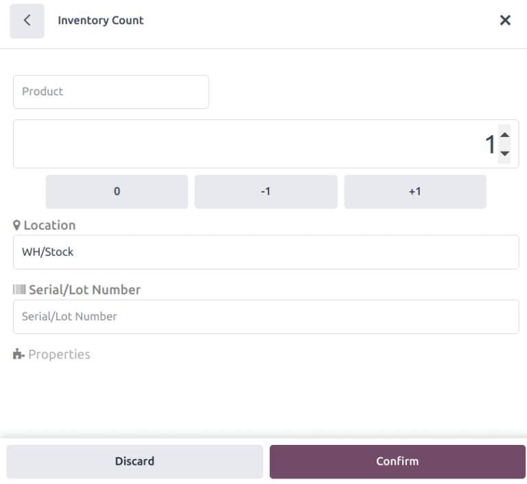

==============================
Adjust inventory with barcodes
==============================

An *inventory adjustment*, or inventory audit, is the process of verifying the physical stock of
products against the quantities recorded in the database. Regular audits ensure accurate inventory
records, prevent stock discrepancies, and maintain efficient operations.

Inventory adjustments can be completed through the **Barcode** application using a compatible
scanner, or the Odoo mobile app.

.. note::
   For a list of Odoo-compatible barcode mobile scanners, and other hardware for the **Inventory**
   and **Barcode** apps, refer to the `Odoo Inventory • Hardware page
   <https://www.odoo.com/app/inventory-hardware>`_.

.. seealso::
   :doc:`../../inventory/warehouses_storage/inventory_management/count_products`

.. tip::
   Odoo's **Barcode** application provides demo data with barcodes to explore the features of the
   app. These can be used for testing purposes, and can be printed from the home screen of the app.

   To access this demo data, navigate to the :menuselection:`Barcode app` and click :guilabel:`stock
   barcodes sheet` and :guilabel:`commands for Inventory` in the information pop-up window above the
   scanner.

   .. image:: adjustments/adjustments-barcode-stock-sheets.png
      :alt: Demo data prompt pop-up on Barcode app main screen.

Preparing for an inventory adjustment
=====================================

Before an inventory adjustment can be performed with the **Barcode** app, the app has to be
installed, and configured. Navigate to the :menuselection:`Inventory app --> Configuration -->
Settings`, and scroll to the :guilabel:`Barcode` section. Tick the checkbox next to
:guilabel:`Barcode Scanner`, and click :guilabel:`Save` to save any changes. If necessary, click
:guilabel:`Confirm` on the pop-up.

.. danger::
   Enabling the **Barcode** feature requires installing the **Barcode** application. Installing a
   new application on a One-App-Free database triggers a 15-day trial. At the end of the trial, if a
   paid subscription has not been added to the database, it will no longer be accessible.

After saving, a new drop-down menu appears under the :guilabel:`Barcode Scanner` option, labeled
:guilabel:`Barcode Nomenclature`, where either :guilabel:`Default Nomenclature` or
:guilabel:`Default GS1 Nomenclature` can be selected. Each nomenclature option determines how
scanners interpret barcodes in Odoo.

Below this is a :icon:`oi-arrow-right` :guilabel:`Configure Product Barcodes` internal link, along
with a set of :guilabel:`Print` buttons for printing barcode commands, storage locations, and a
barcode demo sheet.

.. seealso::
   For more information on setting up and configuring the **Barcode** app, refer to the :doc:`Set up
   your barcode scanner <../setup/hardware>` and :doc:`Activate the Barcodes in Odoo
   <../setup/software>` docs.

Count entire locations
----------------------

The :guilabel:`Count Entire Locations` feature allows users to count all of the products within a
specific location systematically. When scanning a location for an inventory count, the user is
assigned to count all of the products within that location. This allows for easier cycle counts by
assigning an entire location to a user by assigning a single product count. During cycle counts,
users can ensure accurate inventory numbers, see if products that should be in a location are
missing, or discover products incorrectly stored within a location.

To enable this feature, navigate to :menuselection:`Inventory app --> Configuration --> Settings`,
and scroll to the :guilabel:`Barcode` section. Tick the :guilabel:`Count Entire Locations` checkbox,
then click :guilabel:`Save`.

.. important::
   This setting is only visible if the :guilabel:`Storage Locations` checkbox is ticked.

To perform an inventory cont of an entire location, navigate to :menuselection:`Barcode app -->
Inventory Count`,  then scan the desired location barcode. Doing so displays all the products
assigned to the location. :ref:`Proceed with the count <inventory/barcode/conduct-adjustment>` as
normal.

Show quantity to count
----------------------

When conducting an inventory count, the expected quantity of products is displayed by default, to
provide the user with a baseline to use when performing the count. However, as this can result in
users relying on this count instead of performing a new count, this quantity can be hidden.

Navigate to :menuselection:`Inventory app --> Configuration --> Settings`. In the
:guilabel:`Barcode` section, clear the :guilabel:`Show Quantity to Count` checkbox, then click
:guilabel:`Save`.

.. _inventory/barcode/conduct-adjustment:

Conducting an inventory adjustment
==================================

Navigate to the :menuselection:`Barcode app --> Inventory count`.

To begin the adjustment, first scan the *source location*, which is the current location in the
warehouse of the product whose count should be adjusted. Then, scan the product barcodes.

.. tip::
   If the warehouse *multi-location* feature is **not** enabled in the database, a source location
   does not need to be scanned. Instead, scan the product barcode to start the inventory adjustment.

Change the quantity of a product
--------------------------------

The quantity of a product can be changed in multiple ways during an adjustment.

The barcode of a specific product can be scanned multiple times to increase the quantity of that
product in the adjustment.

Alternatively, the quantity can be changed by clicking the :icon:`fa-pencil` :guilabel:`(edit)` icon
on the far right of the product line.

Doing so opens a separate window with a keypad. Edit the number in the :guilabel:`Quantity` line to
change the quantity. Additionally, the :guilabel:`+1` and :guilabel:`-1` buttons can be clicked to
add or subtract quantity of the product, and the number keys can be used to add quantity, as well.

.. example::
   In the below inventory adjustment, the source location `WH/Stock/Shelf 1` was scanned, assigning
   the location. Then, the barcode for the product `[FURN_7888] Desk Stand with Screen` was scanned
   three times, increasing the units in the adjustment. Additional products can be added to this
   adjustment by scanning the barcodes for those specific products.

   .. image:: adjustments/adjustments-barcode-inventory-client-action.png
      :alt: Barcode Inventory Client Action page with inventory adjustment.

Finalize the adjustment
-----------------------

After counting all of the products, review the entries to ensure all the counted quantities are
accurately entered. To complete the inventory adjustment, click :guilabel:`Apply`.

.. tip::
   The :guilabel:`Validate` barcode can be scanned in place of clicking the :guilabel:`Apply`
   button.

Odoo then navigates back to the :guilabel:`Barcode Scanning` screen. A small green banner appears in
the top-right corner, confirming the inventory count has been updated.

Manually add products to an inventory adjustment
================================================

When barcodes for location or products are not available, Odoo **Barcode** can still be used to
perform inventory adjustments.

To do this, navigate to the :menuselection:`Barcode app --> Inventory Count`.

Doing so navigates to the *Barcode Inventory Client Action* page, labeled as :guilabel:`Inventory
Adjustment` in the top header section.

To manually add products to this adjustment, click the white :guilabel:`Add Product` button at the
bottom of the screen.

This navigates to a new, blank page where the desired product, quantity, and source location must be
chosen.

First, click the :guilabel:`Product` line, and choose the product whose stock count should be
adjusted. Then, manually enter the quantity of that product, either by changing the `1` in the
:guilabel:`Quantity` line, or by clicking the :guilabel:`+1` and :guilabel:`-1` buttons to add or
subtract quantity of the product. The number pad can be used to add quantity, as well.

Below the number pad is the :guilabel:`location` line, which should read `WH/Stock` by default.
Click this line to reveal a drop-down menu of locations to choose from, and choose the
:guilabel:`source location` for this inventory adjustment.

Once ready, click :guilabel:`Confirm` to confirm the changes.

To apply the inventory adjustment, click :guilabel:`Apply`.

Once applied, Odoo navigates back to the :guilabel:`Barcode Scanning` screen. A small green banner
appears in the top-right corner, confirming validation of the adjustment.

Requested inventory counts
==========================

After an inventory count is :ref:`assigned <inventory/plan-counts>`, they can be accessed through
the **Barcode** application. To view a requested inventory count, navigate to the
:menuselection:`Barcode app` dashboard. If a count has been requested, the number of products to be
counted is listed on the :guilabel:`Inventory Count` button.

