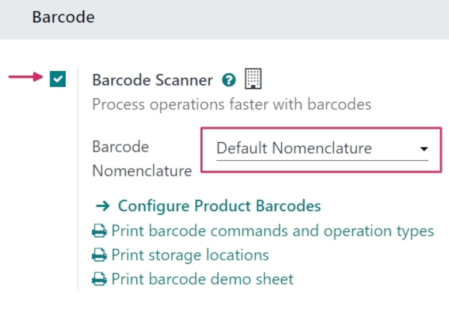
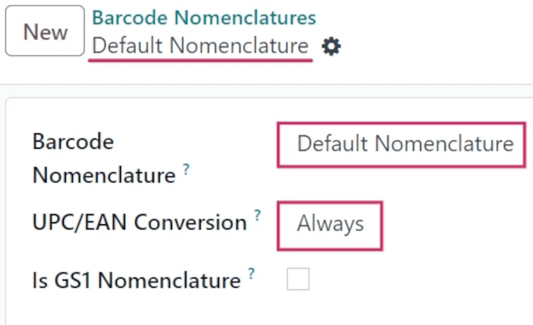
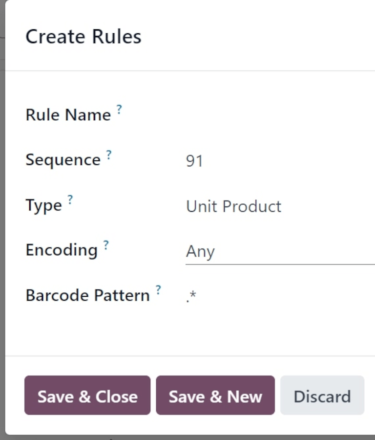

============================
Default barcode nomenclature
============================

.. |UPC| replace:: :abbr:`UPC (Universal Product Code)`
.. |EAN| replace:: :abbr:`EAN (European Article Number)`
.. |GTIN| replace:: :abbr:`GTIN (Global Trade Item Number)`
.. |GTINs| replace:: :abbr:`GTINs (Global Trade Item Numbers)`

*Barcode nomenclatures* define how barcodes are recognized and categorized. When a barcode is
scanned, it is associated to the **first** rule with a matching pattern. The pattern syntax is
described in Odoo's nomenclature list using a regular expression, and a barcode is successfully read
by Odoo if its prefix and/or length matches the one defined in the barcode's rule.

Odoo *Barcode* supports UPC (Universal Product Code), EAN (European Article Number), and GS1
encoding. The pre-configured nomenclatures in Odoo are *Default Nomenclature* and *Default GS1
Nomenclature*. The default nomenclature uses |UPC| and |EAN| encoding, and supports |UPC|/|EAN|
conversion.

.. important::
   |UPC| and |EAN| barcodes **must** be `purchased from GS1
   <https://www.gs1.org/standards/get-barcodes>`_ to use these barcodes. GS1 is the **only**
   official provider of |UPC|/|EAN| and GS1 |GTINs| in the world.

.. _barcode/operations/set-up-nomenclature:

Set up barcode nomenclature
===========================

To use default nomenclature, navigate to :menuselection:`Inventory app --> Configuration -->
Settings`. Under the :guilabel:`Barcode` section, click the checkbox next to :guilabel:`Barcode
Scanner` to enable barcodes. Doing so installs the *Barcode* app in the database.

Next, ensure that the :guilabel:`Default Nomenclature` setting is selected in the :guilabel:`Barcode
Nomenclature` field. Then, click :guilabel:`Save`.

Once the nomenclature is saved and selected, the :menuselection:`Barcode Nomenclatures` settings can
be accessed, via a hidden menu that is **only** discoverable after enabling :ref:`developer mode
<developer-mode>`.

Once developer mode is enabled, navigate to :menuselection:`Inventory app --> Configuration -->
Barcode Nomenclatures` menu, and select :guilabel:`Default Nomenclature`.

From this page, the :guilabel:`Barcode Nomenclature` is specified at the top as the `Default
Nomenclature`.

Under that, the :guilabel:`UPC/EAN Conversion` field is set to :guilabel:`Always`, by default. This
setting determines if a |UPC|/|EAN| barcode should be automatically converted one way or another
when trying to match a rule with the other encoding.

The other available options for this field are :guilabel:`Never`, :guilabel:`EAN-13 to UPC-A`, and
:guilabel:`UPC-A to EAN-13`.

.. important::
   For |UPC|/|EAN| conversion to work for every barcode scanned, the setting in the
   :guilabel:`UPC/EAN Conversion` field **must** be set to :guilabel:`Always`.

The last field at the top of the page is the :guilabel:`Is GS1 Nomenclature` field. For the
:guilabel:`Default Nomenclature`, this field should remain unchecked. This is because the
:guilabel:`Default Nomenclature` uses |UPC| and |EAN| encoding, *not* GS1 encoding.

Further down the page, there is a list showcasing the :guilabel:`Rule Name`, :guilabel:`Type`,
:guilabel:`Encoding`, and :guilabel:`Barcode Pattern` for the *rules* and *barcode patterns* that
Odoo supports for the default nomenclature.

The :ref:`default nomenclature list <barcode/operations/default-nomenclature-list>` contains all the
information that can be condensed with a |UPC|/|EAN| barcode.

.. _barcode/operations/use-upc-ean-barcodes:

Use UPC/EAN barcodes in Odoo
============================

For product identification using |UPC|/|EAN| barcodes in Odoo, businesses **must** obtain `barcodes
<https://www.gs1us.org/upcs-barcodes-prefixes/how-to-get-a-upc-barcode>`_ purchased directly from
GS1.

The |UPC| and |EAN| barcode formats are predominantly used in their own regions. |UPC| is used only
in the United States and Canada, while |EAN| is used everywhere else globally.

A |UPC| is usually a 12-digit barcode used to identify most products, while |EAN| barcodes use
13-digit barcodes to identify products.

|UPC| codes can be converted to |EAN| by prefixing them with a zero. In Odoo, by default,
|UPC|/|EAN| barcodes are automatically converted one way or another when trying to match a rule with
the other encoding.

Refer to the :ref:`default nomenclature list <barcode/operations/default-nomenclature-list>` to see
a comprehensive list of all barcode patterns and rules to follow.

Create rules
------------

|UPC| and |EAN| barcodes contain specific information in the barcode. Scanning these codes from the
:ref:`default nomenclature list <barcode/operations/default-nomenclature-list>` automatically fills
corresponding data in the Odoo database.

Adding new barcode rules to this list ensures that non-standard (:dfn:`user-created`) formats are
interpreted accurately.

To create new rules, first activate :ref:`developer mode <developer-mode>`. Then, navigate to
:menuselection:`Inventory app --> Configuration --> Barcode Nomenclatures`. Select the
:guilabel:`Default Nomenclature` list item.

On the :guilabel:`Default Nomenclature` page, select :guilabel:`Add a line` at the bottom of the
table, which opens a :guilabel:`Create Rules` pop-up window to create a new rule.

The :guilabel:`Rule Name` field is used internally to identify what the barcode represents.

The :guilabel:`Sequence` field represents the priority of the rule; meaning the smaller the value,
the higher the rule appears on the table.

The barcode :guilabel:`Type` field represents different classifications of information that can be
understood by the system (e.g., :guilabel:`Package`, :guilabel:`Lot`, :guilabel:`Location`,
:guilabel:`Coupon`, etc.).

The :guilabel:`Encoding` field specifies which encoding the barcode uses; this rule **only** applies
if the barcode uses this specific encoding. The available :guilabel:`Encoding` options are:
:guilabel:`EAN-13`, :guilabel:`EAN-8`, :guilabel:`UPC-A`, and :guilabel:`GS1-28`.

The :guilabel:`Barcode Pattern` field represents how the sequence of letters or numbers is
recognized by the system to contain information about the product. Odoo follows the sequential order
of this table, and uses the first rule it matches, based on the sequence.

.. note::
   Barcode patterns can also define how numerical values, such as weight or price, are encoded in
   the barcode.

   They are indicated by **{NNN}**, where `N` defines where the number's digits are encoded.
   *Floats* are also supported with the decimals, indicated by `D`, such as **{NNNDD}**.

   In this case, the barcode field on the associated records **must** show these digits as zeros.

After filling in the information, click the :guilabel:`Save & New` button to save the rule, and
instantly start creating another rule. Or, click :guilabel:`Save & Close` to save the rule, and
return to the table of rules.

.. tip::
   When the :guilabel:`Barcode Pattern` field contains `.*`, it means it can contain **any** number
   of characters - those characters being **any** number or type of character.

.. _barcode/operations/default-nomenclature-list:

Default nomenclature list
=========================

The table below contains Odoo's list of :guilabel:`Default Nomenclature` rules. Barcode patterns are
written in regular expressions.

.. list-table::
   :header-rows: 1
   :stub-columns: 1

   * - Rule Name
     - Type
     - Encoding
     - Barcode Pattern
   * - Price Barcodes 2 Decimals
     - Priced Product
     - EAN-13
     - 23.....{NNNDD}
   * - Discount Barcodes
     - Discounted Product
     - Any
     - 22{NN}
   * - Weight Barcodes 3 Decimals
     - Weighted Product
     - EAN-13
     - 21.....{NNDDD}
   * - Customer Barcodes
     - Client
     - Any
     - 042
   * - Coupon & Gift Card Barcodes
     - Coupon
     - Any
     - 043|044
   * - Cashier Barcodes
     - Cashier
     - Any
     - 041
   * - Location barcodes
     - Location
     - Any
     - 414
   * - Package barcodes
     - Package
     - Any
     - PACK
   * - Lot barcodes
     - Lot
     - Any
     - 10
   * - Magnetic Credit Card
     - Credit Card
     - Any
     - %.*
   * - Product Barcodes
     - Unit Product
     - Any
     - .*

.. seealso::
   :doc:`gs1_nomenclature`
