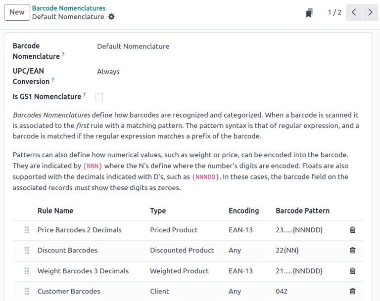

============================
Default barcode nomenclature
============================

.. |UPC| replace:: :abbr:`UPC (Universal Product Code)`
.. |EAN| replace:: :abbr:`EAN (European Article Number)`
.. |GTIN| replace:: :abbr:`GTIN (Global Trade Item Number)`
.. |GTINs| replace:: :abbr:`GTINs (Global Trade Item Numbers)`

*Barcode nomenclatures* define how barcodes are recognized and categorized. When a barcode is
scanned, it is associated to the **first** rule with a matching pattern. The pattern syntax is
described in Odoo's nomenclature list using a regular expression, and a barcode is successfully read
by Odoo if its prefix and/or length matches the one defined in the barcode's rule.

For instance, at a :doc:`Point of Sale <../../../sales/point_of_sale>` station, product weight
barcodes in the European Article Number (EAN) format, which begin with `21` and have five digits
specifying the weight, are used to weigh products and generate a barcode depicting the weight and
price. The `21` and five-digit weight is the barcode pattern used to identify the barcode and can be
customized to ensure Odoo correctly interprets all barcodes for the business.

.. note::
   Barcodes are also commonly used with Odoo's **Inventory** and **Barcode** apps.

Odoo **Barcode** supports |EAN|, Universal Product Code (UPC), and :doc:`GS1 <gs1_nomenclature>`
formats. This document exclusively focuses on :ref:`default rules and patterns in Odoo
<barcode/operations/default-nomenclature-list>`, which use |UPC| and |EAN| encoding.

.. important::
   To use |UPC| and |EAN| barcodes for uniquely identifying products across the entire supply chain,
   they **must** be `purchased from GS1 <https://www.gs1.org/standards/get-barcodes>`_.

   In Odoo, custom barcode patterns can be defined to recognize barcodes specific to the company.
   Barcodes do not need to be purchased if used only within the company, such as in the
   :ref:`example <barcode/operations/product-weight>` where the barcode is written in the |EAN|
   format.

Configuration
=============

To use default nomenclature, navigate to :menuselection:`Inventory app --> Configuration -->
Settings`. Under the :guilabel:`Barcode` section, tick the :guilabel:`Barcode Scanner` checkbox.
Doing so installs the **Barcode** app in the database.

Next, in the :guilabel:`Barcode Nomenclature` field, ensure :guilabel:`Default Nomenclature` is
selected. Then, click :guilabel:`Save`.

With the **Barcode** module installed, and the :guilabel:`Default Nomenclature` selected, the
barcode actions using |UPC| and |EAN|, detailed in the :ref:`default nomenclature list
<barcode/operations/default-nomenclature-list>`, are available for use. And, by default, Odoo
automatically handles |UPC|/|EAN| conversion.

.. _barcode/operations/product-weight:

Example: product weight barcode
===============================

To better understand how barcode nomenclature is used to identify products in Odoo, this example
where product weight barcodes in |EAN| format are used to allow a :doc:`Point of Sale
<../../../sales/point_of_sale>` business to automatically print barcodes, and calculate the price
using the weight of the item.

To set up barcodes for weighted products, the following rule is used:

.. list-table::
   :header-rows: 1

   * - Rule Name
     - Barcode Pattern
     - Field in Odoo
   * - Weighted Barcodes 3 Decimals
     - (21)....{NNDDD}
     - :guilabel:`Barcode` field on product form

.. example::
   To better understand the barcode pattern for weighted products, consider the barcode,
   `2112345000008`:

   - `21`: code that identifies this a barcode for weighted products.
   - `12345`: five digits (denoted by `.....` in the table above) that identify the product.
   - `00000`: five digits (denoted by `{NNDDD}` in the table) representing the weight of the
     product. On the product form, the five weight values **must** be `00000`. The first two digits
     are whole number values, and the last three digits are decimal values. For example, "13.5
     grams" in the `{NNDDD}` format is `13500`.
   - `8`: `check digit <https://www.gs1.org/services/check-digit-calculator>`_ for `211234500000`.

   Together, these components make up a 13-character |EAN| - 13 barcode.

To configure the product barcode for `Pasta Bolognese`, the |EAN| barcode for weighted products,
`2112345000008`, is entered in the :guilabel:`Barcode` field on the product form (accessible by
going to :menuselection:`Inventory app --> Products --> Products`, and selecting the desired
product). In addition, the :guilabel:`Unit of Measure` is set to :guilabel:`kg`.

.. image:: barcode_nomenclature/barcode.png
   :align: center
   :alt: Barcode field on the product form.

Next, a customer's bowl of pasta is weighed to be `1.5` kilograms. This generates a new barcode for
the pasta, according to the weight: `211234501500`, which has a check digit of `2`. The new barcode
is `2112345015002`.

Ensure the products scan properly, by navigating to the :menuselection:`Barcode app --> Operations`.
Next, click any operation type, such as :guilabel:`Receipts`. Then, click the :guilabel:`New` button
to create a draft stock move. Scan the product weight barcode, such as `2112345015002`, and if the
intended product appears, the barcode setup is correct.

Create rules
============

.. important::
   Adding new rules is necessary for |UPC| and |EAN| formats that are **not** in Odoo's default
   list, since barcodes cannot be read successfully if there are unknown fields.

    While new rules can be created, Odoo fields do **not** auto-populate with information from these
    rules. `Custom development <https://www.odoo.com/appointment/132>`_ is required for this
    functionality.

To create a rule, first enable :ref:`developer mode <developer-mode>`. Then, navigate to
:menuselection:`Inventory app --> Configuration --> Barcode Nomenclatures`, and select
:guilabel:`Default Nomenclature`.

On this page, configure the following optional fields:

- :guilabel:`UPC/EAN Conversion`: determines if a |UPC|/|EAN| barcode should be automatically
  converted when matching a rule with another encoding. Options include :guilabel:`Always` (the
  default option), :guilabel:`Never`, :guilabel:`EAN-13 to UPC-A`, and :guilabel:`UPC-A to EAN-13`.
- :guilabel:`Is GS1 Nomenclature`: ensure this checkbox is **not** ticked, as the
  :guilabel:`Default Nomenclature` uses |UPC| and |EAN| encoding, *not* GS1 encoding.

On the :guilabel:`Default Nomenclature` page, click :guilabel:`Add a line` at the bottom of the
table, which opens a :guilabel:`Create Rules` pop-up window to create a new rule.

The :guilabel:`Rule Name` field is used internally to identify what the barcode represents.

The :guilabel:`Sequence` field represents the priority of the rule; meaning the smaller the value,
the higher the rule appears on the table.

The barcode :guilabel:`Type` field represents different classifications of information that can be
understood by the system (e.g., :guilabel:`Package`, :guilabel:`Lot`, :guilabel:`Location`,
:guilabel:`Coupon`, etc.).

The :guilabel:`Encoding` field specifies which encoding the barcode uses. This rule **only** applies
if the barcode uses this specific encoding. The available :guilabel:`Encoding` options are:
:guilabel:`EAN-13`, :guilabel:`EAN-8`, :guilabel:`UPC-A`, and :guilabel:`GS1-28`.

The :guilabel:`Barcode Pattern` field represents how the sequence of letters or numbers is
recognized by the system to contain information about the product. Sometimes, when a certain amount
of digits are required, the number of `.` is shown. `N` represents whole number digits, and `D`
represent decimal digits.

.. example::
   `1...` represents any 4-digit number that starts with 1. `NNDD` represents a two digit number
   with two decimal points. For example, `14.25` is 1425.

After filling in the information, click the :guilabel:`Save & New` button to save the rule, and
instantly start creating another rule. Or, click :guilabel:`Save & Close` to save the rule, and
return to the table of rules.

.. _barcode/operations/default-nomenclature-list:

Default nomenclature list
=========================

The table below contains Odoo's list of :guilabel:`Default Nomenclature` rules. Barcode patterns are
written in regular expressions.

.. list-table::
   :header-rows: 1
   :stub-columns: 1

   * - Rule Name
     - Type
     - Encoding
     - Barcode Pattern
   * - Price Barcodes 2 Decimals
     - Priced Product
     - EAN-13
     - 23.....{NNNDD}
   * - Discount Barcodes
     - Discounted Product
     - Any
     - 22{NN}
   * - Weight Barcodes 3 Decimals
     - Weighted Product
     - EAN-13
     - 21.....{NNDDD}
   * - Customer Barcodes
     - Client
     - Any
     - 042
   * - Coupon & Gift Card Barcodes
     - Coupon
     - Any
     - 043|044
   * - Cashier Barcodes
     - Cashier
     - Any
     - 041
   * - Location barcodes
     - Location
     - Any
     - 414
   * - Package barcodes
     - Package
     - Any
     - PACK
   * - Lot barcodes
     - Lot
     - Any
     - 10
   * - Magnetic Credit Card
     - Credit Card
     - Any
     - %.*
   * - Product Barcodes
     - Unit Product
     - Any
     - .*

.. note::
   When the :guilabel:`Barcode Pattern` contains `.*`, it means it can contain any number or type of
   characters.

.. seealso::
   :doc:`gs1_nomenclature`
