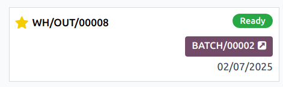

=======================
Process batch transfers
=======================

The Odoo **Barcode** app can be used to process *Batch*, *Wave*, and *Cluster* transfers that are
created in the **Inventory** app.

.. seealso::
   This document covers the steps to process transfers in the **Barcode** app. Instructions on
   creating transfers can be found below:

   - :doc:`../../inventory/shipping_receiving/picking_methods/batch`
   - :doc:`../../inventory/shipping_receiving/picking_methods/wave`
   - :doc:`../../inventory/shipping_receiving/picking_methods/cluster`

Process the batch
-----------------

First, navigate to :menuselection:`Barcode app --> Operations` and select an operation type (like
delivery orders) grouped into batches. From here, select the card for the appropriate batch
transfer, and click the :guilabel:`BATCH` smart button.

On the batch transfer screen, the products in the picking are grouped by location, and each line is
color-coded to associate products in the same picking together.

Then, follow the prompt to :guilabel:`Scan the source location` barcode for the storage location of
the first product. Scan the barcode for the product and package to process the transfer. To record
multiple quantities, click the :icon:`fa-pencil` :guilabel:`(edit)` icon, and enter the required
quantities for the picking.

Repeat this for all products, and click the :guilabel:`Validate` button to mark the transfer as
:guilabel:`Done`.

.. note::
   After creating a batch transfer and assigning a package to a picking, Odoo suggests the specified
   package by displaying the name *in italics* under the product name, ensuring pickers place
   products into the correct boxes.

   Products from the same order are labeled with the same color on the left. Completed pickings are
   highlighted in green.

.. example::
   In a batch transfer for 2 `Cabinet with Doors`, 3 `Acoustic Bloc Screens`, and 4 `Four Person
   Desks`, the `3/3` and `4/4` :guilabel:`Units` indicate that the last two product pickings are
   complete.

   `1/2` units of the `Cabinet with Doors` has already been picked, and after scanning the product
   barcode for the second cabinet, Odoo prompts the user to `Scan a serial number` to record the
   unique serial number for :ref:`product tracking <inventory/product_management/enable-lots>`.

   .. image:: process_transfers/batch-products.png
      :alt: Products to be picked in barcode view.
