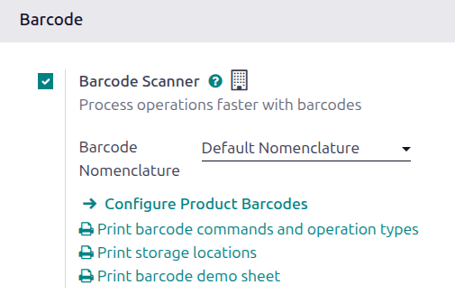
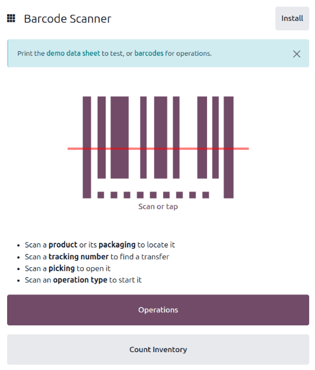
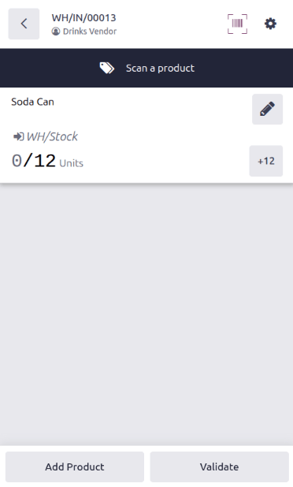
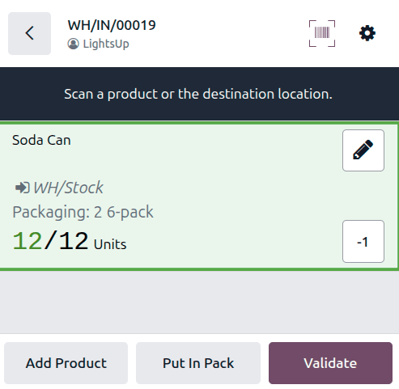
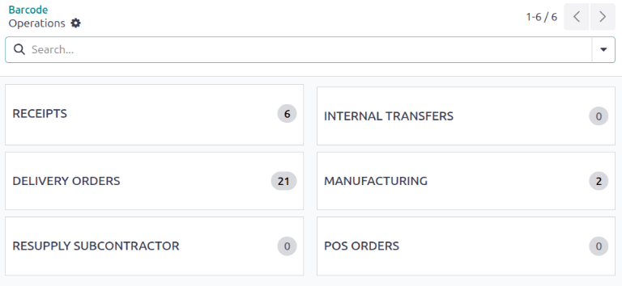
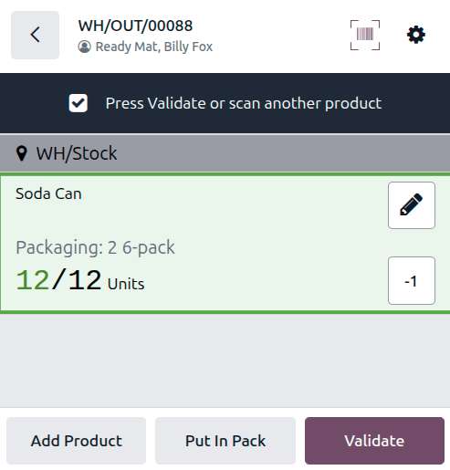

=============================================
Process receipts and deliveries with barcodes
=============================================

.. _barcode/operations/intro:

.. |PO| replace:: :abbr:`PO (Purchase Order)`
.. |SO| replace:: :abbr:`SO (Sales Order)`

The **Barcode** app can be used to process receipts, deliveries, and other types of operations in
real time using a barcode scanner or the Odoo mobile app.

This allows operations on the warehouse floor to be processed in real time, rather than
waiting to validate transfers from a computer. This real-time processing ensures barcodes are
accurately assigned to the correct products, packages, packaging, transfers, locations, and more.
This helps reduce errors and keeps inventory data in sync.

Enable Barcode app
==================

To use the **Barcode** app to process transfers, it must be installed by enabling the feature from
the settings of the **Inventory** app.

To do so, navigate to :menuselection:`Inventory app --> Configuration --> Settings`. Then, scroll
down to the *Barcode* section, and select the checkbox next to the :guilabel:`Barcode Scanner`
feature.

After selecting the checkbox, click :guilabel:`Save` at the top of the page to save changes.

After the page has refreshed, a new option is displayed under the :guilabel:`Barcode Scanner`
feature: :guilabel:`Barcode Nomenclature` (with a corresponding drop-down menu). Select either:

- :guilabel:`Default Nomenclature`: The barcode actions using UPC and EAN, detailed in the default
  nomenclature list, are available for use. By default, Odoo automatically handles UPC/EAN
  conversion.
- :guilabel:`Default GS1 Nomenclature`: Scan barcodes of sealed boxes and identify essential product
  information, such as Global Trade Item Numbers (GTINs), lot number, quantity information, and
  more.

There is also an internal link arrow to :guilabel:`Configure Product Barcodes`, a set of
:guilabel:`Print` buttons for printing barcode commands and operation types, and a barcode demo
sheet.

.. seealso::
   - :doc:`barcode_nomenclature`
   - :doc:`gs1_nomenclature`
   - :doc:`../setup/hardware`
   - :doc:`../setup/software`

.. _barcode/operations/scan-received-products:

Scan barcodes for receipts
==========================

Purchase orders (POs) are used to process warehouse receipts for incoming products, packages, and
product packagings. First, create a request for quotation, then confirm it to create a |PO|.

.. seealso::
   :doc:`../../purchase/manage_deals/rfq`

To process and scan barcodes for warehouse receipts, navigate to the **Barcode** app.

Once inside the **Barcode** app, a :guilabel:`Barcode Scanner` screen displaying different options
is presented.

To process receipts, click the :guilabel:`Operations` button at the bottom of the screen. The
*Operations* overview page opens.

From this page, tap the :guilabel:`Receipts` card to view all outstanding receipts. Then, select the
desired receipt operation to process. This navigates to the barcode transfer screen.

.. note::
   If *only* using a barcode scanner or the Odoo mobile app, scan each barcode transfer for the
   corresponding operation type to process them. Once scanned, the products that are part of an
   existing transfer can be scanned, and new products can be added to the transfer, as well. Once
   all products have been scanned, validate the transfer to proceed with the stock moves.

From this screen, an overview of all receipts to process within that transfer (**WH/IN/000XX**) is
shown. At the bottom of the screen, there are options to :guilabel:`Add Product` or
:guilabel:`Validate`, depending on whether products need to be added to the operation or if the
whole operation should be validated at once. If the *Packages* setting is enabled in the Inventory
settings, the :guilabel:`Put in Pack` button is also available. If :doc:`quality checks
<../../quality/quality_management/quality_checks>` are required for a product, the
:guilabel:`Quality Checks` button displays.

To process and scan each product individually, scan a product, package, or product packaging, or
choose a specific product line. Click the :guilabel:`+#` button (for example, `+10`) to indicate
receipt of that product.

.. example::
   A |PO| is created for `20` `Bolts` and `2` `Cabinet with Doors` products. There are two packages
   (**PACK000002** and **PACK000003**) for the incoming products, each containing 10 Bolts and 1
   Cabinet with Doors.

   A warehouse employee scans the **PACK000003** barcode. 10 Bolts and 1 Cabinet with Doors are
   processed.

   .. image:: receipts_deliveries/example-scan-package.png
      :alt: A warehouse order is partially processed when scanning a package.

Editing a product line
----------------------

To manually adjust received quantities for a product, click the :icon:`fa-pencil`
:guilabel:`(pencil)` icon to open a new screen to edit that product line.

On this screen, the product that is being received is listed. Under the product name, edit the
:guilabel:`Quantity` line. Change the `0.00` in the line to the desired quantity, or click the
:guilabel:`+#` button (for example, `+12`) to automatically fill the quantity ordered from the |PO|.

Additionally, click the :guilabel:`+1` and :guilabel:`-1` buttons to add or subtract a quantity of
the product. Click the product packaging button (for example, `6-pack`) to add a product packaging.

Below the quantity buttons is the :guilabel:`Destination Location` line, which reads `WH/Stock` by
default, unless another *location* is listed on the product itself. Click this line to reveal a
drop-down menu of additional locations to choose from.

When the *Packages* feature is enabled in the **Inventory** app's settings, the following fields
appear:

- :guilabel:`Source Package`: If incoming products are part of their own source package, select or
  create the package.
- :guilabel:`Destination Package`: If the products should be stored in a package in inventory,
  select or create the package.
- :guilabel:`Destination Container Package`: If a package must be nested inside another
  (pack-in-pack), select or create the parent package. See
  :doc:`../../inventory/product_management/configure/pack_in_pack` for more details.

When ready, click :guilabel:`Confirm` to confirm the changes made to the product line.

.. example::
   In the reception operation `WH/IN/00019`, `12 Units` of the `Soda Can` product are expected to be
   received. `[SODA-SINGLE-CAN]` is the barcode set on the product form. Warehouse employees can
   scan the barcode of the `Soda Can` product to receive one unit, or because they can be purchased
   in 6-pack packaging, they can scan the packaging barcode. Alternatively, they can click the
   :icon:`fa-pencil` :guilabel:`(pencil)` icon to manually enter the received quantities.

   .. image:: receipts_deliveries/receipts-deliveries-product-line-editor.png
      :alt: Product line editor for individual transfer in Barcode app.

Validating the transfer
-----------------------

If not all products were scanned or manually entered from the pencil icon, click the :guilabel:`+#`
button on the product line for the products being received, or scan the product, package, or product
packaging barcode.

Finally, click :guilabel:`Validate`. The receipt is processed, and the **Barcode** app can be
closed.

Scan barcodes for delivery orders
=================================

To process warehouse deliveries for outgoing products, a sales order (SO) must be created to create
a delivery operation to process. First, create a quotation, then confirm it to create the |SO|.

.. seealso::
   :doc:`../../../sales/sales/sales_quotations/create_quotations`

To process and scan barcodes for warehouse deliveries, navigate to the :menuselection:`Barcode` app.

In the **Barcode** app, a :guilabel:`Barcode Scanner` screen opens, displaying different options. To
process deliveries, click the :guilabel:`Operations` button at the bottom of the screen. This opens
an *Operations* overview page.

On this page, click the :guilabel:`Delivery Orders` card to view all outstanding deliveries.

Select the desired delivery order to process. This navigates to the barcode transfer screen.

On this screen, first scan the source location of the products to deliver. Then, review the overview
of all products, packages, and packagings to process within that transfer (**WH/OUT/000XX**). At the
bottom of the screen, there are buttons to :guilabel:`Add Product` or :guilabel:`Validate`,
depending on whether products need to be added to the operation or if the whole operation should be
validated at once.

To process and scan each product individually, choose a specific product line. Scan a product,
package, or product packaging, or click the :guilabel:`+#` (for example, `+6`) button to indicate
delivery of that product.

Editing a product line
----------------------

To manually adjust quantities for a product, click the :icon:`fa-pencil` :guilabel:`(pencil)` icon
to open a new screen to edit that product line.

The product that's being delivered is listed on this screen. Under the product name, edit the
:guilabel:`Quantity` line. Change the `0.00` in the line to the desired quantity, or click the
:guilabel:`+#` button (for example, `+6`) to automatically fill the quantity ordered from the |SO|.
If the product is sold in a packaging, click the packaging button (for example, `6-pack`).
Alternatively, click the :guilabel:`+1` and :guilabel:`-1` buttons to add or subtract a quantity of
the product.

When the *Packages* feature is enabled in the **Inventory** settings, the following fields appear:

- :guilabel:`Source Package`: If outgoing products should be picked from a package in inventory,
  select or create the package.
- :guilabel:`Destination Package`: If the products should be stored in a package before delivery,
  select or create the package.
- :guilabel:`Destination Container Package`: If a package must be nested inside another
  (pack-in-pack), select or create the parent package. See
  :doc:`../../inventory/product_management/configure/pack_in_pack` for more details.

The :guilabel:`Quantity in Stock` section lists the locations from which products can be picked. The
selected location is the location from which the product is being pulled for delivery. Click this
line to reveal a menu of additional locations to choose from (if this product is stored in multiple
locations in the warehouse).

.. tip::
   For warehouses with multiple different storage locations, putaway rules, and removal strategies,
   additional steps can be added for various operation types while using the **Barcode** app.

When ready, click :guilabel:`Confirm` to confirm the changes made to the product line.

Validating the delivery
-----------------------

If not all products, packages, or product packagings have been scanned or entered on the overview
page, scan the products, packages, or packagings, or click the :guilabel:`+#` button on the product
line for the products. Finally, click :guilabel:`Validate`. The delivery is processed, and the
**Barcode** app can be closed.

