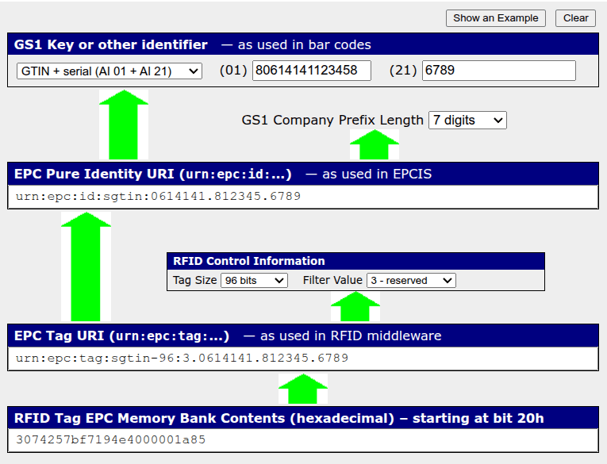

==================
Retrieve EPC codes
==================

.. |EPC| replace:: :abbr:`EPC (electronic product code)`
.. |RFID| replace:: :abbr:`RFID (radio frequency identification)`
.. |GS1| replace:: :abbr:`GS1 (Global Standards 1)`

Electronic product codes (|EPC|) are globally unique identifiers assigned to specific products,
allowing items to be distinguished at the individual level. These identifiers support accurate
inventory management by enabling faster cycle counts, streamlined adjustments, and more precise
stock control.

After EPCs are :ref:`obtained <barcode/operations/retrieve_epcs_gs1>` from |GS1|, they are
:ref:`encoded <barcode/operations/write_epcs>` onto |RFID| tags, which are then applied to products
and used throughout the inventory process.

.. seealso::
    Set up :doc:`../setup/rfid`

.. important::
    If using Odoo 18, |GS1|'s Encoder/Decoder tool **must** be used to retrieve EPCs.

.. _barcode/operations/retrieve_epcs_gs1:

Retrieving EPCs from GS1
========================

To retrieve an EPC to encode on a tag, use `GS1's EPC Encoder/Decoder tool
<https://www.gs1.org/services/epc-encoderdecoder>`__.

#. Enter the GTIN-14 barcode of the product in the application identifier :guilabel:`(01)` field.
#. Enter the product's serial number in the :guilabel:`(21)` field.
#. Specify a company prefix length.
#. Specify the size of the tag and its filter value.

.. _barcode/operations/write_epcs:

Writing EPCs to RFID tags
=========================

After retrieving the EPCs, you can use an RFID writer to write the EPCs onto RFID tags. The process
to write EPCs varies by RFID writer manufacturer. Refer to the RFID writer's documentation for more
information.

.. seealso::
    - :doc:`gs1_nomenclature`
    - :doc:`gs1_usage`
    - :doc:`adjustments`
