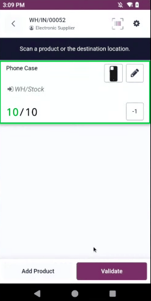
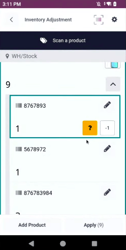

==========================
Manage inventory with RFID
==========================

Managing inventory with an RFID barcode scanner is possible with the **Barcodes** app and a physical
RFID scanner.

Make sure the RFD40 scanner is paired and connected to the mobile computer or smartphone. Open an
operation (like a receipt, transfer, delivery order, or manufacturing order), or count inventory
using the RFID scanner. Scanning an existing operation barcode pulls up the relevant inventory or
manufacturing documents in Odoo on the mobile device.

Overview of the workflow
========================

With the RFD40 scanner in hand, open the **Barcode** app on the computer or phone. Open the
operation record (via the **Barcode** interface or scanning the operation barcode), or open the
:guilabel:`Inventory count` operation. Scan the RFID barcodes for the product.

.. seealso::
   :doc:`../setup/operation_types`

To begin managing inventory using RFID tags, open the **Barcode** app on the smart device.

.. _inventory/barcode/rfid_manage:

Manage inventory
================

From the **Barcode** app, scan the operation barcode or tap the :guilabel:`Operations` button to
open operations for receipts, internal transfers, delivery orders, or manufacturing orders. If the
reading device is not connected, Odoo will automatically connect to the device. When the device is
connected, a toast notification appears on the screen that verifies the connection. Scan the
products, then validate the scan on the mobile computer or smartphone.

.. _inventory/barcode/rfid_count:

Counting inventory
==================

It is required by many factories and warehouses to keep track of inventory, including regular counts
of products to ensure all records are correct. To change the amount of a product in stock, or adjust
inventory, open the :guilabel:`Inventory count` operation. Scan the products to count. If necessary,
verify the count manually. You can update the count by clicking the :icon:`fa-pencil`
:guilabel:`(edit)` icon. Click :guilabel:`Apply` to apply the count on the smart device.

