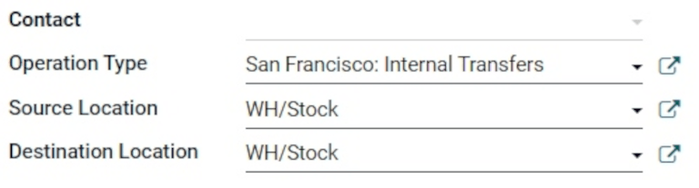
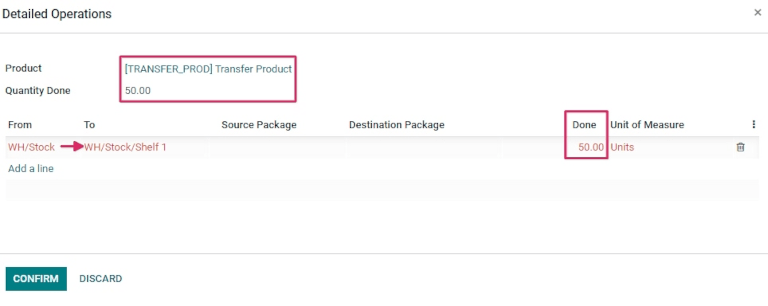
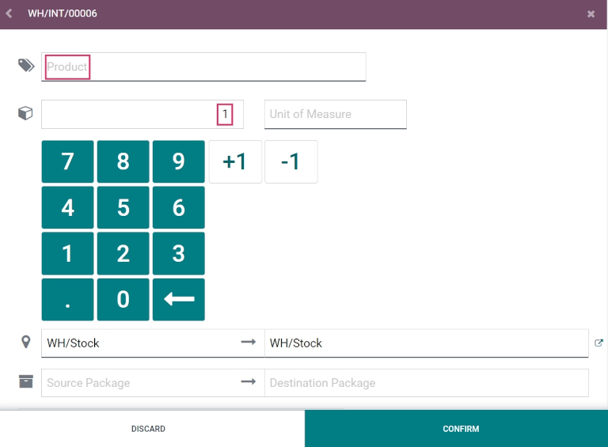

==========================================
Create and process transfers with barcodes
==========================================

The *Barcode* app can be used to process internal transfers for all types of products, including
transfers for products tracked using lots or serial numbers. Transfers can be created from scratch
in real time using an Odoo-compatible barcode scanner or the Odoo mobile app.

For a list of Odoo-compatible barcode mobile scanners, and other hardware for the *Inventory* app,
refer to the `Odoo Inventory • Hardware page <https://www.odoo.com/app/inventory-hardware>`_.

Enable Barcode app
==================

To use the *Barcode* app to process transfers, it must be installed by enabling the feature from the
settings of the *Inventory* app.

To do so, go to the :menuselection:`Inventory app --> Configuration --> Settings`. Then, scroll down
to the :guilabel:`Barcode` section, and click the checkbox next to the :guilabel:`Barcode Scanner`
feature.

Once the checkbox is ticked, click :guilabel:`Save` at the top of the page to save changes.

When the page has refreshed, new options are displayed under the :guilabel:`Barcode Scanner`
feature: :guilabel:`Barcode Nomenclature` (with a corresponding drop-down menu), where either
:guilabel:`Default Nomenclature` or :guilabel:`Default GS1 Nomenclature` can be selected. The
nomenclature selected changes how scanners interpret barcodes in Odoo.

There is also a :guilabel:`Configure Product Barcodes` internal link arrow, and a set of
:guilabel:`Print` buttons for printing barcode commands and a barcode demo sheet.

.. image:: transfers_scratch/transfers-scratch-enabled-barcode-setting.png
   :align: center
   :alt: Enabled Barcode feature in Inventory app settings.

For more on setting up and configuring the :guilabel:`Barcode` app, refer to the :doc:`Set up your
barcode scanner <../setup/hardware>` and :doc:`Activate the Barcodes in Odoo <../setup/software>`
documentation pages.

Scan barcodes for internal transfers
====================================

To create and process internal transfers for products in a warehouse, the :guilabel:`Storage
Locations` and :guilabel:`Multi-Step Routes` features **must** be enabled.

To do so, go to the :menuselection:`Inventory app --> Configuration --> Settings`. Then, scroll down
to the :guilabel:`Warehouse` section, and click the checkboxes next to :guilabel:`Storage Locations`
and :guilabel:`Multi-Step Routes`.

Then, click :guilabel:`Save` at the top of the page to save changes.

Create an internal transfer
---------------------------

To process existing internal transfers, there first needs to be an internal transfer created, and an
operation to process.

To create an internal transfer, navigate to the :menuselection:`Inventory app`. From the
:guilabel:`Inventory Overview` dashboard, locate the :guilabel:`Internal Transfers` card, and click
on the :guilabel:`0 To Process` button.

Then, click :guilabel:`Create` in the top left of the resulting page. This navigates to a new
:guilabel:`Internal Transfer` form.

On this blank form, the :guilabel:`Operation Type` is automatically listed as :guilabel:`Internal
Transfers`. Under that field, the :guilabel:`Source Location` and :guilabel:`Destination Location`
are set as :guilabel:`WH/Stock` by default, but can be changed to whichever locations the products
are being moved from, and moved to.

Once the desired locations have been selected, products can be added to the transfer. On the
:guilabel:`Product` line under the :guilabel:`Products` tab, click :guilabel:`Add a product`, and
select the desired product(s) to add to the transfer.

Once ready, click :guilabel:`Save` at the top of the form to save the new internal transfer. Once
saved, click the :guilabel:`Detailed Operations` icon (four lines, at the far right of the
:guilabel:`Product` line) to open the :guilabel:`Detailed Operations` pop-up window.

From the pop-up, click :guilabel:`Add a line`.

Then, in the :guilabel:`To` column, change the location from :guilabel:`WH/Stock` to a different
location, where the products should be moved.

Next, in the :guilabel:`Done` column, change the quantity to the desired quantity to transfer. Once
ready, click :guilabel:`Confirm` to close out the pop-up window.

Scan barcodes for internal transfer
-----------------------------------

To process and scan barcodes for internal transfers, navigate to the :menuselection:`Barcode app`.

Once inside the :guilabel:`Barcode app`, a :guilabel:`Barcode Scanning` screen displaying different
options is presented.

To process internal transfers, click on the :guilabel:`Operations` button at the bottom of the
screen. This navigates to an :menuselection:`Operations` overview page.

.. image:: transfers_scratch/transfers-scratch-barcode-app.png
   :align: center
   :alt: Barcode app start screen with scanner.

From this page, locate the :guilabel:`Internal Transfers` card, and click the :guilabel:`# To
Process` button to view all outstanding internal transfers. Then, select the desired operation to
process. This navigates to the barcode transfer screen.

.. note::
   When using the *Barcode* app without the *Inventory* app (**only** if using a barcode scanner or
   the Odoo mobile app), the barcodes for each transfer of a corresponding operation type can be
   scanned to be processed easily.

   Once scanned, the products that are part of an existing transfer can be scanned, and new products
   can be added to the transfer, as well. Once all products have been scanned, validate the transfer
   to proceed with the stock moves.

From this screen, an overview of all products to process within that specific internal transfer
(**WH/INT/000XX**) is shown. At the bottom of the screen, there are options to :guilabel:`Add
Product` or :guilabel:`Validate`, depending on if products need to be added to the operation, or if
the whole operation should be validated at once.

.. image:: transfers_scratch/transfers-scratch-receipts-overview.png
   :align: center
   :alt: Overview of receipts in transfer to scan.

Then, scan the barcode of the product to process the internal transfer.

Or, to process and scan each product individually, choose a specific product line. The
:guilabel:`+ 1` button can be clicked to add additional quantity of that product to the transfer, or
the :guilabel:`pencil icon` can be clicked to open a new screen to edit that product line.

In the product's pop-up window, the product and the units to process is displayed with a number pad.
Under the product name, the :guilabel:`Quantity` line can be edited. Change the number in the line
to the quantity listed to be transferred on the internal transfer form.

.. example::
   In the internal transfer operation `WH/INT/000XX`, `50 Units` of the `Transfer Product` is
   moved from `WH/Stock` to `WH/Stock/Shelf 1`. `[TRANSFER_PROD]` is the :guilabel:`Internal
   Reference` set on the product form. Scan the barcode of the `Transfer Product` to receive one
   unit. Afterwards, click the :guilabel:`pencil icon` to manually enter the transferred quantities.

   .. image:: transfers_scratch/transfers-scratch-product-line-editor.png
      :align: center
      :alt: Product line editor for individual transfer in Barcode app.

Additionally, the :guilabel:`+1` and :guilabel:`-1` buttons can be clicked to add or subtract
quantity of the product, and the number keys can be used to add quantity, as well.

Below the number keys are the two :guilabel:`location` lines, which read whichever locations were
previously specified on the internal transfer form, in this case `WH/Stock` and `WH/Stock/Shelf 1`.
Click these lines to reveal a drop-down menu of additional locations to choose from.

Once ready, click :guilabel:`Confirm` to confirm the changes made to the product line.

Then, from the overview page with all products to process within that transfer (**WH/INT/000XX**),
click :guilabel:`Validate`. The receipt has now been processed, and the *Barcode* app can be closed
out.

.. tip::
   The *Barcode* app can also be used to scan products in internal transfers containing unique lot
   numbers and serial numbers.

   From the barcode transfer screen, scan the barcode of a lot or serial number, and Odoo
   automatically increases the quantity of the product to the quantity recorded in the database. If
   the same lot or serial number is shared between different products, scan the product barcode
   first, then the barcode of the lot/serial number.

Create a transfer from scratch
==============================

In addition to processing and scanning barcodes for existing, previously-created internal transfers,
the *Barcode* app can also be used to create transfers from scratch, simply by scanning a printed
operation type barcode.

.. admonition:: Did you know?

   Odoo's *Barcode* application provides demo data with barcodes to explore the features of the app.
   These can be used for testing purposes, and can be printed from the home screen of the app. To
   access this demo data, navigate to the :menuselection:`Barcode app` and click :guilabel:`stock
   barcodes sheet` (bolded and highlighted in blue) in the information pop-up above the scanner.

   .. image:: transfers_scratch/transfers-scratch-demo-data.png
      :align: center
      :alt: Demo data prompt pop-up on Barcode app main screen.

To do this, first navigate to the :menuselection:`Barcode app`. Once inside the *Barcode* app, a
:guilabel:`Barcode Scanning` screen displaying different options is presented.

From this screen, when using a USB or bluetooth barcode scanner, directly scan the product barcode.

When using a smartphone as the barcode scanner, click the :guilabel:`Tap to Scan` button (next to
the camera icon, at the center of the screen). This opens a :guilabel:`Barcode Scanner` pop-up
screen that enables the camera of the device being used.

Face the camera toward the printed operation type barcode to scan it. Doing so processes the
barcode, and navigates to a barcode transfer screen.

From this screen, an overview of all products to process within that specific internal transfer
(**WH/INT/000XX**) is shown. Since this is a new transfer created from scratch, however, there
should not be any products listed on the page.

To add products, scan the product barcode. If the barcode is not available, manually enter the
product into the system by clicking the :guilabel:`Add Product` button at the bottom of the screen,
and add the products and product quantities that should be transferred.

Once ready, click :guilabel:`Confirm` to confirm the changes made to the product line.

Then, from the overview page with all products to process within that transfer (**WH/INT/000XX**),
click :guilabel:`Validate`. The internal transfer has now been processed, and the *Barcode* app can
be closed out.
