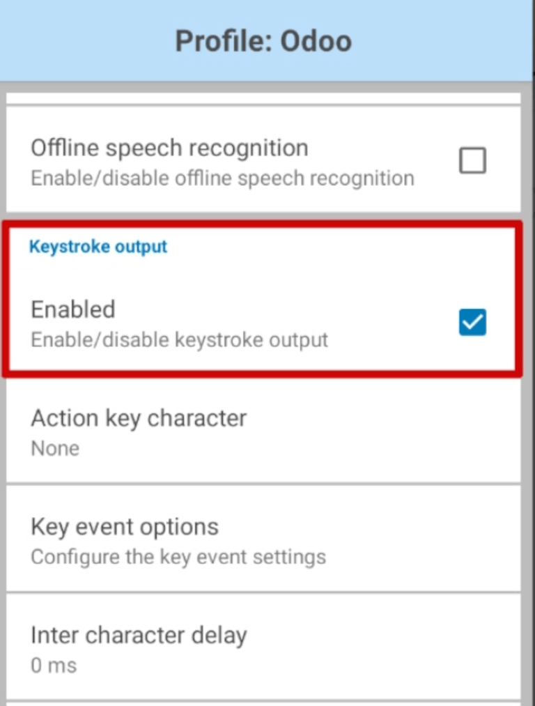
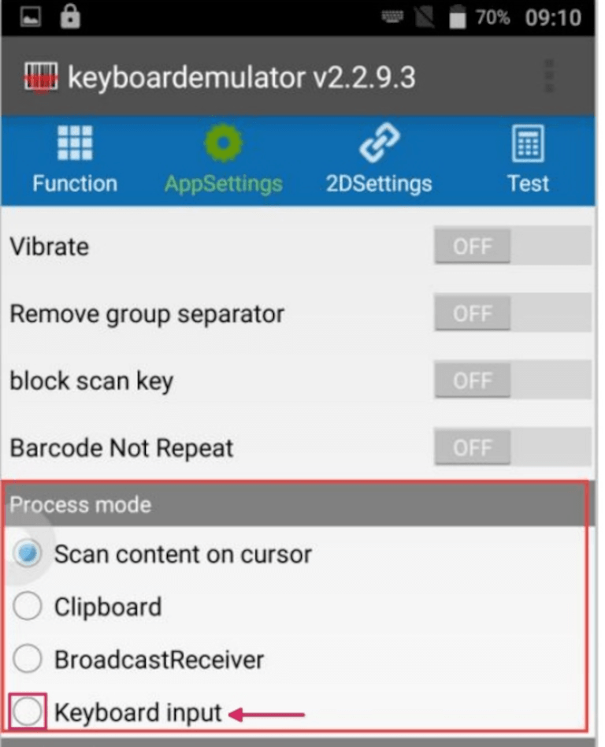
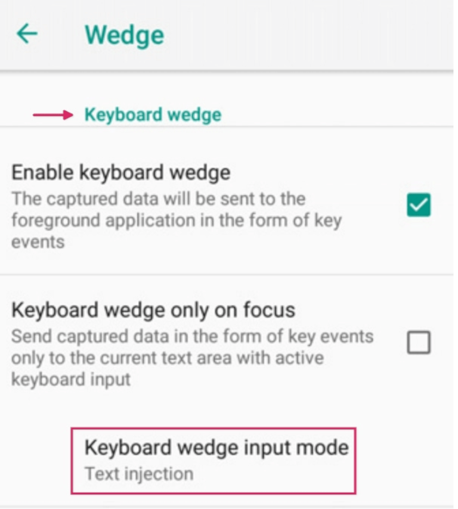
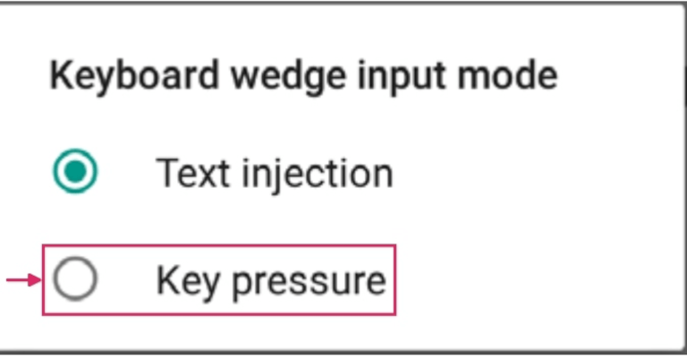
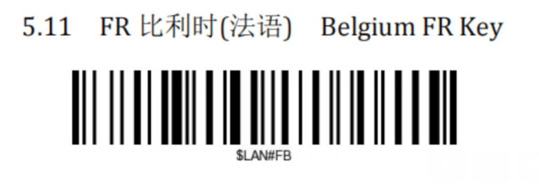

==============================
Barcode device troubleshooting
==============================

Odoo *Barcode* supports three main types of barcode scanners: USB scanners, bluetooth scanners, and
mobile computer scanners. While configuring each type of scanner, common issues may arise, in which
the scanners do not work as intended, and Odoo returns errors to the device.

Read the sections below to identify general and unique device issues, related to specific, popular
types of scanners.

General issues
==============

Refer to the following sections below for common issues involving popular barcode scanner devices.

For issues related to specific devices, refer to the :ref:`Android scanners
<barcode/setup/android-scanners>` section for mobile computer scanners, or to the :ref:`Screenless
scanners <barcode/setup/screenless-scanners>` section for USB and bluetooth scanners.

Barcode cannot be read
----------------------

One common issue encountered when using barcode scanners is an error resulting from barcodes that
cannot be read.

This can occur due to any of the following reasons:

- The barcode is damaged.
- The device cannot read the required barcode type (some scanners can only read 2D barcodes).
- The barcode being scanned is on a screen. Some scanners don't support this, and the barcodes
  **must** be printed out to be scanned. This is most common with 1D barcodes.
- The device has no battery, or is broken. To rule this out, follow the troubleshooting instructions
  in the following sections.

Odoo returns barcode error
--------------------------

All types of barcode scanners have their own device "language", which affects how they output
barcode data to Odoo's *Barcode* app. Sometimes, this can cause Odoo *Barcode* to return a barcode
error after scanning. This could be due to any of the following reasons:

- The computer is configured with a different keyboard layout than the barcode scanner. To rule this
  out, ensure that the device is configured with the same keyboard layout.

  For example, if the computer is configured to use an FR-BE keyboard, configure the scanner to send
  FR-BE keystrokes. The same logic applies if using a tablet instead of a computer.

  For more information on configuring keystrokes, refer to the :doc:`Barcode scanner setup
  <hardware>` documentation.
- For mobile computer scanners (such as Zebra devices, for example), the scanner might interpret the
  barcode differently than intended. To rule this out, scan a test barcode to see how the scanner
  interprets the barcode.

.. _barcode/setup/android-scanners:

Android scanners
================

The most recent barcode scanner models using Android and Google Chrome should work with Odoo.
However, due to the variety of models and configurations, it is recommended to first test a
scanner's compatibility with Odoo.

The Zebra product line is recommended; specifically, the **Zebra TC21 (WiFi-only)**, and **Zebra
TC26 (WiFi/cellular)**.

.. seealso::
   `Odoo Inventory & Barcode compatible hardware <https://www.odoo.com/app/inventory-hardware>`_

Barcode app does not give feedback
----------------------------------

By default, Android barcode scanners pre-process the barcode, then send a full text. Since Odoo
*Barcode* does not read this type of output, settings for each type of scanner **must** be
configured correctly.

Odoo *Barcode* expects that the scanner works like an analogue keyboard, and so, only detects *key
events*. Refer to the following sections for configuration settings for the most popular devices.

Zebra TC21/TC26
---------------

When using Zebra scanners, ensure the following keystroke configurations are set to prevent errors.

Begin on the Zebra scanner's home screen, and select the :guilabel:`DataWedge` app (the app is
represented by a :guilabel:`(light blue barcode)` icon).

On the :guilabel:`DataWedge Profiles` page, select the profile option to access the Zebra scanner's
settings.

Once the profile is selected, scroll down to the :guilabel:`Keyboard Output` option, and ensure the
:guilabel:`Enable/disable keystroke output` option is :guilabel:`Enabled`.

Once that option is enabled, go back to the :guilabel:`Profile` options page, and go to the
:guilabel:`Keystroke output` section. Then, open the :guilabel:`Key event options` submenu. Under
:guilabel:`Characters`, ensure the :guilabel:`Send Characters as Events` option is checked.

.. important::
   The :guilabel:`Send Characters as Events` option **must** be checked on the Zebra scanner, or
   Odoo **cannot** recognize the barcodes that are scanned.

Once the above steps have been taken, perform a test scan to ensure the Zebra scanner is working as
intended.

MUNBYN Android devices
----------------------

When using MUNBYN Android scanners, ensure the following configurations are set to prevent errors.

From the device's home screen, click :menuselection:`AppSettings`. On the resulting page, locate the
:guilabel:`Process mode` section, and select :guilabel:`Keyboard input`.

.. tip::
   The selected *Process mode* controls how data is processed after barcode data has been read out.

   *Keyboard input* enters read-out data at the position of the cursor, the same as input data on an
   analogue keyboard would.

Once the above steps have been taken, perform a test scan to ensure the MUNBYN Android scanner is
working as intended.

.. admonition:: Why is there no data output in the app after a successful scan?

   When scanning a barcode, the scanner might beep, indicating a successful scan, but there is no
   data output in the app.

   To fix this issue, adjust the output method to *keyboard analogue* in the *Scanner* app on the
   device.

   From the device's home screen, click :menuselection:`Scanner App --> Settings`. From the
   :guilabel:`Settings` page, click :guilabel:`Output Mode`. The resulting pop-up window presents
   the different output options available to users. Select :guilabel:`Keyboard Mode`, then click
   :guilabel:`OK`.

   .. image:: device_troubleshooting/device-troubleshooting-output-mode-popup.png
      :align: center
      :alt: Output mode pop-up window on MUNBYN scanner.

   Go back to the app that needs to be scanned, and click on the input dialog box first before
   scanning. Finally, perform a test scan to ensure the MUNBYN Android scanner is working as
   intended.

Datalogic Android devices
-------------------------

When using Datalogic Android scanners, ensure the following configurations are set to prevent
errors.

To view and configure all settings for the scanner, use the *Settings* app on the Datalogic Android
device. From the applications menu, select :menuselection:`Settings --> System --> Scanner
Settings`.

From the resulting list of settings, select :guilabel:`Wedge`. From this menu, under the
:guilabel:`Keyboard wedge` section, ensure that the :guilabel:`Enable keyboard wedge` feature is
activated.

Then, also under the :guilabel:`Keyboard wedge` section, locate the :guilabel:`Keyboard wedge input
mode` option. By default, the input mode is set to :guilabel:`Text injection`.

Click :guilabel:`Keyboard wedge input mode`, and change the setting to :guilabel:`Key pressure`.
This ensures that scanned barcodes are translated into keyboard strokes, instead of being injected
into the text area.

Once all those steps have been taken, perform a test scan to ensure the Datalogic Android scanner is
working as intended.

.. _barcode/setup/screenless-scanners:

Screenless scanners
===================

Screenless scanners are barcode scanning devices that have no screens. These include USB scanners
and bluetooth scanners.

.. important::
   Odoo supports most USB and Bluetooth barcode scanners, as they all emulate a keyboard. However,
   to verify that a scanner is compatible with a specific keyboard layout (or can be configured to
   do so), refer to Odoo's `Inventory & Barcode compatible hardware
   <https://www.odoo.com/app/inventory-hardware>`_ documentation.

NETUM devices
-------------

By default, the NETUM barcode scanner's user manual only shows the French keyboard configuration. To
use the Belgian keyboard, scan the code below:

Once that code has been scanned, ensure the NETUM scanner has the correct keyboard configuration,
and is working as intended.

.. seealso::
   - :doc:`../setup/hardware`
   - :doc:`../setup/software`
