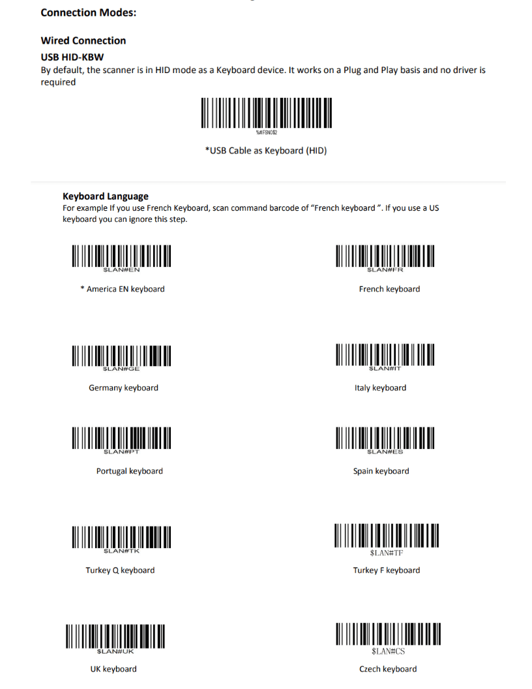
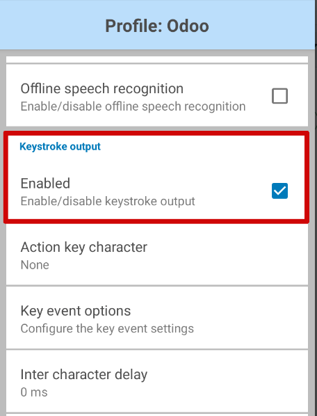
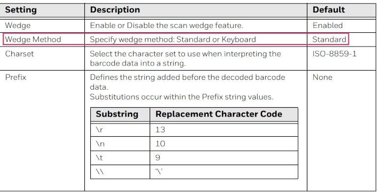
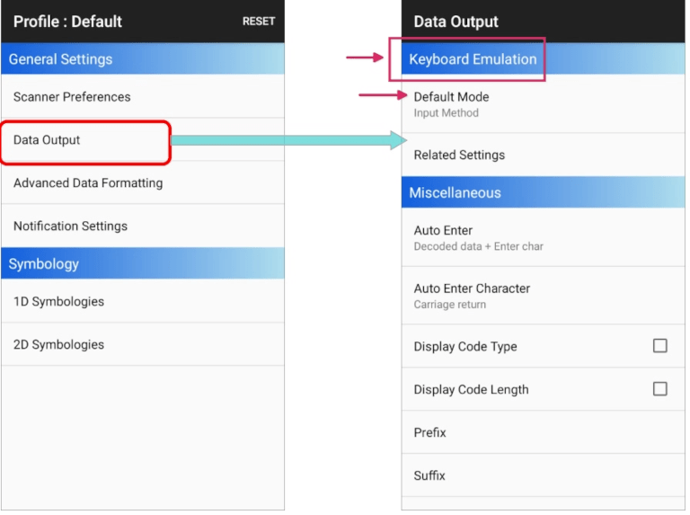
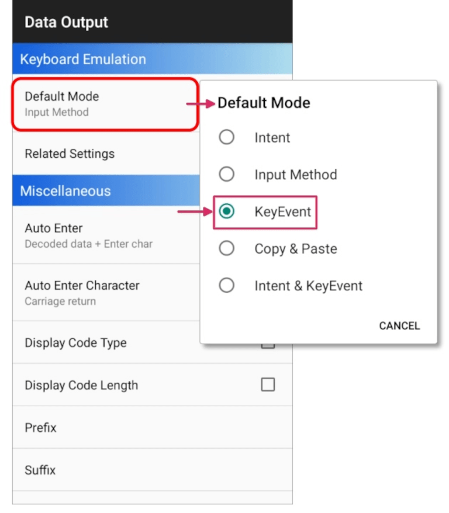

=====================
Barcode scanner setup
=====================

.. _barcode/setup/hardware:

Follow this guide to choose and set up a barcode scanner compatible with Odoo's *Inventory* and
*Barcode* apps.

.. figure:: hardware/barcode-scanner.png
   :align: center
   :alt: An image of an example barcode scanner.

Scanner types
=============

Before setting up a barcode scanner, it is important to determine which type of scanner best meets
the needs of the business. There are three main types of scanners that can be used with Odoo, each
with their own benefits and use cases:

- **USB scanners** are connected to a computer, and are suitable for businesses that scan products
  at a fixed location, like at the checkout line in a grocery store.
- **Bluetooth scanners** pair with a smartphone or tablet, making them both a cost-effective and
  portable barcode scanner option. In this scenario, Odoo is installed on the smartphone, allowing
  warehouse operators to handle operations, and check stock, directly through their mobile devices.
- **Mobile computer scanners** are mobile devices with a built-in barcode scanner.

  .. important::
     If using a USB scanner, ensure the scanner is compatible with the keyboard layout of the
     computer.

     If using a mobile computer scanner, ensure the device can run the Odoo mobile app properly.
     Recent models that use Android OS with the Google Chrome browser, or Windows OS with Microsoft
     Edge, should work. However, testing is crucial due to the variety of available models and
     configurations.

.. seealso::
   `Odoo Inventory & Barcode • Compatible Hardware <https://www.odoo.com/app/inventory-hardware>`_

Configuration
=============

When setting up the barcode scanner, make sure the following configurations are correct so the
scanner can properly interpret barcodes with Odoo.

Keyboard layout
---------------

When using a USB barcode scanner, match its keyboard layout with the operating system's layout for
proper interpretation of characters. Generally, the scanning mode should be set to accept a USB
keyboard (HID), with the language set based on the keyboard that is in use.

To configure the keyboard layout for a **Zebra** scanner, scan the keyboard wedge barcode for the
desired language in the scanner's user manual.

   Examples of keyboard language settings in the Zebra scanner user manual.

Automatic carriage return
-------------------------

Odoo has a default 100-millisecond delay between scans to prevent accidental double scanning. To
synchronize with the barcode scanner, set it to include a *carriage return* (:dfn:`character like
the "Enter" key on a keyboard`) after each scan. Odoo interprets the carriage return as the end of
the barcode input; so Odoo accepts the scan, and waits for the next one.

Typically, on the scanner, a carriage return is included by default. Ensure it is set by scanning a
specific barcode in the user manual, like `CR suffix ON` or `Apply Enter for suffix`.

Zebra scanner
=============

When using Zebra scanners, ensure the following keystroke configurations are set to prevent errors.

Begin on the Zebra scanner's home screen, and select the :guilabel:`DataWedge` app (the app is
represented by a :guilabel:`(light blue barcode)` icon).

On the :guilabel:`DataWedge Profiles` page, select the profile option to access the Zebra scanner's
settings.

.. warning::
   It is **not** suggested to use the "DWDemo" profile, as it does not work properly in every
   circumstance.

   Instead, it is recommended to create a new, personal profile. Once a new profile is created, add
   the *Odoo Mobile* app and *Google Chrome* app in the :guilabel:`Associated Apps` on the scanner's
   home screen.

Once the profile is selected, scroll down to the :guilabel:`Keyboard Output` option, and ensure the
:guilabel:`Enable/disable keystroke output` option is :guilabel:`Enabled`.

Once that option is enabled, go back to the :guilabel:`Profile` options page, and go to the
:guilabel:`Keystroke output` section. Then, open the :guilabel:`Key event options` submenu. Under
:guilabel:`Characters`, ensure the :guilabel:`Send Characters as Events` option is checked.

.. important::
   The :guilabel:`Send Characters as Events` option **must** be checked on the Zebra scanner, or
   Odoo **cannot** recognize the barcodes that are scanned.

Once all those steps have been taken, perform a test scan to ensure the Zebra scanner is working
properly, as intended.

Honeywell mobile computer scanner
=================================

When using Honeywell scanners, follow the instructions below to ensure barcodes can be scanned in
Odoo.

Begin on the Honeywell scanner's home screen, and select :guilabel:`Settings`, represented by a
:guilabel:`⚙️ (gear)` icon. Then, click :guilabel:`Honeywell Settings`, followed by
:guilabel:`Scanning`.

From here, click :guilabel:`Internal Scanner`, followed by :guilabel:`Default Profile`. From the
resulting list of options, select :guilabel:`Data Processing Settings`.

The :guilabel:`Data Processing Settings` specify how barcode data is processed by the computer.
Locate the :guilabel:`Wedge Method` setting. By default, this is set to :guilabel:`Standard`.

Change the :guilabel:`Wedge Method` setting to :guilabel:`Keyboard`.

After completing the steps, conduct a test scan to verify the Honeywell scanner is working as
intended.

Cipherlab mobile computer scanner
=================================

When using Cipherlab scanners, follow the instructions below to ensure barcodes can be scanned in
Odoo.

Begin on the Cipherlab scanner's home screen, and navigate to the :menuselection:`App Drawer (All
Applications)`. Then, click the :guilabel:`ReaderConfig` app, represented by an orange
:guilabel:`⚙️ (gear)` icon over a blue :guilabel:`(barcode)` icon.

Next, select the :guilabel:`Default Profile`, or create a new profile, if needed.

Under the :guilabel:`General Settings`, click :guilabel:`Data Output`, followed by
:guilabel:`Keyboard Emulation`.

By default, the :guilabel:`Input Method`, under :guilabel:`Keyboard Emulation`, is set to
:guilabel:`Default Mode`. Change this setting to :guilabel:`KeyEvent`.

After completing the steps, conduct a test scan to verify the Cipherlab scanner is working as
intended.

.. seealso::
   :doc:`../setup/software`
