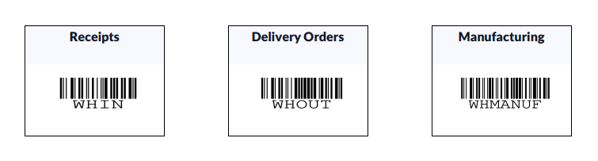
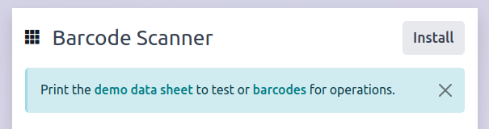
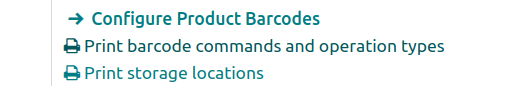
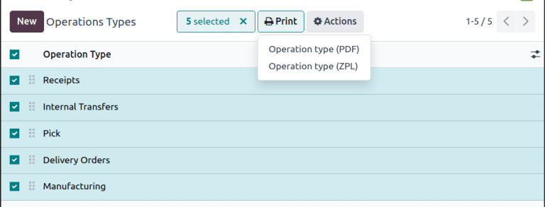
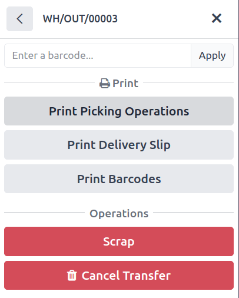
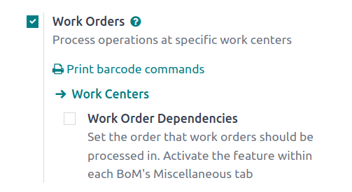

============================
Operation types and commands
============================

Inventory operations, like :doc:`receipts and delivery orders
<../../inventory/shipping_receiving/daily_operations/receipts_delivery_one_step>`, as well as
commands, like validating a transfer or putting products in packages, can be performed by scanning
barcodes through the **Barcode** app. This allows employees to handle tasks and access menus without
the need to touch a screen or use the **Inventory** app on a computer, and allows workflow
streamlining by putting operation barcodes in the appropriate physical location.

.. _inventory/barcode/configure_operations:

Configuring operations
======================

*Operation types* in the **Inventory** and **Barcode** apps define actions that will change the
state of products in inventory. Which operation types are available to print will depend on the
settings of the database. By default, barcodes can be printed for *Receipts (WHIN)*, *Delivery
Orders (WHOUT)*, and *Manufacturing (WHMANUF)*. The *Internal Transfers (WHINT)* and *Pick (WHPICK)*
operations can also be enabled.

.. note::
   Both *Internal Transfers (WHINT)* and *Pick (WHPICK)* operations require :doc:`location barcodes
   <software>` to scan.

Internal transfers
------------------

The *Internal Transfers (WHINT)* operation barcode is available if the database is using the
*Storage Locations* feature to designate where products are located in the inventory. To enable this
setting, go to :menuselection:`Inventory app --> Configuration --> Settings`, then, in the
:guilabel:`Warehouse` section, tick the :guilabel:`Storage Locations` option.

Picking
-------

The *Pick (WHPICK)* operation barcode is available if the database is using the *Multi-Step Routes*
feature configured with a picking step. To enable this setting, go to :menuselection:`Inventory app
--> Configuration --> Settings`, then, in the :guilabel:`Warehouse` section, tick the
:guilabel:`Multi-Step Routes` option and save. From there, click :icon:`fa-arrow-right`
:guilabel:`Set Warehouse Routes` to open warehouse settings and select the warehouse. In the
:guilabel:`Outgoing Shipments` section, select either :guilabel:`Pick then Deliver (2 steps)` or
:guilabel:`Pick, Pack, then Deliver (3 steps)`.

.. seealso::
   - :doc:`Two-step receipt and delivery
     <../../inventory/shipping_receiving/daily_operations/receipts_delivery_two_steps>`
   - :doc:`Three-step delivery
     <../../inventory/shipping_receiving/daily_operations/delivery_three_steps>`

Print barcodes for inventory commands and operations
====================================================

Barcodes for operations and commands can be printed at any time. These documents will include all
the available inventory commands, regardless of whether they are enabled, but only the operations
that are currently enabled in the database. See :ref:`configuring operations
<inventory/barcode/configure_operations>` to enable any missing operations.

.. example::
   The `print_inventory_commands_and_operation_types` document will always show the
   :guilabel:`PUT IN PACK` command, regardless of whether the *Packages* feature is enabled, but the
   *Pick (WHPICK)* operation will only be added if *Multi-Step Routes* are configured to have a
   picking step.

.. important::
   Printing barcodes, by default, will either directly download a PDF file of the selected barcodes
   or open a new tab with a downloadable or printable PDF. To turn this into a direct printing
   operation, :doc:`connect a printer <../../../general/iot/devices/printer>`.

When first opening Barcode
--------------------------

When first opening the **Barcode** app, there is a prompt with options to print barcodes for
commands and operations, as well as some sample barcodes to print and use for testing. Clicking
these links is the easiest way to print command and operation barcodes, but will no longer be
displayed after the first time it is clicked.

From Inventory settings
-----------------------

If the barcode print prompt is not available, inventory commands and operation types barcodes can
always be printed from the *Settings* page. Go to :menuselection:`Inventory app --> Configuration
--> Settings` and in the :guilabel:`Barcode` section under the :guilabel:`Barcode Scanner` setting,
click :icon:`fa-print` :guilabel:`Print barcode commands and operation types`.

Individual operations
---------------------

Barcodes for individual operations, like receipts and manufacturing orders, can also be printed from
the *Operations Types* configuration menu. To select operations to print, go to
:menuselection:`Inventory app --> Configuration --> Operations Types` and tick the box by each
operation type required.

Next, click the :icon:`fa-print` :guilabel:`Print` button and select either :guilabel:`Operation
type (PDF)` to download a PDF with the operation barcodes, or :guilabel:`Operation type (ZPL)` to
send the print job to a :ref:`ZPL-enabled printer <iot/link-printer>`.

.. note::
   The :icon:`fa-print` :guilabel:`Print` button does not appear until at least one operation type
   is selected.

.. _inventory/barcode/print_order:

Print picking operations for specific orders
============================================

Receipts, manufacturing orders, transfers, and delivery orders can all be printed in advance and are
referred to in the print options menu as *picking operations* or *picking*.

In Barcode
----------

From the **Barcode** app, tap the :guilabel:`Operations` button, select the operation type, and then
the specific order to print. From there, either scan the `PRINT PICKING OPERATION` barcode if there
is one available, or tap the :icon:`fa-cog` :guilabel:`(gear)` icon to open the **Barcode** actions
menu and tap the :guilabel:`Print Picking Operation` button.

In Inventory
------------

To print a picking from the **Inventory** app, click the appropriate operation type (*Receipt*,
*Delivery Order*, etc.) and select the individual order or the operation.

From the order, click the :icon:`fa-cog` :guilabel:`(Actions)` icon, hover over :icon:`fa-print`
:guilabel:`Print`, and click :guilabel:`Picking Operations`.

.. note::
   The type of operation can be inferred from the operation reference to help distinguish picking
   operations. For example, the "IN" in `WH/IN/00012` indicates that it is a receipt operation.
   These references are similar to, but do not exactly match the operation type barcodes.

Use barcodes for inventory operations and commands
==================================================

Operations
----------

- **Receipts** `WHIN` creates a new order to receive products into inventory.

   .. warning::
      Scanning a barcode for a receipt will always create a *new* instance of that operation, and
      will not match an already scheduled order. To scan or a specific scheduled receipt, first
      :ref:`print a picking for the individual receipt <inventory/barcode/print_order>`.

      For example, scanning **Receipts** `WHIN` will create a brand new receipt, even if the
      contents match an existing receipt exactly.

- **Delivery Orders** `WHOUT` opens the currently scheduled delivery orders.
- **Manufacturing** `WHMANUF` creates a new manufacturing order. Scanning a product barcode from
  here will add it to the *Producing* list.
- **Internal Transfers** `WHINT` creates a new transfer order. :doc:`Location barcodes <software>`
  can be scanned to designate the source and destination, or scanned direction to initiate a
  transfer in **Barcode**.
- **Pick** `WHPICK` creates a new picking operation. This will *require* a :doc:`location barcode
  <software>` for the source location.

Commands
--------

- `MAIN MENU`: Scan to return to the main menu from an inventory adjustment.
- `VALIDATE`: Scan to confirm that an operation is correct and ready to be completed.
- `CANCEL`: Scan from an operation to prevent that operation from being validated and set its status
  to *Cancelled*.
- `PRINT PICKING OPERATION`: Scan from an existing delivery order, transfer, or receipt to generate
  a PDF with the name and barcode for that operation's reference number. This can be scanned later
  to go directly to the operation.
- `PRINT DELIVERY SLIP`: Scan from an existing receipt or delivery order to generate a PDF of the
  purchase order or delivery order. This will not include a barcode.
- `PUT IN PACK`: After scanning products, this command will designate them as all being in one
  :doc:`package <../../inventory/product_management/configure/package>`. Products scanned *after*
  this command are placed in a new package if the `PUT IN PACK` command is scanned again.
- `SCRAP`: Scan this to mark a scanned product as defective, and move it to a virtual location for
  :doc:`scrap inventory <../../inventory/warehouses_storage/inventory_management/scrap_inventory>`

Print barcodes for manufacturing commands
=========================================

By default, the :guilabel:`Manufacturing` operation type can scan products and components and tap a
*Produce* button to produce them. To print barcodes for basic manufacturing operations, go to
:menuselection:`Manufacturing app --> Configuration --> Settings`, then, in the
:guilabel:`Operations` section, make sure the :guilabel:`Barcode Scanner` box is ticked and click
:icon:`fa-print` :guilabel:`Print barcode commands and operation types`.

Work order commands
-------------------

To enable more granular control of the manufacturing process through **Barcode**, enable the
:doc:`Work Orders <../../manufacturing/basic_setup/bill_configuration>` feature. To print barcodes
for work orders, go to :menuselection:`Manufacturing app --> Configuration --> Settings`, then, in
the :guilabel:`Operations` section, make sure the  :guilabel:`Work Orders` box is ticked and click
:icon:`fa-print` :guilabel:`Print barcode commands`.

.. seealso::
   - `Odoo Tutorials: Process and Cancel MOs Using Barcodes
     <https://www.youtube.com/watch?v=6zBz93AIXBo>`_
   - `Odoo Tutorials: Consuming Components Using Barcodes
     <https://www.youtube.com/watch?v=2ojxIbTq41Q>`_
