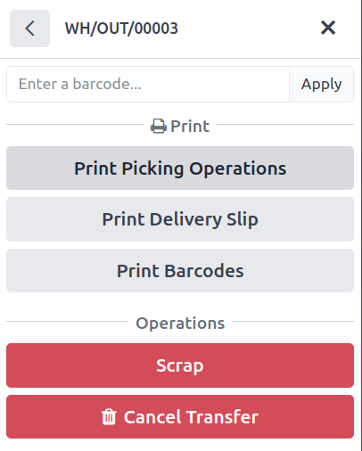

============================
Operation types and commands
============================

Inventory operations, like :doc:`receipts and delivery orders<../../inventory/shipping_receiving/daily_operations/receipts_delivery_one_step>`, as well commands, like validating a transfer or putting products in packages, can be performed by scanning barcodes through the **Barcode** app. This allows employees to handle tasks and access menus without the need to touch a screen or use the **Inventory** app on a computer, and allows workflow streamlining by putting operation barcodes in the appropriate physical location.

.. image:: operation_types/barcode-default-operations.png
   :alt: Printable barcodes for Receipts, Delivery Orders, and Manufacturing.

.. _inventory/barcode/configure_operations:

Configuring operations
======================

*Operation types* in the **Inventory** and **Barcode** apps define actions that will change the state of products in inventory. What operation types are available will depend on the settings which are enabled in the database. By default, barcodes can be printed for the :guilabel:`Receipts (WHIN)`, :guilabel:`Delivery Orders (WHOUT)`, and :guilabel:`Manufacturing (WHMANUF)`. The :guilabel:`Internal Transfers (WHINT)` and :guilabel:`Internal Transfers (WHINT)` and :guilabel:`Pick (WHPICK)` operations can also be enabled.

.. note::
   Both :guilabel:`Internal Transfers (WHINT)` and :guilabel:`Pick (WHPICK)` operations require :doc:`location barcodes <./software>` to scan.

Internal transfers
------------------

The :guilabel:`Internal Transfers (WHINT)` operation barcode is available if the database is using the ::guilabel:`Storage Locations` to designate where products are located in the inventory. To enable this setting, go to :menuselection:`**Inventory** app --> Configuration --> Settings`, then, in the :guilabel:`Warehouse` section, tick the :guilabel:`Storage Locations` option.

Picking
-------

The :guilabel:`Pick (WHPICK)` operation barcode is available if the database is using the ::guilabel:`Multi-Step Routes` feature configured with a picking step. To enable this setting, go to :menuselection:`**Inventory** app --> Configuration --> Settings`, then, in the :guilabel:`Warehouse` section, tick the :guilabel:`Multi-Step Routes` option and save. From there, click :icon:`fa-arrow-right` :guilabel:`Set Warehouse Routes` to open warehouse settings and select the warehouse. In the :guilabel:`Outgoing Shipments` section, select either :guilabel:`Pick then Deliver (2 steps)` or :guilabel:`Pick, Pack, then Deliver (3 steps)`.

.. seealso::
   - :doc:`Two-step receipt and delivery <../../inventory/shipping_receiving/daily_operations/   receipts_delivery_two_steps>`
   - :doc:`Three-step delivery <../../inventory/shipping_receiving/daily_operations/delivery_three_steps>`

Print barcodes for inventory commands and operations
====================================================

Barcodes for operations and commands can be printed at any time. These documents will include all the available inventory commands, regardless of whether they are enabled, but only the operations that are currently enabled in the database. See :ref:`configuring operations <inventory/barcode/configure_operations>` to enable any missing operations.

.. example::
   The `print_inventory_commands_and_operation_types` document will always show the :guilabel:`PUT IN PACK` command, regardless of whether the *Packages* feature is enabled, but the :guilabel:`Pick (WHPICK)` operation will only be added if *Multi-Step Routes* are configured to have a picking step.

.. warning::
   Printing barcodes, by default, will either directly download a PDF file of the selected barcodes or open a new tab with a downloadable or printable PDF. To turn this into a direct printing operation, :doc:`connect a printer<../../../general/iot/devices/printer>`.

When first opening Barcode
--------------------------

When first opening the **Barcode** app, there is a prompt with options to print barcodes for commands and operations, as well as some sample barcodes to print and use for testing. Clicking these links is the easiest way to print command and operation barcodes, but will no longer be displayed after the first time it is clicked.

.. image:: operation_types/barcode-initial-print-prompt.png
   :alt: A prompt to print demo data or barcodes for operations.

From Inventory Settings
-----------------------

Inventory commands and operation types barcodes can always be printed from the *Settings* page. Go to :menuselection:`**Inventory** app --> Configuration --> Settings` and in the :guilabel:`Barcode` section under the :guilabel:`Barcode Scanner` setting, click :icon:`fa-print` :guilabel:`Print barcode commands and operation types`.

.. image:: operation_types/print-operations-and-commands.png
   :alt: Link to print inventory operations and commands.

Individual operations
---------------------

:menuselection:`Inventory app --> Configuration --> Operations Types`

.. image:: operation_types/barcode-print-operations.png
   :alt: Available operations selected making a "Print" button appear.

.. note::
   The :icon:`fa-print` :guilabel:`Print` button does not appear until at least one operation type
   is selected.

Print picking operations for specific orders
============================================

Receipts, manufacturing orders, transfers, and delivery orders can all be printed in advanced and are broadly referred to as "picking operations" when printing.

.. note::
   The type of operation can be inferred from the operation reference to help distinguish picking operations. For example, the "IN" in `WH/IN/00012` indicates that it is a receipt operation. These references are similar to, but do not exactly match the operation type barcodes.

In Barcode
----------

From the **Barcode** app, tap the :guilabel:`Operations` button, and select the operation type, and then the specific order to print. From there, either scan the :guilabel:`PRINT PICKING OPERATION` barcode if there is one available, or tap the :icon:`fa-cog` :guilabel:`(cog)` icon to open the Barcode Actions menu and tap the :guilabel:`Print Picking Operation` button.

In Inventory
------------

Use barcodes for inventory operations and commands
==================================================

Operations
----------

.. warning::

   Scanning a barcode for an operation will always create a *new* instance of that operation.

   .. example::
      Scanning :guilabel:`Receipts (WHIN)` will create a brand new receipt, even if the contents match an existing receipt exactly.

- :guilabel:`Receipts (WHIN)` creates a new order to receive products into inventory.
- :guilabel:`Delivery Orders (WHIN)`

Commands
--------

- :guilabel:`MAIN MENU`: Scan to return to the main menu from an inventory adjustment.
- :guilabel:`DISCARD`: 
- :guilabel:`VALIDATE` Scan to confirm that an operation is correct and ready to be completed.
- :guilabel:`CANCEL`: Scan from an operation to prevent that operation from being validated and set its status to "Canceled".
- :guilabel:`PRINT PICKING OPERATION`: Scan from an existing delivery order, transfer, or receipt to generate a PDF wth the name and barcode for that operation's reference number. This can be scanned later to go directly to the operation.
- :guilabel:`PRINT DELIVERY SLIP`: 
- :guilabel:`PUT IN PACK`
- :guilabel:`SCRAP`
- :guilabel:`RECORD COMPONENTS`
- :guilabel:`RETURN`

Print barcodes for manufacturing commands
=========================================

By default, the :guilabel:`Manufacturing` operation type will allow you to scan products and
components and tap a :guilabel:`Produce` button to produce them. To enable more granular control of
the manufacturing process through **Barcode**, enable the :guilabel:`Work Orders` feature.

.. image:: operation_types/print-work-order-commands.png
   :alt: Add alt text.

.. seealso::
   - `Odoo Tutorials: Process and Cancel MOs Using Barcodes
     <https://www.youtube.com/watch?v=6zBz93AIXBo>`_
   - `Odoo Tutorials: Consuming Components Using Barcodes
     <https://www.youtube.com/watch?v=2ojxIbTq41Q>`_

Use case???
===========

We cover the individual workflows later in receipts and... well I'm not sure about MRP but it should
have its own doc. So this could be a contrast on basic vs barcode methods of
receiving/packing/scrapping

