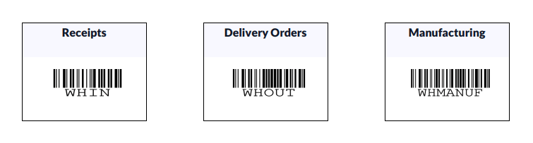
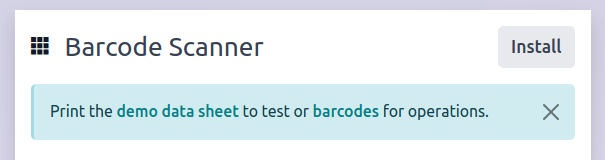
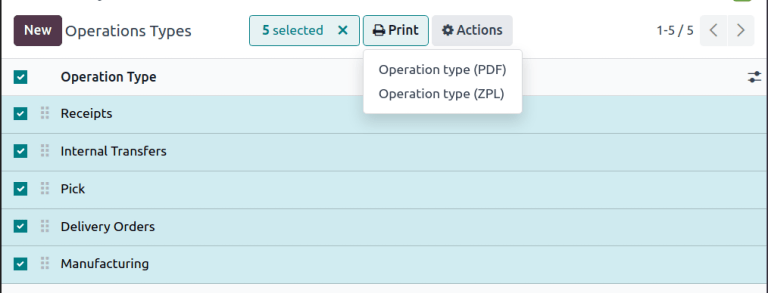
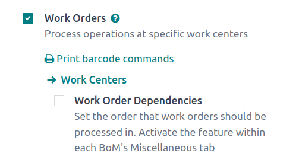

============================
Operation types and commands
============================

Value prop:
- Control the barcode app itself with your barcode scanner
- Access menus, and handle your receipts, deliveries, and manufacturing all without touching a screen
- Put the appropriate barcode in the right physical location to ensure that people use the right operation

Configuring operations
======================

- General definition of an operation in Odoo
   - Instructions to find it in configuration
- What do we have by default? What might you need.
   - Receipts, Delivery Orders, Manufacturing

.. seealso::
   - :doc:`Picking methods <../../inventory/shipping_receiving/picking_methods/batch>`
   - :doc:`Three-step delivery
     <../../inventory/shipping_receiving/daily_operations/delivery_three_steps>`
   - :doc:`Bill of materials <../../manufacturing/basic_setup/bill_configuration>`

Barcodes for inventory commands and operations
==============================================

When first opening Barcode
--------------------------

From Inventory Settings
-----------------------

Specific Locations
------------------

:menuselection:`Inventory app --> Configuration --> Operations Types`

.. note::
   The :icon:`fa-print` :guilabel:`Print` button does not appear until at least one operation type
   is selected.

Printing barcodes for manufacturing commands
============================================

By default, the :guilabel:`Manufacturing` operation type will allow you to scan products and
components and tap a :guilabel:`Produce` button to produce them. To enable more granular control of
the manufacturing process through **Barcode**, enable the :guilabel:`Work Orders` feature.

.. seealso::
   - `Odoo Tutorials: Process and Cancel MOs Using Barcodes
     <https://www.youtube.com/watch?v=6zBz93AIXBo>`_
   - `Odoo Tutorials: Consuming Components Using Barcodes
     <https://www.youtube.com/watch?v=2ojxIbTq41Q>`_

Use case???
===========

We cover the individual workflows later in receipts and... well I'm not sure about MRP but it should
have its own doc. So this could be a contrast on basic vs barcode methods of
receiving/packing/scrapping

