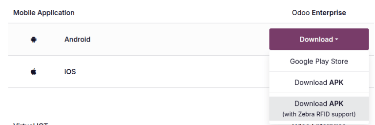

====
RFID
====

.. |EPC| replace:: :abbr:`EPC (electronic product code)`

RFID stands for Radio Frequency Identification. RFID enables the tracking of items using radio
waves: RFID tags are attached to products in inventory, and RFID readers can read those tags to
transmit information to a computer. RFID helps automate processes by keeping inventory accurate and
tracking internal and external moves.

RFID tags transmit electronic product codes (|EPC|), which are unique identifiers to distinguish
individual items. The |EPC| in Odoo is based on GS1 standards to consistently identify products
worldwide. GS1 nomenclature establishes common rules for encoding information within a barcode to
facilitate the global exchange of goods.

.. seealso::
   :doc:`../operations/gs1_nomenclature`

Hardware
========

The following are required to begin working with RFID in Odoo:

- Zebra TCX Series mobile computer, or
- Android Smartphone

Paired with:

- Zebra RFD40 (can read and write RFID tags)

Configuration
=============

Before using RFID tags to manage inventory, the Android Package Kit (APK) with RFID support must be
installed on the mobile computer or smartphone.

.. important::
   Before installing the APK on an individual device, first enable the ability to install unknown
   apps in the device settings. Find this setting in the device's :guilabel:`App` or :guilabel:`App
   & Notification` settings, under the :guilabel:`Special access` or :guilabel:`Special app access`
   section.

Then, download the APK. On the :guilabel:`Downloads` page, under the :guilabel:`Mobile Application`
section, click :guilabel:`Download` next to the :guilabel:`Android` option, then select
:guilabel:`Download APK (with Zebra RFID support)` from the drop-down menu. Download this file via a
computer and transfer the APK via USB or Bluetooth, or use the device's web browser to download the
APK.

Install the APK. If :guilabel:`Install unknown apps` is enabled for the device's web browser,
install the APK directly from the browser download notification. If :guilabel:`Install unknown apps`
is enabled for the device's file manager, open it and navigate to the location where the file is
stored, then tap it to install the APK.

Then, when reading or writing RFID tags, ensure that the Zebra device and the smart device are
paired and connected.

Set a compatible barcode
========================

Before you can manage inventory using RFID tags, a compatible barcode must be assigned to the
products. Set the product barcode in the product form.

.. seealso::
   :ref:`Set product barcodes <inventory/barcode/set-barcodes>`

To work with RFID, the product barcode must be GTIN-14-compatible, and inventory tracking must be
enabled for the product. Product barcodes that are not GTIN-14-compatible must be upgraded to work
with RFID.

.. note::
    Tracking by serial number or lots does not need to be enabled for this feature to work properly.

Limitations
===========

- The serial number that is part of the |EPC| must only be numeric, as SGTIN-96 is the only
  supported encoding scheme for RFID tags in Odoo. Alphanumeric serial numbers are **not**
  supported.
- For products tracked by lot, the lot can be scanned in, but it will be considered as one lot with
  a quantity of `1`. It does not count individual products in a receipt.
- Only ultra-high frequency (UHF) RFID tags are supported.
- Products need to be GS1-registered because barcodes must be unique.
