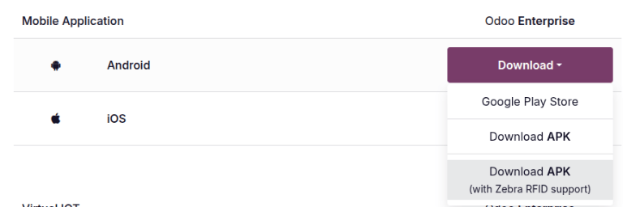

====
RFID
====

.. |EPC| replace:: :abbr:`EPC (electronic product code)`

RFID stands for Radio Frequency Identification. RFID enables the tracking of items using radio
waves: RFID tags are attached to products in inventory, and RFID readers can read those tags to
transmit information to a computer. RFID helps automate processes by keeping inventory accurate and
tracking internal and external moves.

RFID tags transmit electronic product codes (|EPC|), which are unique identifiers to distinguish
individual items. The |EPC| in Odoo is based on GS1 standards to consistently identify products
worldwide. GS1 nomenclature establishes common rules for encoding information within a barcode to
facilitate the global exchange of goods.

.. seealso::
   :doc:`../operations/gs1_nomenclature`

Hardware
========

To start working with RFID in Odoo, one of the following devices is recommended:

- CipherLab UHF RFID RS36, RS38 Series
- Zebra TC53e-RFID Series
- Zebra UHF RFID RFD90XX, RFD40XX Series paired with a mobile Android device

Configuration
=============

.. |APK| replace:: :abbr:`APK (Android Package Kit)`

.. important::
   Before installing the |APK| on a device, enable installation from unknown sources in the Android
   settings. This option can usually be found under :guilabel:`App` or :guilabel:`App &
   Notification` settings, under the :guilabel:`Special access` or :guilabel:`Special app access`
   section.

CipherLab
---------

Before using RFID tags to manage inventory, an additional |APK| developed by CipherLab must be
installed on the mobile computer or smartphone.

.. important::
   Before installing the CipherLab |APK|, please make sure that the firmware of the CipherLab
   Android device is up-to-date. To check for updates, go to :menuselection:`Settings --> System -->
   System updates`. If asked to enter an :guilabel:`Input verify code`, contact a CipherLab
   reseller.

Obtain the :guilabel:`CipherLab Multi-Tag Output` |APK| from CipherLab or from a supplier partner.
Transfer the |APK| to the device using USB or Bluetooth, or download it directly using the device's
web browser.

Open the |APK| from the browser download notification or the location where the file is stored. Tap
to install the |APK|.

Next, enable :guilabel:`Notification` permissions. Navigate to :menuselection:`Settings --> Apps -->
Multi-Tag Output`. A vertical ellipsis menu appears in the top corner. Open the menu, then select
:guilabel:`Allow restricted settings`.

When the CipherLab app is opened, :guilabel:`Accessibility` settings open. In the
:guilabel:`Multi-Tag Output` section, select :guilabel:`Use Multi-Tag Output`.

For the :guilabel:`Multi-Tag Output` settings, set the :guilabel:`End Character` to `;`.

.. note::
   This scanner also works with the **Barcode** Progressive Web App (PWA) or in a web browser. The
   Android Odoo app is not mandatory.

Zebra
-----

Before using RFID tags to manage inventory, a dedicated Odoo Android app with RFID support must be
installed on the mobile computer or smartphone.

First, download the |APK|. On the :guilabel:`Downloads` page, under the :guilabel:`Mobile
Application` section, click :guilabel:`Download` next to the :guilabel:`Android` option, then select
:guilabel:`Download APK (with Zebra RFID support)` from the drop-down menu. Download this file via a
computer and transfer the |APK| via USB or Bluetooth, or use the device's web browser to download
the |APK|.

Install the |APK| directly from the browser download notification or the location where it is
stored.

Then, when reading or writing RFID tags, ensure that the Zebra device and the smart device are
paired and connected.

Set a compatible barcode
========================

Before managing inventory using RFID tags, a compatible barcode must be assigned to the products.
Set the product barcode in the product form.

.. seealso::
   :ref:`Set product barcodes <inventory/barcode/set-barcodes>`

To work with RFID, the product barcode must be GTIN-14-compatible, and inventory tracking must be
enabled for the product. Product barcodes that are not GTIN-14-compatible must be upgraded to work
with RFID.

.. note::
    Tracking by serial number or lots does not need to be enabled for this feature to work properly.

Limitations
===========

- The serial number that is part of the |EPC| must only be numeric, as SGTIN-96 is the only
  supported encoding scheme for RFID tags in Odoo. Alphanumeric serial numbers are **not**
  supported.
- For products tracked by lot, the lot can be scanned in, but it will be considered as one lot with
  a quantity of `1`. It does not count individual products in a receipt.
- Only ultra-high frequency (UHF) RFID tags are supported.
- Products need to be GS1-registered because barcodes must be unique.

.. seealso::
   - :doc:`../operations/scan_rfid`
   - :doc:`../operations/retrieve_epcs`
