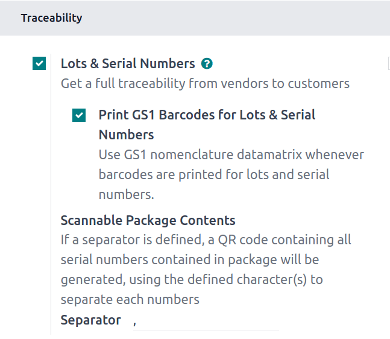
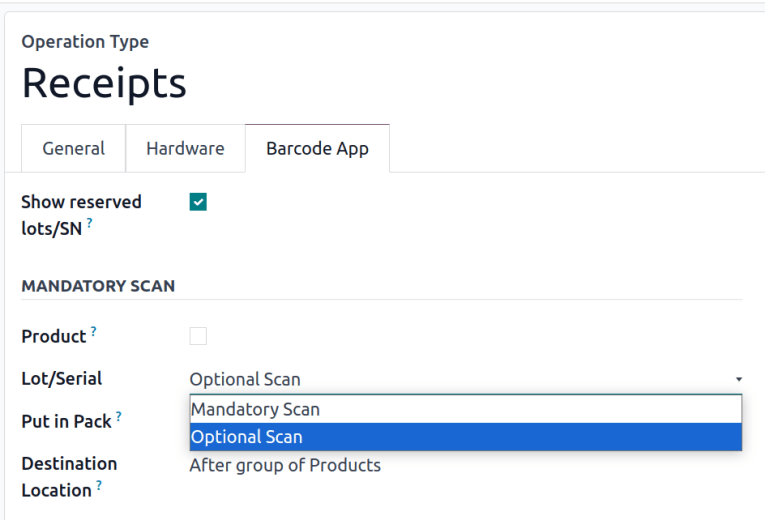
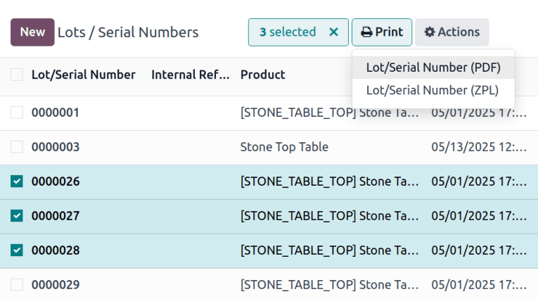
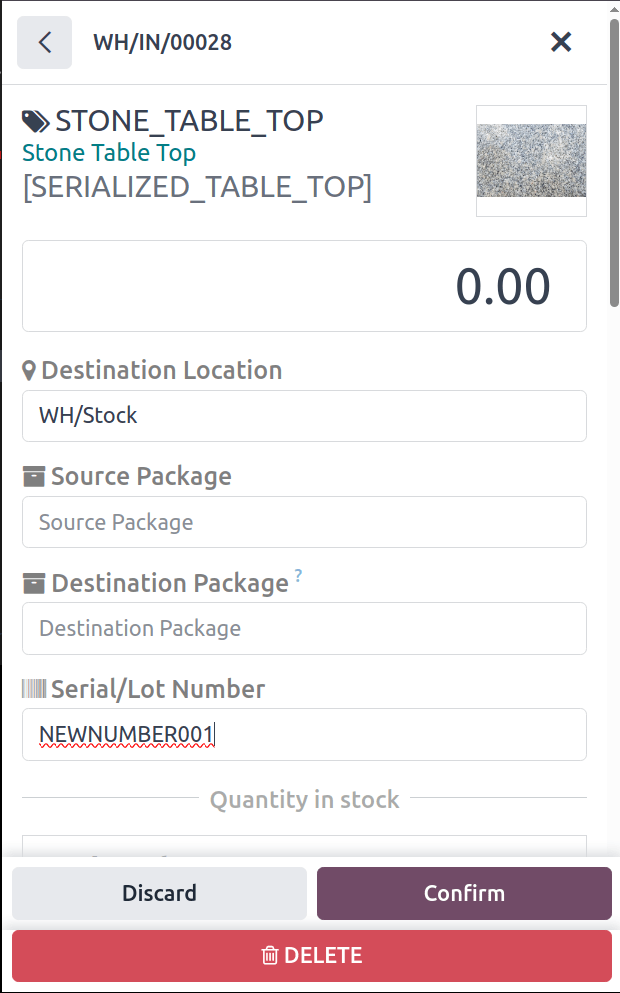
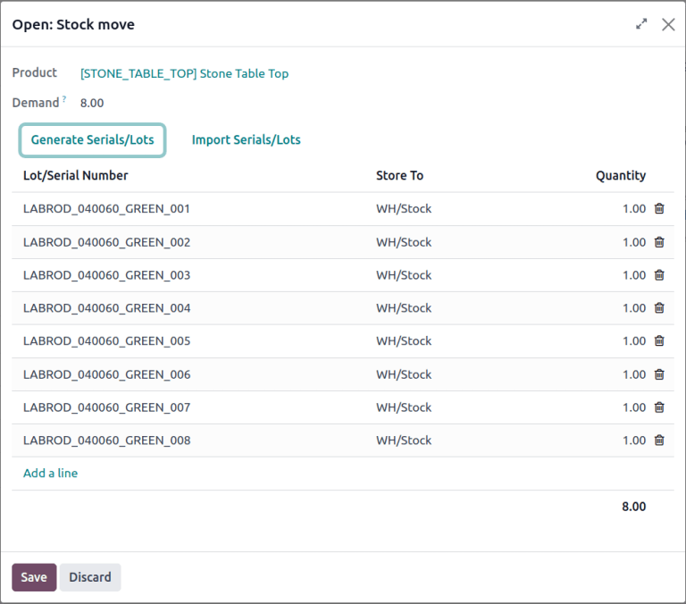

===================================
Barcodes for lot and serial numbers
===================================

The **Barcode** app saves time and prevents user errors while handling :doc:`lot
<../../inventory/product_management/product_tracking/lots>` and :doc:`serial numbers
<../../inventory/product_management/product_tracking/serial_numbers>`. Instead of typing long
sequences of characters, print and scan barcodes instead.

Configuration
=============

To use lot or serial numbers:

#. They must be enabled in the database.
#. Tracking by lot or serial number must be selected for each product.

See the :doc:`serial numbers documentation
<../../inventory/product_management/product_tracking/serial_numbers>` and :doc:`lots documentation
<../../inventory/product_management/product_tracking/lots>` to learn how to start using this
feature.

GS1-compatible QR codes
-----------------------

:doc:`GS1 <../operations/gs1_nomenclature>` nomenclature can be used for serial numbers and lots.

To enable GS1 barcodes for lots and serial numbers, go to :menuselection:`Inventory app -->
Configuration --> Settings` and in the :guilabel:`Traceability` section under :guilabel:`Lots &
Serial Numbers`, tick the box for :guilabel:`Print GS1 Barcodes for Lots & Serial Numbers`.

.. warning::
   GS1 lot and serial number barcodes require a 2D-capable scanner to be scanned. See :doc:`hardware
   configuration <hardware>` to ensure that the feature is compatible with available equipment.

.. _inventory/barcode/mandatory-scan:

Mandatory and optional scanning
-------------------------------

Operation types, like receipts and delivery orders, :ref:`can be configured individually
<inventory/product_management/operation-type-setting>` to determine whether they require a serial or
lot number to process the operation. Additionally, the *Barcode* tab of each operation type
configures whether scanning the lot or serial number is mandatory. *Mandatory scan* specifies that
the only way to input a required serial number or lot number is by scanning a barcode, while
*optional scan* allows users to manually type in a barcode if necessary.

To make it mandatory to scan a barcode for serial numbers and lots, go to :menuselection:`Inventory
app --> Configuration --> Operations Types` and select the operation type where barcodes should be
required for serial numbers. Then, click the :guilabel:`Barcode App` tab, and in the
:guilabel:`MANDATORY SCAN` section set :guilabel:`Lot/Serial` to :guilabel:`Mandatory Scan`.

Barcodes for products and lots
==============================

To print a barcode for one or multiple product lot and serial numbers, go to
:menuselection:`Inventory app --> Products --> Lots / Serial Numbers`. In the list view, tick the
checkbox for each the product to print, click the :icon:`fa-print` :guilabel:`Print` button, and
select either PDF or ZPL depending on printer setup.

Operations
==========

For any product that is tracked by lot or serial number, performing an operation with barcode can be
from the main **Barcode** page by tapping :guilabel:`Operations` and tapping the desired operation
in the interface or scanning the barcode for specific picking order. Once the order is scanned,
select the product by tapping or scanning a barcode and scan the lot or serial number for each
quantity.

.. tip::
   Because vendor lot and serial number barcodes could be damaged in transit and arrive in a state
   that cannot be scanned, it is a good practice to :ref:`set serial number or lot scanning to
   optional <inventory/barcode/mandatory-scan>`. Otherwise, a broken barcode would block validation
   of the receipt.

For products that are starting out without a serial number, there are three options to manage them:
manually typing in the number, generating them ahead of time, or disabling serial numbers for that
operation.

Manually input serial and lot numbers
-------------------------------------

For instances where there are few products or rare shipments, it may be easiest to type lot or
serial numbers in at the time of receipt. After opening an existing receipt or creating a new one
and scanning the product bar code, tap the :icon:`fa-pencil` :guilabel:`(pencil)` icon. Tap the
:guilabel:`Serial/Lot Number` field and enter the serial number and tap :guilabel:`Confirm`.

Generate serial numbers before a receipt
----------------------------------------

Lot and serial numbers can be generated from a scheduled receipt before the products arrive. This
has the advantage of making it possible to print all the serial numbers with the picking order for
the receipt.

To generate lot and serial numbers, in the **Inventory** app click :guilabel:`Receipts` and select
the receipt that requires generated lot or serial numbers. In the :guilabel:`Operations` tab, find
the line for the product, and click the :icon:`fa-list` :guilabel:`(list)` icon. In the
:guilabel:`Open: Stock move` pop-up menu, click :guilabel:`Generate Serials/Lots`.

.. seealso::
   :ref:`Assign serial numbers <inventory/product_management/assign-sn>`

Disable lot and serial numbers for a receipt
--------------------------------------------

With lot and serial numbers disabled for an operation, products that are tracked by these methods
can be received without supplying a serial number or lot number. It is still possible to scan a
serial number at the receipt stage, but the missing numbers will need to be :ref:`created in the
Inventory app <inventory/product_management/already-in-stock>`.

To disable the use of serial numbers for a particular operation type, go to
:menuselection:`Inventory app --> Configuration --> Operations Types` and select the operation type.
In the :guilabel:`LOTS/SERIAL NUMBERS` section, untick :guilabel:`Create New` and :guilabel:`Use
Existing ones`.

.. note::
   The *Create New* option will require the user to supply a serial number or lot number, either by
   scanning or type (if :ref:`optional scan <inventory/barcode/mandatory-scan>` is enabled), and
   will not :ref:`automatically generate serial numbers
   <inventory/product_management/generate-serials>` the way the **Inventory** app can.
