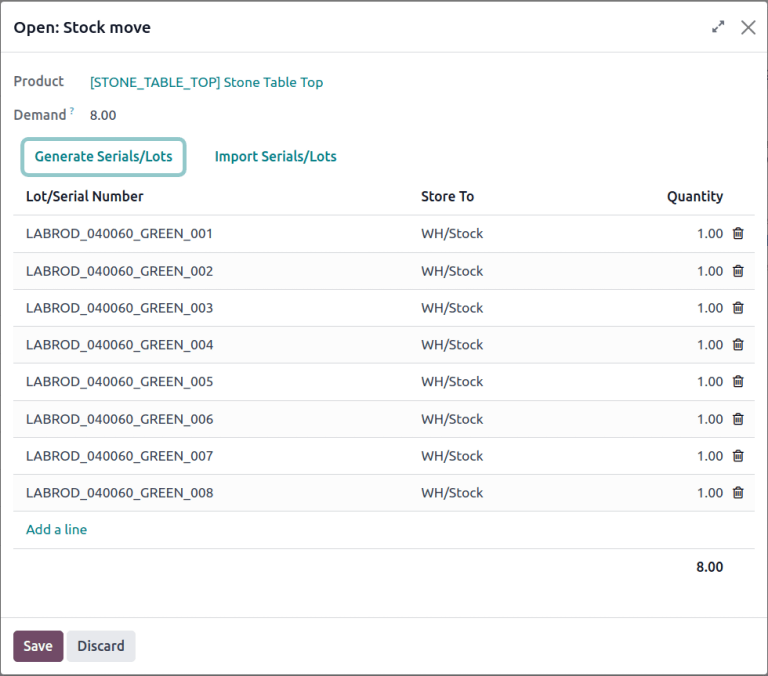
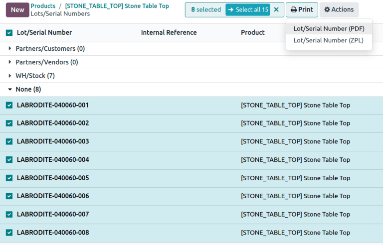

=======================
Serial numbers and lots
=======================

Value prop
- Literally one of the best applications of barcode. Allow all the tracking benefits, without the hassle and error-threat of manually typing them in

Configuration
=============

- Enabling SN's and lots in Settings
- Tracking a product by SN's
   - Need to read up more on lots, is that enabled per product?
- Configuring per operation type
   - Need to confirm that making SN's optional doesn't block validation in Barcode

Receipts
========

Pre-existing serial numbers
---------------------------

- Tap to get to specific receipt
- Scan receipt transfer (???)

Without serial numbers
----------------------

.. seealso::
   :ref:`Assign serial numbers <inventory/product_management/assign-sn>`

