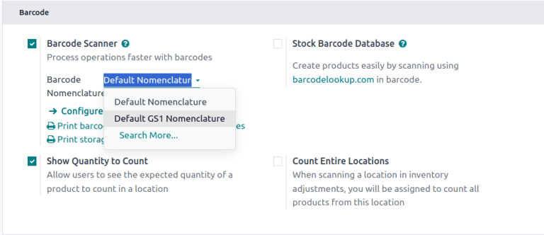
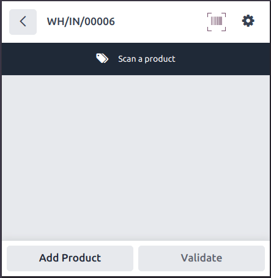
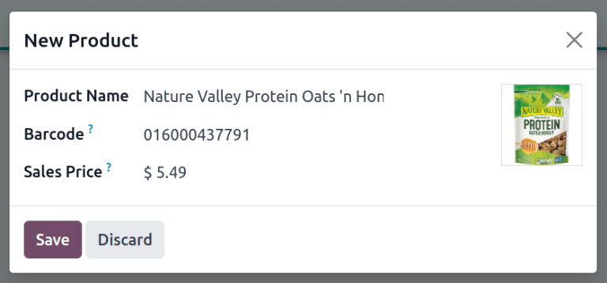
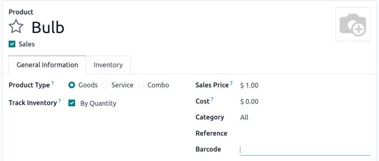
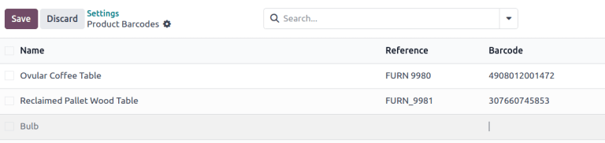
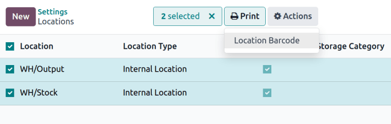

=============================
Product and location barcodes
=============================

.. |GTIN| replace:: :abbr:`GTIN (Global Trade Item Number)`

Inventory operations like product configuration can be streamlined by taking advantage of barcode
scanning features. Assigning barcodes to products and locations is a key step in using the
**Barcode** app, and users can conveniently populate fields with a barcode scanner. This reduces
manual entry, minimizes errors, and speeds up common tasks like product selection, location
assignment, and inventory adjustments.

Configuration
=============

Barcode nomenclature
--------------------

Most retail products use EAN-13 barcodes, also known as Global Trade Identification Numbers (GTIN).
To create a new |GTIN| for a product, a company must have a GS1 Company Prefix. See :doc:`GS1
nomenclature <../operations/gs1_nomenclature>` for more information about using this system.

Odoo supports using any string as a barcode, so users can also create custom internal references to
use with barcode scanners. See :doc:`Default nomenclature <../operations/barcode_nomenclature>` to
learn about optional conventions around barcodes and default values in Odoo

To change the barcode nomenclature, go to :menuselection:`Inventory app --> Configuration -->
Settings` and scroll down to the :guilabel:`Barcode` section to select the nomenclature under
:guilabel:`Barcode Scanner`.

.. _barcode/setup/barcodelookup:

Barcode lookup
--------------

Odoo can automatically add product information using the :guilabel:`Stock Barcode Database` setting
for any :abbr:`UPC (Universal Product Code)`, :abbr:`EAN (European Article Number)`, or :abbr:`ISBN
(International Standard Book Number)` barcode.

To enable automatic barcode look up, go to :menuselection:`Inventory app --> Configuration -->
Settings` and scroll down to the :guilabel:`Barcode` section to tick the box for :guilabel:`Stock
Barcode Database`.

.. note::
   Databases hosted on **Odoo.sh** or **on-premise**, require :ref:`configuring an API key
   <barcodelookup/configuration>`.

.. _inventory/barcode/set-barcodes:

Set product barcodes
====================

Barcodes can be assigned to existing products from the *Product Barcodes* configuration page or from
any product form in the **Inventory**, **Manufacturing** or **Purchase** apps. The barcode field can
be populated either by typing or using scanner input.

When adding a new product, the :ref:`barcode lookup feature <barcode/setup/barcodelookup>` can be
used to automatically find information about a product based on its barcode, and new products can be
added to the database directly from the **Barcode** app by scanning a barcode.

From Barcode app
----------------

New products definitions can be added to the database product lists as well as having their on-hand
inventory tracked from the **Barcode** app, if the :ref:`Barcode Lookup feature
<barcode/setup/barcodelookup>` is enabled. To create a new receipt for scanning new products, choose
one of two methods:

#. From the **Barcode** front page, tap :guilabel:`Operations`, tap :guilabel:`Receipts`, and then
   tap the :guilabel:`New` button.
#. Scan a printed :guilabel:`Receipts (WHIN)` inventory command barcode.

Scanning a product that is not currently in inventory prompts a message that the product does not
exist, with a button option to :guilabel:`Create New Product`. Pressing this button will search the
`Barcode Lookup <https://www.barcodelookup.com/>`_ database for a product matching the code and
format, create a new product definition in the Odoo database with the available information, and add
that product to the receipt to track the quantity on hand in inventory.

.. note::
   Even if a transfer order with a product created through **Barcode** is cancelled, the product
   remains available in the products list in the **Inventory** app unless it is deleted.

From a product form
-------------------

Barcodes can be added to both existing products and new products as they are created through the
products configuration form. To access a product's form, go to :menuselection:`Inventory app -->
Products --> Products` and select the product to add a barcode to.

In the :guilabel:`General Information` tab, click the :guilabel:`Barcode` field to either type in
the barcode or use a scanner to input the barcode value.

.. note::
   If using :doc:`product variants <../../../sales/sales/products_prices/products/variants>`,
   configure barcodes on individual variants and not the product template to allow scanning to
   retrieve the variants.

From Inventory settings
-----------------------

To access the *Product Barcodes* configuration page, go to :menuselection:`Inventory app -->
Configuration --> Settings`. In the :guilabel:`Barcode` section, under the :guilabel:`Barcode
Scanner` feature, click :icon:`fa-arrow-right` :guilabel:`Configure Product Barcodes`. From this
list view, click the :guilabel:`Barcodes` column for any product to enter its barcode. Barcode
scanners will populate this field when the product is scanned.

.. tip::
   To filter for the products that do not have barcodes yet, click the :icon:`fa-sort-desc`
   :guilabel:`(Toggle Search Panel)` icon to add a custom filter where the :guilabel:`Barcode`
   property is :guilabel:`is not set`.

   .. image:: software/barcode-filter-for-no-barcode.png
      :alt: 'Add Custom Filter' pop-up with 'Barcode is not set' configured.

.. _barcode/setup/location:

Print location barcodes
=======================

Barcodes can be assigned to locations to track of where products are stored and manage transfers,
and are automatically available if the :doc:`Storage Locations
<../../inventory/warehouses_storage/inventory_management/use_locations>` feature is enabled.

To print barcodes for locations, go to :menuselection:`Inventory app --> Configuration -->
Settings`, scroll down to the :guilabel:`Warehouse` section and click :icon:`fa-arrow-right`
:guilabel:`Locations`. Tick the boxes for locations and the :guilabel:`Print` button will appear,
downloading a PDF with barcodes for all selected locations.

