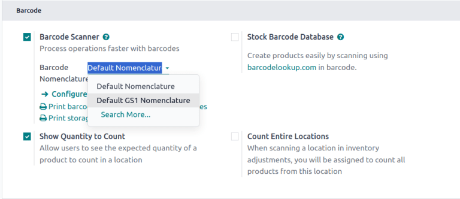
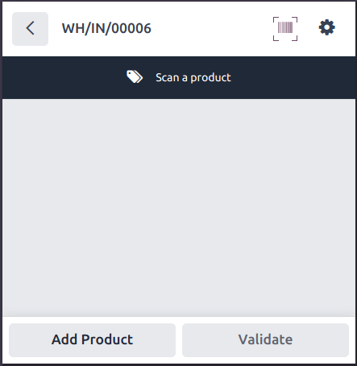
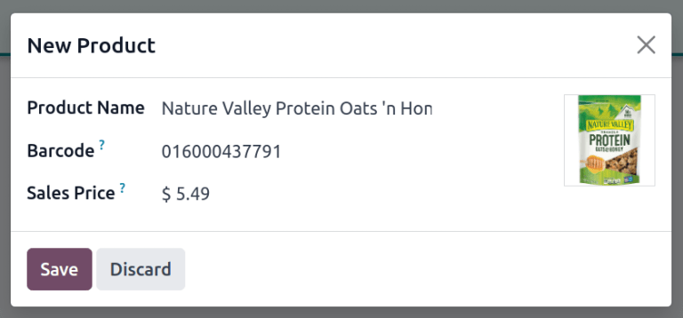
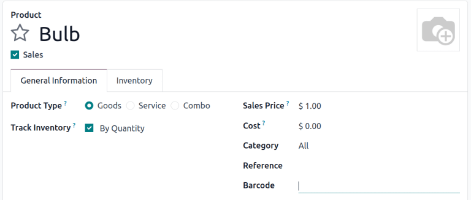
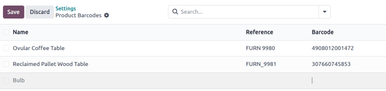
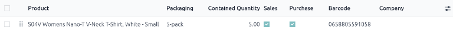
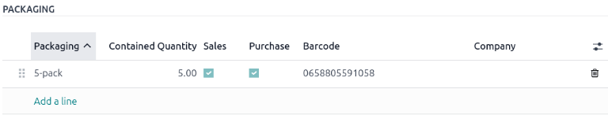
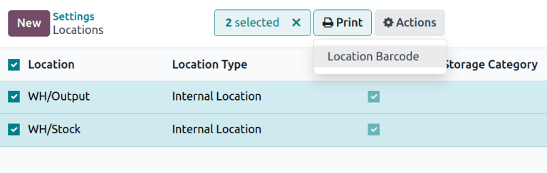

=============================
Product and location barcodes
=============================

.. |GTIN| replace:: :abbr:`GTIN (Global Trade Item Number)`

Inventory operations, like product configuration, can be streamlined by taking advantage of barcode
scanning features. Assigning barcodes to products, product packagings, and locations is a key step
in using the **Barcode** app, and users can conveniently enter values using a barcode scanner. This
reduces manual entry, minimizes errors, and speeds up common tasks like product selection, location
assignment, and inventory adjustments.

Configuration
=============

To enable the **Barcode** app, you must first enable it in the *Inventory* settings.

Navigate to :menuselection:`Inventory app --> Configuration --> Settings`. In the *Barcode* section,
select the :guilabel:`Barcode Scanner` option. Be sure to click :guilabel:`Save`.

Barcode nomenclature
--------------------

Most retail products use EAN-13 barcodes, also known as Global Trade Identification Numbers (GTIN).
To create a new |GTIN| for a product, a company must have a GS1 Company Prefix. See :doc:`GS1
nomenclature <../operations/gs1_nomenclature>` for more information about using this system.

Odoo supports using any string as a barcode, so users can also create custom internal references for
barcode scanners. See the :doc:`Default nomenclature <../operations/barcode_nomenclature>` to learn
about optional conventions around barcodes and default values in Odoo.

To change the barcode nomenclature, go to the :menuselection:`Inventory app --> Configuration -->
Settings` and scroll down to the :guilabel:`Barcode` section to select the nomenclature under
:guilabel:`Barcode Scanner`.

.. _barcode/setup/barcodelookup:

Barcode lookup
--------------

Odoo can automatically add product information using the :guilabel:`Stock Barcode Database` setting
for any :abbr:`UPC (Universal Product Code)`, :abbr:`EAN (European Article Number)`, or :abbr:`ISBN
(International Standard Book Number)` barcode.

To enable automatic barcode look-up, go to the :menuselection:`Inventory app --> Configuration -->
Settings` and scroll down to the :guilabel:`Barcode` section to select the :guilabel:`Stock Barcode
Database` checkbox.

.. seealso::
   :doc:`Barcode Lookup <barcodelookup>`

.. _inventory/barcode/set-barcodes:

Set product barcodes
====================

Barcodes can be assigned to existing products from the *Product Barcodes* configuration page or from
any product form in the **Inventory**, **Manufacturing**, or **Purchase** apps. The barcode field
can be populated either by typing or by scanning.

When adding a new product, the :ref:`barcode lookup feature <barcode/setup/barcodelookup>` can
automatically find product information by its barcode, and new products can be added to the database
directly from the **Barcode** app by scanning a barcode.

From the Barcode app
--------------------

New product definitions can be added to the database product lists, and their on-hand inventory can
be tracked from the **Barcode** app if the :ref:`Barcode Lookup feature
<barcode/setup/barcodelookup>` is enabled. To create a new receipt for scanning new products, choose
one of two methods:

#. From the **Barcode** front page, tap :guilabel:`Operations`, tap :guilabel:`Receipts`, and then
   tap the :guilabel:`New` button.
#. Scan a printed :guilabel:`Receipts (WHIN)` inventory command barcode.

Scanning a product that is not currently in inventory displays a message that the product does not
exist, with a :guilabel:`Create New Product` button. Pressing this button will search the `Barcode
Lookup <https://www.barcodelookup.com/>`_ database for a product matching the code and format,
create a new product definition in the Odoo database using the available information, and add that
product to the receipt to track its quantity on hand.

.. note::
   Even if a transfer order with a product created through **Barcode** is cancelled, the product
   remains available in the products list in the **Inventory** app unless it is deleted.

From a product form
-------------------

Barcodes can be added to both existing products and new products as they are created through the
product's configuration form. To access a product's form, go to the :menuselection:`Inventory app
--> Products --> Products` and select the product to add a barcode to.

In the *General Information* tab, click the :guilabel:`Barcode` field to either type in the barcode
or use a scanner to input the barcode value.

.. note::
   If using :doc:`product variants <../../../sales/sales/products_prices/products/variants>`,
   configure barcodes on individual variants, **not** on the product template, to allow scanning to
   retrieve the variants.

From Inventory settings
-----------------------

To access the *Product Barcodes* configuration page, go to :menuselection:`Inventory app -->
Configuration --> Settings`. In the :guilabel:`Barcode` section, under the :guilabel:`Barcode
Scanner` feature, click :icon:`fa-arrow-right` :guilabel:`Configure Product Barcodes`. From this
list view, click the :guilabel:`Barcodes` column for any product to enter its barcode. Barcode
scanners will populate this field when the product is scanned.

.. tip::
   To filter for products that do not have barcodes yet, click the :icon:`fa-sort-desc`
   :guilabel:`(Toggle Search Panel)` icon to add a custom filter where the :guilabel:`Barcode`
   property :guilabel:`is not set`.

   .. image:: software/barcode-filter-for-no-barcode.png
      :alt: 'Add Custom Filter' pop-up with 'Barcode is not set' configured.

.. _barcode/setup/product-packaging:

Set product packaging barcodes
==============================

If :guilabel:`Product Packagings` is enabled in the **Inventory** settings, barcodes can be set for
product packagings. To enable this feature, navigate to :menuselection:`Inventory app -->
Configuration --> Settings`. In the *Products* section, select :guilabel:`Product Packagings`. Be
sure to :guilabel:`Save` the changes.

Barcodes can be assigned to product packagings from the *Product Packagings* page or from any
product form in the **Inventory** app. The barcode field can be populated either by typing or by
scanning.

After the barcode is assigned to the packaging, it can be used for warehouse operations.

From the Product Packagings page
--------------------------------

Navigate to :menuselection:`Inventory app --> Configuration --> Product Packagings`.

On this page, ensure that the :guilabel:`Barcode` column appears by clicking the
:icon:`oi-settings-adjust` :guilabel:`(additional options)` icon and selecting :guilabel:`Barcode`.

Select an existing packaging, or create a new one by clicking :guilabel:`New`. Be sure to specify
the product, its packaging, and the :guilabel:`Contained Quantity`. Specify whether it is available
for :guilabel:`Sales` or :guilabel:`Purchase`. Specify a :guilabel:`Barcode`.

From product form
-----------------

Navigate to :menuselection:`Inventory app --> Products --> Products`. Open an existing product, or
create a new one by clicking :guilabel:`New`.

After specifying product information in the *General Information* tab, open the *Inventory* tab.

In the *Packaging* section, show the :guilabel:`Barcode` field by clicking the
:icon:`oi-settings-adjust` :guilabel:`(additional options)` icon and selecting :guilabel:`Barcode`.

Add a :guilabel:`Barcode` to an existing packaging, or create a new one by clicking :guilabel:`Add
a line`. Be sure to specify a packaging name and the :guilabel:`Contained Quantity`. Specify whether
the packaging is available for :guilabel:`Sales` or :guilabel:`Purchase`. Finally, specify a
:guilabel:`Barcode`.

.. seealso::
   :doc:`../../inventory/product_management/configure/packaging`

.. _barcode/setup/location:

Print location barcodes
=======================

Barcodes can be assigned to locations to track where products are stored and manage transfers, and
are automatically available if the :doc:`Storage Locations
<../../inventory/warehouses_storage/inventory_management/use_locations>` feature is enabled.

To print barcodes for locations, go to the :menuselection:`Inventory app --> Configuration -->
Settings`, scroll down to the :guilabel:`Warehouse` section and click :icon:`fa-arrow-right`
:guilabel:`Locations`. Select the boxes for locations, and the :guilabel:`Print` button will appear,
allowing the download of a PDF with barcodes for all selected locations.

