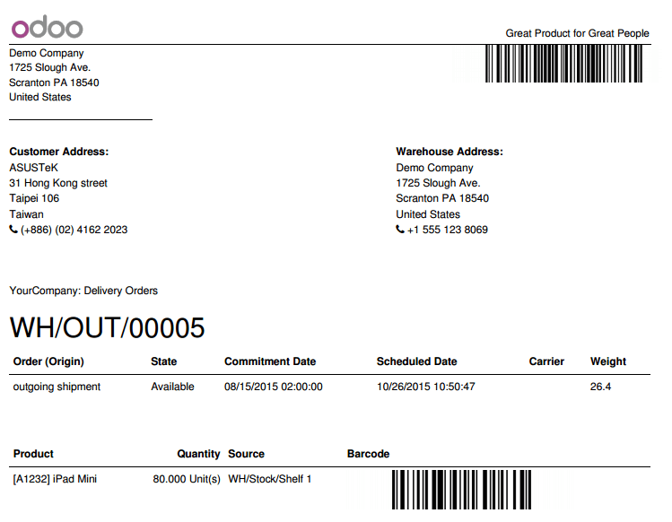

===============================
How to process delivery orders?
===============================

There are two approaches to process delivery orders: you can either work
on printed documents (and scan lines on the documents), or on a screen
(and scan products directly).

Process printed delivery orders:
================================

-   Print delivery orders of the day by selecting all documents from the
    **To Do** list and print **Picking Operations** from the top menu.

-   Once you start processing your delivery orders, **scan the barcode** on
    the top-right corner of the document to load the right record on
    the screen.

-   Then, **scan the barcode** of every product, or scan the barcode of the
    product on the picking line if the barcode on the product is not
    easily accessible, visible or is missing.

-   Once you scanned all products, scan the **Validate** barcode action to
    finish the operation.

Process delivery orders from a computer or mobile device:
=========================================================

-   Load all the delivery orders marked as **To Do**, and open the first
    one.

-   Pick up and scan each listed product.

-   When you've picked all the items, click the **Validate** button or scan
    the **Validate barcode** action to finish the Operation.

-   Move to the next delivery order to process by clicking on the
    top-right right **arrow** or scanning the **Pager-Next** barcode action.

.. image:: media/delivery02.png
    :align: center